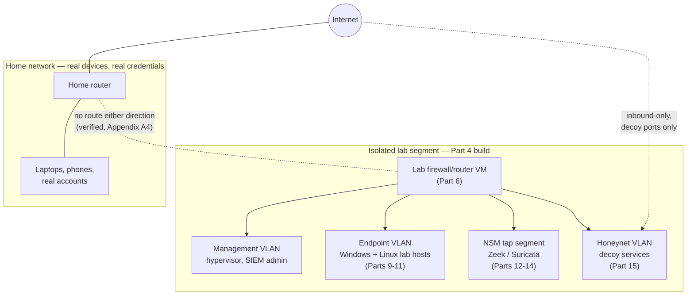
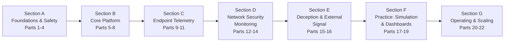

# Part 1 — The SOC Home Lab: What It Is, and What It Deliberately Isn't

## Why this part exists

**[CONCEPT]** The other three volumes in the NESHBOY SOC Professional Library assume telemetry already exists: a SIEM to search, endpoints producing logs, alerts to triage, a team to staff. This book is where a reader who has none of that starts. It is a construction manual for a personally-operated, safely isolated practice environment — a SIEM, Windows and Linux endpoints producing real Sysmon and auditd telemetry, a segmented network, Zeek and Suricata watching the wire, honeypots collecting unsolicited attacker traffic, threat-intel feeds enriching what comes in, dashboards worth looking at, and safe, reversible attack-simulation tooling to generate known-cause telemetry on demand. Every part after this one builds one piece of that environment, in an order chosen so each piece has somewhere to send its output before it exists.

This part does three things before any build content starts. First, it draws the boundary between what this book covers and what the other three volumes cover, so a reader doesn't go looking for detection-query syntax or incident-response procedures here and come away thinking the book is thin — it isn't thin, it's scoped. Second, it states the one rule every later part depends on: you build a lab to attack and defend systems you own, on a network segment that cannot reach, and cannot be reached by, anything you don't own. Third, it introduces the vocabulary — six content tags, eight recurring callouts, four evidence classes — that every subsequent part uses without re-explaining.

> **Safety Gate**
> Every part after this one assumes a lab network with zero route back to a network holding real credentials or reachable production systems, and zero unsolicited-inbound exposure to the open internet beyond what a deliberately-exposed decoy service needs. This part doesn't build that isolation — Part 4 does, and Appendix A4 is the pre-flight checklist you run before powering on anything intentionally vulnerable — but nothing past this page assumes you'll get to it "eventually." If you're tempted to skip ahead to Part 9, 10, 15, or 18 because that's where the interesting tools are, read Part 4 first. A honeypot or an attack-simulation tool built on top of unverified isolation isn't a shortcut; it's the specific failure mode this rule exists to prevent.

## 1. What this book actually is

**[CONCEPT]** This is a hands-on build book for a single operator — a hobbyist, a student, or a working analyst — standing up a lab on hardware they own, sized realistically against what that hardware can actually run. It does not assume a budget, a team, or prior virtualization experience, but it does assume you're willing to install operating systems, edit configuration files, and read an error message instead of clicking past it. Every part states what to install, what to click, what to check, and what breaks if you skip a step — that's the promise a construction manual makes, and the parts that follow are graded against whether they keep it, not against how interesting the subject sounds.

The four volumes of the NESHBOY SOC Professional Library split by a different axis than most security-book series: not beginner/intermediate/advanced, but what job the reader is doing right now. *The SOC Home Lab Handbook* (this book) builds the environment. *The Detection Engineering Handbook V2* teaches what the telemetry that environment produces means, and how to turn it into working detection logic. *SIGNAL TO ACTION: The Complete SOC Playbook Handbook* teaches what to do when a detection fires — the triage and response procedure. *The SOC Manager's Operating Handbook* teaches how to run the team, budget, and process around all of that. A reader can enter at any volume, but this one has to come first for anyone with no lab at all, because the other three assume the telemetry is already flowing.

This book is written by, and partly evidenced from, an author who actually operates a lab of this kind — a Proxmox-based environment with a Pi-hole resolver, a honeynet, and several monitored Linux containers, cited throughout *The Detection Engineering Handbook V2* as REAL LAB EXAMPLE evidence. Where a part draws on that running lab directly, it says so and tags the figure `REAL LAB EXAMPLE`. Where it doesn't — most of the Windows and Active Directory content — it says that too, rather than blur the line. Section 8 below covers this in full, because getting it wrong in either direction (fabricating evidence, or hiding a real result behind vague language) is the specific defect this book's own review checklist exists to catch.

## 2. What this book deliberately isn't

**[CONCEPT]** Three things this book does not teach, on purpose, because another volume in the series already owns that content and duplicating it would cost a reader two inconsistent explanations of the same idea instead of one good one:

- **Not a detection-logic book.** Once Part 9 has your Linux endpoint forwarding auditd events, or Part 10 has Sysmon running on a Windows host, this book stops at "the log arrives and is searchable." What a specific Sysmon Event ID 1 (Process Create) entry means, how to write a correlation rule against it, how to baseline normal behavior against attacker behavior — that's *The Detection Engineering Handbook V2*'s job, and it's a much deeper treatment than a paragraph here could give it.
- **Not a playbook-response book.** Part 15's honeynet will generate real, unsolicited attack sessions, and Part 18's attack-simulation tooling will generate real, on-demand technique executions. Neither part tells you how to run an incident-response procedure against what you catch. *SIGNAL TO ACTION: The Complete SOC Playbook Handbook* owns that.
- **Not a people/ops book.** Nothing here covers staffing a SOC, budgeting for one, or running a vendor RFP. Part 3's hardware budgeting is a hobbyist's dollars and watts, not an enterprise capital-planning process — *The SOC Manager's Operating Handbook* owns the real version of that conversation.

The table below states, part-scope granular, what each of the four volumes owns and where this book hands off to it — worth bookmarking, since every later part repeats a version of this hand-off at the specific point it applies.

| Volume | Owns | Doesn't cover here | This book hands off at |
|---|---|---|---|
| **This book** (SOC Home Lab Handbook) | Building the SIEM, endpoints, network segmentation, NSM sensors, honeypots, and safe attack-simulation tooling | What a fired alert means; how to respond to one; staffing and budget | Parts 9–19, once telemetry exists to interpret |
| Detection Engineering Handbook V2 | Detection rule logic, correlation, baselining, threat-intel scoring, hunt methodology | How to install the SIEM producing the telemetry it analyzes | Its own Parts 3, 8–9, 22–36 — cited by part number throughout this book |
| SOC Playbook Handbook | Alert triage and response procedures, the Playbook Library | How the telemetry behind an alert was generated or collected | Cited wherever this book's honeypot or simulation output would, in a real SOC, trigger a response |
| SOC Manager's Operating Handbook | Staffing, budget, vendor contracts, drill design, Field Test framing | How to physically build any of the components a manager is budgeting for | Part 22's closing synthesis, and Part 3's loose budgeting analogy |

## 3. The one non-negotiable rule: own it, isolate it

**[SAFETY]** Everything else in this book is a recommendation you can weigh against your own hardware, budget, and curiosity. This rule isn't one of those. You build a lab to attack and defend systems you own, on a network segment that cannot reach, and cannot be reached by, anything you don't own. No part in this book instructs you to point a scanner, an exploit, or an "attack simulation" tool at a system you don't own or don't have explicit authority to test — Part 18 restates this rule on its own, in full, because it's the part most likely to get skipped to directly.

### 3.1 What "own" means here

**[SAFETY]** "Own" means hardware and virtual machines under your direct administrative control, on a network you control end to end. It doesn't mean a shared university lab, a friend's home network you have Wi-Fi access to, or a cloud account where "the lab" is one VM on a provider's shared infrastructure with terms of service you haven't read closely. Part 21's provenance notes explain why this book keeps cloud lab-building out of the main part list entirely: a cloud tenant introduces real billing and a real provider's acceptable-use policy, and the "isolated home network" safety story this book is built around doesn't transfer cleanly to a shared platform you don't administer at the hardware layer.

### 3.2 What "isolated" means here

**[SAFETY]** "Isolated" means the lab segment has no route to any network holding a real credential, a real financial account, or a device you'd be upset to lose — and, for anything intentionally vulnerable (a honeypot, an unpatched practice target, a live exploit run against a lab endpoint), no route to the open internet except the one specific inbound path a decoy service is designed to expose. Part 4 builds this for real, with VLANs, an isolated virtual switch, and default-deny egress; Part 6 builds the firewall rules that enforce it; Appendix A4 is the checklist you run to confirm it actually holds before anything risky goes live. Figure 1.1 previews the shape of that architecture before any of those parts build it.

**Figure 1.1 — Target lab isolation topology (preview).** *CONCEPTUAL.* Illustrates the segmentation this book builds toward, not a capture of a running system — Part 4 designs it, Part 6 builds the firewall rules that enforce it, and Figure 6.1 shows the same topology after a real pfSense/OPNsense build. The two dashed paths are the ones this book's Safety Gate boxes exist to keep honest: no route between the home network and the lab firewall in either direction, and an inbound-only path from the internet to the honeynet VLAN limited to the specific ports its decoy services listen on. Diagram ID `FIG-01-01`.

> **What Would Change My Mind**
> This part treats "own it, isolate it" as a hard, non-negotiable rule rather than a strong default a reader can weigh against convenience. The one thing that would change that framing is a documented case where a partially-isolated lab (say, a honeypot on a shared VLAN with a bandwidth cap but no true segmentation) caused zero real harm across a large enough sample of readers to say the risk was overstated — and even then, the fix would be narrowing the rule's scope with evidence, not loosening the "never target a system you don't own" half of it, which isn't really a home-lab-specific claim at all.

## 4. Six tags, one build phase at a time

**[CONCEPT]** This book's readers differ by what phase of building they're in, not by job title — a hobbyist and a working analyst standing up the identical Wazuh install need the same information in the same order. Every paragraph in this book carries one of six bracketed tags marking which phase it belongs to:

| Tag | Answers the question | Example from later in this book |
|---|---|---|
| `[CONCEPT]` | Why does this component exist, and what's the architecture behind it? | Why Zeek watches a mirrored switch port instead of sitting inline |
| `[SETUP]` | What do I click, install, or edit, in order? | Installing Wazuh's manager and indexer packages (Part 8) |
| `[HANDS-ON LAB]` | What's the exercise, and how do I know it worked? | Running one Atomic Red Team technique and confirming the matching Sysmon event (Part 18) |
| `[TROUBLESHOOTING]` | What specifically broke, and what's the fix? | Zeek's `conn.log` staying empty because the vSwitch isn't in promiscuous mode (Part 12) |
| `[SAFETY]` | What must be true about the network before I proceed? | Confirming a honeynet VLAN has no route back to the management network (Part 15) |
| `[COST/RESOURCE]` | What does this cost in RAM, disk, or dollars, and what breaks below that? | Budgeting 8GB for Wazuh's indexer alone, before adding a single endpoint (Part 8) |

A single `##` section in this book usually carries several of these across its subsections — a section on deploying Zeek plausibly opens `[CONCEPT]`, sizes itself `[COST/RESOURCE]`, walks the install `[SETUP]`, verifies it `[HANDS-ON LAB]`, and closes with the two most common install failures under `[TROUBLESHOOTING]`. Part 1 is the exception: it's almost entirely `[CONCEPT]` and `[SAFETY]`, because there's nothing to install yet.

## 5. Eight callouts, and one that's never optional

**[CONCEPT]** Layered on top of the six tags are eight recurring callout boxes, each with one fixed format defined in `STYLE-GUIDE.md`. Seven of them are opportunistic — used where a section genuinely has that kind of thing to say, skipped where it doesn't.

| Callout | Fires when |
|---|---|
| Build Autopsy | A real or realistic build shipped broken — the plan, why it seemed reasonable, how it failed, the fix (or the honest admission there wasn't one) |
| Lab Note | A tactical, practitioner-voice shortcut worth saying out loud |
| Engineering Reality | The gap between documented tool behavior and what actually happens on real hardware |
| Resource Reality | A concrete CPU/RAM/disk/dollar number, and what breaks specifically below it |
| Validation Test | A reproducible action confirming a build step worked, with the exact expected result |
| Blind Spot | A specific, named gap in what a built component can see or teach |
| What Would Change My Mind | A falsifiability statement — the specific evidence that would revise a claim |
| **Safety Gate** | **Mandatory, every part, no exceptions** |

Safety Gate is the one deliberate break from "opportunistic." If it were just one of eight optional boxes, a part could ship with build content and no explicit isolation statement at all — which is exactly the failure this book exists to prevent. Every part, including this one, carries a Safety Gate immediately after its "Why this part exists" section and before any numbered content begins. A part missing one isn't a style nitpick for the reviewer to note; per the review checklist in `STYLE-GUIDE.md` §11, it's a rejection.

> **Lab Note**
> If you're the type who skips front matter, skip everything in this part except the Safety Gate above and Part 4 itself. Nothing else here is required reading before you touch a keyboard — it's required reading before you touch a keyboard *and then forget you meant to isolate the network "after I get it working."* That's the point it exists to make, said plainly instead of buried in a callout box you might also skip.

## 6. The build order: seven sections, twenty-two parts

**[CONCEPT]** The book runs Parts 1–22 across seven labeled sections, in a build order chosen so each part has somewhere to send its output before the next part needs it — segmentation before anything sits on the network, a SIEM before an endpoint has anywhere to forward logs, a packet-capture point before Zeek or Suricata has anything to watch.

**Figure 1.2 — Build order across the book's seven sections.** *CONCEPTUAL.* Illustrates the dependency order this book's part sequence follows, not a fixed reading requirement — a reader retrofitting one component onto an existing lab can enter at the relevant section directly, per Section 9 below, but a reader building from zero gets a working, ingesting pipeline earliest by following this order. Diagram ID `FIG-01-02`.

Section A (Parts 1–4) is this part, plus topology decisions, hardware budgeting, and the network-isolation design every later Safety Gate box points back to. Section B (Parts 5–8) is the hypervisor, the perimeter firewall, internal DNS/DHCP, and the SIEM itself — the platform everything else plugs into. Section C (Parts 9–11) is endpoint telemetry: Linux first, deliberately, because the author's real running lab is Linux-only and Part 9 can lean on real captured evidence immediately, then Windows, then an honest look at why a full Active Directory domain is a much harder build than a standalone host. Section D (Parts 12–14) is network security monitoring — capture placement, then Zeek, then Suricata. Section E (Parts 15–16) is deception and enrichment: honeypots, then threat-intel feed integration. Section F (Parts 17–19) is where the lab starts producing something to look at and something to shoot at: dashboards, safe attack simulation, and purple-team drill design. Section G (Parts 20–22) is keeping the thing running — patching without erasing deliberate vulnerabilities, storage growth, and a closing chapter that walks a full "lab built, now use it" path back into the other three volumes.

## 7. What to do with what you build

**[CONCEPT]** Every build-heavy part in Sections C through F produces output that this book deliberately stops short of interpreting — that's not a gap, it's the hand-off point to whichever of the other three volumes owns what comes next. Concretely, once you've built:

- **Part 9's auditd telemetry or Part 10's Sysmon telemetry** — go to *Detection Engineering Handbook V2*, Part 3 (host telemetry) or Parts 8–9 (Windows/Sysmon detection engineering) to learn what a specific event actually means and how to build detection logic against it. This book gets you a searchable log; that book gets you a rule.
- **Part 13's Zeek logs or Part 14's Suricata alerts** — *Detection Engineering Handbook V2*, Parts 14–15 cover what a suspicious `conn.log` entry or a fired Suricata rule actually indicates, and how to correlate it against other telemetry rather than react to it in isolation.
- **Part 15's honeynet sessions** — this is the part with the most going on downstream. *Detection Engineering Handbook V2* is where you'd learn to interpret a correlated attack session and tag it against MITRE ATT&CK; *SOC Playbook Handbook*'s Playbook Library is where you'd practice the triage and response procedure you'd run if that session had hit something real instead of a decoy.
- **Part 18's attack-simulation runs** — pair each simulated technique with a specific Detection Test from *Detection Engineering Handbook V2* (did the detection you built actually fire, for the right reason?) and a specific playbook from *SOC Playbook Handbook* (could you have triaged this correctly if it were real?). Part 19 formalizes this pairing into a repeatable purple-team drill.
- **A repeatable drill built from any of the above** — *SOC Manager's Operating Handbook*'s Field Test framing (its Part 8) is where you'd learn to structure that drill for a team instead of a solo run, including how to score it and what to report afterward.

Part 22 walks this full path once, end to end, as the book's closing synthesis. This section exists so the hand-off isn't a surprise twenty parts later — every build chapter between here and there names its specific hand-off again, at the point it applies, rather than making you remember this list.

## 8. Evidence discipline: what's real here, and what isn't yet

**[CONCEPT]** This book reuses *The Detection Engineering Handbook V2*'s four-class evidence system verbatim rather than inventing its own, because the two books frequently cite the same physical lab and the same underlying capture files: `CONTROLLED LAB EXAMPLE` (captured from a build run specifically to generate that evidence), `REAL LAB EXAMPLE` (captured from a real, continuously-operated environment), `OFFICIAL REFERENCE` (vendor documentation or a public standard, cited), and `CONCEPTUAL` (an illustrative diagram with no claim of being a capture — both figures in this part are tagged this way). A figure gets one of these four tags, always, and the tag describes what backs it *right now* — never what will back it once a future capture happens.

Here's the honest state of the author's own lab, because Part 11 exists specifically to hold this rather than let it leak into a hedge somewhere else: it's a Proxmox host running a Pi-hole resolver, a honeynet with multiple decoy services and session correlation, and several monitored Linux containers. It's real, it's running, and it's Linux and network content only — no Windows host, no Active Directory domain, no cloud tenant, and no commercial SIEM or EDR product is deployed in it as of this writing. That means Part 9 (Linux endpoints) and Part 15 (honeynet architecture) can and do cite real captured evidence throughout. It also means Part 10 (Windows/Sysmon) and Part 11 (the domain-lab problem) mostly can't — those parts are honest, conceptual, or vendor-documented walkthroughs, not build-tested results, and Part 11 specifically documents a real abandoned attempt at a Windows/AD forensics lab as a Build Autopsy rather than fabricating a domain-lab walkthrough that would misrepresent what was actually built.

> **Blind Spot**
> An evidence-classification system only protects a reader if every author and reviewer actually applies it instead of reaching for `CONTROLLED LAB EXAMPLE` because a screenshot "will obviously get captured eventually." This part can state the rule; it can't enforce it in Parts 2 through 22 on its own. That enforcement is the independent reviewer's job on every single unit, per the checklist in `STYLE-GUIDE.md` §11, item 10 — and it's the specific check this series was built to pass after both companion volumes learned the cost of skipping it.

## 9. How to read this book

**[CONCEPT]** Two reading paths, depending on what you're starting from. Building from zero: read Sections A and B in order — skipping the isolation and platform work to get to "the fun parts" in Sections E and F is the single most common way this book's Safety Gate warnings turn out to matter in practice, not in theory. Retrofitting one component onto a lab you already have: use the series map above and the expanded lookup table in Appendix A5 to jump straight to the relevant section, but still read Part 4 first if you haven't verified your existing network is actually isolated the way this book assumes — an existing lab built without that verification is exactly the gap Part 4's own Engineering Reality callout describes: isolation that quietly breaks through a bridged NIC or a forgotten port-forward is worse than no isolation, because it looks safe.

Either way, the six tags, eight callouts, and four evidence classes introduced above don't get re-explained again. From Part 2 forward, this book assumes you know what `[SAFETY]` means, what a Safety Gate box requires you to verify, and what `REAL LAB EXAMPLE` versus `CONCEPTUAL` is telling you about how much to trust a given figure. That's the entire point of putting them here first.

**Cross-references:** Part 2 (lab architecture patterns and topology decisions) and Part 4 (network isolation and segmentation architecture) for the safety backbone this part previews; Part 11 (the Windows domain lab problem) for the full Build Autopsy behind this part's evidence-discipline claims; Part 22 (from lab to practice) for the closing, full-length version of Section 7's hand-off path; Appendix A5 (cross-series quick reference) for the exhaustive topic lookup across all four NESHBOY volumes; *Detection Engineering Handbook V2* Part 1 (detection engineering foundations) and *SOC Manager's Operating Handbook* Part 8 (assessment design) for the companion volumes' own foundational parts.
