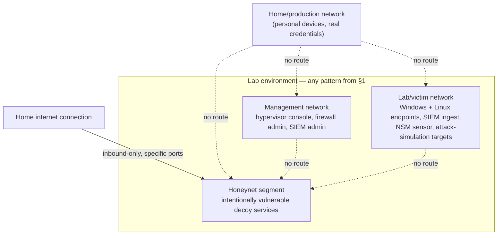

# Part 2 — Lab Architecture Patterns and Topology Decisions

## Why this part exists

Part 1 stated the book's non-negotiable rule: you build a lab to attack and defend systems you own, on a network segment that can't reach — and can't be reached by — anything you don't own. This part is where that rule starts turning into hardware and cabling decisions. Before you buy a mini PC, spin up a cloud VM, or repurpose the desktop under your desk, you need to know what *shape* a home SOC lab can take, which shape fits your budget and your household, and the three logical networks every later part in this book assumes exist regardless of which shape you pick. This part doesn't install anything — no hypervisor, no SIEM, no firewall rule. It's the decision framework and the shared vocabulary that Section B's build chapters (Parts 5 through 8) and the network-isolation chapter right after this one (Part 4) all lean on without re-explaining it.

If you already know you're running Proxmox on a single box and just want the isolation build, skip to Part 4. If you're still deciding whether one box, several boxes, or a cloud account is the right starting point, this is the part that answers that question.

> **Safety Gate**
> Every topology pattern compared in this part — single-host, multi-host, or cloud-hosted — has to end up with the same three logically separate networks defined in §2: a management network, a lab/victim network, and, if you build one, a honeynet segment with zero route back to your home network or any host holding real credentials. Nothing in this part is a substitute for that boundary; it's a menu of hardware shapes the boundary gets built on top of, in Part 4. Before you pick a pattern because it looks cheaper or quieter, confirm the hardware can actually host the VLAN or virtual-switch isolation Part 4 requires — a mini PC with a single NIC and no VLAN-capable switch downstream can't enforce a honeynet segment's isolation no matter how the guests inside it are laid out. Full procedure: Part 4 and Appendix A4.

## 1. Three shapes a home lab can take

**[CONCEPT]** Almost every home SOC lab you'll read about online turns out to be a variation on three underlying shapes. None is objectively "the" right answer — each trades physical footprint, cost, and noise against how much isolation and realism it can actually deliver.

### 1.1 Single-host all-in-one

**[CONCEPT]** One physical machine — a repurposed desktop, a mini PC, or a dedicated home-server box — runs a hypervisor, and every lab component (SIEM, endpoints, network security monitoring sensor, firewall/router VM, honeypots) lives on that one box as separate virtual machines or containers, connected through virtual switches instead of physical cabling. This is the pattern this book's own build chapters (Parts 5 through 21) default to, because it's the pattern the author actually runs.

**[COST/RESOURCE]** One box means one power bill, one set of firmware to patch, and one fan noise profile to negotiate with whoever else lives in the house. It also means one hardware failure takes down every lab component at once, and one undersized CPU or disk controller becomes a shared bottleneck across everything running on it.

**[CONCEPT]** The isolation between components on a single-host build is still real, not cosmetic, as long as the hypervisor's virtual-switch configuration is actually correct — a vSwitch with no uplink to a physical NIC is exactly as isolated as an air-gapped machine, and three separate vSwitches with no bridging between them enforce the same "no route" boundary a physical cable pull would. What breaks that isolation on a single-host build is almost always a configuration mistake (a guest with two network adapters, one on the lab network and one bridged to the home network for "convenience") rather than a hardware limitation — Part 4 names the specific failure modes in detail.

### 1.2 Multi-host distributed

**[CONCEPT]** Two or more separate physical machines split the lab's roles — for example, one box runs the hypervisor hosting endpoints and the SIEM, a second, cheaper box runs the router/firewall and network security monitoring sensor inline on real Ethernet between them, and a third handles the honeynet segment on its own physical NIC. This is closer to how a real small-business network is actually laid out — physical hops between segments, a real switch enforcing VLANs instead of a vSwitch config file, and a genuine single point of failure removed from any one box.

**[COST/RESOURCE]** More boxes means more up-front hardware cost, more power draw, more fan noise, and more firmware/OS instances to keep patched — three or four small boxes running around the clock will cost more in electricity over a year than one larger box sized to do the same total work, even before you account for the extra hardware purchase itself.

**[CONCEPT]** The payoff for that extra cost is that isolation stops being a config file and becomes a cable you can trace with your hand. A honeynet segment on its own physical NIC, connected to a managed switch port with its own VLAN and no trunk to the management switch, survives a hypervisor misconfiguration that would otherwise bridge two vSwitches by accident on a single-host build — the failure mode in §1.1's last paragraph simply has no physical path to occur. That's the real argument for multi-host, and it's worth paying for only if the extra maintenance surface (§3.1) is a cost you're willing to carry every month, not just on build day.

### 1.3 Cloud-hosted and hybrid

**[CONCEPT]** Some or all of the lab runs as cloud VMs and managed services instead of hardware you own — a SIEM in a cloud account, endpoints as cloud instances, a virtual network instead of a physical one. A hybrid variant keeps intentionally vulnerable and attack-simulation components on owned, physically isolated hardware at home while pushing lower-risk components (a SIEM's indexer, a dashboard) to the cloud.

**[COST/RESOURCE]** Cloud removes the up-front hardware cost and the noise/power problem entirely, replacing them with a recurring bill that scales with usage and doesn't stop when you're not actively using the lab unless you remember to shut instances down. It also replaces "isolated home network with no route to the internet" with "a cloud provider's network and billing account, governed by that provider's terms of service" — a materially different safety story that this book doesn't treat as equivalent to a home network build.

**[SAFETY]** A cloud-hosted intentionally-vulnerable service is not automatically isolated the way a home-network segment can be — it typically has a public IP and is reachable from the entire internet unless you explicitly lock it down, and a misconfigured security group can expose a deliberately unpatched honeypot to real attackers with real consequences for your cloud bill and your provider relationship. This book's Safety Gate framework assumes a home-network build; a reader choosing the cloud-hosted pattern owns the extra work of translating "isolated segment" into that provider's specific network-ACL and security-group model before deploying anything intentionally vulnerable, and this book doesn't walk through that translation (per the series map — cloud lab-building is deliberately out of this book's main scope, noted again in Part 22).

The table below compares the three patterns directly, to support choosing one before moving to Part 3's hardware tiers.

**Table 2.1 — Home lab topology patterns compared.** *(CONCEPTUAL SAMPLE — figures are representative ranges for a hobbyist build, not a specific vendor's quote.)*

| Pattern | Physical footprint | Approx. up-front cost | Noise/power profile | Isolation model | Best fit for |
|---|---|---|---|---|---|
| Single-host all-in-one | 1 box | $300–$1,200 (mini PC to dedicated server) | 1 fan, 1 PSU, easiest to tuck away or run silent | Virtual switches/VLANs inside 1 hypervisor | Apartment/shared-household readers, budget-constrained readers, anyone starting out |
| Multi-host distributed | 2 to 4 boxes plus a managed switch | $500–$2,000+ | Multiple fans/PSUs; noticeably louder and warmer as a group | Real switch VLANs plus physical segment boundaries | Readers with a dedicated space (garage, closet, office), readers wanting hardware-fault isolation |
| Cloud-hosted/hybrid | None locally (or a small on-prem component in the hybrid case) | $0 up-front, recurring monthly bill | None locally | Cloud provider's VPC/security-group model, not a home network | Readers with no space/power tolerance for hardware, readers already fluent in 1 cloud provider's networking model |

## 2. The vocabulary every later part assumes

**[CONCEPT]** Whichever shape from §1 you choose, this book describes the resulting lab using three logical network names, not physical ones. A "network" in this vocabulary is a boundary defined by routing and firewall policy, not a specific piece of hardware — on a single-host build all three might be virtual switches inside one hypervisor; on a multi-host build they might be VLANs spanning a real switch. Part 4 builds the actual segmentation; this part just names the pieces so Part 4 (and every part after it) doesn't have to re-derive them.

### 2.1 Management network

**[CONCEPT]** The network you use to administer the lab itself — the hypervisor's own web console, SSH to a firewall VM's configuration interface, the SIEM's admin login. Nothing on the management network should be reachable from the lab/victim network or the honeynet segment; if a compromised lab endpoint can reach your hypervisor's management interface, the isolation between "the thing being attacked" and "the thing running the attack surface" has already failed.

### 2.2 Lab/victim network

**[CONCEPT]** The network holding the endpoints and services this book teaches you to build and monitor — Windows and Linux hosts running Sysmon and auditd, the SIEM's ingest-facing interface, Zeek and Suricata's monitored segment. This is where Part 18's attack-simulation tooling runs against hosts you own, and where most of this book's hands-on exercises live.

### 2.3 Honeynet segment

**[CONCEPT]** A network holding intentionally vulnerable, deliberately exposed decoy services (Part 15) that exist purely to attract and log unsolicited contact. This segment carries the strictest isolation requirement in the book: it's designed to be attacked, its inbound path is intentionally left open on specific ports, and it must have zero route to anything you're not fully prepared to lose if a decoy is fully compromised.

**Figure 2.1 — The three logical networks and what does not connect to what.** *CONCEPTUAL.* Illustrates the vocabulary this part defines and the isolation posture Part 4 builds — a lab environment with a management network, a lab/victim network, and a honeynet segment, none of which routes to the home/production network, and none of which (management or victim) routes to the honeynet segment either. This is an architecture sketch of the target state, not a capture from a specific running build; Part 4 renders the same relationships as actual VLAN/vSwitch rules, and Part 6 as a real pfSense/OPNsense rule table. Diagram ID `FIG-02-01`.

> **Lab Note**
> If you can't yet answer "which of these three networks is this VM on" for every guest in your lab, stop before adding anything else. The single most common way isolation quietly breaks (Part 4 covers the mechanisms) is a guest nobody remembers assigning to a network, sitting on whatever interface the hypervisor defaulted it to.

## 3. Choosing a pattern: budget, noise, and how much you want to own

**[CONCEPT]** Three axes decide which pattern from §1 fits a given reader — none of them is "which tool is best," because the tools in Section B run on any of the three patterns. The pattern question is about the platform underneath the tools, not the tools themselves.

### 3.1 Budget

**[COST/RESOURCE]** A single-host build has the lowest floor: one piece of hardware, sized against Part 3's tiers, running everything. A multi-host build multiplies that floor by however many boxes you split roles across, plus a managed switch capable of VLAN tagging if you want the multi-host pattern's isolation benefit to be real rather than cosmetic. Cloud removes the floor but replaces it with a ceiling that keeps rising the longer instances stay running — a lab left on by accident for a month behaves financially nothing like a home lab left powered on by accident, which just adds a few dollars to one electric bill.

### 3.2 Household noise and power tolerance

**[COST/RESOURCE]** This axis gets skipped in most online lab-building guides and shouldn't be. A dedicated server-grade box with several fans and a real power supply is audibly a server — fine in a garage or a dedicated closet, genuinely disruptive in a bedroom or a shared apartment. A mini PC or a repurposed laptop draws a fraction of the power and can sit on a desk silently. If you don't have a room to put a running-24/7 box in that nobody minds hearing or paying the power bill for, that constraint alone should push you toward the single-host, low-power end of §1's spectrum before cost does.

### 3.3 Own versus simulate

**[CONCEPT]** The last axis is how much of the stack you want to genuinely build and operate long-term versus stand up briefly to run one exercise and tear down. A persistent single-host lab that stays running for months is what most of this book assumes and what makes Part 9's real telemetry examples possible in the first place. A short-lived, torn-down-after-use lab — spun up in the cloud for a weekend, or rebuilt from a snapshot for one drill — trades that persistence for lower ongoing cost and no long-term patching burden. Part 11 revisits this axis specifically for Windows domain labs, where "persistent" turns out to carry a maintenance cost most single-operator readers underestimate.

### 3.4 A worked walkthrough of the three axes

**[CONCEPT]** The table below isn't a formula — no single number decides this for you — but it's the shape of the reasoning worth running through before buying anything, matching a rough reader profile to the pattern from §1 that profile's constraints point toward.

**Table 2.2 — Matching reader constraints to a topology pattern.** *(CONCEPTUAL SAMPLE — illustrative profiles, not a substitute for your own budget/noise/ownership answers.)*

| Reader profile | Budget signal | Noise/power signal | Own-vs-simulate signal | Pattern this points to |
|---|---|---|---|---|
| Apartment, shared household, first lab build | Under $500 to start | Must run silently, ideally out of sight | Wants it running long-term to learn incrementally | Single-host all-in-one (§1.1) |
| Dedicated room/garage, some hardware already on hand | $500–$1,500, spread over time | Fan noise and heat acceptable in that space | Wants hardware-fault isolation, willing to patch more boxes | Multi-host distributed (§1.2) |
| No space or tolerance for always-on hardware | Comfortable with a recurring bill instead of a purchase | No local noise/power constraint at all | Plans short, scenario-based sessions rather than a persistent build | Cloud-hosted/hybrid (§1.3) |
| Already fluent in 1 cloud provider, wants to keep intentionally-vulnerable services at home | Mixed — some recurring cloud cost, some hardware cost | Only the honeynet/attack-simulation piece needs to be physically isolated at home | Wants the SIEM/dashboard layer always reachable without running a home box 24/7 | Hybrid split (§1.3, hybrid variant) |

## 4. A real lab example: what a "distributed" topology looks like once it's actually running

**[CONCEPT]** *REAL LAB EXAMPLE.* The author's own home lab is a useful case study precisely because it doesn't cleanly match any single row of Table 2.1 — it's a single physical Proxmox host (matching §1.1's footprint and cost profile) running enough separately-networked guests that it behaves, logically, like §1.2's multi-host distributed pattern. One box hosts a Pi-hole/DNS resolver, a Tor relay, a honeynet spanning several containers, a vulnerability-scanner platform, and a monitored network-visibility service, each assigned to its own role and network segment rather than dumped onto one flat guest network. That's a legitimate fourth answer to "which pattern do I pick": buy for §1.1's cost and noise profile, then design the guest network layout as if you'd bought for §1.2.

**[CONCEPT]** This didn't happen as a single planned build. The lab grew role by role — DNS first, then a honeynet, then a vulnerability scanner, then network-visibility tooling — with each new guest assigned to a network segment matching §2's vocabulary at the time it was added, rather than a from-scratch redesign every time something new went on the host. That incremental pattern is realistic for a hobbyist lab and worth planning for deliberately: decide the segment-naming and VLAN-numbering scheme in Part 4 before the first guest goes on the network, so guest number nine doesn't require renumbering guests one through eight to fit.

> **Resource Reality**
> The author's real lab is also proof that this pattern's flexibility has a ceiling. Running enough guests on one physical host to cover DNS, a Tor relay, a multi-container honeynet, a vulnerability scanner, and a network-monitoring service has pushed that single host to CPU and RAM oversubscription and a root filesystem sitting at 100% full — not a hypothetical "performance may degrade" warning, but the actual current state of a lab built exactly the way §4 describes. Section 1.1's "one hardware failure takes down everything" and "one CPU becomes a shared bottleneck" caveats aren't abstract risks; they're what happens when a single-host lab's guest count outgrows the box it started on, and the fix is the same one Part 3 states for any tier: budget headroom before you add the next guest, not after the host is already this full.

> **Blind Spot**
> A single physical host running several logically separated guests teaches you the network-segmentation half of the multi-host pattern — VLANs, firewall rules between segments, distinct roles per guest — but not the hardware-fault-isolation half. If that one Proxmox host's disk fails, every guest on every segment goes down at once, including the honeynet and the DNS resolver the rest of the lab depends on. A genuinely distributed multi-host build (separate physical boxes per major role) is the only pattern in this part that actually removes that single point of failure; a single host with well-designed virtual networking removes the *logical* flatness but not the *physical* one.

## 5. Which pattern the rest of this book builds against

**[CONCEPT]** Part 5 walks through installing a hypervisor and states plainly which platform the author actually runs (Proxmox, on the single-host pattern from §1.1) — every hands-on build chapter from Part 5 through Part 21 defaults to that pattern's assumptions: one hypervisor, virtual switches standing in for the physical segment boundaries Part 4 designs. If you've chosen the multi-host pattern from §1.2 instead, the segmentation concepts in Part 4 and the product installs in Parts 5 through 21 still apply — a VLAN is a VLAN whether it spans one hypervisor's virtual switches or a real managed switch between three boxes — but the specific "click here in the Proxmox web console" instructions won't map one-to-one onto a different hypervisor or a physically distributed layout, and this book doesn't re-derive a parallel walkthrough per platform (Part 5 states this limitation explicitly rather than silently assuming Proxmox is the only valid choice).

**[CONCEPT]** If you've chosen the cloud-hosted pattern from §1.3, expect a larger translation gap: Parts 6 through 8 and Parts 12 through 16 assume a hypervisor-and-virtual-switch model that doesn't map directly onto a cloud provider's VPC/security-group model, and this book doesn't provide that translation (§1.3's Safety Gate note above). Part 22's closing synthesis points toward where cloud-specific lab-building content would eventually live, but it isn't part of this book's 22 parts.

## 6. From topology to telemetry: what the other three volumes do with what you build here

**[CONCEPT]** This part produces no telemetry by itself — it's a decision, not a build step. But the pattern chosen here determines something every other NESHBOY volume depends on: how many distinct network segments and log sources will eventually exist, and what each one is *for*. That mapping is what makes the rest of the series usable once Parts 5 through 21 finish building against it.

- **Detection Engineering Handbook V2** assumes a reader already has telemetry with a known source and a known network context — its Parts 8–9 interpret Windows/Sysmon and Linux/auditd events, and its Parts 34–36 teach threat-hunting methodology, on the explicit premise that the hunter knows whether a given host sits on the lab/victim network or the honeynet segment defined in §2. Get the topology decision right here, and every detection rule and hunt built later in that volume has an unambiguous "where did this come from" answer built in from the start.
- **SOC Playbook Handbook**'s Playbook Library assumes an alert arrives tagged with enough network context to triage correctly — a login-anomaly alert from the lab/victim network and the same alert shape from the honeynet segment call for entirely different playbook branches (one is a real detection to investigate, the other is the decoy behaving exactly as designed). That distinction only exists because §2's vocabulary was applied consistently when the lab was built.
- **SOC Manager's Operating Handbook** uses this book's finished lab as the practice environment for Part 8's assessment design and Part 11's onboarding/ramp-up content, and for structuring a repeatable Field Test drill (this book's Part 22 closes the loop on that explicitly). A topology nobody can clearly describe — "which network is this host on, again?" — makes a repeatable drill impossible to score consistently, which is a management problem this part's vocabulary exists to prevent before it starts.

None of that is content this part teaches directly — it's the reason getting the topology decision right, before Part 4's build, pays off three books later.

---

**Cross-references:** This book — Part 1 (the ownership/isolation rule), Part 3 (hardware tiers for whichever pattern you chose), Part 4 (building the isolation this part's vocabulary assumes), Part 5 (hypervisor install on the single-host default), Part 11 (the own-vs-simulate axis applied to Windows domain labs), Part 22 (closing synthesis and the cloud-lab forward pointer), Appendix A1 (topology diagram templates), Appendix A5 (cross-series lookup). Detection Engineering Handbook V2 — Parts 8–9, 34–36. SOC Playbook Handbook — Playbook Library. SOC Manager's Operating Handbook — Part 8, Part 11.
