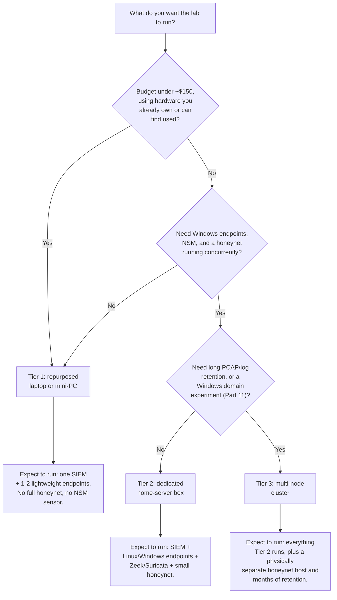

# Part 3 — Hardware and Resource Budgeting

## Why this part exists

Part 2 gave you the shapes a lab can take — single-host, multi-host, cloud-hybrid — and the vocabulary for talking about them. This part turns those shapes into numbers you can actually shop for: how many cores, how much RAM, how much disk, and how much of your electricity bill, per tier, before you spend a single dollar or repurpose a single old laptop. The goal is a hardware decision you can defend, not a hardware decision you regret three services into the build.

**[CONCEPT]** This is a hobbyist's budgeting problem, not an enterprise one. SOC Manager's Operating Handbook, Part 20 (Building & Defending the SOC Budget) covers headcount, licensing, and vendor contracts at organizational scale — a different problem with different stakes. The only thing worth borrowing from it here is the habit: write the number down before you buy, and write down what breaks below it. This part does that for watts, gigabytes, and cores instead of headcount and dollars per analyst.

> **Safety Gate**
> Nothing in this part's sizing guidance is a substitute for the network isolation Part 4 builds. A hardware tier tells you what a box can run — it says nothing about whether it's safe to run it. Before you provision a single VM on whichever tier you choose, confirm you have, or plan to build, enough NIC and virtual-switch capacity to keep the honeynet segment (Part 15) and any attack-simulation targets (Part 18) off the same broadcast domain as your management and endpoint traffic. A Tier 1 box with one onboard NIC can still do this correctly using the VLAN-tagged virtual switches Part 4 builds — but only if that separation exists before anything intentionally vulnerable goes on the box, not retrofitted after. Buying more RAM does not buy you isolation.

## 1. Sizing is a lab problem, not a scaling problem

**[CONCEPT]** An enterprise buys hardware to survive growth it can't fully predict. You're buying hardware to run a fixed, known list of services you're choosing yourself, on a network nobody else depends on. That's a much easier problem, and it has a wrong answer that's worth naming up front: guessing. "I'll get a decent PC and see what fits" produces a box that runs a SIEM adequately, until you add a second Windows endpoint, at which point it swaps, the indexer restarts under memory pressure, and you spend a Saturday debugging a hardware problem you could have avoided by reading a sizing table for ten minutes first.

This part gives you three tiers — repurposed laptop or mini-PC, dedicated home-server box, multi-node cluster — with the CPU, RAM, disk, and power numbers for each, and a plain statement of what each tier cannot do. The tiers aren't marketing categories; they're checkpoints. If your ambition (a Windows domain, a full honeynet, months of PCAP retention, all running at once) exceeds your tier, the fix is either a smaller ambition or a bigger tier — not a hope that Linux memory management will bail you out. It won't, past a point, and that point arrives faster than most first-time lab builders expect.

## 2. The three hardware tiers

**[COST/RESOURCE]** The table below maps hardware tier to what it can and can't run without swapping, so you can pick a starting point before Part 5 walks through the actual hypervisor install.

| Tier | CPU | RAM | Disk | Power draw (idle/load) | Approx. cost | Can run comfortably | Cannot run |
|---|---|---|---|---|---|---|---|
| 1 — Repurposed laptop/mini-PC | 4 cores, no server-grade features | 8–16GB | 128–256GB SSD | 10–25W / 35–45W | $0 (already owned) to $150 used | One SIEM instance, 1–2 lightweight Linux endpoints, a DNS/DHCP service | A Windows endpoint alongside the SIEM without swapping; any NSM sensor doing real packet capture; more than one or two honeypot decoys at once |
| 2 — Dedicated home-server box | 6–8+ cores, server or workstation-class | 32–64GB | 500GB–2TB SSD, plus HDD for cold storage | 45–65W / 90–150W | $250–700 used enterprise SFF/tower | SIEM + several Linux and Windows endpoints + Zeek or Suricata + a small honeynet + threat-intel ingestion, concurrently | A persistent multi-DC Active Directory forest and a full honeynet and months of raw PCAP retention, all at once, without adding storage |
| 3 — Multi-node cluster | 2–3 hosts, Tier-2-class each | 32–64GB per node | Tier-2 disk per node, aggregated | Sum of node draw, plus switch | $700–2,000+ used enterprise gear | Everything Tier 2 runs, plus a physically separate host for the honeynet segment, longer retention, and headroom for a Part 11-style domain experiment | Nothing, really — the limits move from hardware to your own maintenance time (Part 20) |

> **Lab Note**
> Used, off-lease business desktops (HP EliteDesk/ProDesk, Dell OptiPlex) are the best dollar-per-core value in this entire book. They're quiet, they take standard ATX PSUs when the stock one dies, and a 4-core/16GB unit is routinely under $100 on the secondhand market. You do not need ECC RAM or a rack chassis for a single-operator lab — that's Tier-3 thinking applied to a Tier-1 problem.

**[COST/RESOURCE]** Tier categories describe capacity, not headroom actually left over — those are different numbers, and conflating them is the single most common hardware mistake in a lab like this.

> **Resource Reality**
> The author's own running lab sits on Tier-2-class hardware — an HP EliteDesk 800 G1 desktop, Intel Core i5-4590 (4 physical cores, no hyperthreading), 15GiB of RAM — and at last inspection (2026-09-14) it was hosting 13 guests with roughly 21 vCPUs and about 14.5GB of RAM allocated across them, on 4 physical cores and 15GiB of physical RAM. That's over 5x CPU oversubscription and RAM allocated down to the last gigabyte. It runs, because most of those guests (a DNS resolver, several honeynet decoys, a Tor relay) are idle most of the time and Linux's scheduler and memory overcommit tolerate that — but the same host's root filesystem was already at 92% full at that same inspection and fully exhausted within the following day. Oversubscription and disk exhaustion aren't hypothetical failure modes this book warns about in the abstract; they're what's actually happening on the lab this book is partly evidenced from, right now.

## 3. What each lab component actually costs

**[COST/RESOURCE]** Tier tables tell you the ceiling. This table tells you what actually eats into it, service by service, so you can add up a realistic total before you commit to a tier.

| Component | CPU | RAM | Disk | Notes |
|---|---|---|---|---|
| Hypervisor base overhead (Proxmox host itself) | Low, mostly idle | 1–2GB | 20–30GB for the host OS | Web UI, `pvestatd`, and package overhead cost more at idle than vendor "minimum requirements" pages suggest |
| SIEM — indexer component (Wazuh/Elastic-family) | 1–2 cores under ingest | 4GB heap at idle, more under load | 20GB+, grows with retention | Budget 8GB total for the SIEM VM before adding a single endpoint — see Part 8 |
| SIEM — manager/rules engine | Shares the VM above | 1–2GB additional | Shares the VM above | Runs alongside the indexer on the same VM in most home-lab builds |
| Linux endpoint (Debian/Ubuntu + auditd + forwarding) | 1 core | 512MB–1GB | 4–8GB | Matches the author's own real endpoints (pihole: 1 core/1GB; vulnscan: 2 cores/2GB) — Linux telemetry sources are cheap |
| Windows endpoint (standalone + Sysmon + forwarding) | 2 cores | 4GB minimum | 40–60GB | Windows itself, not Sysmon, is the RAM cost here — see Part 10 |
| Zeek sensor | 1–2 cores, scales with link rate | 2–4GB | Depends on log retention, not capture | CPU-bound on packet rate, not RAM-bound — see Part 13's Engineering Reality box for mirrored-port packet loss |
| Suricata sensor | 1–2 cores, scales with rule count and link rate | 2–4GB | Similar to Zeek | Loading the full ET Open rule set costs meaningfully more RAM than a trimmed rule set — see Part 14 |
| Honeynet decoy (single service) | 1 core | 384–768MB | 2–4GB | Matches the author's real AeroNex decoy containers — four of the five run at the low end (384MB/2GB); the one fronting a real, deliberately unpatched phpMyAdmin (CVE-2018-12613) over a full Apache/PHP/MariaDB stack runs heavier (768MB/4GB) because it's a full stack, not a single lightweight service. A decoy is deliberately cheap so you can run several |
| Honeynet collector/correlation backend | 4 cores | 3GB + swap | 4–8GB | Correlation logic and a dashboard cost more than any individual decoy — see Part 15 |
| Threat-intel feed poller | Under 1 core | 256–512MB | 1–2GB | Cheapest component in the book; mostly idle, polling on a timer |

> **Engineering Reality**
> Vendor "minimum requirements" pages describe the software running alone on an otherwise-empty machine. A Proxmox host that claims to run comfortably in a couple of gigabytes still costs you real, permanent RAM for the web UI, `corosync`, and normal package overhead before a single guest boots — treat every vendor minimum in this table as a floor for that one component in isolation, not a number you can stack without a margin.

## 4. Stacking exercise: what actually fits

**[SETUP]** Add the component table up against a tier and the picture gets concrete fast. Take a common first-timer's wish list: one SIEM, two Windows endpoints, three Linux endpoints, Zeek, Suricata, and a small honeynet, all on one box.

1. SIEM: 8GB.
2. Two Windows endpoints at 4GB each: 8GB.
3. Three Linux endpoints at ~1GB each: 3GB.
4. Zeek and Suricata sharing a sensor VM: 4GB.
5. A three-decoy honeynet plus its collector: roughly 4.5GB.
6. Hypervisor host overhead: 2GB.

That's a running total around 29.5GB before any operating-system-level swap headroom or the inevitable moment two Windows endpoints both decide to run updates at once. On a 16GB box, this list doesn't run slowly — it doesn't run. The SIEM's indexer gets OOM-killed, the Windows endpoints thrash into swap and stop producing timely Sysmon events, and the honeynet's collector either falls behind or drops correlation state. A SIEM plus a Windows domain plus a full honeynet on 16GB of RAM produces an unusable, swapping mess, not a working lab — that's not a caution, it's arithmetic from the table above.

The same list fits a 32GB Tier-2 box with room to spare, which is exactly why this book treats Tier 2 as the realistic default for a reader who wants most of Section B through Section E running at once, and treats Tier 1 as a genuinely good starting point for a reader who wants to build incrementally — SIEM and Linux endpoints first (Parts 8–9), then decide whether the next purchase is more RAM in the same box or a second box entirely.

> **What Would Change My Mind**
> This section's specific claim is that 16GB of RAM cannot sustain a SIEM, two Windows endpoints, and a full honeynet running concurrently without swapping under realistic ingest load. If a reader reports running that exact combination on 16GB for a sustained multi-week period — under real event volume, not an idle demo — with no OOM kills and no swap thrashing, that specific number needs revision in this part, not just a footnote. The general "budget generously" framing would survive; the specific 16GB figure would not.

## 5. Beyond RAM: CPU, disk I/O, and NIC capability

**[COST/RESOURCE]** RAM gets the most attention because it fails loudly (a process dies) rather than quietly (a process just runs slower), but two other resources decide whether a lab is pleasant to use.

**[COST/RESOURCE]** CPU oversubscription is normal in a home lab and usually fine, because most of your guests are idle most of the time — the author's own host runs 21 vCPUs of allocated capacity on 4 physical cores without falling over, precisely because a DNS resolver and a Tor relay spend nearly all their time waiting on I/O, not computing. The oversubscription that actually hurts is concurrent, CPU-bound load: a Windows endpoint installing updates at the same moment Zeek is processing a traffic spike and Suricata is matching against a large rule set. There are only 4 physical cores on a box like that, and they can't truly run 4 CPU-bound things at once regardless of how many vCPUs you've handed out on paper; when that happens, everything on the host slows down together, and a SIEM ingest pipeline that falls behind starts silently dropping or delaying events rather than crashing outright — a much harder problem to notice than an OOM kill.

**[COST/RESOURCE]** Disk I/O matters as much as capacity. A SIEM's indexer performs constant small writes; on a spinning hard disk instead of an SSD, ingest can fall behind badly enough that dashboards show data minutes old instead of seconds old. Reserve SSD for anything actively indexing (the SIEM, the honeynet collector's database) and it's fine to put cold storage — PCAP archives, old backups — on cheaper spinning disk, which is exactly the local/local-lvm split the author's own host uses and exactly the retention strategy Part 21 covers in depth.

**[COST/RESOURCE]** NIC capability is the resource first-time builders forget to check, and it bites later rather than immediately: Part 12 needs a virtual switch or physical NIC capable of promiscuous-mode mirroring for Zeek and Suricata to see anything, and not every consumer NIC chipset handles that cleanly under load.

> **Engineering Reality**
> The author's own host has crashed from exactly this kind of NIC problem — not a mirroring failure, but a specific Intel e1000e driver bug ("Hardware Unit Hang") on its primary NIC that took the whole host down four times before the fix (disabling TSO/GSO offload) was identified and made persistent. The lesson generalizes past this one chipset: a consumer NIC under sustained lab load is not guaranteed to behave like its datasheet, and a NIC-driver crash takes down every guest on the host at once, not just the network stack. Note the exact NIC chipset on any box you're considering before you buy it, and budget time to hunt down a driver quirk if the host starts crash-looping under network load — it's a hardware problem, not a config mistake, and no amount of re-reading your firewall rules will fix it.

## 6. Power, noise, and heat: the constraint an enterprise budget doesn't have

**[COST/RESOURCE]** An enterprise SOC's power bill is somebody else's line item. Yours runs through your own electricity meter and sits in the same room you sleep in, and both of those facts should shape which tier you pick.

A Tier-1 laptop idles around 10–15W and rarely gets loud enough to notice. A Tier-2 desktop-class box under real load — SIEM ingest, a couple of endpoints, an NSM sensor all working at once — commonly draws 90–150W, which at a representative $0.15/kWh residential rate is roughly $10–16 a month left running continuously, before you've counted a second box. That's not a large number, but it's not zero, and it compounds with a Tier-3 cluster's per-node draw multiplied across two or three machines. Heat and fan noise scale with it: a repurposed laptop tucked on a shelf is easy to forget about; a multi-node cluster in a bedroom closet is not, and "will this be loud enough that a housemate notices" is a legitimate sizing input this book won't pretend doesn't matter.

> **Lab Note**
> If noise is the binding constraint rather than budget, a low-power NUC-class mini-PC (fanless or near-silent) running Tier-1's workload is worth the price premium over a louder used desktop of the same RAM/CPU spec — you'll actually leave it running 24/7 instead of shutting it down when it bothers you, and a lab that's off half the time produces half the telemetry.

## 7. Deciding your tier: a sizing flow

**[CONCEPT]** The decision isn't really about your budget in isolation — it's budget, ambition, and household tolerance for noise and heat, weighed together. The flow below collapses the tables above into the same decision path this book expects most readers to actually walk.





**Figure 3.1 — Hardware tier decision flow.** *CONCEPTUAL.* Illustrates the sizing decision this section walks through: budget and concurrency requirements route a reader to one of the three tiers defined in §2, each with the stacking expectations from §3–4 attached. This is a decision aid, not a capture from a running build — Part 5 shows the same host after an actual hypervisor install.

## 8. Validate your hardware before you build anything

**[SETUP]** Before committing to a tier, confirm the box you're considering (or already own) can actually deliver what the tables above assume. These checks target Debian/Ubuntu-family Linux and Windows 10/11 hosts — the two operating systems this book's endpoints and hypervisors run on.

On a Linux box or a Linux-based hypervisor host, confirm core count, RAM, and virtualization-extension support:

```bash
nproc
free -h
grep -Eoc '(vmx|svm)' /proc/cpuinfo
```

`nproc` should report the core count the listing claimed; `free -h` should show total RAM close to the advertised spec (a little less is normal — the BIOS and integrated graphics reserve some); the `grep` command should return a number greater than 0, confirming Intel VT-x (`vmx`) or AMD-V (`svm`) is present and exposed to the OS, without which no hypervisor in Part 5 will run a VM at all.

On a Windows box being considered as a host or a future endpoint, confirm the same virtualization extension from PowerShell:

```powershell
Get-ComputerInfo -Property "HyperVRequirementVirtualizationFirmwareEnabled"
```

> **Validation Test**
> **Setup:** a candidate box, powered on, with either a Linux live USB or its existing Linux/Windows install.
> **Action:** run the three Linux commands above, or the PowerShell command above, on the target box.
> **Expected result:** `nproc` and `free -h` match the tables in §2 for the tier you're evaluating; the virtualization-extension check returns a positive result (a nonzero count on Linux, `True` on Windows). If virtualization extensions report disabled, the fix is almost always a BIOS/UEFI setting (commonly named "Intel VT-x," "AMD-V," or "SVM Mode") rather than a hardware limitation — re-check after enabling it before concluding the box can't do the job.

## 9. Troubleshooting undersized hardware

**[TROUBLESHOOTING]** Undersized hardware rarely announces itself as "undersized hardware." It shows up as symptoms in the software layered on top, and it's worth recognizing the pattern before you spend an evening debugging a SIEM config that was never the problem.

- **SIEM indexer restarts repeatedly under load.** Almost always an OOM kill, not a software bug. Check `dmesg` or `journalctl -k` for `Out of memory: Killed process` entries matching the indexer's process name; the fix is the 8GB budget from §3, not a config tweak.
- **Sysmon events arrive minutes late, or stop arriving during load spikes.** A Windows endpoint under swap pressure delays its own event forwarding; by the time an event reaches the SIEM its timestamp is stale enough to break correlation windows in Detection Engineering Handbook V2's detection logic. Check the endpoint's own memory pressure before assuming the SIEM pipeline is broken.
- **Dashboards show data that's minutes old instead of seconds old.** Usually disk I/O, not RAM — check whether the SIEM's storage is on spinning disk rather than SSD before touching any query or index setting.
- **The whole host crash-loops or hangs under network load.** Check the specific NIC chipset and driver for known issues (§5's Engineering Reality box) before assuming it's a virtual-switch misconfiguration — some hardware bugs look exactly like software bugs until you check `dmesg` for driver-level errors.
- **Everything gets slower over weeks with no config changes.** Check disk capacity, not RAM — a filesystem creeping toward full (as the author's own root filesystem did) degrades write performance well before it actually fills, and a SIEM or honeynet collector that can't write new records fails quietly rather than with an obvious error.

## 10. What this budget buys you downstream

**[CONCEPT]** The hardware tier you choose here isn't just a shopping decision — it caps what the rest of the NESHBOY series can do with what your lab produces, so it's worth being explicit about the handoff before you move on to Part 4.

Detection Engineering Handbook V2's threat-hunting content (Parts 34–36) assumes you have enough retained history to hunt across — a Tier-1 box running a SIEM with a few gigabytes of headroom will force short retention windows (Part 21 covers exactly this trade-off), which means hunting exercises built from that book will realistically cover days, not months, of history until you scale up. Size for the hunting scope you actually want to practice, not just the ingest volume you have today.

SOC Playbook Handbook's playbooks assume the services a real incident touches are actually up and responsive when you work through a scenario. An underpowered box that's quietly swapping doesn't just produce noisy telemetry — it makes playbook practice unrealistic in the wrong direction, teaching you to expect sluggish tooling as normal rather than as a service-degradation incident worth escalating in its own right. If you want playbook drills (Part 19) to reflect a healthy environment, budget hardware so the lab's baseline behavior is healthy.

SOC Manager's Operating Handbook's budget-justification framing (Part 20) is worth revisiting once you've lived with a tier for a few months: the exercise of writing down "Tier 1 was fine until I added a second Windows endpoint, and here's the specific number that forced the Tier 2 upgrade" is a small, low-stakes rehearsal of the exact justify-the-spend argument that book teaches at organizational scale. Keep your own numbers from this part — they're a genuine, if miniature, case study the next time you need to make that argument for real.

---

**Cross-references:** Part 2 (Lab Architecture Patterns and Topology Decisions) for the topology shapes these tiers assume; Part 4 (Network Isolation and Segmentation Architecture) for the isolation controls this part's Safety Gate depends on; Part 5 (Choosing and Installing a Hypervisor) for the actual build on the host sized here; Part 8 (Building the SIEM Platform), Part 9 (Linux Endpoints and auditd Deployment), Part 10 (Windows Endpoints and Sysmon Deployment), Part 13 (Deploying Zeek), Part 14 (Deploying Suricata), and Part 15 (Honeypots and Honeynet Architecture) for the components priced in §3; Part 11 (The Windows Domain Lab Problem) and Part 21 (Storage Growth, Retention, and Long-Term Cost Management) for the two heaviest cost drivers this part flags but doesn't fully size; Appendix A2 (Hardware Tiers & Cost Worksheets) for a fillable version of this part's tables; SOC Manager's Operating Handbook, Part 20 for the loosely analogous enterprise budget process.
