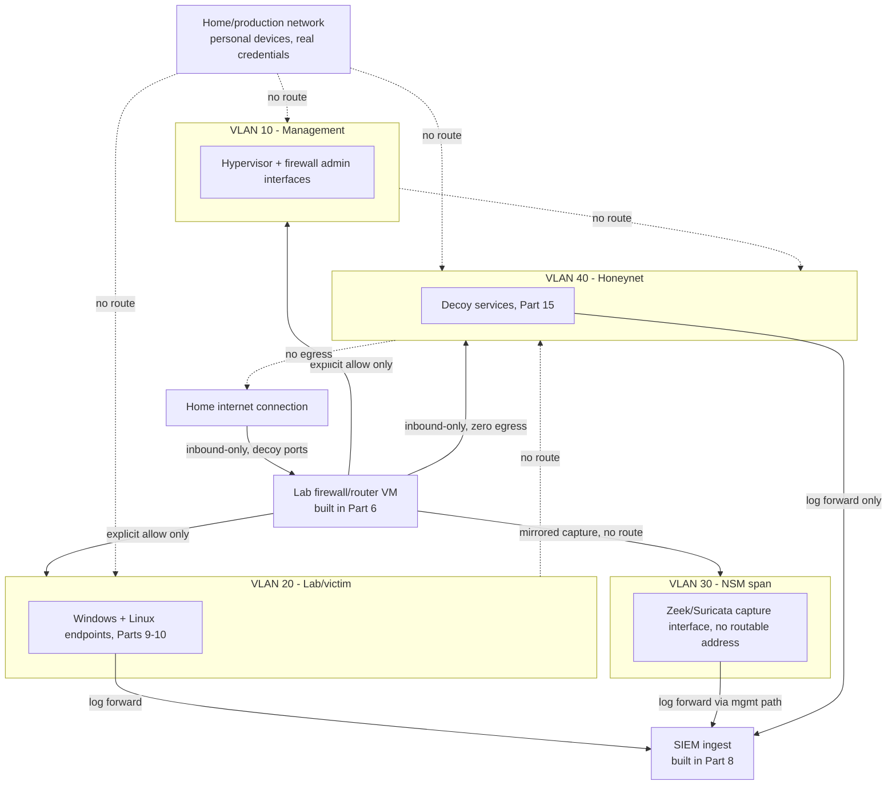

# Part 4 — Network Isolation and Segmentation Architecture

## Why this part exists

Part 2 named three logical networks every later part in this book assumes exist: a management network, a lab/victim network, and, if you build one, a honeynet segment. Part 1 stated the book's one non-negotiable rule — you build a lab to attack and defend systems you own, on a network segment that can't reach, and can't be reached by, anything you don't own. Both of those are still descriptions, not designs. This part is where the description becomes VLAN IDs, virtual-switch configuration, and a default-deny firewall posture — the actual thing Part 6 then implements with a real router/firewall VM, and the thing Part 15's honeynet, Part 18's attack-simulation tooling, and every other later part depend on being true before their own content is safe to follow.

This part adds one refinement to Part 2's three-network vocabulary rather than contradicting it: the network-security-monitoring sensor built in Parts 12 through 14 gets its own broadcast domain for its packet-capture interface, because a mirror/SPAN port carries a full copy of lab/victim traffic and shouldn't need — or get — a routable address anywhere. Its log-shipping interface still lives on the management network like every other admin-facing service in this book. That gives this part four VLANs to design against instead of Part 2's three names, with no conflict between them.

Nothing in this part is a full product walkthrough. Part 5 installs the hypervisor these virtual switches live inside; Part 6 installs the actual firewall product and turns the rule table below into real configuration. What this part gives you is the topology, the isolation model, and — just as important — the specific, boring ways this exact kind of isolation quietly fails on real hardware, so you're checking for the right thing instead of assuming a VLAN label alone did the job.

> **Safety Gate**
> Every later part's Safety Gate box in this book points back to this one. Before you connect a single lab VM to anything else, verify three concrete conditions: (a) no Layer 3 route exists between any lab VLAN and your home network or any host holding real credentials; (b) every lab segment enforces default-deny egress, with only the specific, logged exceptions in Table 4.2; and (c) no single guest — physical or virtual — has a network interface bridged onto a lab VLAN and your home LAN at the same time. Section 6 below gives you the exact ping/traceroute/DNS checks that confirm all three. If you can't check all three right now, stop here — nothing past this part in this book assumes an unverified network, and Appendix A4 expands this into the full pre-flight checklist every later Safety Gate box cites.

## 1. The isolation model this book assumes

**[CONCEPT]** Regardless of which topology pattern from Part 2 you picked — single-host, multi-host, or hybrid — this book's lab network is four logical segments, each a separate VLAN with its own virtual switch or bridge: a management segment for hypervisor and firewall administration, a lab/victim segment for the Windows and Linux endpoints under test (Parts 9 and 10) and the attack-simulation targets from Part 18, an NSM segment carrying only mirrored traffic for the Zeek/Suricata sensor (Parts 12 through 14), and a honeynet segment for the intentionally vulnerable decoy services built in Part 15. The only traffic allowed between any two segments is a short, explicit allow-list; everything else is denied by default.

The honeynet segment gets the strictest rule of the four: it may accept inbound connections on its decoy ports from the internet, but it may not initiate an outbound connection anywhere except the one logging path back to the SIEM. A honeypot's entire value is that it gets compromised — the isolation model's job is making sure that compromise has nowhere further to go. Part 15's expanded Safety Gate restates this specific control rather than assuming a reader remembers it from here, because a honeynet is the part of this book where getting it wrong has the most direct consequence.

**Figure 4.1 — Isolated lab VLAN topology.** *CONCEPTUAL.* Illustrates the target segmentation this part designs — management, lab/victim, NSM, and honeynet VLANs, each behind a default-deny firewall boundary with explicit allow rules limited to admin access and log forwarding. This is an architecture sketch, not a capture from a running build; see Figure 6.1 (Part 6) for the same topology after a real pfSense/OPNsense build, and Figure 15.1 (Part 15) for the honeynet segment specifically once decoys are deployed on it.

## 2. VLAN tagging fundamentals for a home lab

**[CONCEPT]** 802.1Q VLAN tagging is what lets one physical switch (and, on a single-host build, one physical NIC) carry several logically separate broadcast domains at once — a frame gets tagged with a VLAN ID as it leaves a trunk port and only reaches devices configured for that same ID. Without it, a single-host lab with one spare NIC would need one physical switch port per segment, which most home hardware simply doesn't have.

**[SETUP]** The gap most readers hit first: a lot of consumer/SOHO switches marketed as having "VLAN support" only do port-based VLANs — one VLAN per physical port, no tagging — not true 802.1Q trunking of multiple tagged VLANs down a single uplink to a hypervisor's NIC. If your plan is one physical NIC carrying all four VLANs in Table 4.1 to an external switch, confirm the switch's datasheet specifically says "802.1Q tagged VLAN" or "trunk port," not just "VLAN." An inexpensive managed switch with real trunking (commonly $30–80 for an 8-port model) is a real line item in Part 3's hardware budget, not an optional nice-to-have, the moment your topology needs more segments than you have spare physical ports.

The table below lays out the VLAN plan this book's later parts build against. Treat it as a starting template, not a fixed requirement — an extra segment (for example, a dedicated VM network for Part 16's threat-intel feed poller) slots in the same way.

**Table 4.1 — Home lab VLAN plan (CONCEPTUAL SAMPLE).**

| VLAN ID | Segment name | Purpose | Inbound allowed | Outbound allowed |
|---|---|---|---|---|
| 10 | Management | Hypervisor console, firewall admin, SIEM admin | Admin workstation only, on management ports (for example, `443`, `22`) | NTP and package-mirror traffic only |
| 20 | Lab/victim | Windows/Linux endpoints under test (Parts 9-10); attack-simulation targets (Part 18) | Management VLAN only, for admin RDP/SSH | SIEM ingest ports only (Part 8) |
| 30 | NSM | Zeek/Suricata capture interface (Parts 12-14) | Mirrored traffic only — no routable inbound needed | SIEM ingest ports only, from the sensor's separate management path |
| 40 | Honeynet | Decoy services (Part 15) | Internet, decoy ports only (for example, `22`, `80`, `443`) | Log-forwarding path to the SIEM only — nothing else |

## 3. Isolated virtual switches inside the hypervisor

**[CONCEPT]** A VLAN ID alone doesn't isolate anything if the hypervisor bridges every VM to the same virtual switch regardless of tag. The layer that actually matters is the virtual switch (or "port group," or "internal network," depending on the product's vocabulary): a virtual switch with no physical NIC attached at all is exactly as isolated as pulling a cable, and a VM assigned to the wrong virtual switch is not isolated no matter what VLAN ID its guest OS thinks it's on.

**[SETUP]** Part 5 walks through a full hypervisor install; the isolation-specific piece of that build, ahead of anything else in this book, looks like this on Proxmox (the platform the author's own lab runs, per Part 5):

1. Create a new Linux bridge (`Datacenter` > the node > `System` > `Network` > `Create` > `Linux Bridge`) — for example, `vmbr1` — and leave its bridge port field empty rather than assigning a physical NIC.
2. Repeat for each segment that needs its own broadcast domain — a minimum lab build wants at least `vmbr1` (lab/victim) and `vmbr2` (honeynet) in addition to the default `vmbr0`.
3. Assign each VM's virtual network device to the bridge matching its intended segment from Table 4.1, in that VM's hardware configuration — never leave a segment-sensitive VM on the default `vmbr0`.
4. If a single physical uplink has to carry multiple tagged VLANs out to an external managed switch (common when Tier 1 or Tier 2 hardware from Part 3 has only one spare NIC), enable that bridge's VLAN-aware option and tag each VM's virtual NIC with the correct VLAN ID, rather than relying on separate bridges alone.

ESXi's equivalent is a vSwitch with no physical uplink and a VLAN ID set per port group; VirtualBox calls the same concept an "internal network," with no host adapter attached; Hyper-V calls it a "private" virtual switch. Whatever the product, the question to ask before powering on a single VM is identical: does this virtual switch have a path to a physical NIC, and if so, what else is on that NIC?

> **Engineering Reality**
> Proxmox's default `vmbr0` bridge is wired directly to the host's physical NIC out of the box — every VM you create and forget to reassign inherits a live path to whatever that NIC is plugged into, which on a single-host lab is usually your home router's own switch port. Vendor documentation on "creating an isolated network" tends to show the clean case — a bridge with no uplink at all — and rarely warns you that the *default* bridge is the opposite of isolated. Check every VM's network device against Table 4.1 before you power it on, not after; a VM that's already running with the wrong bridge assignment has already had however long it's been up to reach whatever `vmbr0` reaches.

## 4. Default-deny egress and firewall rule design

**[CONCEPT]** Most consumer routers ship default-allow on outbound traffic — anything inside can reach anything outside unless you add a rule blocking it. This book's segmentation model inverts that: nothing crosses a segment boundary unless a rule explicitly allows it, and the rule names a specific source, destination, and port rather than a whole segment. The inbound side of that (what can reach the honeynet from the internet) gets the obvious attention; the outbound side is where the actual risk sits, because the danger in a compromised honeypot or a compromised endpoint isn't the initial foothold — it's what that foothold can then reach.

**[SAFETY]** The honeynet segment's outbound rule is the tightest in the whole plan: it may reach the SIEM's log-ingest port and nothing else — not a public DNS resolver, not an NTP server, not the lab's own internal resolver from Part 7 on any port other than the one the SIEM needs. If a decoy service needs DNS resolution to function, it resolves against the lab's internal resolver over an explicitly allowed path, logged the same way every other honeynet action is logged (Part 15) — it never gets a general-purpose route to "the internet" just because that would be more convenient to configure.

Table 4.2 is the rule set Part 6 actually implements on the firewall/router VM. Read it here as the design to sanity-check before any product-specific configuration begins.

**Table 4.2 — Default-deny segmentation rule set (CONCEPTUAL SAMPLE).**

| Source | Destination | Port/Protocol | Action |
|---|---|---|---|
| VLAN 40 (Honeynet) | Internet | any | Deny |
| VLAN 40 (Honeynet) | VLAN 10/20/30 | any | Deny |
| Internet | VLAN 40 (Honeynet) | `22`, `80`, `443` (decoy ports) | Allow |
| VLAN 40 (Honeynet) | SIEM host (VLAN 10) | `1514`/tcp (log forwarding) | Allow |
| VLAN 10 (Management) | VLAN 20 (Lab/victim) | `3389`/tcp, `22`/tcp (admin RDP/SSH) | Allow |
| VLAN 20 (Lab/victim) | VLAN 10 (Management) | any | Deny |
| VLAN 20 (Lab/victim) | SIEM host (VLAN 10) | `1514`/tcp, `9200`/tcp | Allow |
| VLAN 30 (NSM) | Internet | any | Deny |
| Admin workstation | VLAN 10 (Management) | `443`/tcp, `22`/tcp | Allow |
| any | any | any | Deny |

Two rows deserve a second look before you treat this table as complete. First, the admin-RDP/SSH row exists because Table 4.1 promises the lab/victim VLAN accepts inbound admin access from the management VLAN — without an explicit allow rule for it, the terminal deny-all row below would silently block the exact access path Table 4.1 says exists, and you'd spend an afternoon debugging a "broken" RDP connection that the rule set never actually permitted. Second, notice there's no `VLAN 30 (NSM) → SIEM host` allow rule, even though the sensor's logs do reach the SIEM: Section 1 established that the NSM segment's capture interface gets no routable address at all, so that traffic never actually originates from VLAN 30. It leaves via the sensor's separate management-path interface, which sits on VLAN 10 — the same segment the SIEM host is on — so it's ordinary intra-management-VLAN traffic, not a flow this cross-segment table needs to name. The `VLAN 30 (NSM) → Internet: Deny` row above stays anyway, as a belt-and-suspenders rule in case that interface is ever accidentally given an address it was never supposed to have.

The last row is the one that matters most, and the one most SOHO routers don't ship with: an explicit, terminal deny-all rule that catches everything the rows above it didn't name. Without it, "default-deny" is a design intention the device never actually enforces — most firewall products evaluate rules top to bottom and fall through to an implicit allow if nothing else matched, which is the opposite of what this table needs.

## 5. Where isolation quietly breaks

**[TROUBLESHOOTING]** None of the following are exotic. Every one of them is a normal, easy mistake that produces a lab that looks correctly segmented in the VLAN plan and isn't, in practice, isolated at all.

- **A VM with two NICs, one on each side.** A guest given a second virtual NIC "for convenience" — one on a lab VLAN, one bridged to the physical/home network — turns that VM into an accidental router the moment IP forwarding is enabled anywhere on it. This doesn't require the operator to deliberately enable forwarding: Windows Internet Connection Sharing and a default `net.ipv4.ip_forward=1` left over from an unrelated tutorial both do it silently, with no warning that the box just became a bridge between two networks that were supposed to have zero route to each other.
- **A forgotten port-forward on the home router.** An old inbound port-forward pointed at a lab host's former IP address, left in place after that VM was torn down, silently exposes whatever DHCP hands that address to next — which might be an unrelated home device, or a rebuilt lab VM that never expected to be internet-reachable.
- **An unmanaged switch inserted mid-chain.** A VLAN plan that's logically correct on paper still flattens to one broadcast domain the moment a cheap unmanaged switch gets added between the trunk port and a lab device — most unmanaged switches don't understand 802.1Q tags at all and either drop tagged frames or (worse, depending on the switch) pass them through untagged to every port.
- **A DNS query that leaks off the lab.** A lab VM configured to fall back to a secondary DNS server, or an OS feature that races queries across every active network interface (Windows' multi-homed name resolution behavior is the common culprit), can end up asking your home network's own resolver to look up lab hostnames — which both defeats the isolation model and hands your home network a record of lab activity it was never supposed to see. Part 7 builds the lab's own resolver specifically so this doesn't need to happen; verify every lab VM actually uses it exclusively.
- **A "just for troubleshooting" rule that never gets removed.** The single most common way a firewall rule set drifts from Table 4.2 to something looser: a temporary any-any rule added to diagnose a connectivity problem, which fixes the symptom immediately and then sits there indefinitely because the underlying issue got "solved" and nobody circled back to remove the workaround.

> **Blind Spot**
> Everything in this part addresses network-layer isolation — VLANs, virtual-switch boundaries, firewall rules between segments. None of it protects you if the hypervisor host itself is compromised (a VM-escape bug, or malware on the physical machine hosting all of these virtual switches) or if the workstation you administer the lab from is also the one you use for everyday browsing and gets compromised independently of anything in the lab. Network segmentation limits what a compromised *lab guest* can reach; it does nothing at all for a compromised *lab operator* or a compromised *hypervisor host*, because both of those sit above the boundary this part draws, not inside it.

## 6. Verifying isolation before you build anything on it

**[HANDS-ON LAB]** Goal: confirm, empirically, that the topology in Table 4.1 and the rule set in Table 4.2 actually behave the way they're written before any other part in this book adds a single component on top of them.

1. From a VM on the lab/victim VLAN, ping the home network's router/gateway IP address. Expect no reply.
2. From the same VM, run a traceroute (`tracert` on Windows, `traceroute` on Linux) to any known home-network host's IP address. Expect it to fail at the lab firewall's own hop — it should never resolve a hop beyond that boundary.
3. From a VM on the honeynet VLAN, attempt an outbound connection to an arbitrary internet host on port 80 — for example, `curl http://example.com` on Linux. Expect a timeout. Only the specific inbound decoy ports and the one outbound logging path in Table 4.2 should work from this segment; nothing else should.
4. From a VM on the lab/victim VLAN, resolve any DNS name and confirm the answering resolver is the lab's own internal one (Part 7), not an address outside the lab.

> **Validation Test**
> **Setup:** At least one VM on the lab/victim VLAN, and the firewall/router VM from Part 6 (or, if Part 6 hasn't been built yet, whatever device currently sits between the lab segment and your home network) enforcing Table 4.2's rules.
> **Action:** `ping <home-network-gateway-IP>` from the lab VM.
> **Expected result:** The request times out or returns "destination unreachable" — zero replies. A single successful reply means a route exists that shouldn't, and nothing else in this book should be built on top of this topology until that route is found and removed.

## 7. Hardware and licensing implications of segmentation

**[COST/RESOURCE]** Segmentation done properly is a real line item, not a free upgrade to a topology you were building anyway. A managed switch with genuine 802.1Q trunking support, if your build needs one, runs roughly $30–80 for a small home-lab-sized 8-port model — Part 3's hardware tiers should already have this in the parts list if your chosen topology pattern from Part 2 needs more physical ports than you have. A firewall/router VM (pfSense or OPNsense, built in Part 6) is a light guest by this book's standards — budget roughly 1–2 vCPUs and 1–2GB of RAM for it at idle — but it's still a permanent, always-on tenant on whatever hypervisor Part 5 builds, and it needs to be counted against Part 3's resource tiers alongside the SIEM and every endpoint, not treated as free overhead because it's "just a firewall."

If your single-host build only has one built-in NIC and needs a second or third physical uplink to reach an external managed switch, a USB Ethernet adapter is the usual fix — and the usual place this specific build quietly breaks.

> **Lab Note**
> If your firewall/router VM's extra NICs are USB Ethernet adapters, buy ones with a known-good Linux driver reputation before building anything else on top of them. A cheap USB-C NIC that drops packets under load will make every isolation check in Section 6 look like a segmentation bug when it's actually a $10 adapter falling over. Intel- and ASIX-chipset adapters are the safe default; unbranded RTL8153 clones are the ones that cause this — and they're also, unhelpfully, the cheapest and most common ones sold under a dozen different storefront names.

## 8. Making isolation a habit, not a one-time check

**[SAFETY]** Section 6's checks confirm the topology is correct on the day you build it. They don't stay true automatically. Every time you add a new decoy service to the honeynet, join a new endpoint to the lab/victim VLAN, or change a firewall rule for any reason — including a "just for troubleshooting" rule from Section 5's list — re-run the same checks rather than assuming the isolation you verified once is still the isolation you have now. Appendix A4 expands this into the full, step-by-step pre-flight checklist that Part 15's expanded Safety Gate and Part 18's mandatory pre-flight checklist both cite by name rather than repeating in full; this part defines the controls, Appendix A4 operationalizes them into something you actually run, checkbox by checkbox, before powering on anything intentionally vulnerable.

## 9. What this feeds into the rest of the series

**[CONCEPT]** This part builds no telemetry by itself — it's architecture, not a log source. But once Part 6 turns Table 4.2 into a real firewall build, the deny-log entries that firewall generates every time something tries to cross a boundary it shouldn't are the very first telemetry this entire book produces, arriving before Part 8 has a SIEM to put them in and long before Part 9's `auditd` rules or Part 10's Sysmon config exist. Forward that firewall's deny log into the SIEM the moment Part 8 is standing, even before any endpoint is joined — a lab with no endpoints yet still has a firewall worth watching.

That telemetry also produces one of the cleanest detections a home lab can generate, and it's worth handing forward explicitly rather than leaving it as an incidental fact about this part:

- **Detection Engineering Handbook V2** teaches baselining and anomaly detection (its Parts 22–33) on telemetry that usually has to be filtered hard to separate signal from normal noise. A firewall deny event for traffic this part's rule set says should structurally never happen — honeynet-to-management, lab/victim-to-management outside the allowed admin path, anything sourced from the NSM segment heading to the internet — has no legitimate reason to exist at all. Build a detection rule keyed on exactly those source/destination pairs from Table 4.2, and you have a near-zero-false-positive alert before that volume's more general correlation logic is even needed. That's a more reliable starting detection than most signature-based rules this lab will ever produce, precisely because Table 4.2 already defines what "should never happen" means with no ambiguity.
- **SOC Playbook Handbook**'s Playbook Library assumes an alert arrives already tagged with enough network context to route correctly — the same login-anomaly shape from the lab/victim VLAN and from the honeynet VLAN calls for two entirely different playbook branches, one a real investigation and one the decoy behaving exactly as designed. Tag every event this lab produces with its source VLAN at ingest, from the very first firewall log Part 8 receives, so that field exists for triage later instead of being reconstructed after the fact from IP ranges.
- **SOC Manager's Operating Handbook** treats a working, verifiably isolated lab as the substrate its Part 8 assessment design and Part 11 onboarding/ramp-up content run on top of — you can't score a repeatable practice drill consistently, or run Part 18's attack-simulation tooling against a team in training, on a network topology nobody can describe with confidence. This part's verification habit (Section 6, and Appendix A4 in full) is what makes that substrate trustworthy enough to build a drill on, not an optional hardening step layered on afterward.

None of that cross-book handoff is content this part teaches directly — it's the reason getting this part's design right, and re-verifying it every time something changes, pays off three books later instead of just one.

---

**Cross-references:** This book — Part 1 (the ownership/isolation rule), Part 2 (the management/lab-victim/honeynet vocabulary this part builds against), Part 3 (hardware tiers this segmentation runs on), Part 5 (hypervisor install hosting these virtual switches), Part 6 (the real firewall build enforcing Table 4.2), Part 7 (the internal resolver Section 5's DNS-leak check depends on), Part 9, Part 10 (endpoints living on the lab/victim VLAN), Part 12 (NSM sensor placement on the mirror-only VLAN), Part 15 (honeynet, expanded Safety Gate), Part 18 (attack-simulation pre-flight checklist), Appendix A1 (diagram templates), Appendix A4 (the full pre-flight checklist). Detection Engineering Handbook V2 — Parts 22–33 (baselining/anomaly detection on this part's deny-log telemetry). SOC Playbook Handbook — Playbook Library (VLAN-tagged alert triage). SOC Manager's Operating Handbook — Part 8, Part 11 (assessment design and onboarding on top of a verified-isolated lab).
