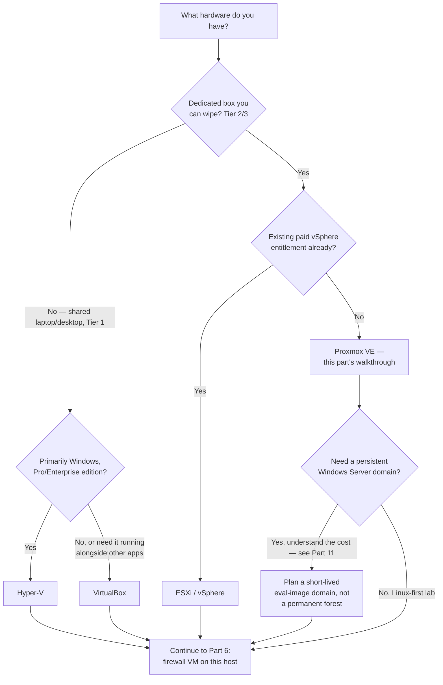
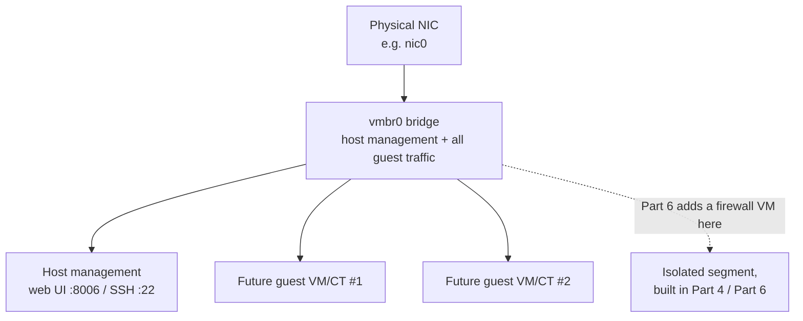

# Part 5 — Choosing and Installing a Hypervisor

## Why this part exists

Part 3 gave you hardware tiers and a resource budget. Part 4 gave you the isolation architecture you'll eventually build. Neither of those parts put a hypervisor on a disk. This part does exactly that: it compares the handful of virtualization platforms a home-lab builder actually chooses between, then walks through a real installation start to finish on the platform this book's own author runs.

This part stops at "the hypervisor boots, the web console loads, and the host has one network bridge with no isolation on it yet." It does not create your first guest VM (that starts in Part 6, with the firewall VM), and it does not build the segmented network Part 4 designed — a fresh hypervisor install has exactly one flat bridge and zero isolation by default, and that's fine at this stage because nothing running on it yet needs protecting from anything. What this part hands you is a working, updated Type-1 or Type-2 platform, sized correctly for the tier you picked in Part 3, ready for Part 6 to start building on top of.

> **Safety Gate**
> Nothing in this part deploys a honeypot, a deliberately vulnerable service, or attack-simulation tooling — a bare hypervisor install has nothing on it worth attacking, so it's fine for the host to sit on your home LAN during this part exactly like any other appliance. The checkable condition that matters here is a *forward* one: do not create a vulnerable practice VM, a decoy service, or an Atomic Red Team target directly on this host's default bridge once it's running. That guest goes on the isolated segment Part 4 designed and Part 6 builds — verified against the Appendix A4 pre-flight checklist — not on the flat network this install leaves behind. If you're already itching to spin something interesting up the moment the web UI loads, that's the one thing to hold off on.

## 1. Type-1 versus Type-2, and why the distinction is worth caring about

### 1.1 Bare metal versus hosted

**[CONCEPT]** A Type-1 hypervisor runs directly on hardware, with no general-purpose host operating system underneath it — Proxmox VE, ESXi/vSphere, and Hyper-V (when the "Hyper-V role" takes over the boot process on Windows Server or a Windows client with Hyper-V enabled) are all Type-1 in this sense. A Type-2 hypervisor runs as an application inside a host OS you're also using for other things — VirtualBox on your daily-driver Windows or Linux desktop is the clearest example.

The difference isn't academic. A Type-1 host dedicates its RAM, CPU, and disk to virtualization and nothing else; a Type-2 host is splitting resources with whatever else the host OS is doing, including the browser tabs and background updates you didn't think about when you budgeted RAM in Part 3.

### 1.2 Why this matters for an always-on home lab

**[COST/RESOURCE]** A lab that runs 24/7 — a SIEM ingesting continuously, a honeynet listening for opportunistic scans, Zeek watching a mirrored port — behaves differently under a Type-1 host than under a Type-2 one running on a machine you also use for email and video calls. Every restart of your daily-driver OS (a Windows update, a sleep/wake cycle, a crash) takes your entire lab down with it if it's Type-2. A dedicated Type-1 box just keeps running.

This doesn't make Type-2 wrong — it makes it the right choice for a specific situation: Part 3's Tier 1 (a repurposed laptop or mini-PC you don't want to dedicate, or a Windows machine you're not ready to wipe). Tier 2 and Tier 3 readers, dedicating a box specifically to this lab, should default to Type-1.

## 2. Matching a hypervisor to your hardware and your goal

### 2.1 The decision drivers

**[CONCEPT]** Four questions decide this for almost every reader:

- Is this a dedicated box you can wipe, or a machine you still need for something else?
- Do you eventually want a Windows Server domain lab (Part 11), or are you staying Linux-first?
- Do you already have a paid vSphere entitlement through work, or are you starting from zero?
- Is "runs entirely on hardware you own" actually a requirement, or is a cloud VM's real billing and lack of a home-isolation story acceptable to you?

The table below maps the five realistic options against Part 3's hardware tiers and against those questions.

| Hypervisor | Type | Cost | Best-fit tier (Part 3) | Windows-domain friendliness | Home-isolation story |
|---|---|---|---|---|---|
| Proxmox VE | Type-1, Linux/KVM+LXC | Free, no-subscription repo | Tier 2–3 (dedicated box) | Good — runs Windows guests fine, no native licensing help | Full — you own every bridge and firewall rule |
| ESXi/vSphere | Type-1 | Free tier discontinued for new users after the Broadcom acquisition; otherwise licensed | Tier 2–3, mainly for readers with an existing work entitlement | Excellent — VMware and Windows Server are a long-standing pairing | Full, same as Proxmox |
| VirtualBox | Type-2 | Free | Tier 1 (shared laptop/desktop) | Workable for a single standalone host, clumsy for more | Manual — host-only/internal networks need deliberate setup per Part 4 |
| Hyper-V | Type-1 role on Windows | Free with Windows Pro/Enterprise/Server | Tier 1–2, if the box is already running Windows | Excellent — native Windows Server support, easiest path to Part 11's eval-image domain | Full via Hyper-V virtual switches, but fewer isolation primitives than a dedicated firewall VM |
| Cloud VM (AWS/Azure/GCP) | Type-1, provider-managed | Real, ongoing billing | Out of this book's main scope — see Part 22 | Excellent, but licensing/cost adds up fast | None of this book's kind — isolation is the provider's VPC model, not a home network you fully control |

**Figure 5.1 — Hypervisor selection decision flow.** *CONCEPTUAL.* Illustrates the decision path a reader follows from "what hardware do I actually have" to a specific hypervisor choice; it is a teaching sketch of the logic in §2.1, not a capture of a real decision-support tool.





### 2.2 Resource Reality — hypervisor overhead itself

**[COST/RESOURCE]**

> **Resource Reality**
> Proxmox VE's own footprint at idle is small — a few hundred megabytes of RAM for the management stack — but that's not the number that matters. What matters is what's left after every guest's allocation, and on real hardware that number gets tight faster than the raw specs suggest. On this book's own reference host — an Intel Core i5-4590 (4 cores, no hyperthreading) with 15GiB of RAM — `free -h` at doc time showed 6.7GiB used, 504MiB genuinely free, and 8.7GiB in buffer/cache, with 944MiB of an 8GiB swap file already in use — mild swap pressure, not yet critical, but worth watching — running fewer than a dozen lightweight LXC containers. If your Tier 2 box is at or below this spec, budget guest RAM conservatively — this isn't a "runs a little slow" ceiling, it's the point where the host starts swapping under normal load, not just peak load.

## 3. Why this book's walkthrough uses Proxmox VE

### 3.1 The rationale, and the real lab behind it

**[CONCEPT]** This book's hands-on installation steps target Proxmox VE specifically, for a concrete reason: it's what the author actually runs. The same host this part walks through installing is the base of the running Proxmox environment cited as a REAL LAB EXAMPLE throughout *Detection Engineering Handbook V2* — the honeynet (CT103, CT108, CT113), the Pi-hole resolver (CT100), and the vulnerability-scanner platform (CT104) all sit on this exact box. Choosing a different hypervisor changes specific steps in §4 and §6 below, not the overall shape of the book — Proxmox is this part's worked example, not a requirement to follow this book.

The hardware itself is unglamorous on purpose: an HP EliteDesk 800 G1 TWR desktop, Intel Core i5-4590 @ 3.30GHz (4 cores, no hyperthreading), 15GiB RAM, a 931.5GiB SSD as the primary disk, and a second, currently-unused 119.2GiB SSD held as spare capacity. Proxmox VE 9.2.2 on Debian GNU/Linux 13 (trixie), kernel 7.0.2-6-pve. Nothing about this specification is exotic — it's a nine-to-ten-year-old office desktop, which is precisely the point: Part 3's Tier 2 doesn't require new hardware, and this book's own real evidence is built on proof of that.

### 3.2 Build Autopsy — the e1000e crash nobody warns you about in the installer

> **Build Autopsy — the network card that took the host down four times**
>
> **The plan:** Install Proxmox VE on the box's single onboard NIC (an Intel I217-LM, `e1000e` driver) using every installer default, including default network offload settings, since the installer doesn't expose an offload toggle and there was no obvious reason to touch one.
>
> **Why it seemed reasonable:** TCP Segmentation Offload (TSO) and Generic Segmentation Offload (GSO) are enabled by default on essentially every Linux NIC driver because they reduce CPU overhead under load — turning them off is something you'd normally do to *fix* a problem, not something you'd pre-emptively do on a fresh install with no symptoms yet.
>
> **How it failed:** Four abrupt crashes in roughly 27 hours (confirmed via `last -x`) — Sep 8 20:51, Sep 8 22:28, Sep 9 22:21, and Sep 9 23:52 — traced through `journalctl -b -1` to the e1000e driver's well-documented "Hardware Unit Hang" bug on the I217/I218 NIC family under sustained load with TSO enabled. This isn't a Proxmox bug or a misconfiguration; it's a known upstream driver issue that just happens to surface once a NIC is finally pushed hard enough — which a home lab, unlike a lightly-used desktop, will eventually do.
>
> **The fix:** Disable both offloads on the affected NIC and make the change survive reboots, not just the current session.

The fix targets Debian's `/etc/network/interfaces` on Proxmox VE 9.2, and applies at runtime immediately, before the persistent change takes effect on the next boot.

```bash
# Immediate fix — takes effect without a reboot, but does not survive one on its own
ethtool -K nic0 tso off gso off
```

Confirm the runtime change held before moving on to the persistent step: `ethtool -k nic0` should report `tcp-segmentation-offload: off` and `generic-segmentation-offload: off`. Make it persistent by adding a `post-up` line under the NIC's stanza in `/etc/network/interfaces` (substitute your own interface name for `nic0`):

```text
iface nic0 inet manual
    post-up /sbin/ethtool -K nic0 tso off gso off
```

> **Lab Note**
> If your host uses an Intel I217/I218-family NIC (`e1000e` driver — check with `ethtool -i <interface>`), apply this fix during initial setup, before you've moved anything critical onto the host. Waiting for the first crash to teach you this costs a corrupted VM disk or two if the crash lands mid-write; applying it pre-emptively costs one command.

## 4. Installing Proxmox VE step by step

### 4.1 Before you start

**[SETUP]** Confirm the following before booting the installer — skipping any of these turns a 20-minute install into a repeat trip to re-flash USB media.

| Check | What to verify | Why it matters |
|---|---|---|
| Virtualization extensions | Intel VT-x/AMD-V enabled in BIOS/UEFI | Proxmox refuses to start most guests without it; some BIOS revisions ship this disabled by default |
| ISO source | Downloaded from `proxmox.com/downloads`, checksum verified | A corrupted ISO produces confusing mid-install failures, not a clean error |
| Install media | USB flashed with `dd`, Rufus, or Balena Etcher in "DD image" mode, not a plain file copy | A file-copied ISO won't boot on most firmware |
| Target disk identified | Know which physical disk (by size, not just device letter) is the intended install target | The installer will happily erase the wrong disk if you guess wrong — verify by size against what you documented in Part 3 |
| Network plan | Static IP, gateway, and DNS server decided ahead of time | The installer asks for these during setup; improvising them mid-install is where typos happen |

### 4.2 Running the installer

**[SETUP]** This procedure targets the Proxmox VE 9.2 graphical installer, booted from USB on UEFI or legacy BIOS firmware.

1. Boot from the installer USB and select **Install Proxmox VE** (not the debug or rescue options) at the boot menu.
2. Accept the EULA.
3. Select the target disk. If you have more than one disk (as this book's reference host does — a 931.5GiB primary and an unused 119.2GiB spare), double-check you've selected the one you intend by size, not by slot position.
4. Under **Options**, choose the filesystem: `ext4` on LVM (this book's reference build) is the simpler, more universally-documented choice; `ZFS` (RAID-Z variants) adds checksumming and snapshots but wants more RAM and, ideally, more than one disk to be worth its overhead — most Tier 2 single-disk builds should stay on ext4/LVM unless you specifically want ZFS's features.
5. Set the country, time zone, and keyboard layout. Get the keyboard layout right — a mismatch here silently changes which physical key produces which character in the root password you're about to set, which surfaces later as password entries that mysteriously "don't work" at first boot.
6. Set the root password and an admin email address (used for the host's own automated notification emails — a real address you check, not a placeholder).
7. Configure the management network: hostname (FQDN, e.g. `pve.home.local`), the NIC to bind to, static IP/CIDR, gateway, and DNS server.
8. Review the summary screen and confirm. This is the last point before the target disk is wiped — verify the disk selection one more time here.
9. Let the install finish and reboot when prompted, removing the USB media first.

### 4.3 The three failures that eat the most time

**[TROUBLESHOOTING]**

- **"No bootable device" or the installer never appears.** Almost always a USB written as a plain file copy instead of a raw disk image, or UEFI Secure Boot blocking an unsigned bootloader. Re-flash with a tool that writes a raw image (Rufus in "DD" mode, `dd`, or Balena Etcher), and try disabling Secure Boot if the media still won't boot.
- **Installer completes, but guests won't start / no virtualization extensions detected.** Reboot into BIOS/UEFI setup and enable VT-x (Intel) or AMD-V (AMD) — some vendors ship it off by default, and Proxmox's own installer doesn't hard-block on this, so the failure only surfaces the first time you try to start a VM.
- **Wrong disk wiped.** No fix — this is why step 3 and step 8 above both exist as disk-selection checkpoints. If it happens, the lesson is procedural (verify by size, twice), not technical.

## 5. Storage layout: the default split, and the trap inside it

### 5.1 What the installer actually creates

**[CONCEPT]** On a single-disk ext4/LVM install, the Proxmox installer creates a volume group spanning the whole disk, then splits it into a modest root logical volume (mounted at `/`, holding the OS and the `local` storage pool — ISOs, templates, and every guest backup), a swap volume, and a large thin-provisioned pool (`local-lvm`) for guest disk images. The installer's default root LV size is conservative — sized for the OS, not for a lab that will accumulate backups, ISOs, and container templates for months.

### 5.2 Engineering Reality — where that default split actually goes wrong

> **Engineering Reality**
> Proxmox's documentation frames `local` and `local-lvm` as separate concerns — OS/backups versus guest disks — and on paper that separation looks clean. In practice, on this book's own reference host, the `root` logical volume (96GiB) sits at 92% used while `local-lvm`'s thin pool (794.30GiB) sits at 2.47% used, because `local` — which lives *on* the root filesystem — is absorbing every vzdump backup, every LXC rootfs stored as a raw file rather than an LVM volume, and every downloaded ISO and container template. A reader watching only "how full is my storage pool" in the Proxmox UI can miss this entirely, because `local-lvm`'s near-empty gauge looks fine while the actual filesystem underneath `local` quietly fills up. Check `df -h /` directly, not just the storage-pool percentages in the web UI.

### 5.3 What to do about it at install time

**[SETUP]** Two changes at install time avoid this trap entirely rather than fixing it later:

1. In the installer's **Options** screen, use the advanced LVM options to increase `hdsize`/root sizing beyond the default if the disk has room — this book's reference host would have avoided its capacity warning entirely with a root LV closer to 150–200GiB rather than 96GiB, given the same disk was carrying 6+ months of backups and ISOs.
2. Plan, from day one, to move backup targets off the local disk once you add any kind of network storage (an NFS share, a second physical disk, cloud backup) — Part 20 covers retention policy in depth, but the decision to *not* let every backup default to `local` forever is cheapest to make before the disk fills, not after.

## 6. First boot: reaching the web UI and the minimum hardening pass

### 6.1 Logging in and switching repositories

**[SETUP]** This targets a freshly-installed Proxmox VE 9.2 host with no changes made yet beyond the installer defaults.

1. From any machine on the same network, browse to `https://<host-ip>:8006`.
2. Accept the browser's self-signed-certificate warning (expected on a fresh install — Proxmox generates its own cert, and there's no CA behind it yet).
3. Log in with username `root` and the password set during installation, realm `Linux PAM`.
4. Proxmox VE ships pointed at the enterprise repository by default, which requires a paid subscription to update from. Switch to the free no-subscription repository so `apt update` actually pulls updates without a subscription key:

```bash
# Disable the enterprise repo (requires a paid subscription key)
sed -i 's/^deb/#deb/' /etc/apt/sources.list.d/pve-enterprise.list

# Add the no-subscription repository (community-supported, no key required)
echo "deb http://download.proxmox.com/debian/pve trixie pve-no-subscription" \
  > /etc/apt/sources.list.d/pve-no-subscription.list

apt update && apt full-upgrade -y
```

The single-line `.list` form above still works on Proxmox VE 9's trixie base, but Proxmox's own current documentation has moved to the deb822 multi-line format (`/etc/apt/sources.list.d/proxmox.sources`) and specifically notes that `apt` on trixie will complain about the legacy single-line syntax — cosmetic for now, but worth knowing before you go looking for why `apt update` prints a deprecation warning (`OFFICIAL REFERENCE` — see `REFERENCES.md` entry [PROXMOX-REPOS]).

5. Reboot if the kernel was updated (`pveversion -v` will show a kernel version mismatch against `uname -r` if a reboot is pending).

> **Validation Test**
> **Setup:** Proxmox VE installed and rebooted per §4.2, repository switch from §6.1 applied.
> **Action:** From the host console (or SSH), run `pveversion` and `uptime`; from a browser on the same network, load `https://<host-ip>:8006`.
> **Expected result:** `pveversion` reports a version string beginning `pve-manager/9.x`; `uptime` shows the host has been up since the post-install reboot with no unexpected restarts; the web UI loads the login screen without a connection-refused or certificate-mismatch error blocking access entirely (the self-signed-cert browser warning is expected and not a failure).

### 6.2 What "no isolation yet" actually means at this point

**[SAFETY]** The host you just built has one bridge (`vmbr0`), bound to your one physical NIC, carrying host management traffic and every future guest's network traffic on the same flat segment as your home LAN. That is the correct, expected state for a hypervisor with zero guests on it — there is nothing here yet for isolation to protect. It stops being correct the moment you create a guest meant to be intentionally vulnerable, attacked, or exposed as a decoy: that guest needs the segmented, default-deny network Part 4 designs and Part 6 builds, verified against Appendix A4, before it powers on. This part's install doesn't build that segmentation — don't mistake "the hypervisor is running" for "it's safe to put a honeypot on it."

## 7. The networking foundation this install leaves behind

### 7.1 One bridge, one NIC, everything sharing it

**[CONCEPT]** A default single-NIC Proxmox install creates exactly one Linux bridge, `vmbr0`, with the physical NIC as its sole member. Host management (the web UI, SSH) and every guest's virtual NIC attach to the same bridge, which means — at this stage — a guest's traffic is indistinguishable, switch-side, from the host's own management traffic. This is normal for a fresh install and is exactly what Part 4 and Part 6 exist to change.

**Figure 5.2 — Default single-NIC bridge topology after a fresh install.** *CONCEPTUAL.* Illustrates what a stock Proxmox install looks like network-wise immediately after §6 — one bridge, one physical NIC, host management and future guests all sharing it — before Part 6 adds a firewall VM and Part 4's isolated segment exists. The general shape mirrors the author's own running host's bridge layout, but this is a teaching sketch, not an exported diagram of a specific point-in-time configuration.





### 7.2 What this install cannot tell you about isolation

**[CONCEPT]**

> **Blind Spot**
> A hypervisor install, by itself, cannot tell you whether your physical network is actually isolated from anything — that's a property of your router, switch, and VLAN configuration, none of which the Proxmox installer touches or verifies. A clean install with no errors gives you zero assurance that a guest you create later can't reach your home LAN; it only means the hypervisor software itself is working. Treat "the install succeeded" and "isolation is verified" as two completely separate claims, because they are — Part 4's architecture and Appendix A4's checklist are what actually establish the second one.

## 8. Other hypervisors: what changes if you don't run Proxmox

### 8.1 VirtualBox

**[CONCEPT]** VirtualBox is the right default for Part 3's Tier 1 reader: a shared laptop or desktop you're not ready to dedicate or wipe. Installation is a normal application install on top of whatever OS you're already running. The tradeoff is networking: isolating a VirtualBox guest requires deliberately choosing Host-Only or Internal Network adapter modes per VM rather than getting a segmented network by default, and running more than two or three guests at once on a laptop's RAM budget gets uncomfortable fast — revisit Part 3's Tier 1 sizing before assuming VirtualBox alone can carry a full SIEM-plus-endpoints-plus-NSM stack.

### 8.2 Hyper-V

**[CONCEPT]** Hyper-V ships as an optional Windows feature on Windows 10/11 Pro, Enterprise, and Education, and as a role on Windows Server. Enabling it turns the Windows kernel itself into a Type-1 hypervisor host, which has one practical consequence worth knowing before you enable it: older versions of other Type-2 hypervisors (VirtualBox, VMware Workstation) couldn't run guests at all once Hyper-V was active, because both wanted exclusive control of the same CPU virtualization extensions. Current VirtualBox versions work around this by running through the Windows Hypervisor Platform when Hyper-V is enabled, but pay a real performance cost compared to running with Hyper-V off — if you want both, test which combination your specific versions tolerate before committing a build to it. Hyper-V is the most natural path to Part 11's short-lived eval-image Windows Server domain, since Windows Server is a first-party guest on its own native hypervisor.

### 8.3 ESXi / vSphere

**[CONCEPT]** ESXi is a mature, thoroughly-documented Type-1 hypervisor with decades of enterprise data-center deployment behind it, and if you already hold a vSphere entitlement through work, it's a legitimate choice for a home lab. The practical reality for a reader starting from zero: Broadcom discontinued the free ESXi hypervisor download for new users following its acquisition of VMware, so this option is now realistically available only to readers with an existing entitlement, not a "download it free tonight" option the way it was for years. This book doesn't walk through an ESXi install for that reason — most readers can't reproduce it without a license they don't have.

### 8.4 Cloud VMs

**[CONCEPT]** A cloud provider's VM (AWS EC2, Azure, GCP Compute Engine) is a real Type-1-backed virtualization platform, but it changes the book's entire premise: you're paying real, ongoing money per hour, and "isolated from my home network" is replaced by "isolated within the provider's VPC/VNet model," governed by that provider's terms of service rather than a switch in your own house. This book's safety architecture (Part 4) is built specifically around a home network you fully control; a cloud tenant is a different enough risk and cost model that it's deliberately out of this book's main scope. Part 22's closing synthesis points toward it as a next step once you've outgrown a home lab, not before.

## 9. What this install hands off

**[CONCEPT]** Even at this early stage, before a single lab-specific service exists, the host itself already produces one real telemetry source worth knowing about: its own authentication log and system journal (`journalctl`, `/var/log/auth.log`). *Detection Engineering Handbook V2*, Part 3 covers how to read Linux authentication and privilege-escalation telemetry once you're forwarding it, and the *SOC Playbook Handbook*'s Linux logging technical-reference chapters cover what to actually do when one of those events looks wrong — both apply the moment you forward this host's own logs into the SIEM Part 8 builds, not just to the guest endpoints Part 9 builds later. If you're tracking the actual hours a build like this costs — install, the offload fix, the storage remediation in §5.3 — that record is the same kind of input the *SOC Manager's Operating Handbook*'s Part 20 budget framing uses at enterprise scale, just at a single-operator size; Part 3 already draws this analogy for hardware cost, and it holds for build-time cost too.

What this part does not hand off yet is anything resembling a working lab. The hypervisor is running, updated, and reachable — that's the whole deliverable. Part 6 builds the firewall VM on top of it; Part 4's segmentation becomes real hardware and rules starting there, not here.

---

**Cross-references:** Part 3 (Hardware and Resource Budgeting — the tier this install targets), Part 4 (Network Isolation and Segmentation Architecture — the isolation this install explicitly does not yet build), Part 6 (Perimeter Firewall and Segmentation Build — the next guest created on this host), Part 8 (Building the SIEM Platform — where this host's own auth log eventually gets forwarded), Part 11 (The Windows Domain Lab Problem — relevant if §8.2's Hyper-V path leads toward a domain), Part 20 (Lab Maintenance, Patching, and Snapshot/Backup Strategy — the storage-growth trap from §5.2 in full), Appendix A2 (Hardware Tiers & Cost Worksheets), Appendix A4 (The Safety & Isolation Pre-Flight Checklist — required before any guest built on this host can be intentionally vulnerable or exposed); *Detection Engineering Handbook V2*, Part 3 (Linux authentication telemetry); *SOC Playbook Handbook*, Linux logging technical-reference chapters; *SOC Manager's Operating Handbook*, Part 20 (Building & Defending the SOC Budget, loose analogy only).
