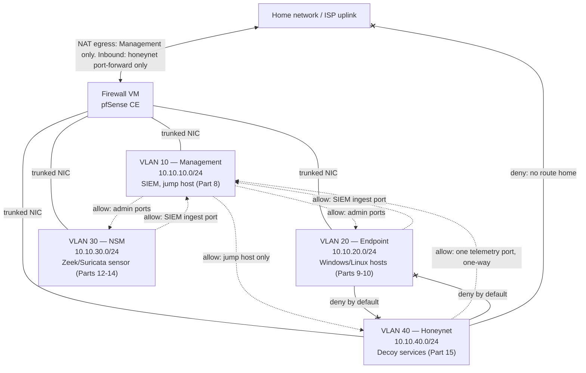

# Part 6 — Perimeter Firewall and Segmentation Build

## Why this part exists

**[CONCEPT]** Part 4 designed a lab network that cannot reach — and cannot be reached by — anything you don't own: four segments (Management, Endpoint, NSM, Honeynet), a default-deny posture between them, and a list of the specific ways isolation quietly breaks. This part is where that design stops being a diagram and becomes a running firewall VM with real interfaces, real VLAN tags, and a real rule base you can point traffic at and watch get blocked or allowed. If Part 4 is the blueprint, this is the pour-the-foundation part: nothing in Parts 7 through 21 — no SIEM, no endpoint, no honeypot, no attack simulation — goes on this network until the build in this part is in place and the isolation it claims to provide has actually been verified, not assumed.

Two things this part does not cover, on purpose. It does not configure Suricata or Snort rules, even though both run comfortably on the same firewall VM — that content, and the decision of whether to run an IDS inline or as a passive NSM sensor, belongs to Part 14. And it does not build the DNS/DHCP services that will actually hand out addresses on these VLANs beyond the bare minimum needed to prove connectivity — that's Part 7's job. What this part delivers is the box, the VLANs, and the rule base that every later part's traffic has to cross.

> **Safety Gate**
> Everything past this point assumes you're building on the hypervisor from Part 5, on hardware with no other production role in your household — this firewall VM's WAN interface will sit between your home network and every intentionally exposed or intentionally vulnerable service the rest of this book builds. Before wiring a single virtual NIC, confirm the physical switch port and virtual switch/bridge this VM's LAN-side interface attaches to are not shared with any device holding real credentials or real data, and that the Honeynet VLAN this part creates (§4) has no firewall rule, NAT rule, or static route back to your home subnet — not "blocked by default," but checked, per the Appendix A4 pre-flight procedure, after every rule-base change in this part, not just once at the end.

## 1. What Part 4 designed and what this part actually builds

**[CONCEPT]** Part 4 settled on four VLANs, and this part keeps that vocabulary rather than inventing a new one:

- **Management** — the segment you administer from: the firewall's own web GUI, the hypervisor's management interface, and, once Part 8 builds it, the SIEM.
- **Endpoint** — the Windows and Linux hosts Parts 9 and 10 build, generating the Sysmon and auditd telemetry this whole book exists to produce.
- **NSM** — the sensor segment Parts 12 through 14 build out, watching traffic rather than participating as an ordinary peer on it.
- **Honeynet** — the decoy segment Part 15 populates, built specifically to be attacked and therefore held to the strictest isolation rule in the book.

Part 4 stated the rule that governs all four: default-deny between every segment, with only the specific paths a later part actually needs punched through as explicit allow rules. This part is where "default-deny" and "explicit allow" turn into an actual rule you write in a firewall GUI, in a specific order, evaluated by a specific engine — and where the gap between "I wrote a deny rule" and "the traffic is actually denied" gets checked instead of assumed.

## 2. Choosing a firewall platform: pfSense vs. OPNsense

**[CONCEPT]** Both pfSense Community Edition and OPNsense are free, FreeBSD-based, and capable of everything this part asks of a firewall: VLAN-tagged interfaces, a stateful packet filter, NAT control, and a web GUI you can drive without memorizing `iptables` syntax. Table 6.1 compares the two on the axes that actually matter for a home lab build, not on a feature checklist neither reader will exhaust.

**Table 6.1 — pfSense Community Edition vs. OPNsense, home-lab-relevant differences.**

| Axis | pfSense CE | OPNsense |
|---|---|---|
| Base OS | FreeBSD, Netgate-maintained fork | FreeBSD/HardenedBSD, community fork of pfSense's original codebase |
| License | Apache 2.0 (CE) | BSD 2-clause |
| Rule evaluation | Interface rules evaluated top-down, first match; floating rules evaluated first regardless of tab | Same top-down/floating-first model, slightly different GUI grouping |
| Package ecosystem | Smaller; some packages moved behind Netgate's paid tiers over time | Broader plugin list retained free, including Suricata and Zenarmor |
| GUI update cadence | Slower, more conservative | Faster point releases, more frequent UI changes |
| Best fit for this book | Reader who wants the most-documented option with the largest base of third-party tutorials | Reader who wants a more actively developed plugin ecosystem, particularly if Part 14's IDS work matters to them |

This part uses pfSense CE as the worked example because it has the deepest base of public documentation for a first-time build, and every step below states plainly which parts are pfSense-specific menu paths versus general firewall concepts that carry over to OPNsense with a different click path. Neither platform's install has been build-tested against this book's own hardware as of this draft — treat the exact menu paths as pfSense/OPNsense's own documented behavior at time of writing, and expect minor UI drift across versions.

> **Engineering Reality**
> Both platforms' official documentation describes VLAN tagging as "just add a VLAN interface." In practice, the VLAN tag never reaches the firewall at all if the underlying virtual switch port group (or physical switch port, if this VM's NIC is passed through) isn't explicitly set to trunk/tagged mode — a port group left in "access" or "untagged" mode silently strips the tag before the firewall VM ever sees the frame, and the symptom is a VLAN interface that comes up but never receives DHCP requests or ARP traffic from anything, with no error on the firewall side at all.

## 3. Sizing and installing the firewall VM

**[COST/RESOURCE]** A firewall VM pushing home-lab traffic volumes — a handful of endpoints, a sensor, a honeypot fielding opportunistic internet scanning — is not resource-hungry compared to the SIEM in Part 8. Table 6.2 gives the floor.

**Table 6.2 — Firewall VM sizing (CONCEPTUAL SAMPLE).**

| Resource | Minimum | Comfortable | What breaks below the minimum |
|---|---|---|---|
| vCPU | 1 | 2 | Rule-set evaluation and stateful tracking add latency under load; a single-vCPU firewall handling Suricata inline (Part 14) later saturates quickly |
| RAM | 1GB | 2GB | Below 1GB, the web GUI and package manager compete with the packet filter for memory and the GUI becomes sluggish or unresponsive during rule-base edits |
| Disk | 8GB | 20GB | Below 8GB, OS updates and firewall logs (which this book wants you keeping, not disabling) fill the disk within weeks |
| NICs | 2 (WAN, LAN trunk) | 2, virtio/paravirtualized | An emulated NIC type on some hypervisors drops VLAN tags in ways a paravirtualized NIC doesn't — check your hypervisor's specific guidance before troubleshooting a "missing" VLAN as a firewall config problem |

> **Resource Reality**
> None of this is where a home lab's resource budget actually goes — that's the SIEM (Part 8, 8GB alone) and any Windows domain attempt (Part 11). A 2GB, 2-vCPU firewall VM is a rounding error against Part 3's hardware tiers, which is exactly why there's no excuse to undersize the one component every other part's traffic has to cross.

**[SETUP]** These steps target pfSense CE 2.7.x running as a VM on the Proxmox host from Part 5; the console-level steps are nearly identical on OPNsense with different menu wording once you reach the GUI.

1. Create the VM in Proxmox with 2 vCPU, 2GB RAM, a 20GB virtual disk, and two virtio network interfaces — the first bridged to the WAN-facing virtual switch (the one with a path to your home network's internet egress), the second bridged to a dedicated internal virtual switch that will carry all four VLANs as trunked traffic.
2. Attach the pfSense CE installer ISO and boot the VM.
3. Walk through the installer's default partitioning and let it reboot into the installed system.
4. At the console menu, assign interfaces: option 1, then match the WAN and LAN NICs to the two virtio devices in the order Proxmox presents them (the console lists MAC addresses, which is the reliable way to tell them apart if the ordering isn't obvious).
5. Set the LAN interface's IPv4 address to a static address on a temporary subnet (for example `192.168.99.1/24`), and enable its DHCP server with a small temporary range — this is only to reach the web GUI for the first time and gets replaced once VLAN interfaces exist in §4.
6. From a workstation temporarily connected to that LAN segment, browse to `https://192.168.99.1` and complete the setup wizard (admin password, hostname, time zone).

> **Validation Test**
> **Setup:** pfSense CE installed per the steps above, temporary LAN IP `192.168.99.1/24` assigned.
> **Action:** From a workstation on that temporary LAN segment, browse to `https://192.168.99.1` and log in with the admin password set during setup.
> **Expected result:** The pfSense dashboard loads and shows both interfaces (WAN, LAN) as up, with WAN showing a real IP address obtained from your home network's DHCP.

## 4. Building the VLAN interfaces

**[SETUP]** With the base install reachable, replace the temporary flat LAN with the four VLANs Part 4 designed. Table 6.3 is the plan this build follows; adjust the third octet if it collides with your existing home network.

**Table 6.3 — VLAN plan (CONCEPTUAL SAMPLE).**

| VLAN ID | Segment | Subnet | Firewall IP | DHCP range | Populated by |
|---|---|---|---|---|---|
| 10 | Management | 10.10.10.0/24 | 10.10.10.1 | 10.10.10.100–10.10.10.199 | Part 8 (SIEM), a jump host |
| 20 | Endpoint | 10.10.20.0/24 | 10.10.20.1 | 10.10.20.100–10.10.20.199 | Parts 9–10 (Linux, Windows hosts) |
| 30 | NSM | 10.10.30.0/24 | 10.10.30.1 | 10.10.30.100–10.10.30.199 | Parts 12–14 (Zeek, Suricata sensor) |
| 40 | Honeynet | 10.10.40.0/24 | 10.10.40.1 | 10.10.40.100–10.10.40.199 | Part 15 (decoy services) |

1. Under `Interfaces > Assignments > VLANs`, add a VLAN with parent interface set to the internal (LAN-side) NIC and VLAN tag `10`; repeat for tags `20`, `30`, and `40` — four VLAN pseudo-interfaces total, all sharing the one physical/virtual NIC as trunked traffic.
2. Under `Interfaces > Assignments`, assign each new VLAN to an available OPT slot, then rename each (`OPT1` to `MGMT`, `OPT2` to `ENDPOINT`, `OPT3` to `NSM`, `OPT4` to `HONEYNET`) so the rule base in §6 reads clearly.
3. On each renamed interface's configuration page, enable the interface, set it to a static IPv4 address matching Table 6.3's firewall IP (for example `10.10.10.1/24` for MGMT), and save.
4. Under `Services > DHCP Server`, enable DHCP on each of the four interfaces with the range from Table 6.3, and set a distinct, short lease time (for example, 2 hours) — a home lab churns through VM rebuilds often enough that long leases just mean stale entries.
5. Retire the temporary flat LAN from §3 once all four VLANs are confirmed reachable — either repurpose that physical interface assignment into one of the four VLANs' parent, or leave it unassigned.

**[TROUBLESHOOTING]** If a VLAN interface shows "up" but never receives a DHCP request from a test client, the fault is almost never the firewall config — it's the virtual switch. Confirm the internal virtual switch (Proxmox's Linux bridge or an OVS bridge, depending on your Part 5 setup) is passing VLAN tags through rather than stripping them at the port level; on a Proxmox Linux bridge this usually means the VM's network device has VLAN-aware trunking enabled and no single default VLAN tag set on the port itself.

Figure 6.1 shows the topology this section produces: one firewall VM, one trunked internal NIC, four VLAN interfaces, and the deny-by-default posture §5 and §6 add on top.

**Figure 6.1 — Firewall VM and four-VLAN segmentation topology.** *CONCEPTUAL.* Illustrates the target end state of this part's build: one firewall VM trunking four VLANs, with default-deny between every pair of segments and only the specific allow paths from Table 6.4 punched through. This is an architecture sketch of the intended build, not a capture from a running deployment — Parts 8, 9, 10, and 15 populate these segments with the actual services the dotted allow-arrows exist for.

## 5. Deny-by-default: the base rule the rest of this part depends on

**[SAFETY]** Both pfSense and OPNsense ship a default rule on the LAN-type interface that allows that interface's own subnet to reach anything — "LAN to any" — because most home-router use cases want an open internal network by default. A home lab practicing segmentation cannot keep that default: it's the single rule that would quietly undo every VLAN boundary this part just built.

1. On each of the four VLAN interfaces (`Firewall > Rules`, one tab per interface), delete or disable any pre-existing "allow all" rule that isn't one you added deliberately.
2. Confirm each interface tab ends with an implicit deny — pfSense and OPNsense both deny by default when no rule matches, so an interface tab with zero rules is already "deny everything in and out" for that interface; verify this is genuinely the state on all four tabs rather than assuming it.
3. On the WAN interface, leave the built-in "block bogon networks" and "block private networks" options enabled — these block obviously spoofed or misrouted traffic arriving from the internet side before it ever reaches your rule base.

With every VLAN interface at "deny everything," nothing on this network can reach anything else, including the internet. That's the correct starting state — §6 and §7 now add back exactly the paths later parts actually need, and no others.

## 6. Explicit allow rules: what actually needs to cross a boundary

**[SETUP]** Table 6.4 is the full allow-list this build needs before any later part goes live. It intentionally does not include an "any-any" row anywhere — every row names a specific source, destination, and port.

**Table 6.4 — Inter-segment firewall rules (CONCEPTUAL SAMPLE).**

| Source | Destination | Port/protocol | Action | Feeds |
|---|---|---|---|---|
| Endpoint | Management | `1514`/TCP, `1515`/TCP | Allow | Part 8 (SIEM agent traffic, Wazuh worked example) |
| NSM | Management | `5044`/TCP | Allow | Part 8, Part 13 (Zeek log shipping via Beats) |
| Honeynet | Management | `5044`/TCP (one-way, outbound from Honeynet only) | Allow | Part 8, Part 15 (decoy session telemetry) |
| Management | Endpoint | `22`/TCP, `5985`/TCP, `5986`/TCP | Allow | Parts 9–10 (SSH, WinRM admin access) |
| Management | NSM | `22`/TCP | Allow | Parts 12–14 (sensor admin access) |
| Management | Honeynet | `22`/TCP, from a single jump-host address only | Allow | Part 15 (scoped admin access) |
| Endpoint | Honeynet | any | Deny | — endpoints never initiate contact with the decoy segment |
| Honeynet | Endpoint | any | Deny | — a compromised decoy must not reach anything else |
| Honeynet | Management | anything besides the row above | Deny | — telemetry only, not general access |
| Any lab VLAN | WAN (home network / internet) | any, except Management's explicit egress | Deny | — see §7 for Management's own scoped egress |

Table 6.5 gives the SIEM ingest ports by platform, since Part 8 hasn't committed you to one yet — adjust the Endpoint-to-Management and NSM-to-Management rows above to match whichever platform you actually build.

**Table 6.5 — Common SIEM ingest ports by platform, per each project's own documentation.**

| Platform | Agent/event port | Enrollment/management port | Notes |
|---|---|---|---|
| Wazuh | `1514`/UDP or TCP | `1515`/TCP | TCP is more reliable across a routed VLAN boundary than UDP; prefer TCP for the Endpoint-to-Management rule |
| Elastic (Filebeat/Winlogbeat to Logstash) | `5044`/TCP | — | Also used for Zeek/Suricata log shipping if standardized on Beats |
| Graylog | `514`/UDP or TCP (syslog), `12201`/UDP or TCP (GELF) | `9000`/TCP (web UI) | Syslog UDP loses messages under packet loss; prefer GELF or syslog-TCP for anything you don't want silently dropped |

1. Under `Firewall > Aliases`, create an alias for each VLAN subnet (`MGMT_NET`, `ENDPOINT_NET`, `NSM_NET`, `HONEYNET_NET`) — this makes the rules in the next step readable and means a later subnet change (unlikely, but possible) is a one-place edit instead of a rule-by-rule hunt.
2. On the Endpoint interface tab, add a rule: source `ENDPOINT_NET`, destination `MGMT_NET`, destination port matching your chosen SIEM platform from Table 6.5, action Pass.
3. Repeat on the NSM and Honeynet tabs for their respective rows in Table 6.4.
4. On the Management interface tab, add the three admin-access rules — source `MGMT_NET`, destination the specific other VLAN alias, the specific admin port, action Pass. Do not write a single "Management to any, any port" rule; each destination gets its own row.
5. Leave every other combination unwritten. The deny-by-default state from §5 already blocks everything you haven't explicitly allowed — a rule base that only ever grows explicit allow rows, with nothing else, is the entire point of this section.

> **Lab Note**
> Write the alias names to match Table 6.4's column headers exactly, and keep a copy of that table next to the firewall GUI while you build the rules. A rule base built from a plan you're reading off, row by row, is the difference between finishing in 20 minutes and spending an hour second-guessing which VLAN was which.

## 7. Egress and the honeynet's one-way path

**[SAFETY]** Every VLAN above got an allow rule for the specific internal paths it needs. None of them got an allow rule for reaching the internet — and one of them, Honeynet, must never get one, because the Safety Gate at the top of this part depends on it having no route home and no route out except the single inbound port-forward Part 15 will add.

> **Build Autopsy — "the honeynet segment that could still dial home"**
>
> **The plan:** Build the four VLANs, apply deny-by-default on every interface tab per §5, and treat that as sufficient isolation for the Honeynet segment — no explicit allow rule out to the WAN, so nothing gets out.
>
> **Why it seemed reasonable:** Deny-by-default on the interface rules genuinely does block Honeynet-initiated connections outbound through the packet filter itself — the interface tab has no Pass rule sending Honeynet traffic to WAN, so it looks airtight.
>
> **How it failed:** pfSense and OPNsense both default `Firewall > NAT > Outbound` to Automatic mode, which generates an outbound NAT mapping for every internal interface's subnet — including a newly added VLAN — with no separate action required. NAT and the packet filter are evaluated together: a packet from the Honeynet subnet heading to WAN can still get NAT-translated and forwarded if any rule anywhere (a stray floating rule, a rule pasted from a tutorial that says "allow this network out to any") ends up matching it, and Automatic mode means that NAT translation is silently ready and waiting the moment such a rule exists — the isolation was one rule-base mistake away from failing with no warning, not architecturally incapable of failing.
>
> **The fix:** Switch `Firewall > NAT > Outbound` to Manual mode, delete the automatically generated mapping for the Honeynet subnet specifically, and add one floating rule on the Honeynet interface, evaluated before anything else, that explicitly blocks Honeynet-to-WAN and Honeynet-to-any-RFC1918-destination-besides-Management traffic — a rule that fails closed even if a later, careless rule gets added beneath it.

**[SETUP]** Apply the fix from the Build Autopsy above before this segment carries any real traffic:

1. Under `Firewall > NAT > Outbound`, switch mode from Automatic to Manual.
2. Recreate the automatically generated outbound NAT mappings for Management, Endpoint, and NSM (these three do need normal internet egress for OS updates, time sync, and, for Management, threat-intel feed pulls in Part 16) — copy the Automatic-mode mapping's settings before switching, so you're not guessing at the translation address.
3. Do not recreate a mapping for the Honeynet subnet.
4. Under `Firewall > Rules > Floating`, add a rule above everything else: source `HONEYNET_NET`, destination "any," action Block, applied to the Honeynet interface — this is the explicit, fails-closed statement that the earlier implicit deny should have been from the start.
5. Leave a single, narrow exception ready for Part 15: an inbound port-forward on WAN to one specific Honeynet host and port, for the decoy service itself. Do not create it yet — that's Part 15's job, once there's an actual decoy service listening.

> **Blind Spot**
> This part's rule base only sees traffic that actually routes through the firewall. A misconfigured hypervisor virtual switch that bridges two VLANs' virtual NICs directly at Layer 2 — a mistake in the Part 5 vSwitch setup, not this firewall's rule base — defeats every rule in this section without the firewall ever seeing a packet to block. Appendix A4's isolation checklist covers verifying the vSwitch layer separately; this part's validation in §8 only proves the firewall's own rules are correct, not that traffic is actually forced through the firewall in the first place.

## 8. Verifying isolation actually holds

**[HANDS-ON LAB]** The goal here is to prove three things with actual traffic, not read the rule base and assume it's correct: the required allow paths work, the required deny paths don't, and the Honeynet segment specifically has no way home.

1. Stand up one temporary test VM on the Endpoint VLAN and one on the Honeynet VLAN — a minimal Linux image is enough; you're not testing the OS, you're testing the network.
2. From the Endpoint test VM, attempt to ping the Management interface's firewall IP (`10.10.10.1`). Expect no reply — ICMP isn't in Table 6.4's allow list, and that's correct; a working SIEM ingest port doesn't require ICMP to succeed.
3. From the Endpoint test VM, attempt a connection to whichever SIEM ingest port you chose from Table 6.5 against a placeholder listener on the Management VLAN (a simple `nc -l` on the target port is enough for this test, before Part 8's real SIEM exists). Expect success — this is the one path this segment needs, and it should work.
4. From the Honeynet test VM, attempt to reach the Endpoint test VM on any port, and attempt to reach an external internet address (for example, a ping to a public DNS resolver). Expect both to fail outright, with the firewall's live log (`Status > System Logs > Firewall`) showing the packets hit the floating block rule from §7, not a silent timeout you can't attribute to anything.
5. From the Endpoint test VM, attempt to reach the Honeynet test VM on any port. Expect failure, confirming the deny is symmetric and not just one-directional.

> **Validation Test**
> **Setup:** Four VLANs built per §4, deny-by-default and the Table 6.4 allow rules applied per §5–6, Honeynet floating block rule applied per §7, one temporary test VM on Endpoint and one on Honeynet.
> **Action:** From the Honeynet test VM, run `ping -c 3 1.1.1.1` (or your preferred external address) and `curl` against the Management VLAN's firewall IP on any port.
> **Expected result:** Both fail with no response, and the firewall's live log shows the traffic matching the Honeynet floating block rule by name — not a generic "no route" error from the test VM itself, which would prove nothing about whether the firewall is the thing actually stopping it.

Tear down both temporary test VMs once this checklist passes — they existed only to generate traffic to test against, and leaving them running just adds two more hosts to keep patched for no ongoing purpose.

## 9. Troubleshooting segmentation builds

**[TROUBLESHOOTING]** Four failure modes account for most of what actually goes wrong building this out, beyond the VLAN-tagging issue already covered in §4:

- **A floating rule silently overrides an interface-tab rule you were sure was correct.** Both platforms evaluate floating rules before interface-tab rules, regardless of which tab you're looking at in the GUI. If a Table 6.4 allow rule appears correctly configured but still doesn't pass traffic, check `Firewall > Rules > Floating` first — a leftover floating block rule from an earlier experiment is a common, easy-to-miss cause.
- **A rule edit doesn't take effect until existing states clear.** pfSense and OPNsense track connections as stateful sessions; tightening a rule after a permissive session is already established doesn't retroactively kill that session. After any rule-base change during this build, clear states (`Diagnostics > States > Reset States`) before re-testing, or you'll validate against a stale, already-permitted connection instead of the new rule.
- **DHCP relay or a stray second DHCP server leaks addresses across VLANs.** If a test client on one VLAN receives an address from a different VLAN's range, check for a second, forgotten DHCP server on that segment (a hypervisor's built-in DHCP feature is a common culprit) rather than assuming the firewall's own DHCP config is wrong.
- **A rule that references an alias silently stops matching after the alias is edited but not saved and applied.** Both platforms require an explicit "Apply Changes" step after alias edits, separate from saving the alias itself; a rule that used to work and now doesn't, with no other change made, is worth checking here before anything more exotic.

## 10. What this build feeds downstream

**[CONCEPT]** This part's output isn't detection content by itself — it's the plumbing three later parts, and two other NESHBOY volumes, build on directly.

- **Within this book:** Part 7 hangs internal DNS/DHCP off the VLAN structure built in §4. Part 8's SIEM sits in the Management VLAN and is the destination for every ingest-port allow rule in Table 6.4. Part 15's honeynet occupies the segment this part deliberately starved of any route home, and reuses the exact floating-block pattern from §7's Build Autopsy as its own starting posture, expanded with the port-forward Part 15 adds.
- **Detection Engineering Handbook V2:** the firewall's own deny log (`Status > System Logs > Firewall`, or once Part 8 exists, that log forwarded into the SIEM) is itself a telemetry source, not just an isolation mechanism — a logged deny of Honeynet-to-WAN traffic that shouldn't be attempting that in the first place is a compromise indicator, not routine noise. Detection Engineering Handbook V2's network-detection content (its Part 14) is where you'd build an actual detection rule on top of that log once it's flowing; this part only guarantees the log exists and means something specific when it fires.
- **SOC Playbook Handbook:** once a firewall-deny alert like the one above exists in the SIEM, it needs a response procedure — what to check first, who or what gets isolated, when to treat it as confirmed compromise of the decoy versus a benign misconfiguration. That triage logic lives in the SOC Playbook Handbook's Playbook Library, not here; this part's job ends at "the alert exists and is meaningful."
- **SOC Manager's Operating Handbook:** network segmentation of this shape — a documented VLAN plan, a default-deny rule base, an explicit allow-list instead of an implicit trust boundary — is exactly the kind of control a Field Test (SOC Manager's Operating Handbook, Part 8) would assess in a real organization. Running this build yourself is a legitimate, hands-on way to understand what that kind of assessment actually checks for, even though this book's version of it protects a home lab rather than an employer's network.

---

**Cross-references:** Part 4 (Network Isolation and Segmentation Architecture — the design this part builds), Part 5 (Choosing and Installing a Hypervisor — where this firewall VM runs), Part 7 (Internal DNS and Core Network Services), Part 8 (Building the SIEM Platform — the Management-VLAN destination for Table 6.4's ingest rules), Part 14 (Deploying Suricata for Intrusion Detection — the IDS content this part deliberately excludes), Part 15 (Honeypots and Honeynet Architecture — the segment this part starves of a route home), Appendix A3 (Build Checklists & Config Snippet Reference — pfSense/OPNsense rule-table template), Appendix A4 (The Safety & Isolation Pre-Flight Checklist); Detection Engineering Handbook V2, Part 14 (Network Detection Engineering); SOC Playbook Handbook, Playbook Library; SOC Manager's Operating Handbook, Part 8 (Field Test / assessment design).
