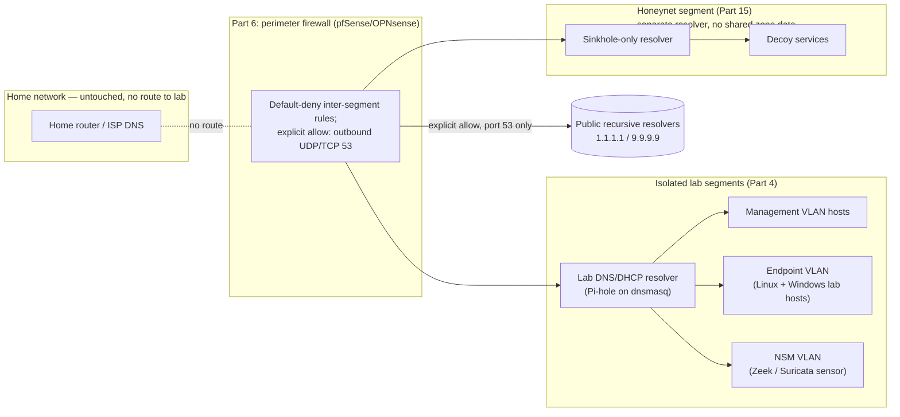

# Part 7 — Internal DNS and Core Network Services

## Why this part exists

Every part after this one assumes lab hosts can resolve a hostname and get an IP address without asking anything outside the lab to do it for them. Part 8's SIEM needs endpoints to find it by name. Part 13 and Part 14's sensors need `conn.log` and alert output to show real hostnames, not bare IPs, or a reader spends the rest of the book reverse-resolving addresses by hand. Part 15's honeynet needs decoy services to look like they belong on a network, which means answering DNS like a real network segment would. None of that works if the lab's name resolution is either missing entirely or, worse, silently riding on the reader's home router's DNS forwarder — the exact dependency Part 4 built the isolation to remove.

This part builds the lab's own DNS and DHCP: a resolver that serves only the isolated lab segments from Part 4 and Part 6, forwards outbound queries through the firewall's explicit allow rule rather than the home network's default gateway, and — as a side effect of doing its job at all — produces the cheapest, earliest telemetry source in this entire book. A DNS query log exists the moment the resolver is running; it costs no extra agent, no extra parser, and no extra RAM beyond the resolver itself. Every later part that talks about "what to do with lab telemetry" assumes something like this is already emitting rows into a log file.

> **Safety Gate**
> The resolver and DHCP service built in this part must bind only to the isolated lab-segment interface(s) established in Part 4 and built out in Part 6 — never to an interface that also reaches your home network's broadcast domain. Two concrete conditions to verify before this service starts answering queries: (1) its upstream forwarder is a public recursive resolver (for example `1.1.1.1` or `9.9.9.9`) reached only through the firewall's explicit outbound-53 allow rule, never through your home router's own DNS; and (2) if you run more than one lab segment (endpoint, NSM, honeynet), the honeynet segment's resolver — covered fully in Part 15 — must not share zone data with the others, so a decoy host answering a lookup never leaks a real lab hostname. Run the Appendix A4 pre-flight checklist before pointing any lab host at this resolver.

## 1. Why the lab needs its own name resolution

**[CONCEPT]** A lab with no internal DNS still has a working network — hosts can reach each other by IP, and outbound traffic still routes through the firewall from Part 6. What breaks is everything that assumes names: a SIEM dashboard full of raw IPv4 addresses instead of `wazuh-mgr.lab.internal`, a Sysmon `DestinationHostname` field that comes back empty, and — the failure mode that actually matters for this book's safety story — a lab host that, absent any other resolver, falls back to whatever DNS server DHCP handed it. If that DHCP server is your home router, every query a lab host makes now transits your home network's resolver, and by extension your ISP's, defeating the isolation Part 4 spent an entire part building.

The fix is not complicated: the lab segment needs its own authoritative-enough DNS server (it doesn't need to be authoritative for the whole internet, just for the handful of internal hostnames the lab cares about, forwarding everything else) and its own DHCP server handing out that resolver's address along with lab-scoped IP leases. Building that pair is this part's entire scope. Interpreting what a DNS log tells you about a specific threat — DGA-pattern queries, NXDOMAIN bursts, DNS tunneling — is Detection Engineering Handbook V2, Part 15's job, cited again in §10 below; this part stops at "the log exists and is trustworthy."

## 2. Choosing a resolver and DHCP stack

**[CONCEPT]** Four realistic options cover almost every home-lab build. The table below supports one decision: which stack to install in §4, based on how much DHCP integration and blocklist/sinkhole behavior you want without hand-writing zone files.

| Option | DHCP included? | Query log format | Blocklist / sinkhole support | Resource footprint | Best fit |
|---|---|---|---|---|---|
| Pi-hole (on top of `dnsmasq`/`unbound`) | Yes, via `dnsmasq` | Plaintext `pihole.log`, plus a queryable SQLite/FTL database | Built-in gravity list, per-domain block, web UI | Light — see §4's Resource Reality | Readers who want a web UI and ad-block-style logging out of the box |
| Plain `dnsmasq` | Yes, native | Plaintext syslog lines (`query`, `forwarded`, `cached`, `reply`) | Manual, via `address=/domain/0.0.0.0` lines | Lightest of the four | Readers who want minimal moving parts and are comfortable editing one config file |
| BIND9 + ISC DHCP | Separate daemons, both mature | `named` query log (verbose, needs explicit logging channel config) | Manual, via response-policy zones (RPZ) | Heaviest — two daemons, more RAM | Readers who want a resolver that behaves like enterprise/production DNS infrastructure, at the cost of more setup |
| Technitium DNS Server | Yes, native | Structured (JSON-capable) query log via its own API | Built-in blocklist subscriptions | Moderate — a .NET runtime, more than `dnsmasq` alone | Readers who want an API-first resolver for scripted log pulls into Part 8's SIEM |

This book uses Pi-hole (running on `dnsmasq` underneath) as the worked example for the rest of this part, for one direct reason: it is what the author's own lab actually runs, on a Linux container named CT100, which means every log excerpt from here on is a REAL LAB EXAMPLE rather than a constructed one. `dnsmasq` alone is functionally identical for everything this part builds — swap the web UI and gravity-list logic for a hand-edited `/etc/dnsmasq.conf` if you'd rather skip the extra layer.

## 3. Placing the resolver on the isolated topology

**[SAFETY]** Where the resolver sits matters more than which software it runs. It needs an interface on the lab segment(s) it serves, a forwarder path to the internet that goes through the firewall's explicit allow rule from Part 6 (not a default route back to your home gateway), and — if your build has more than one lab segment — a decision about whether one instance serves all of them or each segment gets its own.

For a single-segment lab (Part 2's smallest topology pattern), one resolver instance is enough. For a multi-segment build with a separate honeynet (Part 15), the honeynet segment must not share this resolver's zone data — a probe against a decoy host that gets back a real internal hostname (`siem-mgr.lab.internal` instead of a decoy-appropriate name) has just told whoever's poking at it more about your real lab than a honeypot should ever reveal. Give the honeynet its own resolver instance, configured in §8 as a sinkhole-only teaching setup with no knowledge of the endpoint or management segments' real hostnames.

Figure 7.1 shows the target placement: one lab resolver serving the management, endpoint, and NSM segments, and a separate, zone-isolated resolver for the honeynet segment, with no forwarder path from either instance back through the home network.





**Figure 7.1 — Target lab DNS/DHCP placement across isolated segments.** *CONCEPTUAL.* Illustrates the recommended split between a shared resolver for the management/endpoint/NSM segments and a zone-isolated resolver for the honeynet segment, with no forwarder path back through the home network. This is an architecture target for a reader's own build, not a capture from a running system — compare against the honest caveat in the Lab Note below, where the author's own real resolver does not fully match this diagram.

## 4. Building the lab resolver: Pi-hole/dnsmasq install and DHCP scope

**[COST/RESOURCE]**

> **Resource Reality**
> Pi-hole's own documentation lists 1 vCPU and 512MB of RAM as sufficient for a home network's query volume, with 4GB of disk mostly consumed by the FTL query database over time, not the software itself. This is the lightest telemetry-producing component in the entire book — a rounding error next to Part 8's SIEM (8GB minimum) or Part 10's Windows endpoints. If your hardware tier from Part 3 can run anything at all, it can run this.

**[SETUP]** The steps below target Pi-hole's official installer on Debian-family Linux (the author's own CT100 runs Debian in an LXC container on Proxmox; the same steps apply inside any Debian/Ubuntu VM or container on your chosen hypervisor from Part 5).

1. Create the lab resolver's VM or container with one NIC on the lab segment's interface only — verify this in your hypervisor's network settings before proceeding, not after.
2. Install Pi-hole with the official installer: `curl -sSL https://install.pi-hole.net | bash`.
3. During the interactive install, select the lab segment's interface (not any interface touching your home network) and choose upstream DNS providers that are public recursive resolvers — `1.1.1.1` and `9.9.9.9` are reasonable defaults — never your home router's IP.
4. After install, open the Pi-hole admin UI and enable DHCP under **Settings → DHCP**, setting the range to the lab-segment subnet from Part 4's VLAN plan — for example `10.10.20.50`–`10.10.20.150` — never your home network's `192.168.x.x` range. This is the supported, version-stable way to manage DHCP on a Pi-hole install; hand-editing a `dnsmasq.d` drop-in file for DHCP is a plain-`dnsmasq`-only technique (§2), and doing both on the same box risks two DHCP configs answering the same segment (§9).
5. In the same **Settings → DHCP** screen, set the lab segment's local domain suffix to `lab.internal` so lab hosts resolve each other as `<hostname>.lab.internal` instead of bare IPs.
6. Restart the service: `pihole restartdns`.
7. On the firewall from Part 6, add the explicit outbound-53 allow rule from this resolver's IP to your chosen public resolvers, and confirm the default-deny rule still blocks every other path out.

The one setting worth double-checking against the Safety Gate above: Pi-hole's interface-listening mode. Set it to "listen on interface only, permit all origins" scoped to the lab segment's interface — the alternative "listen on all interfaces" setting will happily answer queries from your home network too if the container is ever dual-homed, which is precisely the bridged-NIC failure mode Part 4 warned about.

## 5. Validating resolution and DHCP end-to-end

**[HANDS-ON LAB]** Goal: confirm a lab host gets a DHCP lease from the new resolver, resolves an internal hostname, and resolves a public one through the firewall's allowed path — all without touching your home network's DNS.

> **Validation Test**
> **Setup:** Lab resolver installed per §4, one test VM or container on the lab segment with DHCP enabled and no static DNS override.
> **Action:** Power on the test host, then run `nslookup pihole.lab.internal` followed by `nslookup github.com` from that host.
> **Expected result:** The test host's assigned IP falls inside the DHCP range configured in §4 (checkable via `ip a` on the host or the Pi-hole web UI's "DHCP leases" page); `pihole.lab.internal` resolves to the resolver's own lab-segment IP; `github.com` resolves successfully through the forwarder, and the query appears in the resolver's own query log within seconds — confirming the whole path (DHCP, internal resolution, forwarded resolution, logging) works without a fallback to any other resolver.

If `github.com` fails to resolve but the internal name works, the firewall's outbound-53 allow rule from step 7 in §4 is the first thing to check — a resolver with no forwarder path can still answer for names it knows and correctly fail everything else, which looks like a broken resolver but is actually a working one with no route out.

## 6. DNS query logs as an early, cheap telemetry source

**[CONCEPT]** Every dnsmasq-based resolver logs each query, whether it was served from cache, forwarded upstream, or blocked, plus every DHCP lease event, in a single plaintext log. No agent install, no parser configuration, no SIEM required to start looking at it — `tail -f /var/log/pihole/pihole.log` is a working telemetry feed on day one. Figure 7.2 shows a real excerpt.

```text
Sep 15 08:32:46 dnsmasq[2221]: forwarded software-static.download.prss.microsoft.com to 1.1.1.1
Sep 15 08:32:46 dnsmasq[2221]: reply software-static.download.prss.microsoft.com is <CNAME>
Sep 15 08:32:47 dnsmasq[2221]: query[A] mykulprint.lan from 192.168.1.169
Sep 15 08:32:47 dnsmasq[2221]: config mykulprint.lan is NXDOMAIN
Sep 15 08:32:49 dnsmasq[2221]: query[AAAA] mobile.events.data.microsoft.com from 192.168.1.169
Sep 15 08:32:49 dnsmasq[2221]: gravity blocked mobile.events.data.microsoft.com is ::
Sep 15 08:32:49 dnsmasq[2221]: query[A] mobile.events.data.microsoft.com from 192.168.1.169
Sep 15 08:32:49 dnsmasq[2221]: gravity blocked mobile.events.data.microsoft.com is 0.0.0.0
Sep 15 08:32:50 dnsmasq-dhcp[2221]: DHCPREQUEST(eth0) 192.168.1.7 b0:19:21:83:77:bf
Sep 15 08:32:50 dnsmasq-dhcp[2221]: DHCPACK(eth0) 192.168.1.7 b0:19:21:83:77:bf Archer
```

**Figure 7.2 — CT100 Pi-hole/dnsmasq query log excerpt.** *REAL LAB EXAMPLE.* Captured from the author's own running CT100 container (Debian LXC, Pi-hole on `dnsmasq`) on 2026-09-15. Shows a `gravity blocked` line — Pi-hole's default blocklist stopping a client from reaching `mobile.events.data.microsoft.com`, a Microsoft telemetry endpoint — alongside ordinary forwarded and cached lookups, and a DHCP lease renewal from the same daemon. No secrets are present in DNS query logs of this kind; nothing has been redacted.

**[HANDS-ON LAB]** Read the excerpt line by line and identify four distinct event types before moving on: a `forwarded` query (resolver had no cached answer, asked upstream), a `config`-sourced NXDOMAIN (resolver authoritatively knows this name doesn't exist — useful for spotting lab hosts probing for hostnames that were never registered), a `gravity blocked` line (blocklist match, the sinkhole behavior built out fully in §8), and a `DHCPACK` (lease granted, tying an IP back to a MAC address at a specific time — the same correlation a SIEM in Part 8 will do automatically once this log is ingested).

> **Lab Note**
> The author's own CT100 shown in Figure 7.2 doubles as the household's everyday ad-blocking resolver — that's a real, working setup for a single-operator home network, but it also means CT100 itself sits partly outside this book's isolation boundary: it serves the whole home LAN (`192.168.1.0/24`), not a segment-scoped lab VLAN. Don't copy that shortcut for your own isolated build. Stand up a second, dedicated instance bound only to the lab-segment interface from §3 — repointing your one household resolver at the lab and calling it isolated defeats the Safety Gate at the top of this part.

> **Blind Spot**
> A resolver only sees queries that are actually sent to it. A client hardcoded to a public DNS-over-HTTPS endpoint — increasingly a default "secure DNS" browser setting, and a known evasion technique for malware avoiding local logging — never asks this resolver anything, and produces zero rows in `pihole.log` for traffic that is very much happening. This part's query-log telemetry is blind to any host that bypasses local resolution entirely; detecting that bypass itself (unexpected outbound 443/853 traffic that isn't matched to any prior DNS lookup) is Detection Engineering Handbook V2, Part 15 territory, not something a query log can show for a query it never received.

## 7. Watching the resolver host itself

**[CONCEPT]** The resolver is a Linux host like any other lab endpoint, and it needs the same baseline scrutiny Part 9 applies to every Linux lab host — this section is a pointer forward, not a duplicate build. `auth.log`'s `sudo` entries are a useful early example of why: they show exactly who ran what, as whom, which is precisely the kind of legitimate-administrative-activity baseline Part 9 teaches you to establish before you can recognize anomalous sudo use.

```text
Jun 17 09:40:23 pihole sudo[4161]:     root : TTY=pts/1 ; PWD=/root ; USER=pihole ; COMMAND=/usr/bin/bash /opt/pihole/gravity.sh --force
Aug 17 15:28:38 pihole sudo[143836]:     root : TTY=pts/1 ; PWD=/root ; USER=root ; COMMAND=/usr/bin/pihole-FTL --config
```

**Figure 7.3 — CT100 `auth.log` sudo invocations excerpt.** *REAL LAB EXAMPLE.* Captured from the author's own running CT100 container on 2026-09-15, spanning entries from June through August 2026. Both lines are expected administrative activity — a blocklist update (`gravity.sh --force`) run as the `pihole` service account, and a config check run as root — kept here specifically as a baseline example of normal use, not a finding.

Full auditd deployment, rule-set design, and forwarding this host's logs into the Part 8 SIEM belong to Part 9; the point of including it here is narrower — do not let "it's just the DNS box" become a reason to skip monitoring it. A resolver with root access to its own gravity list and DHCP scope is worth watching precisely because it's small and easy to forget.

## 8. Sinkholing as a teaching setup

**[HANDS-ON LAB]** A sinkhole is just a DNS response that lies on purpose — instead of resolving a domain to its real address, the resolver answers with `0.0.0.0` or a controlled address you own, so any client that tries to reach that domain gets stopped or redirected before it leaves the resolver. Pi-hole's gravity list already does this for ad/telemetry domains, as Figure 7.2 showed. This section builds the same mechanism for teaching purposes: deterministic, on-demand "blocked" telemetry you can trigger whenever you want it, rather than waiting for an ad network to phone home.

1. Create a dedicated list file, `/etc/pihole/lab-sinkhole.list`, containing domain names you fully control the meaning of — teaching-only names under a domain you own, or RFC 2606 reserved test names (`example.com`, `example.org`) — never real, currently-active malicious infrastructure.
2. Add the list as a custom blocklist source in the Pi-hole admin UI ("Group Management" → "Adlists"), pointed at a local file path rather than a remote URL.
3. Run `pihole -g` to force a gravity list rebuild, pulling in the new entries.
4. From a lab test host, query one of the listed domains and confirm the resolver answers with the sinkhole address rather than forwarding upstream.

> **Safety Gate**
> Never populate a teaching sinkhole list with real, currently active malicious domains for the purpose of testing whether your resolver blocks them — doing so risks a lookup racing ahead of the block (a cache miss forwarded upstream before the list reloads) and, more importantly, provides no benefit a fabricated or reserved test domain doesn't already provide just as well. This sinkhole exists to exercise the block *path*, not to have a supervised near-miss with real attacker infrastructure. Curated threat-intel domain feeds belong in Part 16, ingested for enrichment and correlation, not queried directly by a lab host under any circumstances.

This deterministic block behavior becomes genuinely useful once Part 18's attack-simulation tooling exists: a scripted technique that performs a DNS lookup against a known test domain gives you a repeatable, on-demand event to validate that Part 8's SIEM actually ingests the resulting `gravity blocked` line end to end — a much cheaper validation loop than waiting for a real ad network to trigger the same code path.

## 9. Troubleshooting common resolver/DHCP failures

**[TROUBLESHOOTING]** Three failure modes account for most of the friction readers hit with this build.

- **Two DHCP servers answer the same segment.** If the lab segment's switch or virtual switch still has an uplink into a network segment where another DHCP server is active (a home router, or a hypervisor's own built-in DHCP on that vSwitch), lab hosts intermittently get leases from the wrong server. Fix: disable any competing DHCP service on that specific interface/vSwitch — check the hypervisor's virtual network settings, not just the physical router, since several hypervisors quietly run their own DHCP by default on NAT-mode virtual switches.
- **Public names resolve, but the lab's own hostnames don't.** This usually means the `lab.internal` domain suffix set in §4's **Settings → DHCP** screen didn't get picked up — confirm the setting saved, then restart with `pihole restartdns reload-lists`. For a plain-`dnsmasq` install (§2) instead of Pi-hole, re-check the `domain=` directive in your `dnsmasq.conf` for a typo. A resolver that only answers for the internet and not your own lab hostnames is answering half its job.
- **Nothing resolves, and the resolver's own log shows queries arriving.** The resolver can see the query (it's on the right interface) but its forwarder path is blocked — check the Part 6 firewall's outbound-53 allow rule for the resolver's specific source IP, not a broader "allow DNS" rule that might be scoped to the wrong subnet after a VLAN renumber.

## 10. Where this telemetry goes next

**[CONCEPT]** This part deliberately stops at "the log exists, it's trustworthy, and you know what each line means." Three things happen to it after that, each owned by a different volume in this series:

- **Detection Engineering Handbook V2, Part 15** builds actual detection logic on top of this telemetry once it's flowing into a SIEM — NXDOMAIN-burst patterns that suggest a DGA, query volume anomalies, and correlating a `gravity blocked` hit against the threat-intel feeds Part 16 of this book adds later. This part produces the raw material; that part teaches you to reason about it.
- **SOC Playbook Handbook's Playbook Library** owns what to actually do the first time a real alert fires off this telemetry once Part 8's SIEM is watching it — for example, triaging a sinkhole/gravity-block hit that wasn't one of your own §8 test queries. This part doesn't teach triage; it makes sure there's something worth triaging.
- **SOC Manager's Operating Handbook, Part 8 (assessment design) and Part 11 (onboarding/ramp-up)** can use this exact telemetry source as a low-cost, deterministic practice-drill input — the sinkhole from §8 is cheap enough to reset and rerun as many times as a training exercise needs, which is exactly the repeatable-drill property that volume's Field Test framing, expanded in this book's own Part 22, is built around.

Forwarding `pihole.log` (or `dnsmasq`'s syslog output) into the SIEM built in Part 8 is that part's job, not this one's — the pipeline, parser, and index design belong there. What this part guarantees going in is that the source log itself is real, isolated, and already meaningful before a single line of it reaches a dashboard.

**Cross-references:** Part 4 (network isolation and segmentation architecture); Part 6 (perimeter firewall and segmentation build); Part 8 (SIEM ingest for this part's DNS/DHCP logs); Part 9 (Linux endpoint auditd/log-forwarding treatment of the resolver host itself); Part 15 (honeynet-segment resolver isolation and sinkhole architecture at scale); Part 16 (threat-intelligence feed integration, referenced in §8's Safety Gate); Part 18 (attack-simulation tooling that exercises the §8 sinkhole on demand); Appendix A4 (safety and isolation pre-flight checklist); Detection Engineering Handbook V2, Part 15 (DNS-based detection logic); SOC Playbook Handbook, Playbook Library (alert triage); SOC Manager's Operating Handbook, Parts 8 and 11 (practice-drill design and onboarding use of this telemetry).
