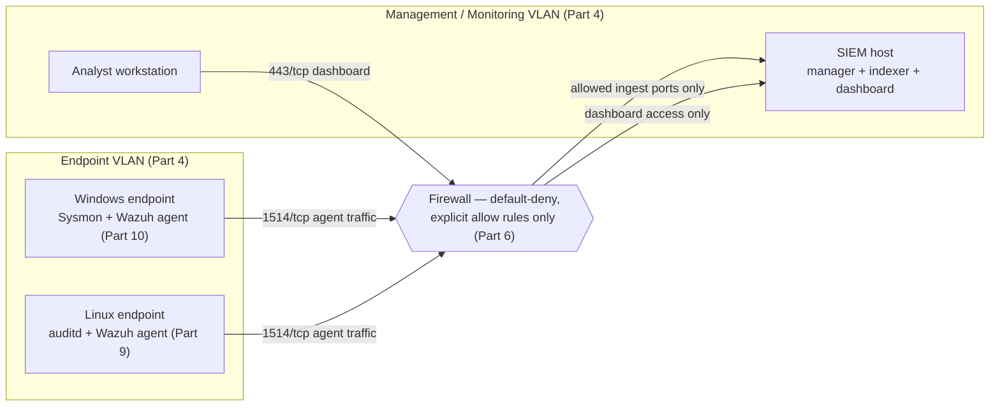

# Part 8 — Building the SIEM Platform

## Why this part exists

**[CONCEPT]** Every part before this one built infrastructure that doesn't, by itself, produce anything you can search: an isolated network (Part 4), a hypervisor (Part 5), a firewall with segmentation rules (Part 6), and internal DNS (Part 7). This part builds the first thing in the lab whose entire job is to receive, store, and make searchable whatever the rest of the book produces. By the end of it, you'll have a self-hosted SIEM running on its own VM, one test log line proven to arrive and show up in search, and a clear map of where this part's job stops and the next three books' jobs start. It deliberately does not cover parsing quality, field normalization, or correlation logic — Wazuh, Elastic, and Graylog all ship opinions about how a raw log becomes a structured event, and getting those opinions right is Detection Engineering Handbook V2's job (Parts 5–7), not this one's. This part's finish line is "logs arrive and are searchable," full stop.

> **Safety Gate**
> The SIEM host you build in this part is the single most valuable pivot point in your entire lab — it will eventually hold credentials, agent enrollment keys, and a live view into every endpoint you point at it. Everything here assumes it lives inside the isolated segment architecture from Part 4, reachable from the endpoint VLAN only on the specific ingest ports it needs (§4) and reachable for dashboard access only from your management VLAN, never bridged to your home network or exposed to the open internet on any port. Before you install anything, confirm the VM's virtual NIC is attached to the correct isolated virtual switch from Part 5 and that the firewall rules in §4 exist before the first agent enrolls — an unauthenticated or default-credentialed SIEM dashboard reachable from the wrong segment defeats the isolation of every other part in this book at once. If you haven't run the Appendix A4 pre-flight checklist since building Part 6's firewall, run it now before continuing.

## 1. Choosing a SIEM platform for a home lab

**[CONCEPT]** "SIEM" gets used loosely enough in vendor marketing that it's worth pinning down what this part actually means by it: one platform that ingests logs from multiple sources, stores them in a way that's indexed for fast search, and gives you a query interface and a dashboard on top. Three self-hosted options cover nearly every home-lab build you'll see discussed: Wazuh (a security-focused platform built on OpenSearch, bundling a host-agent and some detection content out of the box), the Elastic Stack (Elasticsearch, Logstash or Beats, and Kibana, assembled from separate components), and Graylog (its own server process backed by MongoDB for metadata and Elasticsearch or OpenSearch for the actual log storage). None of the three requires a paid license to run at home-lab scale, and all three are genuinely used in production SOCs — you are not settling for a toy version of anything by picking any one of them.

The table below compares the three on what actually matters at this size: how much RAM the platform wants before you've added a single endpoint, and how much hand-configuration the install leaves you to do afterward. These are vendor-documented sizing figures, not numbers this book's own author has build-tested against a running install — the real lab this book draws REAL LAB EXAMPLE evidence from (Parts 5, 7, 9, and 15) is Linux-and-network-only and currently runs no commercial SIEM, so treat this comparison as a planning reference, not a captured result, and re-check each platform's current sizing docs before you commit hardware.

| Platform | RAM at idle (single node) | Components you install | Setup friction | Best fit for this book |
|---|---|---|---|---|
| Wazuh | ~8GB (roughly 4GB OpenSearch heap plus manager overhead) | Manager, indexer (OpenSearch), dashboard, host agent | Low — one installer script does all three at once | Readers who want detection content and host-integrity checks bundled in, without wiring separate components together themselves |
| Elastic Stack | ~12–16GB comfortably (Elasticsearch heap, Logstash or Beats, and Kibana each budgeted separately) | Elasticsearch, Logstash and/or Beats, Kibana | Medium-high — each component is installed, versioned, and configured on its own | Readers planning to lean on Detection Engineering Handbook V2's query and correlation content later, since Elastic's query language is what most of that content assumes |
| Graylog | ~8–12GB (Graylog server plus a MongoDB metadata store plus an Elasticsearch/OpenSearch backend) | Graylog server, MongoDB, Elasticsearch or OpenSearch | Medium — three components, but Graylog's own docs walk through wiring them together directly | Readers who want a simpler day-to-day search UI than Kibana and don't need Wazuh's bundled agent features |

This book's worked walkthrough (§3) uses Wazuh, purely because its single installer script is the lowest-friction path to "logs arrive and are searchable" for a first SIEM build — every ingest, verification, and troubleshooting concept in §3–§6 applies to the other two platforms with different commands and file paths, not a different architecture.

All three platforms ship a free, self-hosted edition with no artificial cap on data volume or agent count for a home-lab's scale — the commercial tiers vendors sell on top (managed cloud hosting, enterprise support contracts, extra compliance-reporting modules) are aimed at organizations, not a single-operator lab, and nothing in this book's build assumes you'll ever need one.

> **What Would Change My Mind**
> This part recommends Wazuh as the lowest-friction first SIEM for a reader with no prior preference, on the grounds of its single installer script. If a reader reports the Elastic Stack's separately-versioned components staying reliably in sync across upgrades with less manual intervention than Wazuh's bundled release cycle — not just "Elastic has more features," which isn't the claim being made — that specific maintenance-burden comparison, not the general recommendation, would need revision.

## 2. Sizing the host before you install anything

**[COST/RESOURCE]** Skipping this section and installing straight from a vendor quick-start guide is the single most common way this build goes wrong, and it's the subject of §3's Build Autopsy — read the numbers below before you provision the VM, not after the installer fails.

> **Resource Reality**
> Wazuh's own sizing guidance treats 4 vCPU and 8GB of RAM as the floor for a single all-in-one node serving up to roughly 25 agents, and the indexer component underneath it (OpenSearch) wants at least 4GB of that RAM as dedicated JVM heap before it reliably stays running under real load. Below that floor, the indexer doesn't run slowly — it fails its own bootstrap checks outright, or gets killed by the kernel's out-of-memory handler the moment the manager hands it its first real batch of agent data. If Part 3 put your build on the entry-level hardware tier (a single repurposed laptop or mini-PC), plan on giving the SIEM the whole box: it should not share a host with Windows endpoints, NSM sensors, or a honeynet segment on the same tier of hardware.

The table below maps Part 3's three hardware tiers onto what each can actually run for a SIEM alone, before adding endpoints, NSM sensors, or a honeynet on the same box.

| Hardware tier (Part 3) | Total RAM available | What it can run as a SIEM | What it can't |
|---|---|---|---|
| Repurposed laptop/mini-PC | 8–16GB | One SIEM platform as the box's only real workload | The SIEM plus Windows endpoints plus NSM sensors on the same host — move up a tier before combining |
| Dedicated home-server box | 32–64GB | SIEM plus several endpoints plus Zeek/Suricata, each on a separate VM with real headroom | A persistent multi-DC AD forest layered on top without hitting swap (see Part 11) |
| Multi-node cluster | 64GB+ across hosts | SIEM, endpoints, NSM, and a honeynet each on dedicated VMs or hosts with no resource contention | — |

If you're building on the entry-level tier and know you'll eventually want Zeek (Part 13) or a Windows endpoint (Part 10) running at the same time, size the SIEM VM at 8GB minimum now rather than resizing it under a running install later — shrinking a live OpenSearch heap after the fact is far more disruptive than starting with headroom.

## 3. Installing a self-hosted SIEM: a Wazuh walkthrough

### 3.1 Preparing the VM

**[SETUP]** Before running any installer, the VM itself needs to exist in the right place on the network Part 4 designed and Part 6 built.

1. In your hypervisor (Part 5), create a new VM with at least 4 vCPU and 8GB RAM, per §2's floor.
2. Attach its virtual NIC to the management or monitoring VLAN from Part 4's segmentation plan — not the endpoint VLAN, and never the honeynet segment.
3. Install Ubuntu Server 22.04 LTS (or your distribution of choice; the steps below target Ubuntu specifically) with a static IP reserved on the DNS server built in Part 7.
4. Confirm the VM can reach the internet outbound for package downloads.
5. Confirm — using the Part 6 firewall's logs, not just an assumption — that nothing outside the lab segment can reach it yet.

### 3.2 Running the all-in-one installer

**[SETUP]** The commands below target Wazuh 4.7's all-in-one installer script running on Ubuntu Server 22.04 LTS; if you're installing a newer 4.x release, the script name is the same but the download path in Wazuh's own docs will have moved.

```bash
curl -sO https://packages.wazuh.com/4.7/wazuh-install.sh
sudo bash ./wazuh-install.sh -a
```

The `-a` flag tells the script to install the manager, indexer, and dashboard together on this one node — the "all-in-one" pattern this book uses throughout. The script takes several minutes and prints an admin username and a generated password for the dashboard at the very end; copy that password immediately, since it isn't shown again and the terminal scrollback is your only other copy. To confirm the install actually succeeded rather than silently failing partway through, check that all three services are active before doing anything else:

```bash
sudo systemctl status wazuh-manager wazuh-indexer wazuh-dashboard
```

All three should report `active (running)`. If `wazuh-indexer` instead shows `failed` or is stuck `activating`, stop here and go to §6 before continuing — the dashboard will often still load and let you log in even when the indexer underneath it never came up, which is exactly the failure mode in the Build Autopsy below.

> **Build Autopsy — the all-in-one node that never finishes booting**
>
> **The plan:** Take Part 3's mid-tier hardware budget — an 8GB repurposed mini-PC — and run Wazuh's all-in-one installer directly on it, on the assumption that the official script handles all the sizing decisions for you.
>
> **Why it seemed reasonable:** The installer's own defaults don't warn you it needs more than what you gave it, and 8GB sounds like plenty of room for a lab with two or three endpoints.
>
> **How it failed:** OpenSearch — the indexer underneath Wazuh's dashboard — refuses to start below its default heap allocation and a kernel setting (`vm.max_map_count`) most quick-start guides don't mention. On an 8GB VM where the host OS and a couple of other lab services are already using part of that memory, the indexer either fails its own bootstrap checks outright or gets OOM-killed the moment the manager hands it its first real batch of agent data. The dashboard still loads, you can still log in, and it shows nothing — because the component actually holding the logs never came up.
>
> **The fix:** Treat §2's Resource Reality numbers as a floor, not a suggestion — give the SIEM VM a dedicated 8GB with the host OS and every other lab service running on separate hardware or a separate VM entirely. On genuinely constrained hardware, install the manager and indexer as two separate VMs instead of one all-in-one node, so a memory-hungry indexer restart doesn't take the whole platform down with it.

### 3.3 Closing the front door before anything connects

**[SAFETY]** The generated admin password from §3.2 is the only thing standing between "isolated lab SIEM" and "open door with a search bar." Log into the dashboard at `https://<siem-ip>` immediately after install, using the printed credentials, and confirm the certificate warning you get is the installer's self-signed cert (expected at this stage — Part 8 doesn't cover replacing it with one from your own internal CA) and not a sign you've reached the wrong host. Do this before wiring in a single forwarder in §4; an endpoint enrolling against a SIEM you haven't logged into yet is an endpoint enrolling against a dashboard still sitting on installer defaults.

## 4. Building the first ingest pipeline

### 4.1 Picking a forwarder

**[CONCEPT]** A SIEM only ever sees what something else sends it. For Wazuh, that's almost always the Wazuh agent — a small process installed on each endpoint that ships logs, file-integrity events, and (on Windows) Sysmon/Event Log data back to the manager over its own protocol on port `1514/tcp`, with enrollment on port `1515/tcp`. Elastic-stack builds typically use Filebeat instead, shipping to Logstash or directly to Elasticsearch on port `5044/tcp`. Graylog accepts both syslog and GELF inputs depending on the source. This part builds and proves the pipeline itself, using the SIEM host as its own test source; Part 9 and Part 10 cover installing the Wazuh agent (or Filebeat) on the actual Linux and Windows endpoints once they exist.

### 4.2 Opening exactly the ports this needs

**[SAFETY]** Before wiring in a single forwarder, the firewall built in Part 6 needs explicit allow rules for exactly these ports — everything else stays denied by default, per Part 4's segmentation model.

| Source | Destination | Port/protocol | Action |
|---|---|---|---|
| Endpoint VLAN | SIEM host | `1514/tcp` (Wazuh agent) | Allow |
| Endpoint VLAN | SIEM host | `1515/tcp` (Wazuh agent enrollment) | Allow |
| Endpoint VLAN | SIEM host | `5044/tcp` (Filebeat, if used instead of or alongside the Wazuh agent) | Allow |
| Management VLAN | SIEM host | `443/tcp` (dashboard HTTPS) | Allow |
| Any other source | SIEM host | any | Deny (default) |

Add these as explicit rules in the pfSense/OPNsense interface built in Part 6 rather than a catch-all "allow endpoint VLAN to SIEM" rule — a broad rule here quietly reopens exactly the blast-radius problem Part 4 exists to prevent, since it would let a compromised endpoint reach anything else the SIEM host happens to expose, not just the ingest ports it actually needs.

### 4.3 The ingest architecture

**[CONCEPT]** The diagram below shows where the pieces from §4.1 and §4.2 sit relative to the VLAN boundary and firewall rules from Parts 4 and 6 — the shape this part is building toward, before any endpoint actually exists to populate it.





**Figure 8.1 — SIEM ingest pipeline inside the isolated lab segment.** *CONCEPTUAL.* Illustrates where endpoint forwarders, the SIEM host, and analyst dashboard access sit relative to the Part 4 VLAN boundary and the Part 6 firewall's allow rules. This is an architecture sketch, not a capture from a running build — no endpoints exist yet at this point in the book, and the author's own real lab currently runs no commercial SIEM/EDR product, so no REAL LAB EXAMPLE screenshot of this specific pipeline exists to cite here or elsewhere in this part.

## 5. Verifying logs arrive and are searchable

**[HANDS-ON LAB]** Goal: prove the ingest pipeline moves a log line from the SIEM host itself into the searchable index, without depending on any endpoint build from later parts. Run this before moving on to Part 9 or Part 10 — if it fails, adding real endpoints on top only adds more sources that also won't show up, which is a much harder problem to debug than one missing test line.

1. On the SIEM host, generate a local syslog test line with a tag you can search for later.
2. Open the dashboard.
3. Search for that tag.
4. Confirm the entry's timestamp matches when you actually ran the command, not some other time.

```bash
logger -t labtest "part08 ingest check $(date +%s)"
```

> **Validation Test**
> **Setup:** SIEM installed per §3, dashboard reachable, no endpoints forwarding yet.
> **Action:** `logger -t labtest "part08 ingest check $(date +%s)"` on the SIEM host itself.
> **Expected result:** A new entry tagged `labtest` appears in the SIEM's search view within seconds, with a timestamp matching when you ran the command. If nothing appears after a minute, the pipeline itself is broken — go to §6 before wiring in any real endpoint.

## 6. Troubleshooting the installs that go wrong

**[TROUBLESHOOTING]** Two failure modes account for nearly every broken first install, beyond the undersized-hardware failure already covered in §3's Build Autopsy.

**The indexer bootstraps but the manager can't reach it.** Wazuh's manager and indexer communicate over a local port that a host firewall (`ufw`, if it's enabled on the VM itself, separate from the Part 6 network firewall) can block without any obvious error in the dashboard. Check `sudo systemctl status wazuh-indexer` for `active (running)` first, then check the manager's own log at `/var/ossec/logs/ossec.log` for connection-refused errors before assuming the ingest pipeline in §4 is the problem.

**Agent enrollment fails with a certificate or key mismatch.** This shows up once you reach Part 9 or Part 10 and try to enroll a real endpoint: the agent reports it can't validate the manager's certificate, or enrollment succeeds but no events ever arrive. This is almost always a clock-skew problem, not a certificate problem — if the endpoint's clock has drifted more than a few minutes from the SIEM host's, enrollment and encrypted agent traffic both fail in ways that look like a certificate issue in the log output. Confirm both hosts are pointed at the same NTP source before troubleshooting anything else.

**The dashboard suddenly stops accepting new data after weeks of running fine.** OpenSearch and Elasticsearch both flip an index to read-only once the underlying disk crosses a "flood-stage" watermark — 95% full by default — as a safety measure against writing into a completely full filesystem. The dashboard keeps loading and old data stays searchable, but nothing new lands, with no obvious error unless you check the indexer's own log for a `flood_stage_watermark` message. Running `df -h` on the SIEM VM's data volume is the first check, well before assuming the ingest pipeline itself broke; Part 21 covers the retention policy that keeps you from hitting this watermark in the first place.

> **Blind Spot**
> A log line landing in the index and showing up in search proves the pipeline moves bytes from source to storage. It proves nothing about whether those bytes were parsed into the right fields, whether a timestamp reflects when the event actually happened versus when it was ingested, or whether the same field name means the same thing across two different log sources. This part's finish line — logs arrive and are searchable — is the floor Detection Engineering Handbook V2, Parts 5–7 build on, not a substitute for that work.

## 7. What this part stops at, and where the telemetry goes next

**[CONCEPT]** A working, searchable SIEM with one verified test log line is infrastructure, not a detection capability — the gap between the two is deliberate, and closing it is explicitly the other volumes' job rather than something duplicated here.

- **Detection Engineering Handbook V2, Parts 5–7** cover parsing quality, field normalization, and time-handling in depth — the difference between a log that's merely searchable and one that's actually structured well enough to build a detection on. Read these before you trust any dashboard panel built on this part's pipeline.
- **Detection Engineering Handbook V2, Parts 22–33** cover the correlation, baselining, and threat-intel scoring logic that turns raw searchable events into an actual alert. Nothing in this part fires an alert on anything — it only makes the underlying data visible.
- **Detection Engineering Handbook V2, Parts 34–36** cover threat-hunting methodology once telemetry exists to hunt in — directly applicable the moment Part 9 and Part 10's endpoints start forwarding real data through the pipeline this part built.
- **SOC Playbook Handbook's Playbook Library** covers what a fired alert actually means and how to triage it — relevant once Detection Engineering Handbook V2's rule logic is layered on top of this part's ingest pipeline and something actually fires.
- **SOC Manager's Operating Handbook, Part 8 (assessment design) and Part 11 (onboarding/ramp-up)** cover structuring a repeatable practice drill against a team — relevant once this lab has enough of the rest of the book built (endpoints, NSM, honeynet) to generate the kind of telemetry a drill needs.
- **This book's own Part 17** builds the dashboards worth looking at on top of everything this part and Parts 9–16 feed into the SIEM. **Part 19** closes the loop fully, pairing a simulated action with a specific detection and a specific playbook.

> **Lab Note**
> Don't point every endpoint at the SIEM the day you finish this part's install. Wire in one test source, confirm it with §5's Validation Test, and only then move on to Part 9 and Part 10's real endpoint builds — debugging "why isn't anything arriving" against five endpoints at once is a much worse afternoon than debugging it against one.

---

**Cross-references:** Part 3 (hardware tiers and resource budgeting), Part 4 (network isolation and segmentation architecture), Part 5 (hypervisor installation), Part 6 (firewall and segmentation build), Part 7 (internal DNS), Part 9 (Linux endpoints and auditd), Part 10 (Windows endpoints and Sysmon), Part 17 (dashboards and visualization), Part 19 (purple-team drills), Appendix A4 (safety and isolation pre-flight checklist); Detection Engineering Handbook V2 Parts 5–7, 22–33, and 34–36; SOC Playbook Handbook's Playbook Library; SOC Manager's Operating Handbook Parts 8 and 11.
