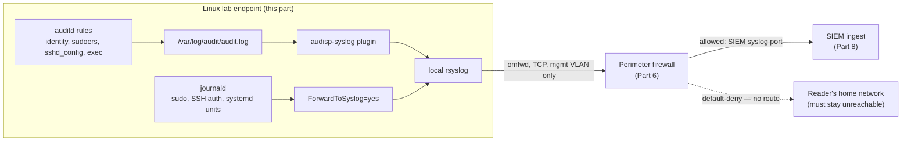

# Part 9 — Linux Endpoints and auditd Deployment

## Why this part exists

Every other part in Section C and D of this book assumes something is generating logs worth searching. This part is where that stops being an assumption. You'll stand up one or more Linux lab endpoints, turn on the telemetry Linux gives you for free (journald, syslog), then layer `auditd` on top for the telemetry Linux does not give you for free — who touched `/etc/shadow`, what ran `execve` and with what arguments, whether a file that shouldn't change just changed. This is also, honestly, the part of this book with the deepest real-world backing: the author's own running lab is Linux-only, and several of the figures below are pulled directly from that lab's actual logs rather than constructed for the page. Where that isn't true — and it isn't true everywhere in this part — the text says so plainly rather than letting the reader assume otherwise.

> **Safety Gate**
> Everything below assumes the Linux endpoint(s) you build here live on the lab/victim network segment designed in Part 4 and firewalled in Part 6 — not bridged, NATed, or dual-homed onto your home LAN, and not reachable from the open internet. Before you provision a single container or VM for this part, confirm two things: the endpoint's only route to anything is through the perimeter firewall built in Part 6, and the only destination that firewall permits outbound from this segment is the SIEM ingest port on the management VLAN (Part 8). If you're going to run the identity-watch exercises in §8 by editing `/etc/passwd` or `/etc/shadow` as a test, do it on a disposable lab endpoint you're prepared to rebuild — not a box that also holds a real credential you use elsewhere. Run the Appendix A4 pre-flight checklist if this is the first endpoint you're standing up on this segment.

## 1. What this part builds, and what it deliberately skips

**[CONCEPT]** This part covers three things, in order: provisioning a Linux endpoint sized for the job, confirming journald/syslog already produce useful baseline telemetry with zero extra software, then installing and tuning `auditd` to close the specific gap journald leaves — file-integrity-style watches and process-execution auditing. It does not cover how to read what any of this produces once it lands in a SIEM; that's Detection Engineering Handbook V2's job (cited by part number in §9 below), and this part stops the moment the telemetry is confirmed to arrive intact and searchable.

It also does not cover Windows endpoints (Part 10) or why this book puts Linux first (the short version: the author's real lab is Linux-only, so this part gets to lean on real evidence immediately instead of constructing it — see `BOOK-INDEX.md` provenance item 6 if you want the full reasoning).

## 2. Choosing and sizing Linux lab endpoints

**[CONCEPT]** A lab endpoint's job in this book is narrow: run some real services, get used a little, and produce telemetry a SIEM can ingest and a reader can practice against. It does not need to be a beefy box. What it needs is a stable identity (a hostname and IP that don't drift every rebuild), enough headroom that `auditd` and a log forwarder don't starve whatever service you're also running on it, and — this is the part that actually catches people — the right virtualization choice for what you're asking `auditd` to do. More on that in §4.

### 2.1 Container or VM

**[COST/RESOURCE]** Table 9.1 sizes three common endpoint roles against the two virtualization choices this book's readers are likely using per Part 5 (Proxmox LXC containers or KVM/VirtualBox VMs). The right column is the one most readers skip past and shouldn't — it's the reason §4 exists as its own section.

**Table 9.1 — Linux lab endpoint sizing by role.** The table below supports the decision of which platform (container or VM) and how many resources to commit to each endpoint role before provisioning anything.

| Endpoint role | Platform | Min RAM | Min disk | Runs `auditd` cleanly? |
|---|---|---|---|---|
| General-purpose service host (DNS, web app, file share) | LXC container | 512MB | 4GB | No — see §4 |
| General-purpose service host (DNS, web app, file share) | KVM/VirtualBox VM | 1GB | 8GB | Yes |
| Dedicated `auditd`-instrumented endpoint (this part's main exercise) | KVM/VirtualBox VM | 1GB | 10GB | Yes |
| Log/journal forwarder relay (optional, if not folding into the SIEM host) | LXC container | 512MB | 4GB | Not needed — no rules run here |

**[SETUP]** This chapter targets Debian 12 (bookworm) and Ubuntu 22.04/24.04 LTS as the endpoint OS — both ship a current audit userspace (`auditd` package roughly version 3.0–3.1) and current `systemd`/journald. If you're on a different distribution, the package names in §4 will differ (RHEL/Rocky use the same `auditd` package name but a different default rule-loading path); the rule syntax itself in §5 is portable across all of them since it's a kernel-level interface, not a distribution-specific one.

## 3. Baseline telemetry before you install anything extra: journald and rsyslog

**[CONCEPT]** Before `auditd` enters the picture, a default Linux install is not silent. `journald` already captures every `sudo` invocation, every `systemd` unit state transition, and every SSH authentication attempt, success or failure, with no configuration at all. This matters for two reasons: it's real telemetry you can forward into the Part 8 SIEM today, and it's the honest baseline against which "why do I even need `auditd`" gets answered in §5 — journald tells you *that* someone ran a command as another user; it does not tell you *what that command touched* unless the command's own output says so.

The three figures below aren't constructed examples. They're excerpts from the author's own running lab — a Pi-hole DNS container (CT100) and a vulnerability-scanner platform container (CT104), both Debian-based LXC containers on the Proxmox host this book's Part 5 describes — captured directly from `/var/log/auth.log` and `journalctl` with no modification beyond trimming line counts for the page.

```text
Jul 07 11:54:58 pihole sudo[33546]:     root : TTY=pts/1 ; PWD=/root ; USER=root ; COMMAND=/usr/bin/ss -tulpn
Jul 07 11:54:58 pihole sudo[33546]: pam_unix(sudo:session): session opened for user root(uid=0) by (uid=0)
Aug 17 15:28:38 pihole sudo[143836]:     root : TTY=pts/1 ; PWD=/root ; USER=root ; COMMAND=/usr/bin/pihole-FTL --config
```

**Figure 9.1 — Baseline `sudo` invocation telemetry, no extra tooling installed.** *REAL LAB EXAMPLE.* Captured from `/var/log/auth.log` on the author's CT100 Pi-hole container via `grep -i sudo`. Shows the invoking user, target user, and exact command for two legitimate administrative `sudo` calls — this is the shape of the baseline you'd build anomaly detection against once this telemetry reaches Detection Engineering Handbook V2's baselining content (its Part 31).

```text
Sep 09 19:26:06 vulnscan systemd[1]: vulnscan-web.service: Deactivated successfully.
Sep 09 19:26:06 vulnscan systemd[1]: Stopped vulnscan-web.service - Vulnerability Scanner Dashboard (web).
Sep 09 19:26:07 vulnscan systemd[1]: Starting vulnscan-web.service - Vulnerability Scanner Dashboard (web)...
Sep 09 19:26:07 vulnscan systemd[1]: Started vulnscan-web.service - Vulnerability Scanner Dashboard (web).
```

**Figure 9.2 — `systemd` unit state transitions via `journalctl`.** *REAL LAB EXAMPLE.* Captured from the author's CT104 vulnerability-scanner container, showing the canonical Stopping → Deactivated → Stopped → Starting → Started sequence for a real application unit (`vulnscan-web.service`). No `auditd`, no agent, no configuration — this is what `journalctl -u <unit>` gives you the moment the unit exists.

```text
admin    ssh:notty    <redacted-internal-host>    Mon Sep 14 01:17 - 01:17  (00:00)
root     ssh:notty    <redacted-internal-host>    Mon Sep 14 01:06 - 01:06  (00:00)
root     ssh:notty    <redacted-internal-host>    Mon Sep 14 01:05 - 01:05  (00:00)
```

**Figure 9.3 — Failed SSH authentication burst via `lastb`.** *REAL LAB EXAMPLE, source address redacted for this book.* Dozens of failed `admin`/`root` SSH attempts in rapid succession against the author's CT104 container, sourced from a single host elsewhere on the author's home network (address withheld here; the original capture is cited unredacted in Detection Engineering Handbook V2's evidence manifest, where the exposure was already assessed as low-risk since it's an internal address). `lastb` never exposes the attempted password, so no credential redaction was needed — only the source address is trimmed here as an extra precaution for this book. The pattern itself — dozens of attempts per minute against a small set of usernames — is exactly the shape a brute-force detection rule keys on, real or simulated.

## 4. Installing auditd

**[SETUP]** `auditd` gives you the layer journald doesn't: kernel-level watches on specific files (did anything write to `/etc/shadow`) and kernel-level watches on specific syscalls (did anything call `execve`, and with what arguments). The commands below target Debian 12/Ubuntu 22.04's `auditd` package.

```bash
sudo apt update
sudo apt install auditd audispd-plugins
sudo systemctl enable --now auditd
sudo systemctl status auditd
```

Confirm the service is active and check that rules are loading with `auditctl -l` — an empty list is expected until §5 adds rules, but the command itself should return cleanly, not an error.

> **Engineering Reality**
> The Linux kernel's audit subsystem is not namespace-aware — it's a single, global facility owned by the host kernel, not something an unprivileged container gets its own copy of. Run the commands above inside an unprivileged LXC container (the same kind CT100 and CT104 actually are) and `auditctl -l` typically fails outright, or the daemon starts but silently produces no records, because the container was never granted `CAP_AUDIT_CONTROL` against the host's audit netlink socket. This is exactly why Table 9.1 marks the dedicated `auditd` endpoint row "VM," not "container": if you want the rule-set content in §5 to actually work, build this specific endpoint as a KVM/VirtualBox VM per Part 5, not as an LXC container, even though every other endpoint role in this book is happy as a container.

> **Validation Test**
> **Setup:** `auditd` installed and running per the commands above, on a VM-based endpoint (not an LXC container).
> **Action:** `sudo auditctl -w /etc/hostname -p r -k lab_validation` followed by `cat /etc/hostname`, then `sudo ausearch -k lab_validation`.
> **Expected result:** `ausearch` returns at least one `type=SYSCALL` record with `key="lab_validation"` and a `comm="cat"` field — proof the kernel audit hooks are live end to end on this host before you invest in the full rule set in §5.

## 5. Writing an auditd rule set

**[CONCEPT]** `auditd` rules live in `/etc/audit/rules.d/*.rules` and compile into the running rule set via `augenrules --load`. Every rule you write here is one of two shapes: a **watch** (`-w <path> -p <perms> -k <key>`, tripped when anything accesses that path with those permissions), or a **syscall rule** (`-a always,exit -F arch=b64 -S <syscall> -k <key>`, tripped whenever that syscall runs, regardless of path). Every rule should carry a key — the `-k` flag — so `ausearch -k <key>` can pull exactly the records you care about instead of grepping the whole log.

### 5.1 Watching identity and access-control files

**[SETUP]** The three watches below are the minimum baseline for identity telemetry — anything editing account, credential, or privilege-escalation configuration on this endpoint.

```text
# /etc/audit/rules.d/identity.rules
-w /etc/passwd -p wa -k identity
-w /etc/shadow -p wa -k identity
-w /etc/group -p wa -k identity
-w /etc/sudoers -p wa -k sudoers
-w /etc/sudoers.d/ -p wa -k sudoers
-w /etc/ssh/sshd_config -p wa -k sshd_config
```

Load the rules and confirm they're active:

```bash
sudo augenrules --load
sudo auditctl -l | grep -E "identity|sudoers|sshd_config"
```

You should see six active watch rules echoed back, each carrying the key you assigned — this is the check to run before moving to §5.2, not after something breaks.

### 5.2 Watching process execution

**[SETUP]** The `identity` key (`-k identity`, from §5.1) tells you a file changed; it does not tell you what process changed it or what else that process did in the same breath. A syscall rule on `execve` closes that gap by logging every process a shell or service actually launches.

```text
# /etc/audit/rules.d/execution.rules
-a always,exit -F arch=b64 -S execve -k exec
-a always,exit -F arch=b32 -S execve -k exec
```

Both architecture lines matter on a 64-bit host: a 32-bit binary invoking `execve` generates a `b32` syscall entry, and a rule scoped only to `arch=b64` misses it silently — no error, just an absent record. Load and confirm the same way as §5.1, then generate one event to check the shape of the output.

```bash
sudo augenrules --load
whoami
sudo ausearch -k exec -ts recent | tail -n 20
```

A single `whoami` invocation produces a matched set of records sharing one `msg=audit(<epoch>:<serial>)` identifier: a `type=SYSCALL` line with `syscall=59` (the `execve` syscall number on x86-64) and `key="exec"`, paired with a `type=EXECVE` line showing the literal argument vector (`a0="whoami"`), and a `type=PATH`/`type=CWD` pair recording the binary's path and the working directory it ran from. `ausearch` groups all of these under the shared serial number automatically — you don't need to correlate them by hand.

### 5.3 A baseline key-tagging plan

**[SETUP]** Table 9.2 lays out the full baseline this part recommends before you add anything workload-specific — use it as the starting rule file, not the finished one.

**Table 9.2 — Baseline auditd key-tagging plan.** The table below supports deciding which watches belong in a first rule set versus which are workload-specific additions to layer on later.

| Key | Rule type | Watched target | Purpose |
|---|---|---|---|
| `identity` | Watch, `-p wa` | `/etc/passwd`, `/etc/shadow`, `/etc/group` | Detect account/credential file tampering |
| `sudoers` | Watch, `-p wa` | `/etc/sudoers`, `/etc/sudoers.d/` | Detect privilege-escalation config changes |
| `sshd_config` | Watch, `-p wa` | `/etc/ssh/sshd_config` | Detect SSH access-policy changes |
| `exec` | Syscall, `execve` | All process execution | Baseline and hunt on process-launch activity |
| `lab_validation` | Watch, `-p r` | `/etc/hostname` (Validation Test only) | Confirm the audit pipeline is alive — remove after §4's test |

> **Lab Note**
> Snapshot the VM after §4's install and before you load a single rule from §5. A typo in a syscall rule (a wrong architecture flag, a malformed `-F` filter) is a five-minute rollback from that snapshot instead of chasing why `augenrules --load` silently accepted a rule that never matches anything.

### 5.4 Locking the rule set

**[SETUP]** `-e 2` in a rules file makes the running rule set immutable until the next reboot — no process, including root, can add, remove, or flush a rule without rebooting first. This is a real integrity control (it's what stops an attacker with root from just turning off the watch that would catch them), and it's also a real inconvenience while you're still iterating.

```text
# append to the end of the last rules.d file loaded, e.g. 99-finalize.rules
-e 2
```

> **Build Autopsy — the audit.log that filled a lab disk in an afternoon**
>
> **The plan:** Broaden the §5.1–5.2 rule set to "watch everything" for maximum visibility — add `-p rwxa` watches on `/etc`, `/var`, and `/home` wholesale, on top of the `execve` syscall rule, reasoning that more coverage is strictly better than less.
>
> **Why it seemed reasonable:** The `auditctl` syntax makes broad watches just as easy to write as narrow ones, and nothing in the tool itself warns you before you load a rule that will fire constantly.
>
> **How it failed:** A `-p rwxa` watch on a high-traffic directory tree matches not just writes but reads and execute-permission checks on every file underneath it — package managers, log rotation, and the `execve` rule from §5.2 all generate reads through `/etc` and `/var` continuously. On a 10GB lab VM, unfiltered audit output at that volume fills `/var/log/audit` in hours, and `auditd.conf`'s default `disk_full_action = SUSPEND` stops auditing entirely the moment the partition fills — the exact opposite of the visibility the broad rule set was trying to buy.
>
> **The fix:** Scope watches to the specific files that actually matter (Table 9.2), not directory trees; scope the `execve` rule's output by filtering in the SIEM rather than the kernel if volume is still too high; and set `space_left_action = email` (or a script action) in `/etc/audit/auditd.conf` at some threshold below 100% so you get warned before `disk_full_action` ever triggers, not after.

## 6. Forwarding audit and journal telemetry into the SIEM

**[CONCEPT]** Before the config, it's worth seeing the whole path an event takes — from a kernel-level audit rule or a journald entry, through local forwarding, across the segmentation boundary, to the SIEM.





**Figure 9.4 — Linux endpoint telemetry pipeline and isolation boundary.** *CONCEPTUAL.* Illustrates how `auditd` and journald telemetry produced on a Part 9 lab endpoint reaches the Part 8 SIEM through a local `rsyslog` forwarder, and how the Part 4/6 segmentation confines that forwarder's only permitted egress to the SIEM's syslog port while denying any route back to the reader's home network. This is an architecture sketch of the intended build, not a capture from a running deployment.

**[SETUP]** `auditd`'s `audisp-syslog` plugin is the most portable forwarding path across whichever SIEM you built in Part 8 — Wazuh, the Elastic stack, or Graylog all accept syslog input, so this section targets that plugin rather than a SIEM-specific agent. Enable it in `/etc/audit/plugins.d/syslog.conf`:

```text
# /etc/audit/plugins.d/syslog.conf
active = yes
direction = out
path = /sbin/audisp-syslog
type = always
args = LOG_LOCAL6
format = string
```

Restart `auditd` to pick up the plugin change, then point local `rsyslog` at the SIEM's syslog listener for both the audit facility and the general journal:

```text
# /etc/rsyslog.d/60-forward-to-siem.conf
local6.*    @@<siem-mgmt-vlan-ip>:<siem-syslog-port>
auth,authpriv.*    @@<siem-mgmt-vlan-ip>:<siem-syslog-port>
```

The `@@` prefix forces TCP rather than UDP — worth keeping for audit data specifically, since a dropped UDP datagram of a `SYSCALL`/`EXECVE`/`PATH` triplet loses a correlated event silently, with nothing in the local log to flag the gap. Also set `ForwardToSyslog=yes` in `/etc/systemd/journald.conf` so the `sudo` and `systemd` unit telemetry from §3 rides the same forwarding path.

```bash
sudo systemctl restart auditd rsyslog
sudo systemctl restart systemd-journald
```

> **Validation Test**
> **Setup:** Forwarding configured per the two files above, SIEM ingest confirmed reachable per Part 8.
> **Action:** `sudo ausearch -k identity -ts recent` locally to confirm a record exists, then search the SIEM for the same event (by `key=identity` or the equivalent field your SIEM's syslog parser assigns it) within roughly one minute of generating it.
> **Expected result:** The identical `SYSCALL`/`PATH` pair appears in the SIEM's search index, not just the local `audit.log` — if it's on the endpoint but not in the SIEM, the break is in the forwarding path (§6), not the rule set (§5).

> **Resource Reality**
> A lab endpoint with the Table 9.2 baseline rule set generates roughly a few hundred kilobytes to low single-digit megabytes of raw `audit.log` per day of light, human-driven use — the `execve` rule is the dominant contributor by volume, since every shell command and every script's internal process spawns counts. Budget at least 5GB of disk headroom beyond the OS itself specifically for `/var/log/audit` on any endpoint running the `exec` key, and set `max_log_file_action = ROTATE` with a bounded `num_logs` in `auditd.conf` — without rotation, this is a slow version of the Build Autopsy failure above, not a different one.

## 7. Tuning for a lab-sized host: backlog and rate limits

**[TROUBLESHOOTING]** Two `auditd` behaviors surprise readers who configured everything in §5–6 correctly and still see gaps. First: the kernel audit backlog (tunable via `auditctl -b <limit>`) is a fixed-size buffer between the kernel generating a record and `auditd` consuming it — a burst of syscalls matching your rules (a `find /` crossing a watched path, a build script spawning hundreds of processes against the `exec` key) can exceed the default backlog faster than `auditd` drains it, and the kernel's default failure mode is to silently drop the overflow rather than block anything. If your event counts in the SIEM look thinner than the activity you generated, check `dmesg` for `audit: backlog limit exceeded` before assuming a rule is wrong. Second: `auditd.conf`'s `rate_limit` setting (0 by default, meaning unlimited) exists specifically to cap events-per-second if a rule turns out noisier than expected in practice — set it once you've measured a baseline rate under normal use, not before, or you'll rate-limit away the exact activity you're trying to capture.

## 8. Hands-on lab: watching identity-file access end to end

**[HANDS-ON LAB]** Goal: confirm, on your own lab endpoint, that a real identity-file modification produces a correlated, forwarded, searchable event — not just that the pipeline is theoretically wired correctly.

1. On the VM-based endpoint from §2–§4, run `sudo useradd -m labtestuser` to create a disposable test account.
2. Immediately run `sudo ausearch -k identity -ts recent` locally and confirm a `type=SYSCALL` record appears with `key="identity"` and a `type=PATH` record naming `/etc/passwd`.
3. Search the Part 8 SIEM for the same event within about one minute.
4. Clean up: `sudo userdel -r labtestuser`, and confirm a second, distinct `identity`-keyed event appears for the deletion.

Expected result: two distinct, correlated identity events — one for the account creation, one for the deletion — both visible in the SIEM with the process (`useradd`/`userdel`) and target file intact. If step 2 succeeds locally but step 3 never shows the event, the forwarding path from §6 is where to look, not the rule set.

> **Blind Spot**
> `auditd` and journald both tell you what happened on *this* host's kernel and init system. Neither sees anything that happens inside another container or VM sharing the same hypervisor unless that guest runs its own instrumentation — and per the Engineering Reality in §4, an LXC container can't run `auditd` at all. A reader who instruments only the VM-based endpoint from this part and assumes the LXC-based service containers built elsewhere in this book (Part 7's DNS container, for instance) are equally visible is wrong; those containers' visibility is whatever journald and application logs give you, full stop, until Part 20's maintenance content or a future revision addresses host-level auditing of the hypervisor itself.

> **What Would Change My Mind**
> This part recommends VMs over LXC containers specifically for `auditd`-instrumented endpoints, on the grounds that the Linux audit subsystem isn't namespace-aware. Kernel namespace-aware audit filtering has been an active, if slow-moving, area of upstream discussion; if a stable kernel and audit-userspace release ships genuine per-namespace audit rule support that Debian/Ubuntu backport into a supported release, this part's platform recommendation in Table 9.1 would need revision — not the underlying principle that you need to know which layer your rules actually run at.

## 9. Where this telemetry goes next

**[CONCEPT]** This part's job ends the moment `identity`, `sudoers`, `sshd_config`, and `exec`-keyed events, plus the baseline journald/syslog telemetry from §3, are confirmed arriving intact in the Part 8 SIEM. Three things a reader should do with that telemetry next, each owned by a different NESHBOY volume:

- **Read the fields correctly.** Detection Engineering Handbook V2, Part 3 (Telemetry Engineering I: Host and Identity Sources) is where `SYSCALL`/`EXECVE`/`PATH` field semantics, journald field normalization, and this exact auditd-key vocabulary get turned into parsed, queryable schema — this part produces the raw material that chapter assumes exists.
- **Build detection logic on top of it.** Baselining "normal" `sudo` and `exec` activity for this specific endpoint, and writing correlation logic that flags a deviation, is Detection Engineering Handbook V2, Part 31's job, not this part's — §5.1's `identity` key existing is the prerequisite, not the detection.
- **Know what to do when it fires.** Once a detection built on this telemetry fires for real, SOC Playbook Handbook's Linux logging technical-reference chapters own triage procedure for exactly this event shape — what to check first on a host that just produced an unexpected `identity`-keyed event, and how to scope whether it's isolated or part of something larger.

Part 19 (Generating Practice Telemetry and Purple-Team Drills) later in this book closes the loop the other direction — pairing a scoped, reversible attack-simulation action against this exact endpoint with the specific detection and playbook it should trigger, so the telemetry this part builds doesn't just sit in a SIEM unused.

---

**Cross-references:** Part 4 (network isolation this part's Safety Gate depends on), Part 5 (hypervisor choice underlying Table 9.1's container/VM split), Part 6 (perimeter firewall enforcing the egress-only-to-SIEM rule), Part 8 (SIEM ingest this part forwards into), Part 10 and Part 11 (Windows endpoint content and the Windows/AD honesty gap), Part 19 (purple-team drills that consume this part's telemetry), Appendix A3 (auditd baseline rule file, reusable starting point for §5), Appendix A4 (pre-flight isolation checklist); Detection Engineering Handbook V2, Part 3 and Part 31 (deh:part03, deh:part31); SOC Playbook Handbook's Linux logging technical-reference chapters.
