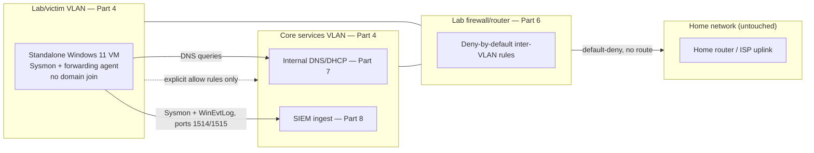

# Part 10 — Windows Endpoints and Sysmon Deployment

## Why this part exists

Part 9 built Linux endpoints because that's what the author's real lab actually runs. Most public detection content, most EDR vendor documentation, and most of Detection Engineering Handbook V2's own Windows-focused material (its Parts 8–9) assume Sysmon and Windows Event Log telemetry exists somewhere. A SOC home lab that never produces that telemetry can't practice against a large share of what the rest of this library teaches. This part closes that gap the honest way: one or more standalone, non-domain-joined Windows virtual machines, Sysmon deployed with a real configuration instead of the near-useless default, and both Sysmon and Windows Event Log forwarded into the SIEM Part 8 built.

"Standalone" is the operative word. This part does not build an Active Directory domain, a domain controller, or any GPO-driven rollout — Part 11 explains exactly why, using the author's own abandoned attempt at that build as the case study. What you get here is real, useful, and honestly scoped: process-creation, network-connection, and file-creation telemetry from a single Windows host, plus the Windows security log's own authentication and privilege events in their local (non-domain) form. What you don't get is domain authentication, Kerberos ticketing, or lateral-movement telemetry that depends on a trust boundary — those need a domain, and a domain is Part 11's problem to scope, not this part's problem to fake.

> **Safety Gate**
> The Windows VM (or VMs) this part builds must live entirely inside the isolated lab/victim network segment designed in Part 4 — the same segment, not a look-alike copy of it on a different vSwitch. Before installing anything, confirm the VM's virtual NIC is attached to that segment's VLAN and not to a default or bridged network the hypervisor may have offered during VM creation; a single mis-attached NIC gives this Windows host a direct path to your home network, which defeats every isolation control built in Parts 4 and 6. Verify the attachment in the hypervisor's own NIC settings, not just by checking the IP address Windows reports — a host can show a lab-segment IP and still be bridged if the underlying vSwitch port group is wrong.

## 1. Scope: what this build is, and what it deliberately isn't

**[CONCEPT]** A standalone Windows endpoint is a Windows VM that boots, runs, and authenticates entirely on its own — a local administrator account, no domain controller to check in with, no Group Policy pushed from anywhere. That's a real limitation compared to almost every production Windows environment a reader will eventually work in, and it's worth naming plainly rather than glossing over: this build teaches Sysmon and Windows Event Log fundamentals, not domain-authentication detection content. Detection Engineering Handbook V2's Parts 8–9 cover how to read the telemetry this part produces; nothing in those parts requires a domain to be meaningful, since process creation, network connections, and file writes happen identically whether or not a host is domain-joined.

> **Build Autopsy — the abandoned Windows/AD forensics lab**
>
> **The plan:** Stand up a persistent two-DC Active Directory forest with several domain-joined Windows endpoints, generating realistic domain-authentication and Kerberos telemetry for detection practice.
>
> **Why it seemed reasonable:** A domain lab looked like the obvious next step after a standalone Windows host, and free evaluation-licensed Server ISOs made the software cost zero.
>
> **How it failed:** Domain controller promotion, a GPO-driven Sysmon and audit-policy rollout, and keeping two rotating evaluation licenses alive turned into ongoing maintenance the rest of the lab (the honeynet, the vulnerability scanner) never demanded. The build stalled at a half-configured single DC and was never finished.
>
> **The fix:** No fix was completed, and this part doesn't pretend otherwise. This book teaches the standalone host you're reading about right now, and documents the domain build's real cost honestly in Part 11 instead of walking through a lab that doesn't exist.

## 2. Sizing the Windows guest: licensing options and resource cost

**[COST/RESOURCE]** A Windows VM costs more than any single Linux endpoint from Part 9, in every dimension that matters for a home lab: disk, RAM, and licensing complexity. The table below compares the realistic options for a lab guest OS; it supports the decision of which image to actually download before spinning up a VM.

| Option | License cost | Real lifespan | Typical idle RAM | Notes |
|---|---|---|---|---|
| Windows 11 Enterprise Evaluation | Free (Microsoft Evaluation Center) | 90 days, extendable with `slmgr /rearm` (commonly three resets before reinstall is required) | 2–3GB | Closest to a real managed endpoint; plan for a periodic rearm or reinstall cycle |
| Windows Server 2022/2025 Evaluation, used as a workstation | Free (Microsoft Evaluation Center) | 180 days, also rearm-extendable | 2GB | Server-role defaults and Event Log noise differ from a real workstation — skip this unless you specifically want server telemetry |
| Retail Windows 10/11 (a license you already hold, not reused from an active machine) | Cost of the license, often $0 if idle | Indefinite | 2–3GB | No expiry to manage, but don't reuse a key that's activating a production machine |
| Windows on ARM or other non-x86 builds | Varies | Varies | Varies | Avoid — Sysmon and guest-driver compatibility on non-x86 hosts is inconsistent enough to cost more lab time than it saves |

> **Resource Reality**
> Budget 4GB of RAM and 80GB of thin-provisioned disk as the practical floor for one Windows 11 Enterprise Evaluation VM doing real Sysmon-plus-agent work, not the 4GB/64GB Microsoft lists as the bare installer minimum — the installer minimum assumes an idle desktop, not a host also running a forwarding agent and generating test telemetry on demand. On a hypervisor host already running the SIEM from Part 8 and a couple of Linux endpoints from Part 9, this is usually the single biggest RAM line item in the whole lab; check the tier budget from Part 3 before adding a second Windows host.

> **What Would Change My Mind**
> This part recommends evaluation media over retail Windows for a first Windows lab endpoint, on the grounds that eval images can be freely rearmed for a fixed lab lifecycle without spending a license slot. If you already hold a retail Windows 10 or 11 license sitting completely idle — not activating any other machine — that changes the calculus, and retail is the simpler choice for you specifically: no rearm cycle to track, no eventual reinstall.

## 3. Provisioning the standalone Windows VM

### 3.1 Choosing and downloading an eval image

**[SETUP]** These steps target the Windows 11 Enterprise Evaluation ISO from Microsoft's Evaluation Center, current as of this writing.

1. Go to the Microsoft Evaluation Center and select the Windows 11 Enterprise evaluation download.
2. Choose the 64-bit ISO — Sysmon and every forwarding agent this part uses assumes 64-bit.
3. Verify the downloaded ISO's checksum against the value Microsoft's download page lists, before mounting it anywhere.
4. Copy the ISO to wherever your hypervisor (Part 5) expects installation media — a Proxmox ISO storage volume, a Hyper-V media folder, or equivalent.

Confirm the download worked by checking the ISO's file size against the value Microsoft's download page lists; a truncated download is the single most common cause of an installer that hangs partway through Windows Setup.

### 3.2 Building the VM inside the lab segment

**[SAFETY]** The choice that matters most in this step: the VM's virtual NIC must be attached to the lab/victim VLAN from Part 4, not any default network the VM-creation wizard offers.

**[SETUP]** Create the VM per your hypervisor's normal workflow from Part 5, with these lab-specific choices: at least 4GB of RAM (8GB if the host has headroom) and a 60–80GB thin-provisioned virtual disk. Boot from the ISO and run through Windows Setup normally.

Figure 10.1 sketches where this VM sits relative to the firewall, internal DNS, and SIEM built in earlier parts, so the network attachment step above has a concrete picture behind it rather than an abstract instruction.





**Figure 10.1 — Standalone Windows endpoint inside the lab network segment.** *CONCEPTUAL.* Illustrates where the Part 10 Windows host sits relative to the firewall, internal DNS, and SIEM built in Parts 4, 6, 7, and 8. This is an architecture sketch showing the intended topology, not a capture from a running build — see Figure 6.2 (Part 6) for the same segmentation model after a real firewall build.

> **Engineering Reality**
> Hypervisor documentation implies attaching a NIC to a VLAN is the whole story; in practice, a VM using a paravirtualized NIC driver (VirtIO on Proxmox/KVM, or the Hyper-V synthetic adapter without integration services installed) boots with no working network at all until the matching guest driver package is installed inside Windows. If the VM shows no IP address after setup completes, install the hypervisor's guest-tools package first — don't assume the VLAN attachment is wrong before ruling this out.

### 3.3 First boot and local-account setup

**[SETUP]** During Windows Setup's out-of-box experience, choose "Domain join instead" (or the equivalent option to skip a Microsoft account) and create a local administrator account. Do this even though a fresh VM has no domain to join yet — the option matters because skipping it correctly is what keeps this host standalone by default rather than by later remediation. Set a strong local password; this VM sits on an isolated segment, but "isolated" is not the same as "fine with a weak password," since anything else that later joins the same segment (Part 15's honeynet explicitly does not belong here, but a future exercise host might) inherits whatever habits this VM sets.

> **Lab Note**
> Take a hypervisor snapshot immediately after this first boot, before installing Sysmon or any forwarding agent. Every misconfigured Sysmon rule or bad agent enrollment in the rest of this part is then a two-minute snapshot revert instead of a 20-minute reinstall — take it now, before you're tempted to skip it because the install "went fine."

## 4. Baseline hygiene: time, DNS, and update egress

**[SAFETY]** Point the Windows VM's DNS at the internal resolver built in Part 7 rather than a public resolver — this keeps the endpoint from depending on anything outside the lab segment to resolve names, and keeps lab DNS queries visible in the query log Part 7 already set up.

**[SETUP]** Set Windows Time to sync against a source reachable inside the lab (Part 7's host, if it also serves NTP) or through the one controlled egress path described below; skip this and forwarded events risk arriving with a timestamp meaningfully off from the SIEM's own clock.

**[SAFETY]** Windows Update needs some form of outbound HTTPS access to Microsoft's update endpoints to patch a long-lived lab host, and "some form of outbound access" is exactly the kind of blanket statement Part 4 exists to prevent. Add one explicit, narrow allow rule at the lab firewall (Part 6) for outbound HTTPS from this VM's specific IP, and leave everything else on default-deny egress. Don't widen that rule to "allow all outbound" for convenience — a single narrow allow rule is easy to audit later; a broad one quietly becomes the path something else uses.

## 5. Installing and configuring Sysmon

### 5.1 Installing the Sysmon service

**[CONCEPT]** Sysmon (System Monitor) is a free Microsoft Sysinternals tool that installs as a Windows service and driver, logging process creation, network connections, file creation, and several dozen other event types to a dedicated Windows Event Log channel. A default Sysmon install with no configuration file logs almost nothing useful — process creation with a thin field set and no filtering logic, which is why the next step matters more than the install itself.

**[SETUP]** This targets Sysmon v15.x (Sysinternals, current as of this writing) on Windows 11. Run the following from an elevated PowerShell prompt after copying the Sysmon binary and a config file to the endpoint:

```powershell
.\Sysmon64.exe -accepteula -i C:\ProgramData\sysmon\sysmon-config.xml
```

Confirm it worked by running `Get-Service sysmon64` and checking for a `Running` status, then opening Event Viewer to `Applications and Services Logs > Microsoft-Windows-Sysmon/Operational` and confirming new entries appear as you use the machine.

### 5.2 Applying a real configuration baseline

**[SETUP]** Don't write a Sysmon configuration from scratch for a first build. Adapt one of the maintained public baselines — SwiftOnSecurity's `sysmon-config` and Olaf Hartong's `sysmon-modular` are the two most widely used starting points — and trim it to what your lab's hardware can log without flooding disk. Appendix A3 hosts this book's own trimmed baseline, built from those community sources, for exactly this purpose rather than repeating a full config inline in every part that needs one. Appendix A3 is not yet authored (see `README.md`); until it is, adapt one of the two community baselines above directly.

CONCEPTUAL SAMPLE — an illustrative excerpt only, not a complete or build-tested configuration; adapt a maintained public baseline instead of typing one from scratch.
```xml
<Sysmon schemaversion="4.90">
  <EventFiltering>
    <ProcessCreate onmatch="exclude">
      <!-- excluded — this fires on every service-hosted process and adds volume
           with little detection value on a single-host lab -->
      <Image condition="end with">svchost.exe</Image>
    </ProcessCreate>
    <NetworkConnect onmatch="include">
      <DestinationPort condition="is">3389</DestinationPort>
    </NetworkConnect>
  </EventFiltering>
</Sysmon>
```

After applying any config change, confirm it took effect by running `Sysmon64.exe -c` with no other arguments, which prints the currently loaded configuration back to the console.

## 6. Forwarding Windows Event Log and Sysmon telemetry to the SIEM

**[SETUP]** Part 8 left the choice of SIEM platform open between Wazuh, the Elastic stack, and Graylog. The forwarding mechanism differs by choice:

- **Wazuh** — install the Windows agent MSI and point it at the manager's lab IP during a silent install.
- **Elastic stack** — install Winlogbeat, configured to ship both the standard Windows Event Log channels and the `Microsoft-Windows-Sysmon/Operational` channel.
- **Graylog** — use the Graylog Sidecar with a Winlogbeat or NXLog backend, which Graylog's own documentation configures similarly to the Elastic case above.

The Wazuh path is shown here as the worked example, since it needs the fewest moving parts for a first build. Run this from an elevated PowerShell prompt on the Windows endpoint, targeting a Wazuh 4.x manager already reachable on the lab segment:

```powershell
msiexec.exe /i wazuh-agent.msi /q WAZUH_MANAGER="10.10.10.5" WAZUH_AGENT_GROUP="windows-endpoints"
```

The agent connects to the manager on port 1514 for ongoing event traffic and port 1515 for one-time enrollment; both need an explicit allow rule at the lab firewall if Part 6's rule set doesn't already have one for SIEM ingest. Confirm the agent enrolled by checking the Wazuh manager's dashboard for this host in an `Active` state, or by running `Get-Service -Name WazuhSvc` locally and confirming it's running.

## 7. Validating the pipeline end to end

**[HANDS-ON LAB]** Generate one known event on the endpoint and confirm it arrives at the SIEM before treating the pipeline as working.

> **Validation Test**
> **Setup:** Sysmon installed with the Appendix A3 baseline (not yet authored — see `README.md`; substitute an adapted SwiftOnSecurity/`sysmon-modular` config per §5.2 until it exists), the Wazuh agent (or Winlogbeat/Sidecar equivalent) enrolled and running, both confirmed per the previous two sections.
> **Action:** `powershell -Command "Start-Process cmd.exe -ArgumentList '/c whoami'"` on the Windows endpoint.
> **Expected result:** A Sysmon Event ID 1 (Process Create) entry appears in the SIEM within seconds, showing `ParentImage` = the PowerShell process and `Image` pointing to `cmd.exe`, followed immediately by a second Event ID 1 entry for `whoami.exe` with `cmd.exe` as its parent.

If nothing arrives within a minute or two, work through the troubleshooting section below before assuming the exercise itself is broken.

## 8. Troubleshooting the most common forwarding failures

**[TROUBLESHOOTING]** Three failure modes account for most "nothing showed up" reports on a first Windows endpoint build:

- **Sysmon logs locally but nothing forwards.** Check the forwarding agent's own service status first (`Get-Service WazuhSvc` or the Winlogbeat equivalent) — Sysmon working correctly says nothing about whether the agent is running at all.
- **The agent shows connected but events don't appear in search.** Check clock skew with `w32tm /query /status`. A Windows host whose clock has drifted more than a few minutes from the SIEM's own time can have its events silently misordered or filtered by time-range queries that assume roughly synchronized clocks.
- **Enrollment fails outright, agent never reaches Active.** Confirm the firewall rule from Part 6 actually allows ports 1514 and 1515 from this VM's specific IP — a rule scoped to the wrong subnet after a VLAN renumbering is the most common cause, and it fails silently with no error on the Windows side beyond a generic connection timeout in the agent's own log.

## 9. Local hardening that still matters inside an isolated segment

**[SAFETY]** Isolation upstream doesn't excuse a wide-open host downstream — anything else that ever shares this segment (a future exercise VM, an Atomic Red Team runner in Part 18) inherits whatever attack surface this host leaves open.

**[SETUP]** On the standalone Windows endpoint:

1. Confirm the built-in Guest account is disabled (it is by default on modern Windows, but verify with `net user guest`).
2. Disable SMBv1 if it's present: `Disable-WindowsOptionalFeature -Online -FeatureName SMB1Protocol`.
3. Leave Remote Desktop disabled unless a specific exercise needs it, and if you do enable it temporarily, restrict it to the management VLAN in the Part 6 firewall rules, not the whole lab segment.
4. Turn on PowerShell Script Block Logging via the `EnableScriptBlockLogging` registry value under `HKLM:\Software\Policies\Microsoft\Windows\PowerShell\ScriptBlockLogging`, so Event ID 4104 entries are available once Detection Engineering Handbook V2's PowerShell-focused content needs them.

## 10. What a standalone host can't teach you

**[CONCEPT]** Naming the gap here matters more than papering over it.

> **Blind Spot**
> A standalone Windows host has no domain to authenticate against, so it can never generate Kerberos ticket-granting events (Event IDs 4768 and 4769), domain-scoped logon events with a real domain in the `TargetDomainName` field, or any telemetry that depends on a trust boundary between hosts — because there is no trust boundary here, only one machine. Group Policy–driven configuration rollout, DCSync-style detection content, and lateral-movement telemetry between domain-joined peers are all out of reach on this build specifically. Part 11 names the real cost of closing that gap rather than pretending this part already closed it.

## 11. From telemetry to detection, response, and practice: where this build feeds the rest of the library

**[CONCEPT]** This part's job stops at "Sysmon and Windows Event Log events are searchable in the SIEM." What a reader does with them next is explicitly other volumes' territory, and the point of building this pipeline at all is to feed them:

- **Detection Engineering Handbook V2, Parts 8–9** cover how to actually read Sysmon Event ID 1 (Process Create), Sysmon Event ID 3 (Network Connect), and Sysmon Event ID 11 (FileCreate), plus core Windows security events like Event ID 4624 (An account was successfully logged on) and 4625 (An account failed to log on), against this exact telemetry shape. Parts 22–33 of that same book cover building correlation logic, baselining, and threat-intel enrichment on top of it — this part produces the raw material those parts assume already exists.
- **SOC Playbook Handbook's Playbook Library** owns what to actually do once an alert fires from this telemetry — this part builds the pipe, not the response procedure at the other end of it.
- **SOC Manager's Operating Handbook, Part 8** (assessment design) and **Part 11** (onboarding/ramp-up) use a working endpoint-telemetry pipeline like this one as the substrate for a structured, repeatable practice drill for a team, rather than a solo exercise.
- **Within this book**, Part 18's Atomic Red Team–style attack simulation and Part 19's purple-team drills both assume an endpoint that already forwards clean Sysmon telemetry — this part is a direct prerequisite for generating known-cause events to validate detections against, not a parallel, unrelated exercise.

## 12. Build checklist

**[SETUP]** The table below recaps this part's steps as a pre-flight checklist — run through it before calling the build done, especially before handing this host off to an exercise in Part 18 or 19.

| Item | Why it matters | Verify by |
|---|---|---|
| VM attached only to the lab/victim VLAN (Part 4) | A bridged or mis-tagged NIC defeats every isolation control built so far | Hypervisor's NIC/vSwitch setting, not just the VM's reported IP |
| No domain join, local admin account only | Domain-authentication telemetry is Part 11's scope, not this part's | `systeminfo` reports `Workgroup`, not a domain name |
| Sysmon installed with a real config, not the default | A default, unconfigured Sysmon logs almost nothing filterable | `Get-Service sysmon64` shows `Running`; `Sysmon64.exe -c` prints the intended config |
| Time synced to an in-lab or explicitly allowed source | Clock skew beyond a few minutes causes the SIEM to misorder or drop events | `w32tm /query /status` shows a small, recent offset |
| Forwarding agent installed and enrolled with the Part 8 SIEM | Local-only logging teaches you nothing at the SIEM layer | New events visible in SIEM search within seconds of generating one |
| Egress restricted to DNS plus one allowed update path | An unrestricted Windows VM is the isolation failure this book exists to prevent | Part 6's firewall rule table shows explicit allow rules only, default-deny below them |
| Clean-install snapshot taken before any config change | A broken config is a snapshot revert, not a reinstall | Snapshot exists, dated before the first Sysmon/agent change |

**Cross-references:** Part 4 (network isolation this part's Safety Gate depends on), Part 6 (firewall rules gating SIEM ingest and update egress), Part 7 (internal DNS/time this endpoint uses), Part 8 (the SIEM this telemetry forwards to), Part 9 (the Linux-endpoint parallel build), Part 11 (the Windows domain-lab honesty chapter this part's scope defers to), Part 18–19 (attack-simulation and purple-team drills that consume this telemetry), Appendix A3 (Sysmon config-as-code baseline), Appendix A4 (safety pre-flight checklist referenced by Parts 15/18/19); Detection Engineering Handbook V2 Parts 8–9 and 22–33; SOC Playbook Handbook's Playbook Library; SOC Manager's Operating Handbook Parts 8 and 11.
