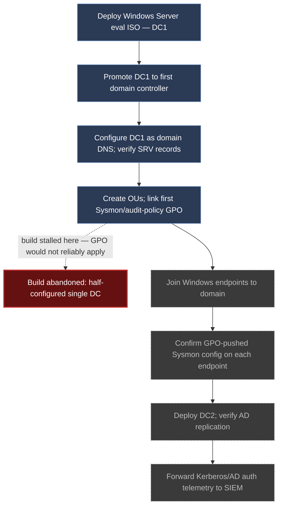

# Part 11 — The Windows Domain Lab Problem: Scope, Cost, and an Honest Failure

## Why this part exists

Part 10 built one or more standalone Windows hosts — Sysmon deployed, Windows Event Log forwarding into the SIEM, no domain anywhere in sight. That scope decision wasn't an oversight. A full Active Directory forest is the natural next step a reader reaches for after a standalone host works, and this part exists to tell you honestly what that next step actually costs before you spend a weekend finding out yourself.

The author tried it. It didn't finish. This part is that build's autopsy, not a walkthrough dressed up to look like one. `BOOK-INDEX.md` and the author's own `LAB-EVIDENCE-MANIFEST.md` are explicit that the real, running home lab is Linux-and-network only — no domain controller, no GPO, no Kerberos telemetry captured anywhere in it. Every Windows/AD claim below is either `CONCEPTUAL` (a diagram of what was planned) or `OFFICIAL REFERENCE` (Microsoft's own published requirements and licensing terms) — never `REAL LAB EXAMPLE` or `CONTROLLED LAB EXAMPLE`, because no domain build here was ever run to completion. Part 9's auditd deployment gets to cite real captured evidence from CT100 and CT104; this part doesn't get that luxury, and it says so instead of faking it.

What you get instead: a specific breakdown of why a domain lab is a materially different undertaking than a standalone host, a Build Autopsy of the attempt that stalled, and a realistic scoped-down path that doesn't require you to become an unpaid part-time AD administrator just to generate Kerberos telemetry once.

> **Safety Gate**
> Everything in this part's scoped-down alternative (§8) assumes the same isolated lab segment built in Part 4, verified against the Appendix A4 pre-flight checklist. A domain controller opens listening surface a standalone host doesn't have — LDAP on ports 389 and 636, Kerberos on port 88, SMB on port 445, and DNS on port 53 if it's also the domain's DNS server — and every one of those must be reachable only from inside the lab segment, never from your home network or the open internet. If you build even a short-lived eval-image domain controller, run the Appendix A4 checklist before you join the first endpoint to it, not just before its first boot. A domain controller with default GPO password policy and no LAPS is a realistic Kerberoasting target on purpose (Part 18 uses it that way) — which means an exposed one is a realistic Kerberoasting target for someone who isn't you.

## 1. What "a Windows domain lab" actually requires

**[CONCEPT]** A standalone Windows host, as built in Part 10, is one VM: install the OS, install Sysmon, point its Windows Event Forwarding or a Wazuh/Elastic agent at the SIEM, done. A domain adds an entirely different category of moving parts on top of that, not just more of the same:

- **A domain controller (DC)** running Active Directory Domain Services (AD DS), which is also usually your domain's DNS server — a second service with its own failure modes layered onto the first.
- **A second DC**, if you want the forest to survive one box rebooting for patching without the whole domain going dark — which is the realistic baseline for anything you'd call "resilient," not a nice-to-have.
- **Organizational Units (OUs) and Group Policy Objects (GPOs)** to push configuration — including the Sysmon and audit-policy baseline this book cares about — to every domain-joined endpoint centrally, instead of touching each host by hand.
- **Domain-joined endpoints**, which now authenticate via Kerberos instead of local logon, producing an entirely different telemetry shape (ticket requests, not just local logon events) that Detection Engineering Handbook V2's Part 13 is the one that teaches you to read.
- **A licensing/evaluation-image lifecycle** for every Windows Server instance involved, since a hobbyist lab isn't buying retail Windows Server licenses for boxes that exist to get torn down and rebuilt.

A single forest also carries its own internal versioning concept — the forest and domain functional level, which gates which AD DS features are available and which older domain-controller OS versions could theoretically still join. A single-DC lab never has to think about functional-level mismatches, because there's nothing else in the forest to disagree with; a two-DC forest built from two different eval ISO builds can, in principle, hit a mismatch the moment the second DC tries to join, which is one more pre-flight check a standalone host never asks of you.

None of these five items exists in isolation — DC promotion assumes working DNS, GPO rollout assumes DC replication is healthy, and the eval-license clock is running on every server in the forest independently. That's the shape of the problem: not one hard step, but five moving parts whose failure modes compound.

## 2. Build Autopsy: what was attempted and how it stalled

**[CONCEPT]** The plan going in looked reasonable on paper. Here's what was actually tried, and where it stopped.

> **Build Autopsy — the abandoned Windows/AD forensics lab**
>
> **The plan:** Stand up a persistent two-DC Active Directory forest with several domain-joined Windows endpoints, generating realistic AD authentication and Kerberos telemetry for detection practice.
>
> **Why it seemed reasonable:** A domain lab is the natural next step after standalone Windows hosts, and eval-licensed Server ISOs make the software cost zero. The author's other lab components — a Proxmox hypervisor, a honeynet, several monitored Linux containers — were all running comfortably on the same hardware tier, so a domain forest looked like an incremental addition rather than a new category of work.
>
> **How it failed:** DC promotion, GPO-driven Sysmon/audit-policy rollout, and keeping two eval licenses alive on a rotating basis turned out to demand a level of ongoing maintenance the author's other running lab components didn't need. GPO changes took a replication cycle to show up or silently didn't apply because of OU-linking or WMI-filter mistakes that gave no error message anywhere — just an endpoint that quietly kept its old audit policy. Diagnosing that ate hours that a Linux `auditd` rule edit (Part 9) never demanded, because that config takes effect the moment the file is reloaded and says so in the log if it doesn't. The build stalled at a half-configured single DC — DNS integration working, GPO rollout to endpoints not — and was never finished.
>
> **The fix:** No fix was completed. This book teaches standalone, non-domain-joined Windows hosts (Part 10) and documents the domain build's real cost honestly here instead of presenting a walkthrough of a lab that doesn't exist.

> **Lab Note**
> If you're tempted to try this yourself: snapshot the VM immediately after DC promotion succeeds and before you touch a single GPO. GPO troubleshooting is where this build burns hours, and a bad GPO link or WMI filter can leave a domain in a state that's faster to revert from a snapshot than to diagnose by reading replication logs at 11pm.

## 3. The five-way cost stack: domain lab vs. standalone hosts

**[COST/RESOURCE]** The table below compares what Part 10's standalone-host build actually costs against what each additional domain component adds, so the decision in §8 has real numbers behind it instead of a vague "it's harder."

| Cost dimension | Standalone host (Part 10) | Domain lab addition |
|---|---|---|
| Setup time, first pass | 1–2 hours (install OS, deploy Sysmon config) | 4–8 hours minimum for DC promotion, DNS integration, and a first GPO that actually applies |
| Ongoing maintenance | Near zero — patch occasionally, config doesn't drift on its own | Recurring — eval rearm cycles, GPO drift diagnosis, replication health checks on every reboot |
| Licensing lifecycle | None (client eval or existing license, no rearm clock) | Windows Server eval ISO's 180-day clock per DC, renewable a limited number of times (§4) |
| Failure visibility | High — Sysmon either loads its config or logs why it didn't | Low — a GPO that fails to apply typically produces no error, just silently stale policy |
| Resource floor | 2–4GB RAM, 1–2 vCPU per host | Adds 2GB RAM minimum per DC, plus DNS service overhead, before any endpoint joins |

**[CONCEPT]** The row that matters most for a single-operator hobbyist lab is failure visibility, not raw resource cost. An `auditd` rule that's wrong tells you immediately — it either loads or `auditctl -l` shows nothing changed. A GPO that's wrong tells you nothing; the endpoint just keeps behaving like the policy was never pushed, and you find out only by manually checking the setting on the endpoint itself. That asymmetry is most of why the Build Autopsy in §2 burned the hours it did.

## 4. Licensing and the evaluation-image lifecycle

**[CONCEPT]** Windows Server evaluation ISOs are free to download directly from Microsoft and legitimately usable in a lab, but they carry a 180-day evaluation timer per installed instance. Microsoft's own documentation (`OFFICIAL REFERENCE` — see `REFERENCES.md` entry for the Windows Server evaluation licensing terms) states the timer can be extended with `slmgr /rearm`, up to a small fixed number of times, after which the installation either shuts down periodically or requires conversion to a licensed retail/volume edition to keep running.

**[TROUBLESHOOTING]** The specific trap: `slmgr /rearm` resets the evaluation clock, but it does not reset a domain controller's own internal state — AD DS doesn't care about the Windows license timer, but a DC that shuts itself into a notification/reduced-functionality state mid-cycle because a rearm was missed can leave the rest of the forest unable to authenticate against it until it's manually recovered. On a two-DC forest, that means tracking two independent rearm clocks on a recurring calendar reminder, not a one-time setup step — exactly the "rotating basis" maintenance burden named in the Build Autopsy above.

> **Engineering Reality**
> Microsoft's evaluation-license documentation describes the rearm process as a simple maintenance command; in practice, a rearm you forget to run before the 180-day window closes on a domain controller (as opposed to a standalone eval host) doesn't just stop that one machine — it can put every domain-joined endpoint's authentication into a degraded state until the DC is recovered, since Kerberos ticket issuance depends on the DC being fully functional. A standalone Windows host missing its rearm window just stops working on its own; a DC missing its rearm window takes dependents down with it.

**[TROUBLESHOOTING]** The obvious workaround — snapshot the DC before the eval clock runs out, then roll back to "buy more time" — is specifically the wrong move on a domain controller, and Microsoft's own AD DS documentation warns against it directly (`OFFICIAL REFERENCE`). Restoring a DC from a snapshot taken before other domain controllers or objects changed can trigger a USN rollback: the restored DC's replication counter no longer matches what its replication partners believe already happened, and AD DS defends against the resulting inconsistency by disabling that DC's outbound replication rather than silently corrupting the directory. On a lab forest, the practical symptom is a DC that looks like it booted fine but stops replicating anything, with the fix (reformat and re-promote, or use a hypervisor's AD DS-aware snapshot integration if it has one) costing more time than the rearm you were trying to avoid. Snapshot endpoints freely; treat DC snapshots as a one-way "before I do something destructive" safety net, not a routine undo button.

## 5. GPO-driven rollout: why central policy multiplies maintenance

**[CONCEPT]** Part 10 deploys Sysmon by copying a config file to each host and running one installer command per machine — tedious at scale, but each step either visibly succeeds or visibly fails on the spot. A domain's Group Policy model exists specifically to avoid that per-host repetition: link a GPO with the Sysmon config and audit-policy settings to the OU containing your endpoints, and every joined machine picks it up on its next policy refresh cycle without you touching it directly.

The problem is exactly the failure-visibility gap already named in §3. GPO application depends on a chain of conditions — the GPO must be linked to the right OU, not blocked by an inheritance-blocking setting further down the tree, not excluded by a WMI filter or security filtering on the GPO itself, and the endpoint must actually complete a policy refresh cycle (`gpupdate /force` if you don't want to wait for the default interval). Get any one of those wrong and the observable symptom is identical to a correctly-applied GPO that just hasn't propagated yet: nothing happens, no error, no log entry pointing at the actual cause. Diagnosing which of those four or five possible causes is the real one is where the Build Autopsy's hours went, and it's a genuinely different skill than debugging a local config file.

> **Blind Spot**
> A standalone Windows host (Part 10), however well-configured, cannot produce domain-authentication telemetry — no Kerberos ticket requests (Event IDs 4768 and 4769), no cross-host lateral-movement signal that depends on shared domain credentials, no GPO-driven policy-compliance drift to detect. If your goal is specifically to see and interpret that class of telemetry, no amount of additional standalone-host tuning gets you there; you need at least the scoped-down domain exercise in §8, because the gap is architectural, not a configuration depth problem.

## 6. Resource Reality: the floor for a persistent multi-DC forest

**[COST/RESOURCE]**

> **Resource Reality**
> Microsoft's published minimum for a Windows Server installation is 2GB of RAM and 2 vCPUs per instance (`OFFICIAL REFERENCE`, Windows Server system requirements) — treat that as a floor for "boots," not "usable." A two-DC forest alone commits 4–6GB of RAM and 4 vCPUs before a single endpoint joins, once you budget realistic headroom above the bare minimum for AD DS and DNS running together on each box. Add two domain-joined Windows 10/11 endpoints at Part 3's own 2–4GB-each tier and the persistent forest's baseline footprint lands at 10–14GB of RAM and 8+ vCPUs sitting idle, before this book's SIEM (Part 8, 8GB alone) or NSM sensors (Parts 13–14) get a share of the same host. On the mid-tier hardware budget from Part 3, that's the point where a domain forest stops being "one more VM" and starts being the majority of the box's committed memory — for a component whose telemetry payoff, measured in distinct detection content it unlocks over the standalone-host baseline, is narrower than its resource share suggests.

## 7. Topology: what was planned versus where the build actually stopped

**[CONCEPT]** The diagram below is a planning sketch, not a captured topology — no part of the two-DC forest in this diagram was ever fully built. It exists to show precisely where the Build Autopsy's build stopped relative to what a finished forest would have looked like, so the gap is visible rather than described only in prose.

**Figure 11.1 — Planned two-DC domain build versus where it actually stopped.** *CONCEPTUAL.* Illustrates the sequence a persistent multi-DC forest build requires (DC promotion through Kerberos telemetry reaching the SIEM) against the point the author's own attempt actually reached before stalling. Solid-filled nodes were completed; dashed nodes (endpoint join, GPO confirmation, second DC, telemetry forwarding) were never reached. No captured screenshot accompanies this diagram — see §9.1 of `STYLE-GUIDE.md`: an AD-domain screenshot for this part is a documented non-goal, not a pending capture.

## 8. The realistic scoped-down alternative

**[CONCEPT]** A persistent multi-DC forest is not the only way to get domain-authentication telemetry, and for a single-operator hobbyist lab it's usually the wrong default given §3's maintenance asymmetry. Two narrower paths get most of the teaching value at a fraction of the ongoing cost.

**[SETUP]** **Option A — stay with standalone hosts (Part 10's default).** If your goal is Sysmon and Windows Event Log telemetry, process-creation chains, and endpoint-side detection content, a domain buys you nothing extra for that specific goal. Part 10 already covers it, and it's the right stopping point for most readers.

**[SETUP]** **Option B — a short-lived, single-exercise eval-image domain.** The maintenance burden in §3 and §4 only accrues over time a domain lab stays running; a domain that exists for a weekend and gets torn down afterward never hits its first rearm deadline and never accumulates GPO drift, because there's no "later" for either problem to show up in. The exercise itself is four steps:

1. Build exactly one DC and one or two domain-joined endpoints from a fresh eval ISO.
2. Snapshot the whole set once DC promotion and the domain join both succeed.
3. Run one bounded exercise against it — a GPO-driven Sysmon rollout as a learning exercise in its own right, or a Kerberoasting simulation paired with Part 18's attack-simulation content — and capture the telemetry you wanted.
4. Either revert to the snapshot for the next exercise or delete the VMs outright.

**[SAFETY]** Whichever option you pick, a domain controller's additional listening surface (LDAP, Kerberos, SMB, DNS — restated from this part's Safety Gate) must stay inside the Part 4 isolated segment for the entire time it exists, including the short-lived Option B build — "it's only up for a weekend" is not an isolation control.

The table below compares all three paths side by side for the decision this section is actually asking you to make.

| Path | Setup effort | Ongoing maintenance | Licensing risk | Telemetry realism | Recommended for |
|---|---|---|---|---|---|
| Standalone hosts only (Part 10) | Low — 1–2 hours per host | Near zero | None | No domain-auth telemetry at all | Most readers; sufficient for Sysmon/endpoint detection content |
| Short-lived eval-image domain (Option B) | Moderate — 4–8 hours per exercise cycle | Low — torn down before rearm/GPO-drift windows matter | Low — never lives long enough to hit the rearm clock | Full Kerberos/AD-auth telemetry for the exercise's duration | Readers who specifically need Kerberos/GPO telemetry for a bounded drill |
| Persistent multi-DC forest | High — see §2's Build Autopsy | High — recurring rearm cycles, GPO drift diagnosis | Moderate — two independent rearm clocks to track indefinitely | Full, continuous domain-auth telemetry | Readers with a specific ongoing need that justifies the maintenance cost — not the default |

> **What Would Change My Mind**
> This part recommends against a persistent multi-DC AD forest for a single-operator hobbyist lab on the grounds of ongoing maintenance cost. If a reader reports running one comfortably on commodity hardware for six-plus months with under an hour a month of upkeep, that specific claim — not the general "AD labs are hard" framing — would need revision, and this part would need a documented update rather than silent removal of the caveat.

## 9. What a finished forest would have unlocked

**[CONCEPT]** It's worth being precise about what the abandoned build in §2 would have bought over Option B's short-lived domain, since "more realistic telemetry" is otherwise a vague claim. A persistent forest's main advantage is duration: some domain-attack techniques are more convincing, or only observable at all, against a domain that has accumulated real history — service accounts with stale Kerberos tickets, group memberships that drifted over months, replication metadata old enough to look organic rather than freshly seeded. T1558 (Steal or Forge Kerberos Tickets), the technique Option B's Kerberoasting exercise (paired with Part 18) targets, works identically well against a one-weekend domain, because it only needs a service account with a Kerberos service principal name — it doesn't care how old the forest is. T1003.006 (OS Credential Dumping: DCSync), by contrast, is more convincing to practice against a forest with real replication history and more than one DC actually exchanging updates, which Option B's single-DC build never has and the abandoned two-DC forest was specifically trying to reach.

That's the honest trade: a persistent multi-DC forest buys you a small number of techniques that specifically depend on multi-DC replication or long-lived directory state, at the ongoing maintenance cost documented in §3 and §4. For the much larger set of domain-authentication and Kerberos-ticket telemetry that Detection Engineering Handbook V2's Part 13 teaches you to read, Option B's short-lived build produces functionally identical log entries.

## 10. Where this telemetry goes: handing off to the other three books

**[CONCEPT]** Whichever path from §8 you take, once domain-authentication telemetry exists in your SIEM, this book's job is done — reading it, hunting in it, and responding to it belongs to the other three NESHBOY volumes, not here:

- **Detection Engineering Handbook V2, Part 13** owns interpreting the telemetry itself — what a Kerberos ticket-granting-service request (Event ID 4769) with an unusual encryption type means, what a DCSync-pattern replication request looks like in the logs, and the detection logic built on top of it. Part 11 is barred from re-explaining that content (per `BOOK-INDEX.md` provenance item 8) precisely so it has one owner instead of two slightly different versions.
- **Detection Engineering Handbook V2, Parts 8–9** cover the Windows Event ID and Sysmon interpretation fundamentals that apply whether or not the host is domain-joined — read those first if Part 10 was your only stop.
- **SOC Playbook Handbook's Playbook Library** owns what to actually do when a domain-authentication alert fires — triage steps for a suspicious ticket-request pattern or an unexpected privileged-group change, once Detection Engineering Handbook V2's logic has flagged it.
- **SOC Manager's Operating Handbook, Part 8 (assessment design)** is where a short-lived Option B exercise (§8) becomes a repeatable team drill rather than a one-off personal experiment — the same bounded-domain-plus-teardown pattern scales to "run this exercise with two analysts and compare their Kerberoasting-detection triage time."
- **SOC Manager's Operating Handbook, Part 20 (Building & Defending the SOC Budget)** is worth reading alongside §3's cost table if you're making the case, inside a real organization, for why a lab environment's maintenance cost is a legitimate budget line and not just "spin up another VM" — the asymmetry this part documents at hobbyist scale is the same asymmetry that shows up in enterprise AD-lab budgeting, just with more zeros.

Part 11 itself produces no telemetry of its own — it's the honesty layer sitting between "here's what a standalone host teaches you" (Part 10) and "here's what a domain adds and what it actually costs to get there" (this part), so that whichever path a reader takes out of §8, they took it with real numbers instead of a vendor quick-start's implied "it's basically the same amount of work."

---

**Cross-references:** Part 3 (hardware/resource tiers cited in §6), Part 4 and Appendix A4 (isolation controls required by this part's Safety Gate), Part 9 (contrast case — real, build-tested Linux telemetry with no domain-equivalent maintenance burden), Part 10 (the standalone-host baseline this part explains why it stopped short of extending), Part 18 (attack-simulation pairing for the short-lived eval-domain exercise in §8), `deh:part8`, `deh:part9`, `deh:part13` (Windows/Sysmon and Kerberos/AD detection-logic content this part explicitly defers), `soc-playbook:playbook-library` (triage procedures for domain-authentication alerts), `manager:part08`, `manager:part20` (drill design and budget framing for a domain exercise run inside a real organization).
