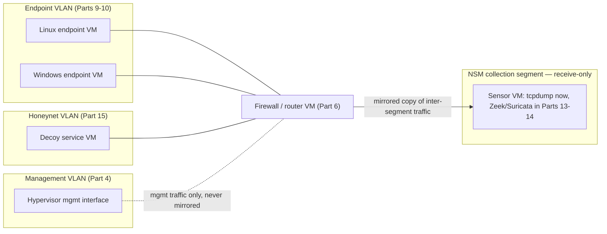

# Part 12 — Packet Capture and Traffic Visibility Fundamentals

## Why this part exists

Everything in Section D of this book — Zeek in Part 13, Suricata in Part 14 — assumes packets are already arriving at a place those tools can read them. That assumption is the part most home-lab builders skip past, and it's the reason a first Zeek or Suricata install so often "runs" and produces nothing: the tool isn't broken, it's watching an interface that never sees the traffic in question. A virtual switch, like a physical switched network, doesn't broadcast every frame to every port the way an old Ethernet hub did. If you want a sensor to see traffic between two other VMs, you have to deliberately build a path for a copy of that traffic to reach it. That's the entire subject of this part: mirror and tap mechanics, promiscuous-mode configuration per hypervisor, and where inside the segmentation model from Part 4 a sensor actually belongs.

This part is deliberately conceptual and reference-based rather than a screenshot-driven walkthrough of the author's own running lab. The author's real, running Proxmox environment — cited as REAL LAB EXAMPLE evidence throughout this book and Detection Engineering Handbook V2 — produces host-based telemetry (auditd records, DNS query logs, honeynet session logs) today, not a standing packet-capture sensor. The mechanics below are accurate, documented behavior for each hypervisor named, not a claim that this exact build has been run end to end and captured as evidence. Part 13 and Part 14 are where that gap should close, once a reader (or a future edition) builds the sensor this part describes and runs Zeek or Suricata against it.

> **Safety Gate**
> Everything in this part assumes the segmentation built in Part 4 is already verified end to end via the Appendix A4 pre-flight checklist before you touch any mirror or promiscuous-mode setting. Two failure modes are specific to packet capture and worth naming outright, not folded into a general caution. First, a mirror source scoped too broadly — mirroring a trunk or uplink port instead of only the lab VLAN(s) defined in Part 4 — pulls real home-network packets into a lab capture file that later gets forwarded to a lab SIEM, screenshotted, or shared; confirm exactly which port group or bridge a mirror session reads from before you start it, not after you notice unfamiliar addresses in the output. Second, a sensor VM built with a management vNIC and a promiscuous mirror-destination vNIC becomes an unintended bridge between segments Part 4 built to be separate if IP forwarding is ever enabled on it. The mirror-destination adapter gets no default route, no forwarding capability, and no reason to ever originate traffic — it only listens.

## 1. Why a virtual switch doesn't just show you the traffic

**[CONCEPT]** A hub-based Ethernet segment sent every frame to every port, which is exactly why early intrusion-detection systems could plug into any port and see everything. A switch — physical or virtual — deliberately doesn't do that. It learns which MAC address lives behind which port and forwards unicast traffic only to that port, both to reduce collision domains and, as a side effect, to make casual eavesdropping harder. Every hypervisor's virtual switch (Proxmox's Linux bridge, VMware's vSwitch, VirtualBox's internal/host-only networking, Hyper-V's virtual switch) behaves the same way by default: a VM's vNIC receives only the frames actually addressed to it, plus broadcast and multicast traffic.

That default is correct and desirable for a production network — it's also exactly why installing Zeek on some VM you happen to have spare capacity on and pointing it at that VM's own vNIC produces almost nothing interesting. The VM sees its own traffic. It doesn't see the conversation between your Linux endpoint from Part 9 and your Windows endpoint from Part 10 unless one of them is a party to it. Seeing that conversation requires either putting the sensor in the actual path the traffic already travels (inline) or arranging for a copy of it to be delivered somewhere else (tap or mirror). Section 2 covers which of those two approaches fits a home lab, and Section 3 covers the specific setting, per hypervisor, that makes it happen.

## 2. Capture topologies: tap, mirror, and inline placement

**[CONCEPT]** Three architectural patterns cover essentially every NSM sensor placement, in a home lab or otherwise.

- **Inline** places the sensor directly in the traffic's path — it's a mandatory hop, not a bystander. A firewall running Suricata in IPS mode is inline: traffic must pass through it to reach its destination at all. Inline gives you the option to block, not just observe, at the cost that a crashed or overloaded sensor can take the network path down with it.
- **Tap** is a physical or virtual device that passively copies traffic without being a hop in the path — traditionally a hardware device sitting between two other devices on a cable, splitting the signal. Virtual environments rarely have a true tap device; what they have instead is —
- **Mirror (SPAN)** — a switch feature that copies frames seen on one or more source ports to a separate destination port, without that destination port being part of the traffic's actual path. This is the pattern this part builds toward for a home lab: lower operational risk than inline (a sensor failure doesn't take down connectivity), and directly supported, in some form, by every hypervisor covered in Section 3.

The distinction that matters for a lab builder: inline sensors sit *in* the segmentation Part 4 already built (most naturally, on the firewall/router VM from Part 6, since traffic between segments already passes through it). Mirror-fed sensors sit *beside* it, on a dedicated receive-only path. Figure 12.1 sketches the mirror pattern this part uses for the rest of the book.





**Figure 12.1 — Mirror-fed sensor placement inside the Part 4 segmentation model.** *CONCEPTUAL.* Illustrates where a mirror-fed sensor sits relative to the management, endpoint, and honeynet segments from Part 4: traffic between segments already passes through the Part 6 firewall/router VM, which is the natural mirror source, and the sensor receives a one-way copy on a dedicated collection segment with no route back into any other segment. This is an architecture sketch, not a capture from a running build. Diagram ID `FIG-12-01`.

The table below compares the three patterns directly, since "which one do I build" is the decision this section supports.

| Pattern | Sees traffic that... | Can block traffic? | Failure mode if sensor dies | Typical home-lab fit |
|---|---|---|---|---|
| Inline | Physically transits the sensor | Yes | Path down until sensor recovers or is bypassed | Suricata in IPS mode on the Part 6 firewall VM itself |
| Tap (hardware) | Is split off a physical cable | No | None — passive splitter, no dependency | Rare in an all-virtual lab; relevant if bridging to a physical switch |
| Mirror / SPAN (virtual) | Is copied by the vSwitch/bridge to a destination port | No | None — mirror destination going down doesn't affect the mirrored traffic's real path | Default choice for this book; built in Section 3 |

## 3. Promiscuous mode and mirror configuration per hypervisor

**[SETUP]** Each hypervisor exposes mirroring or promiscuous-mode capture through a different mechanism, and none of them use identical terms for the same idea. The table below is the quick-reference; the subsections that follow give the actual steps for the hypervisor this book's Part 5 builds (Proxmox) and enough detail on the other three to translate the same pattern if you're on one of them instead.

| Hypervisor | Mechanism | Where it's configured | Preserves VLAN tags in the capture? | Common gotcha |
|---|---|---|---|---|
| Proxmox VE (Linux bridge) | `tcpdump` bound directly to the bridge device, or a `tc` mirred/ingress redirect | Hypervisor host shell (root) | Yes, if captured above the tagging point | Requires host shell access — there is no GUI toggle for this in the Proxmox web UI |
| Proxmox VE (Open vSwitch) | Native OVS mirror port (`ovs-vsctl`) | Hypervisor host shell (root) | Yes | Only available if the bridge was built as an OVS bridge, not the default Linux bridge |
| VMware ESXi / vSphere | Distributed-switch mirror session, or port-group security policy set to Promiscuous Mode: Accept | vSphere Client (dvSwitch) or per-port-group security policy (standard switch) | Yes for dvSwitch mirror sessions; standard-switch promiscuous mode only sees that port group | Promiscuous mode must be accepted at both the vSwitch and the port-group level — setting only one does nothing |
| VMware Workstation | Adapter set to "Bridged" isn't relevant here; promiscuous support depends on host OS driver, inconsistent | Virtual network editor, per-adapter | Inconsistent | Workstation's promiscuous support is the weakest of the four — treat Workstation as a poor fit for this part's exercises and prefer ESXi or Proxmox if NSM work is the priority |
| Oracle VirtualBox | Promiscuous Mode Policy per adapter: Deny / Allow VMs / Allow All | VM Settings → Network → Adapter → Advanced | Yes, for internal/host-only networks | Default policy is Deny — a sensor's adapter must be set to at least Allow VMs before it sees sibling-VM traffic |
| Hyper-V | Explicit port mirroring (source/destination), not a promiscuous checkbox | PowerShell (`Set-VMNetworkAdapter`) or Hyper-V Manager advanced features | Yes | Hyper-V has no single "promiscuous" switch — you must explicitly mark source adapters and a destination adapter, or nothing mirrors |

### 3.1 Proxmox VE: capturing on the Linux bridge

**[SETUP]** This targets Proxmox VE 8.x running the default Linux-bridge networking model built in Part 5 — not Open vSwitch, which is covered separately below. A Linux bridge (`vmbr1`, for example, backing an endpoint VLAN) exposes itself as a real interface on the hypervisor host. When a packet-capture tool binds to that bridge device in promiscuous mode, the kernel's bridging code passes it a copy of frames actually forwarded across the bridge — not just broadcast and multicast, but the unicast traffic between the VMs attached to it. This means the simplest sensor on Proxmox isn't a separate VM at all; it's `tcpdump` run directly on the hypervisor host, against the bridge interface:

```bash
tcpdump -i vmbr1 -w /var/tmp/lab-capture.pcap
```

Confirm this is actually working, before trusting it for anything, by checking that the interface's packet counters are climbing while lab VMs generate traffic: `ip -s link show vmbr1` should show an increasing RX/TX count between two checks a few seconds apart.

Running the capture on the host itself is the lowest-friction option, but it means the hypervisor's own management plane has visibility into lab traffic — acceptable for a single-operator home lab, but worth knowing if you'd rather isolate that role. The alternative is a dedicated sensor VM fed by a `tc` mirred redirect on the bridge, which copies frames to a second interface a VM can read without granting that VM host-level access. This targets Proxmox VE 8.x with the `iproute2` `tc` tooling already present in the default install:

```bash
tc qdisc add dev vmbr1 ingress
tc filter add dev vmbr1 parent ffff: protocol all u32 match u32 0 0 \
  action mirred egress mirror dev <mirror-destination-iface>
```

Confirm it worked using the same interface-counter check on `<mirror-destination-iface>`, or the Validation Test in Section 6.

### 3.2 Proxmox VE with Open vSwitch: native mirror ports

**[SETUP]** If the Part 5 build used Open vSwitch bridges instead of the Linux bridge default (a deliberate choice, not the out-of-the-box Proxmox behavior), OVS supports mirror ports natively. This targets Open vSwitch as packaged for Proxmox VE 8.x:

```bash
ovs-vsctl -- --id=@p get port <mirror-destination-port> \
  -- --id=@m create mirror name=lab-mirror select-all=true output-port=@p \
  -- set bridge vmbr1 mirrors=@m
```

Confirm it worked the same way as the Linux-bridge case: rising counters on the mirror destination while lab traffic runs, or the Section 6 Validation Test.

### 3.3 VMware, VirtualBox, and Hyper-V: the same pattern, different knobs

**[SETUP]** On VMware ESXi, promiscuous mode is a security-policy setting that must be accepted at both the distributed or standard switch level and the port-group level — checking only one leaves the port group still blocking promiscuous frames. A distributed-switch mirror session (vSphere Client → Networking → Port Mirroring) is the closer analog to Proxmox's `tc`/OVS mirror and is the better choice if the vSphere license tier supports it, since it doesn't require setting an entire port group promiscuous. On VirtualBox, the relevant setting is the adapter's Promiscuous Mode Policy (VM Settings → Network → Adapter → Advanced), which defaults to Deny and must be raised to at least Allow VMs for a sensor VM's adapter to see traffic from sibling VMs on the same internal or host-only network. On Hyper-V, there's no promiscuous checkbox at all — mirroring is explicit, configured per virtual-adapter as source or destination. This targets Hyper-V on Windows Server 2019 or later, or Windows 11 Pro/Enterprise with Hyper-V enabled, run from an elevated PowerShell session on the Hyper-V host:

```powershell
Set-VMNetworkAdapter -VMName "lab-endpoint-01" -PortMirroring Source
Set-VMNetworkAdapter -VMName "lab-sensor" -PortMirroring Destination
```

Confirm it worked by generating traffic to or from `lab-endpoint-01` and checking that it appears in a capture tool running inside `lab-sensor`.

> **Engineering Reality**
> Vendor documentation for promiscuous mode and port mirroring describes it as seeing "all traffic on the segment." In practice, a virtual switch delivers a copy of traffic to a promiscuous or mirror-destination port only for frames that actually reach that specific port group or bridge. Two VMs on separate port groups, connected only through the Part 6 firewall/router VM, generate traffic that never touches the endpoint-VLAN port group at all until the router has already forwarded it. Put the capture point on the interface actually doing the routing, or on a mirror session fed from there — not on whichever port group happens to be easiest to reach from wherever you already have a spare VM.

## 4. Sizing the capture/sensor host

**[COST/RESOURCE]** A capture host's resource profile depends almost entirely on what you keep, not what you see. Reading packets off the wire costs relatively little CPU at home-lab traffic volumes; writing every byte of every packet to disk indefinitely is what actually runs out of room.

| Capture mode | CPU | RAM | Disk growth | Realistic retention on a home lab |
|---|---|---|---|---|
| Short debug capture (`tcpdump -w`, manual start/stop) | Under 5% of one core at lab traffic volumes | 512MB | Fast — full payload, no rotation | Minutes to hours, then delete |
| Continuous full-packet capture with rotation (`-C`/`-W` flags) | Under 10% of one core | 1GB | 10-20GB per day once a honeynet segment is drawing scanner traffic | A few days at most before disk pressure forces deletion |
| Metadata/alert output only (Zeek `conn.log`/`ssl.log`, Suricata `eve.json` — Parts 13-14) | 1-2 CPU cores recommended once rule matching is active | 2-4GB | A small fraction of full-packet capture for the same traffic | Weeks to months, subject to Part 21's retention guidance |

> **Resource Reality**
> A sensor VM doing full-payload `tcpdump -w` capture at even modest home-lab traffic volumes can fill 20GB of disk in under a day once a honeynet segment starts drawing opportunistic scanner traffic — full-packet retention is a short-lived debugging tool in this book, not a standing default. Part 13 and Part 14 exist specifically because Zeek's and Suricata's metadata and alert output cost a small fraction of that disk footprint for the same traffic. Treat raw pcap capture from this part as the thing you turn on to prove the sensor works (Section 6), then turn back off.

## 5. Sensor placement inside the Part 4 segmentation model

**[SAFETY]** A mirror-fed sensor should live on its own segment — call it the NSM collection segment — that exists for exactly one purpose: receiving mirrored traffic and nothing else. It should have no route to the management segment, no route to the endpoint segment, and no route to the honeynet segment; the mirror mechanism itself is what delivers traffic to it, not routing. This matters because a sensor is, almost by definition, running software (Zeek, Suricata, or even just `tcpdump` with a permissive filter) that parses untrusted, attacker-influenced input — a honeynet decoy in Part 15 exists specifically to attract that input. A parsing bug in an NSM tool processing a malicious packet is a real, if uncommon, attack surface; a sensor with no route anywhere confines the blast radius of that bug to itself.

The natural mirror source, in the topology this book builds, is the Part 6 firewall/router VM — every inter-segment conversation already passes through it, so mirroring its internal interfaces captures endpoint-to-endpoint, endpoint-to-honeynet, and endpoint-to-internet traffic in one place, rather than needing a separate mirror per segment. This is also why Section 1's point about switches not broadcasting matters operationally: mirroring an endpoint VM's own port group only shows that VM's own traffic, never the honeynet's.

> **Blind Spot**
> A packet capture sees frames, not intent. Once a lab endpoint speaks TLS — which is most of what a normal Windows or Linux host does by default — this part's capture point shows connection metadata (addresses, ports, certificate fields, the TLS `SNI` value) but not the decrypted payload. That's enough to feed Part 13's Zeek `ssl.log` and the connection-level detection content Detection Engineering Handbook V2 builds on top of it; it is not enough to "watch a credential cross the wire in cleartext" as a teaching moment unless an exercise deliberately uses an unencrypted protocol for that specific purpose. Don't design a lab exercise around visibility this capture point structurally cannot provide.

## 6. Validating the capture point

**[HANDS-ON LAB]** Before pointing Zeek or Suricata at a sensor in Part 13 or Part 14, confirm the sensor actually receives traffic at all — a tool with nothing to read produces empty logs that look identical to "nothing happened" and "the sensor is misconfigured," and telling those apart later is far more annoying than checking now.

1. Bring up the Linux endpoint VM from Part 9 and a second lab VM to serve as a traffic target (any lab VM with a listening service, or just something to ping).
2. Start a capture on the sensor, filtered narrowly so the result is unambiguous: `tcpdump -i <mirror-iface> -n icmp`.
3. From the Linux endpoint, run `ping -c 4 <target-VM-IP>`.
4. Watch the sensor's terminal for output while the ping runs, not after.

CONCEPTUAL SAMPLE — illustrative tcpdump output, not a captured screenshot

```text
14:02:11.442019 IP 10.20.1.11 > 10.20.1.15: ICMP echo request, id 5321, seq 1
14:02:11.442390 IP 10.20.1.15 > 10.20.1.11: ICMP echo reply, id 5321, seq 1
14:02:12.443011 IP 10.20.1.11 > 10.20.1.15: ICMP echo request, id 5321, seq 2
14:02:12.443295 IP 10.20.1.15 > 10.20.1.11: ICMP echo reply, id 5321, seq 2
```

> **Validation Test**
> **Setup:** Sensor VM's mirror-destination adapter attached per Section 3, `tcpdump` installed, the Part 6 firewall/router VM's relevant interface mirrored per whichever hypervisor subsection applies.
> **Action:** `ping -c 4 <target-VM-IP>` from the Part 9 Linux endpoint, while running `tcpdump -i <mirror-iface> -n icmp` on the sensor.
> **Expected result:** Four ICMP echo request/reply pairs appear in the sensor's `tcpdump` output within the same second each is sent. If nothing appears, the mirror isn't attached to the source you think it is — see Section 8's first troubleshooting entry before assuming the hypervisor setting itself is wrong.

> **Lab Note**
> If you're not sure a mirror is attached to the right point, generate one very identifiable packet — a ping to an address nothing else in the lab ever contacts — and grep for it in the capture. It's a five-second sanity check that beats staring at a wall of unrelated broadcast traffic trying to convince yourself the mirror probably works.

## 7. From packets to detections: what this feeds across the series

**[CONCEPT]** This part's only output is a place where traffic can be read; it deliberately stops there. What happens next fans out across the rest of this book and into the other three NESHBOY volumes, and it's worth being explicit about the handoff at each stage so you know which book owns which decision once you have this pipeline running:

- **Part 13 (Zeek) and Part 14 (Suricata)** attach directly to the capture point this part builds — neither tool has anything to analyze without it. Both parts are written to reuse the exact same mirror-fed sensor rather than each building their own.
- **Detection Engineering Handbook V2, Parts 14-15** own writing detection logic against the `conn.log`/`ssl.log`/`dns.log` records and Suricata alerts this pipeline produces — this book teaches you to build the pipe, not how to reason about what's suspicious in a given `conn.log` entry.
- **SOC Playbook Handbook's Playbook Library** owns what an analyst does once one of those detections actually fires as an alert — this book's job ends at "the alert exists and reached a SIEM," not at "here's how to triage it."
- **SOC Manager's Operating Handbook, Part 8 (assessment design)** becomes buildable against real telemetry, not a hypothetical, once this pipeline exists — a manager designing a repeatable practice assessment needs a lab that actually produces network telemetry to assess against, and this part is where that requirement gets satisfied.
- **This book's own Part 19 (purple-team drills)** pairs a specific simulated action against this pipeline with a specific detection and a specific playbook, closing the loop the three bullets above describe individually.

## 8. Troubleshooting common capture failures

### 8.1 Mirror configured, sensor sees nothing

**[TROUBLESHOOTING]** The most common cause is a mirror source scoped to the wrong bridge, port group, or virtual adapter — not a broken mirror mechanism. Confirm the source is correct before doubting the feature: check `ip -s link show <bridge>` on Proxmox, or the equivalent interface-counter view on the other hypervisors, and verify the counters climb while lab traffic runs. If the source interface itself shows no traffic, the problem is upstream of the mirror entirely — likely the wrong bridge or port group was mirrored, not the mirror setting itself.

### 8.2 Sensor sees only broadcast/ARP, no unicast

**[TROUBLESHOOTING]** This is the signature of a promiscuous-mode setting that wasn't actually accepted at every layer that checks it. On ESXi, this means the vSwitch-level and port-group-level security policies disagree — both must explicitly accept promiscuous mode. On VirtualBox, this means the adapter's Promiscuous Mode Policy is still at its Deny default. Re-check the exact setting named in Section 3's table for your hypervisor rather than assuming "promiscuous mode is on somewhere" is sufficient.

### 8.3 Capture disk fills faster than expected

**[TROUBLESHOOTING]** This is a sizing miss, not a bug — Section 4's table exists because full-payload capture with no rotation genuinely does consume disk this fast once a honeynet segment starts drawing opportunistic scanner traffic. Add `-C <size>` and `-W <count>` to any standing `tcpdump` capture to rotate files instead of writing one unbounded file, or — the better long-term fix — stop relying on raw pcap retention past the point where Part 13 or Part 14's metadata/alert output is running, per Part 21's storage guidance.

---

**Cross-references:** Part 4 (segmentation architecture this part's mirror points depend on); Part 5 (the Proxmox hypervisor build this part's Section 3 configuration targets); Part 6 (the firewall/router VM this part treats as the natural mirror source); Part 9 and Part 10 (the endpoints generating the traffic captured here); Part 13 (deploying Zeek against this capture point); Part 14 (deploying Suricata against the same point); Part 21 (storage growth and retention once continuous capture is running); Appendix A3 (config snippet reference); Appendix A4 (the safety and isolation pre-flight checklist referenced in this part's Safety Gate); Detection Engineering Handbook V2, Parts 14-15 (writing detection logic against the resulting Zeek/Suricata output); SOC Playbook Handbook's Playbook Library (triaging alerts that logic produces); SOC Manager's Operating Handbook, Part 8 (assessment design against this telemetry pipeline).
