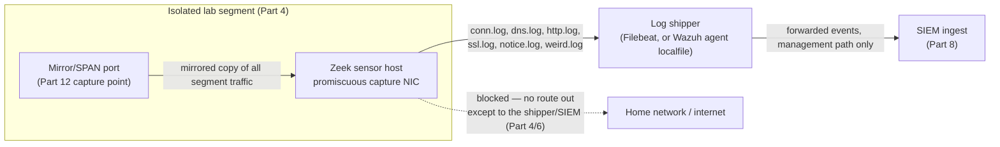

# Part 13 — Deploying Zeek for Network Security Monitoring

## Why this part exists

Part 12 gave you a place to see traffic: a mirrored interface, in promiscuous mode, sitting inside the isolated segment from Part 4. Seeing packets and understanding them are different problems. A raw packet capture is unreadable at scale — Zeek's job is to sit on that mirrored interface and turn every connection into a structured, searchable log line before it ever reaches your SIEM. This part installs Zeek against the Part 12 capture point, walks through the log families that matter on day one (`conn.log`, `dns.log`, `http.log`, `ssl.log`, `notice.log`, `weird.log`), and forwards those logs into the Part 8 SIEM. It stops at the log arriving and being searchable. What a specific `conn.log` entry actually means — is this connection a port scan, a beacon, a DNS tunnel — is Detection Engineering Handbook V2's job (its Parts 14–15), not this book's.

> **Safety Gate**
> Everything in this part assumes the mirrored interface you're pointing Zeek at is the one built and verified in Part 12, sitting on the isolated lab segment from Part 4 — not a mirror of your home network's real traffic, and not an interface with any route back out to the internet beyond the explicit, allow-listed path to your Part 8 SIEM. Zeek is a passive listener; it never sends a packet to anything it's watching. But the sensor host it runs on is a full Linux box on your lab network, and a full Linux box with no isolation boundary is just one more thing an attacker in that segment can pivot through. Before installing Zeek, confirm the Appendix A4 pre-flight checklist passes for the segment the sensor lives on — specifically that the sensor's only outbound path is to the SIEM's ingest port, nothing else.

## 1. What Zeek actually does — and what it deliberately doesn't

**[CONCEPT]** Zeek is a network security monitor (NSM), not an intrusion detection system (IDS). The distinction matters mechanically, not just as vocabulary: an IDS like Suricata (Part 14) inspects traffic against a rule set and raises an alert when something matches — it screams. Zeek inspects the same traffic and writes a structured record of every connection whether or not anything looks wrong — it narrates. Point Zeek at an hour of ordinary lab traffic and you get thousands of log lines describing DNS lookups, TCP handshakes, and HTTP requests that were all completely benign. That's the intended output. The value shows up later, when you need to answer "what else did this host talk to in the ten minutes before the alert fired" — a question an IDS alone can't answer, because an IDS only logged the thing that matched a rule.

Zeek ships with a small built-in notion of "notable" behavior of its own — the `notice.log` family, covering things like a certificate that fails validation (`SSL::Invalid_Server_Cert`) or a protocol violation Zeek's own parsers flag as unexpected. Treat these as Zeek raising its hand, not as an alert queue: `notice.log` entries are worth watching, but they're a small fraction of what Zeek produces and were never meant to replace a dedicated IDS.

### 1.1 Where Zeek and Suricata split the work

The table below supports one decision: whether you need Zeek, Suricata, or both on the same capture point, and what each one is actually good for once it's running.

| Question | Zeek | Suricata |
|---|---|---|
| Alerts on a known-bad signature | No — has no rule-matching engine of its own | Yes — this is its core function |
| Logs every connection, matched or not | Yes — this is its core function | Only via `eve.json` `flow`/`stats` event types, less rich |
| Extracts application-layer metadata (`http.log` URIs, `ssl.log` SNI/JA3, `dns.log` queries) | Yes, in depth, per protocol | Partial, via `http`/`tls`/`dns` `eve.json` event types |
| Good starting point for "what else did this host do" | Yes — this is exactly what it's for | Weaker — built for matching, not narrating |
| Needs a maintained rule feed to stay useful | No | Yes (Part 14 covers ET Open and similar) |
| Typical home-lab pairing | Runs alongside Suricata on the same tap | Runs alongside Zeek on the same tap |

Most production NSM deployments run both on the same tap for exactly this reason — Suricata tells you something matched, Zeek tells you everything else that connection did. §7's Build Autopsy covers why this book's own author didn't do that pairing on the one live segment where it would have mattered most.





**Figure 13.1 — Zeek sensor placement and log flow into the lab SIEM.** *CONCEPTUAL.* Illustrates where a Zeek sensor sits relative to the Part 12 mirror port and the Part 8 SIEM ingest pipeline inside the isolated lab segment from Part 4. This is an architecture sketch, not a capture from a running build — no Zeek instance currently runs in the author's own lab (see §7).

## 2. Sizing a Zeek sensor for a home lab

**[COST/RESOURCE]** Zeek's CPU and RAM cost scales with connection rate and how many analysis scripts you load, not with link speed on its own — a quiet 1Gbps lab segment with a handful of endpoints costs Zeek far less than a busy 100Mbps segment with a chatty honeynet on it. The table below gives three tiers matched to Part 3's hardware tiers, sized for a standalone `zeekctl` deployment (one process doing capture, analysis, and logging — no manager/proxy/worker split, which only starts paying off well above home-lab traffic volumes).

| Tier | Matches (Part 3) | Segment traffic | vCPU | RAM | Disk for logs |
|---|---|---|---|---|---|
| Light | Repurposed laptop/mini-PC | 1–3 quiet endpoints, no honeynet on the same tap | 1 | 1GB | 1–2GB/week, plaintext JSON logs |
| Standard | Dedicated home-server box | 4–10 endpoints, or a honeynet segment with moderate scanner traffic | 2 | 2GB | 5–10GB/week |
| Heavy | Multi-node cluster | A busy honeynet segment (see §7) or sustained internal traffic generation (Part 19) | 4 | 4GB | 20GB+/week — plan retention per Part 21 |

> **Resource Reality**
> Zeek's own manual describes RAM use as "modest" for typical deployments; on this book's home-lab hardware, "modest" still means a standalone instance watching a honeynet-scale connection rate (hundreds of new connections per minute from background internet scanners, not a quiet home segment) will sit at 1.5–2GB resident and spike higher during log rotation. On a 2GB VM with nothing else running, that's fine. On a 2GB VM that's also running a log shipper, a cron-driven enrichment job, or anything else from this book's later parts, expect the OOM killer to take Zeek down first — it's usually the largest single process on the box. Give the sensor its own VM rather than co-locating it with the SIEM or an endpoint.

## 3. Installing Zeek at the Part 12 capture point

**[SETUP]** The steps below target Zeek 6.0/6.1 installed from the official `security:zeek` package repository on Ubuntu Server 22.04 LTS, deployed as a single standalone node with `zeekctl` — the right starting configuration for every tier in §2's table. If you're on a different distribution, the package repo has equivalent instructions for Debian, RHEL/CentOS, and Fedora; the `zeekctl` steps after installation are identical regardless of package source.

### 3.1 Adding the package repository and installing Zeek

1. Import the repository's signing key and add the repo:
```bash
curl -fsSL https://download.opensuse.org/repositories/security:/zeek/xUbuntu_22.04/Release.key \
  | gpg --dearmor | sudo tee /usr/share/keyrings/zeek-archive-keyring.gpg >/dev/null
echo "deb [signed-by=/usr/share/keyrings/zeek-archive-keyring.gpg] \
https://download.opensuse.org/repositories/security:/zeek/xUbuntu_22.04/ /" \
  | sudo tee /etc/apt/sources.list.d/security:zeek.list
```
2. Refresh package metadata and install:
```bash
sudo apt update
sudo apt install -y zeek
```
3. Zeek installs to `/opt/zeek` rather than the usual `/usr` tree. Add its `bin` directory to your path so `zeekctl` is reachable without a full path every time:
```bash
echo 'export PATH=/opt/zeek/bin:$PATH' | sudo tee /etc/profile.d/zeek.sh
source /etc/profile.d/zeek.sh
```

Confirm the install worked before touching any configuration: `zeek --version` should print `6.0` or `6.1`. If the command isn't found, the `PATH` export above either didn't run or was applied in a shell you're no longer in — open a fresh terminal and retry before assuming the package install itself failed.

### 3.2 Pointing Zeek at the mirror interface

Zeek's node configuration lives at `/opt/zeek/etc/node.cfg`. For a standalone deployment, edit the `interface` line to match the exact interface name of the mirrored NIC from Part 12 — never the sensor's management interface, or Zeek will happily monitor its own SSH session instead of the traffic you actually built this for.

```text
[zeek]
type=standalone
host=localhost
interface=ens19
```

Run `ip link show` on the sensor first if you're not certain of the mirror interface's name — guessing wrong here is the single most common reason a fresh Zeek install produces empty logs (see §6).

Before deploying, load the JSON logging policy so every log family writes newline-delimited JSON instead of Zeek's default tab-separated format — JSON is what every log shipper in §5 expects, and switching formats later means re-pointing every downstream parser. Add one line to `/opt/zeek/share/zeek/site/local.zeek`:

```zeek
# JSON output — every downstream shipper in this book (Filebeat, Wazuh's
# localfile reader) expects newline-delimited JSON, not Zeek's default TSV.
@load policy/tuning/json-logs.zeek
```

Deploy the configuration — this both validates the config and starts the standalone node:

```bash
sudo zeekctl deploy
```

`zeekctl deploy` runs a syntax check before starting anything; if `node.cfg` or `local.zeek` has a typo, it reports the error and leaves the previous state untouched rather than starting a half-broken sensor.

> **Validation Test**
> **Setup:** Zeek deployed per §3.1–3.2, mirror interface confirmed via `ip link show` before editing `node.cfg`.
> **Action:** `sudo zeekctl status`, then generate a small amount of traffic on the monitored segment (any endpoint browsing to an internal or external site) and run `tail -f /opt/zeek/logs/current/conn.log`.
> **Expected result:** `zeekctl status` reports the `zeek` node as `running`. Within a few seconds of the test traffic, new JSON lines appear in `conn.log` with populated `id.orig_h`, `id.resp_h`, and `duration` fields — if the file exists but stays empty while you generate traffic, the mirror isn't actually reaching this interface; go back to Part 12's verification steps before troubleshooting Zeek itself.

## 4. The log families worth knowing on day one

**[CONCEPT]** Zeek writes dozens of log files once enough protocols are exercised, but a home lab's first month of real use lives almost entirely in six of them. Every one of these logs shares a `uid` field for the connection it describes — the single most useful fact about Zeek's log design, and the reason §9's hands-on exercise is built around tracing one `uid` across multiple log files.

| Log file | What it records | A field worth knowing first |
|---|---|---|
| `conn.log` | Every TCP/UDP/ICMP connection, matched or not | `conn.log`'s `duration` field — connection length in seconds; long-lived low-traffic connections are the shape a beacon leaves behind |
| `dns.log` | Every DNS query and response Zeek observes | `dns.log`'s `query` field — the queried name, before any resolution happens |
| `http.log` | Every unencrypted HTTP request/response pair | `http.log`'s `uri` field — the requested path, paired with `method` |
| `ssl.log` | TLS/SSL handshake metadata (not decrypted payload) | `ssl.log`'s `server_name` field — the SNI hostname the client requested, when present |
| `notice.log` | Zeek's own built-in "something worth a look" events | The `note` field holds the `Notice::Type` value, e.g. `` `SSL::Invalid_Server_Cert` `` |
| `weird.log` | Protocol behavior Zeek's parsers flag as malformed or unexpected, not necessarily malicious | The `name` field holds Zeek's internal weird-name string for the anomaly — a plain string, not a formal enum type the way `notice.log`'s `note` field is — e.g. `` `dns_unmatched_reply` `` |

Two details worth knowing before you rely on `ssl.log`: JA3/JA3S TLS client-fingerprint hashes are not populated by default and are not part of the base Zeek install at all — they come from a third-party package (`zeek/salesforce/ja3`), installed with `zkg install zeek/salesforce/ja3` and then loaded in `local.zeek` with `@load Salesforce/JA3`, a different mechanism from §3.2's bundled `policy/tuning/json-logs.zeek`. And `server_name` is only populated when the client sends SNI in the clear; a client using encrypted SNI (increasingly common on TLS 1.3) will leave that field empty, which is a real, specific limit on what this log can tell you — not a misconfiguration to chase.

## 5. Forwarding Zeek logs into the SIEM

**[SETUP]** With JSON logging active (§3.2), Zeek writes each log family as its own file under `/opt/zeek/logs/current/`, rotated hourly into dated subdirectories. Getting those files into the Part 8 SIEM is the same log-shipping problem Parts 9 and 10 already solved for auditd and Sysmon — point a shipper at the files, forward the events.

If Part 8's SIEM choice was Wazuh, the shipping path runs through the Wazuh agent's own `<localfile>` log reader rather than a separate Filebeat install on the sensor. Wazuh's `<location>` tag does support a basic `*` wildcard, so `/opt/zeek/logs/current/*.log` will technically match every family — but for a small, fixed set of exactly-named files like these five, one stanza per file is more explicit and easier to reason about than trusting the agent's periodic wildcard rescan to pick up exactly the files you expect, no more and no fewer. Each log family gets its own stanza in `/var/ossec/etc/ossec.conf` on the sensor:

```xml
<ossec_config>
  <localfile>
    <log_format>json</log_format>
    <location>/opt/zeek/logs/current/conn.log</location>
  </localfile>
  <localfile>
    <log_format>json</log_format>
    <location>/opt/zeek/logs/current/dns.log</location>
  </localfile>
  <localfile>
    <log_format>json</log_format>
    <location>/opt/zeek/logs/current/http.log</location>
  </localfile>
  <localfile>
    <log_format>json</log_format>
    <location>/opt/zeek/logs/current/ssl.log</location>
  </localfile>
  <localfile>
    <log_format>json</log_format>
    <location>/opt/zeek/logs/current/notice.log</location>
  </localfile>
</ossec_config>
```

Restart the agent after editing this file (`sudo systemctl restart wazuh-agent`) — `ossec.conf` is only read at agent start, not watched live. If Part 8's SIEM choice was the Elastic stack or Graylog instead, the equivalent is Filebeat's own Zeek module (`filebeat modules enable zeek`, then set `var.paths` in `/etc/filebeat/modules.d/zeek.yml` to the same `/opt/zeek/logs/current/*.log` glob Filebeat's `paths:` syntax does support) or a Graylog Beats/GELF input pointed at the same files — the underlying files and fields are identical regardless of which shipper reads them.

> **Validation Test**
> **Setup:** Zeek forwarding configured per this section, targeting the Part 8 SIEM.
> **Action:** Repeat the traffic generation from §3's Validation Test, then search the SIEM for events from the sensor host within the last few minutes.
> **Expected result:** Zeek-sourced events appear in the SIEM with the same field names as the raw JSON (`id.orig_h`, `duration`, `query`, `uri`, etc., depending on which log family matched your test traffic) and a timestamp within a few seconds of the local `conn.log` entry. A large forwarding delay (minutes, not seconds) usually means the shipper is buffering on a bulk-send interval rather than failing outright — check the shipper's own logs before assuming Zeek itself is the problem.

## 6. Troubleshooting the first week

**[TROUBLESHOOTING]**

- **`zeekctl status` shows the node as `crashed` immediately after deploy.** Almost always a permissions problem, not a config problem: Zeek needs `CAP_NET_RAW` and `CAP_NET_ADMIN` to open the interface in promiscuous mode, and a standalone package install doesn't grant these automatically on every distribution. Check `journalctl -u zeek` (or `/opt/zeek/logs/current/stderr.log`) for a permission-denied message on the capture interface; if present, run `sudo setcap cap_net_raw,cap_net_admin=eip /opt/zeek/bin/zeek` and redeploy.
- **Logs exist but stay nearly empty despite real traffic on the segment.** This is a Part 12 problem wearing a Zeek costume, not a Zeek problem. Confirm the mirror interface is actually receiving traffic independent of Zeek entirely — `ip -s link show ens19` (substituting your interface) and watch the RX byte counter climb while you generate test traffic. If it doesn't climb, go back to the hypervisor's mirror/SPAN configuration; Zeek can't analyze packets that never arrive at its NIC.
- **Edited `local.zeek` but the change (JSON logs, JA3) never took effect.** Editing the file alone doesn't reload Zeek's running configuration — you have to redeploy. Run `sudo zeekctl check` first to catch a syntax error before it takes down the running node, then `sudo zeekctl deploy` to apply and restart.
- **Sensor's disk fills up faster than expected.** JSON-format logs are larger than Zeek's default tab-separated format (the same information, plus JSON's field-name overhead repeated on every line), and rotated logs are not compressed by default. Budget disk per §2's table, and see Part 21 for a realistic retention policy before you're choosing between deleting logs and running out of space mid-capture.

## 7. Build Autopsy — pairing Zeek with Suricata on the real honeynet gateway

> **Build Autopsy — "run Zeek alongside Suricata on the honeynet edge gateway"**
>
> **The plan:** Add a Zeek instance next to the already-running Suricata deployment on the author's real honeynet edge gateway, watching the same mirrored honeynet interface, so an analyst reviewing a Suricata alert could pivot straight into Zeek's connection-level narration of the surrounding session — the standard NSM pairing described in §1.1.
>
> **Why it seemed reasonable:** The gateway already had a working capture point and a working Suricata deployment (Part 14 covers that build); adding Zeek to the same tap looked like it should be a small marginal cost for a meaningful gain in context around every alert.
>
> **How it failed:** The gateway shares its physical Proxmox host with the rest of the author's real lab — Pi-hole, a Tor relay, a vulnerability scanner, and the honeynet's own sacrificial decoy VMs all run on the same box, which was already committed at roughly 22 vCPUs against 4 physical cores and running close to its full 15GB of RAM, with swap already in active use. §2's Resource Reality box describes what Zeek costs on hardware with headroom to spare; this host didn't have that headroom, and the honeynet segment specifically sees a higher, spikier connection rate than a quiet home segment because it's a deliberate target for internet background scanning. Adding a second capture process to an already-oversubscribed shared host risked degrading the gateway's existing, working Suricata pipeline rather than adding a clean second signal next to it.
>
> **The fix:** No fix was completed on that gateway — it's disclosed here as a real, resource-driven decision, not silently omitted. Suricata alone remains that segment's live telemetry source. This book's Zeek walkthrough (§3–§5) targets a purpose-built sensor VM sized per §2's tiers, not a shared production box already carrying other services — a reader following this part on dedicated hardware isn't inheriting the exact resource conflict the author hit on a box that was never sized for a second NSM tool in the first place.

## 8. Blind Spot: what Zeek cannot see

> **Blind Spot**
> Zeek analyzes what crosses the wire it's mirrored from, in whatever form it arrives in — it does not decrypt anything. `ssl.log` gives you handshake metadata (SNI when present, negotiated cipher, certificate details, a JA3 fingerprint if that policy script is loaded) but never the contents of the encrypted session itself, which today is most of a home lab's real traffic. A client using encrypted SNI defeats even the `server_name` field. Traffic tunneled through a VPN that terminates outside the mirrored segment shows up as one encrypted flow to the VPN endpoint, with everything inside it invisible — Zeek narrates the tunnel's existence, not what travels through it. None of this is a configuration mistake to fix; it's the actual limit of what a passive network sensor can ever see, and it's the reason this book still deploys endpoint telemetry (Parts 9–10) rather than treating NSM as a substitute for it.

## 9. Hands-on lab: tracing one session across three log files

**[HANDS-ON LAB]** Goal: confirm you can follow a single connection across `conn.log`, `http.log`, and `ssl.log` using the shared `uid` field from §4, rather than just seeing that log files exist. This exercise generates ordinary outbound web traffic to two public, benign test endpoints — nothing here targets a system you don't own or don't have explicit permission to test.

One prerequisite before step 1: Part 4's Table 4.2 leaves the lab/victim VLAN's outbound access at SIEM-ingest-ports-only by default, so a lab endpoint's `curl` to a real internet host will time out, not just run slowly, until you add one explicit rule for it. Add a single, scoped, temporary allow rule on the Part 6 firewall — lab/victim VLAN to the two test hosts' addresses, ports 80/443 only — for the duration of this exercise, then remove it once you're done. Don't generalize that into a standing "lab/victim VLAN to internet, any port" rule to save yourself the trouble next time; that's exactly the kind of convenience-driven rule Part 4 §4 built the terminal deny-all to prevent.

1. From a lab endpoint on the monitored segment (a Part 9 or Part 10 build), make a plain HTTP request to a benign, purpose-built test site: `curl -A "zeek-lab-test/1.0" http://neverssl.com`.
2. On the Zeek sensor, find the matching entry: `grep '"id.resp_p":80' /opt/zeek/logs/current/conn.log | tail -1`, and note its `uid` value.
3. Search `http.log` for the same `uid`: `grep '"<uid-value>"' /opt/zeek/logs/current/http.log`.
4. From the same endpoint, make an HTTPS request to a site you expect to support TLS: `curl -A "zeek-lab-test/1.0" https://example.com`.
5. Repeat steps 2–3 against `ssl.log` for this second connection's `uid`.

Expected result: step 3 returns an `http.log` line whose `uid` matches the `conn.log` entry from step 2, with `method` = `GET` and `user_agent` containing `zeek-lab-test/1.0` — proof the two logs describe the same session, not just similar-looking traffic. Step 5 returns an `ssl.log` line with a populated `server_name` field. If step 3 or 5 returns nothing, re-check that JSON logging (§3.2) is active — a stray tab-separated log from before that change won't match a JSON-formatted `grep` pattern.

> **Lab Note**
> Keep a second terminal open with `tail -f` on whichever log file you're testing against before you generate the traffic, rather than generating traffic first and grepping after. Watching the line appear in real time is the fastest way to notice a timestamp mismatch, a missing field, or a `uid` that doesn't look like the one you expected — problems that are much harder to spot scrolling back through a file after the fact.

## 10. From Zeek logs to detections, playbooks, and drills

**[CONCEPT]** Everything above stops at "the log exists and is searchable in the SIEM." That's a deliberate scope boundary, not an oversight — turning a `conn.log` field into an actual detection is a different skill, owned by a different volume in this series.

- **Detection logic:** Detection Engineering Handbook V2's Parts 14–15 build directly on the log families this part produces — a vertical or horizontal port-scan detection, a beaconing detection scoring the coefficient of variation of a connection's inter-arrival intervals, and lateral-movement detections over SMB/RDP session data all assume a connection-summary source that looks exactly like `conn.log`. If you build nothing else from this part, `conn.log` flowing into the SIEM is the prerequisite those chapters are written against.
- **Alert response:** When a detection built from this telemetry fires — or a `notice.log` entry like `` `SSL::Invalid_Server_Cert` `` shows up on its own — SOC Playbook Handbook's Playbook Library owns what an analyst does next: triage steps, escalation thresholds, and closure criteria. This part's job ends at the alert existing in a searchable form; that book's job starts at the alert firing.
- **Practice drills:** This book's own Part 19 (Generating Practice Telemetry and Purple-Team Drills) pairs a simulated action against a lab endpoint with a specific Detection Engineering Handbook V2 detection and a specific SOC Playbook Handbook playbook, closing the loop from raw Zeek output back to a repeatable exercise. SOC Manager's Operating Handbook's Part 8 (assessment design) and Part 11 (onboarding/ramp-up) frame how to run that same drill as a structured, repeatable program activity rather than a one-off test.
- **Visualization:** Part 17 builds dashboards on top of everything ingested through Parts 8–16, including this part's Zeek logs — connection volume over time, top talkers, and `notice.log` counts are a natural first panel set once this part's forwarding pipeline is live.

None of that downstream work is possible if the pipeline built in §3–§5 isn't actually running and forwarding. Validate it with the tests in this part before assuming the later ones will have anything to read.

---

**Cross-references:** Part 4 (network isolation this sensor's Safety Gate depends on), Part 8 (SIEM ingest destination), Part 9/Part 10 (endpoints generating the traffic Zeek observes), Part 12 (the mirrored capture point this part attaches to), Part 14 (Suricata — the complementary alerting layer on the same tap), Part 17 (dashboards built on this part's forwarded logs), Part 19 (pairing this telemetry with a purple-team drill), Part 21 (log retention once volume grows), Appendix A3 (Zeek config snippet baseline), Appendix A4 (isolation pre-flight checklist referenced in this part's Safety Gate); Detection Engineering Handbook V2, Parts 14–15 (turning `conn.log`/`dns.log` fields into scan, beaconing, and lateral-movement detections); SOC Playbook Handbook's Playbook Library (triaging a fired Zeek-sourced alert); SOC Manager's Operating Handbook, Part 8 and Part 11 (structuring a repeatable drill around this telemetry).
