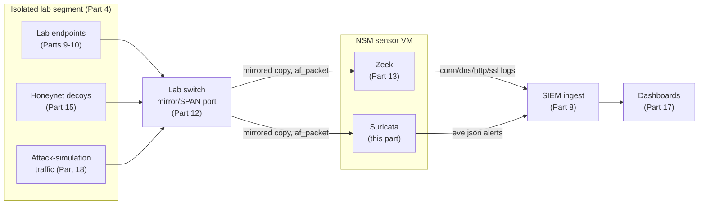

# Part 14 — Deploying Suricata for Intrusion Detection

## Why this part exists

Part 13 put a sensor on the wire and taught Zeek to describe every connection that crosses it — who talked to whom, over what protocol, for how long. This part puts a second piece of software on that same wire and teaches it to do something different: compare every packet against a database of thousands of known-bad patterns and raise an alert the instant one matches. Zeek answers "what happened here?" comprehensively, after the fact. Suricata answers "does this match something bad?" narrowly, in real time. A lab running one without the other is missing half of what a real network security monitoring (NSM) stack looks like — which is exactly why Parts 13 and 14 are built to sit on the same capture point and get read side by side, rather than as two disconnected installs.

This part does not teach detection logic, correlation tuning, or full MITRE ATT&CK mapping — that depth belongs to *Detection Engineering Handbook V2*'s network detection engineering content, cited throughout below. It does not cover running Suricata inline as an intrusion prevention system (IPS) that can drop live traffic — §9 explains why that's a deliberate non-goal for a single-operator home lab. What it does cover, start to finish: installing Suricata against the capture point Part 12 built, pointing it at a real rule source, confirming it actually alerts on something, tuning the noisiest categories out, and getting the result into the Part 8 SIEM where the rest of this book's telemetry already lives.

> **Safety Gate**
> Suricata in this part runs in passive IDS mode against a mirrored copy of traffic from the isolated lab segment built in Part 4 and tapped in Part 12 — it never sits inline on a path that carries anything you'd be upset to lose if a rule misfires or the sensor crashes. Two things must be true before you install anything below: first, the mirror/SPAN port feeding the sensor's capture interface carries traffic only from the lab's endpoint, honeynet, and simulation segments, never from your home network's management VLAN; second, the sensor's own management interface (the one you SSH into, and the one `suricata-update` uses to fetch rules) is the only interface with a route to the internet, and the capture interface itself has no IP address at all. Confirm both against the Appendix A4 pre-flight checklist before you bring the capture interface up. Nothing in this part instructs you to point Suricata, or anything upstream of it, at a network you don't own — the traffic it inspects is traffic you generated yourself, in Parts 15, 18, and 19.

## 1. Suricata's job next to Zeek: signatures vs. stories

**[CONCEPT]** Zeek and Suricata both read the same packets and both produce structured logs, which is why it's tempting to think of them as competitors. They're not. Zeek's `conn.log`, `dns.log`, `http.log`, and friends (Part 13) are a comprehensive, protocol-aware transcript — every session gets a record whether or not anything about it looks suspicious. Suricata's default output, a single file called `eve.json`, is signature-driven — a session generates a record in it only when something in the packet stream matched a rule someone wrote to catch a specific known pattern: a particular exploit's byte sequence, a malware family's command-and-control beacon shape, a scanner's telltale User-Agent string. Zeek tells you everything that happened. Suricata tells you, immediately, when something that happened matches something already known to be bad.

**[CONCEPT]** That difference has a direct consequence for what each tool can and can't catch. Suricata will never alert on a technique with no rule written for it — a genuinely novel attack, or one that simply hasn't made it into the ET Open ruleset yet, passes through silently. Zeek has no such gap, because it isn't trying to recognize badness at all; it just describes. The two tools are complementary for exactly this reason: Zeek gives you the haystack to search later, and Suricata gives you an immediate, narrow flag on the needles someone else has already catalogued. Table 14.1 puts the split side by side.

The table below compares Zeek's and Suricata's roles directly, to make clear why this book builds both instead of picking one.

| Property | Zeek (Part 13) | Suricata (this part) |
|---|---|---|
| Detection model | Descriptive — logs every session, no badness judgment | Signature-based — alerts only on a rule match |
| Primary output | Multiple protocol-specific logs (`conn.log`, `dns.log`, `http.log`, `ssl.log`) | Single `eve.json` event stream, typed by `event_type` |
| Catches unknown/novel activity | Yes, as a describable session — a human or a hunt query still has to notice it | No — a technique with no matching rule produces no alert |
| Catches known attack patterns instantly | Only if you write correlation logic on top of its logs | Yes, out of the box, from the ET Open ruleset |
| Resource profile at lab scale | Moderate CPU, log volume scales with session count | CPU scales with both traffic volume and the number of loaded rules |
| Where its depth lives | Detection Engineering Handbook V2, Parts 14–15 | Detection Engineering Handbook V2, Part 14 |

## 2. Where Suricata sits: reusing Part 12's capture point

**[CONCEPT]** Suricata needs the same thing Zeek needs: a copy of raw packets from somewhere that sees lab traffic, delivered to an interface in promiscuous mode with no IP address of its own. If you built the mirror/SPAN configuration in Part 12 and pointed Zeek at it in Part 13, Suricata reuses the identical interface — there is no separate tap to build. Both tools can run on the same sensor VM, reading the same interface independently in `af-packet` mode; neither one consumes packets the other needs, since the NIC driver hands each listening process its own copy.

> **Build Autopsy — "one less VM, one shared bottleneck"**
>
> **The plan:** Save a VM by installing Suricata directly on the router/firewall appliance (Part 6's pfSense or OPNsense box) using its built-in Suricata package, instead of standing up a separate sensor.
>
> **Why it seemed reasonable:** The firewall already sees every packet crossing segment boundaries, the package is a checkbox install, and running one fewer VM matters on the smaller hardware tiers from Part 3.
>
> **How it failed:** Rule matching is CPU-intensive, and so is stateful firewall rule evaluation on the same box. Under a traffic burst — a Part 18 attack-simulation run, or several honeynet decoys getting scanned at once — the two workloads compete for the same cores. The observed failure isn't a clean crash; it's rising firewall latency and silently dropped Suricata capture threads at the same time, so the lab's segmentation enforcement and its intrusion detection degrade together, exactly when the traffic generating the load is the traffic you most want both watching correctly.
>
> **The fix:** Keep the firewall doing firewall work and give Suricata its own sensor VM on a mirrored port, identical to how Part 13 places Zeek. It costs the VM Part 3 budgeted for, but it means a traffic spike that stresses one tool doesn't silently starve the other.

**[SETUP]** If the sensor VM is already running Zeek from Part 13, no new capture-interface work is needed — skip to §3. If this is the first NSM tool going on this VM, revisit Part 12's promiscuous-mode and virtual-switch mirroring steps for your specific hypervisor before continuing; Suricata will start and appear to run correctly even if the capture interface is receiving nothing, which is a much more confusing failure to debug than a clean install error.





**Figure 14.1 — Suricata's place in the NSM capture pipeline.** *CONCEPTUAL.* Illustrates how Suricata and Zeek read independent copies of the same mirrored traffic from the Part 12 capture point and forward their respective outputs into the Part 8 SIEM. This is an architecture sketch, not a capture from a running sensor — it shows the intended topology this part and Part 13 build toward, not a screenshot of either tool's own interface. Diagram ID `FIG-14-01`.

## 3. Installing Suricata

**[SETUP]** These steps target Ubuntu Server 22.04 LTS and Suricata's 7.x series via the OISF-maintained stable PPA — the commands don't change across 7.x point releases, but check `apt-cache policy suricata` for whatever is current in that repository when you actually build this, rather than assuming the version pinned above is still the newest one.

```bash
sudo add-apt-repository ppa:oisf/suricata-stable
sudo apt update
sudo apt install -y suricata
suricata -V
```

Confirm the install worked by checking that `suricata -V` prints a version string starting with `7.` and that `systemctl status suricata` shows the service loaded (it may not be `active` yet — that's expected before the capture interface is configured in §4).

> **Lab Note**
> Before you ever restart the live service after editing `suricata.yaml`, run `sudo suricata -T -c /etc/suricata/suricata.yaml -v`. It parses the config and rule set without touching the running sensor, and it turns "I have a typo somewhere in 40 lines of YAML" into a specific line number in about two seconds — faster than restarting the service and then digging through `journalctl` to find out why it didn't come back up.

## 4. Configuring the capture interface and HOME_NET

**[SETUP]** Suricata's main config file, `/etc/suricata/suricata.yaml`, needs two changes before it's useful in this lab: an `af-packet` stanza pointing at the mirrored interface, and a `HOME_NET` variable describing the lab's own address space so rules that check traffic direction (inbound versus outbound) evaluate correctly.

```yaml
# CONCEPTUAL SAMPLE — invented interface name and lab CIDR for illustration;
# substitute your sensor's actual mirrored interface and Part 4 segment addressing.
vars:
  address-groups:
    HOME_NET: "[10.20.30.0/24]"
    EXTERNAL_NET: "!$HOME_NET"

af-packet:
  - interface: ens19
    cluster-id: 99
    cluster-type: cluster_flow
    defrag: yes
    use-mmap: yes
    ring-size: 2048
```

**[COST/RESOURCE]** `cluster-type: cluster_flow` matters more than it looks like it should: it tells Suricata to hash packets to worker threads by flow, so a single TCP session's packets always land on the same thread instead of getting split across cores out of order. Leaving this at its default on a multi-core sensor produces reassembly errors under real load that look like a broken NIC, not a config setting.

> **Resource Reality**
> Suricata's CPU cost scales with both traffic volume and the number of loaded rules, not just one or the other. A quiet lab segment pushing a few megabits a second against the full ET Open ruleset (upward of 30,000 signatures) idles comfortably on 2 vCPUs. The same 2 vCPUs fall behind — visible as a climbing `capture.kernel_drops` counter in `stats.log` — the moment a Part 18 attack-simulation burst or a honeynet scan spike pushes real throughput up while every one of those signatures is still being checked against every packet. Budget 4 vCPUs for a sensor VM that runs both Zeek and Suricata together on anything above the smallest hardware tier in Part 3, and watch `stats.log` after your first real traffic burst before assuming the sizing is fine.

Enable and start the service now that the capture interface and address groups are set, and check the log for capture errors rather than assuming a clean systemd status means packets are actually arriving.

```bash
sudo systemctl enable --now suricata
sudo tail -n 30 /var/log/suricata/suricata.log
```

A healthy start shows a line reporting the `af-packet` interface came up and a rule-loading summary with a nonzero signature count; an interface name typo produces a clear "no such device" error in the same log within the first few lines.

## 5. Rule sources and suricata-update

**[SETUP]** A fresh Suricata install ships with almost no rules loaded — the detection value comes from `suricata-update`, a separate tool that fetches, merges, and installs rule sets from one or more sources. The default source, Emerging Threats Open (`et/open`), is enabled automatically and is the right starting point for a home lab.

```bash
sudo suricata-update
sudo suricata-update list-enabled-sources
sudo systemctl restart suricata
```

Confirm the update actually pulled rules by checking that `list-enabled-sources` prints at least `et/open`, and that the restarted service's startup log (as in §4) reports a much larger signature count than the near-zero count from the first install.

The table below compares the rule sources `suricata-update list-sources` can enable, to help decide which ones actually belong in a single-operator lab instead of turning on everything available.

| Rule source | Cost | Update cadence | Best lab fit |
|---|---|---|---|
| `et/open` (Emerging Threats Open) | Free | Daily | Default baseline — broad coverage, the source every worked example in this part assumes |
| `et/pro` (Proofpoint ET Pro) | Paid subscription | Daily, ahead of Open | Skip for a hobbyist build unless you specifically want to compare Open's coverage against Pro's |
| `oisf/trafficid` | Free | Tied to Suricata releases | Application/protocol identification rather than attack detection — pairs well with Zeek's protocol logs from Part 13 |
| `sslbl/ssl-fp-blacklist` (abuse.ch) | Free | Periodic | Flags known-malicious TLS certificate fingerprints; small rule count, low CPU cost to add |
| `local.rules` (self-authored) | Free (your time) | On demand | Lab-specific test markers and Part 19 purple-team drill signatures |

**[SETUP]** Custom rules belong in `/etc/suricata/rules/local.rules`, referenced from `suricata.yaml`'s `default-rule-path` and rule-files list. This one confirms the file is actually being loaded without depending on any ET Open signature firing first.

```suricata
# CONCEPTUAL SAMPLE — a lab-only test rule, not from ET Open, confirming local.rules loads
alert http any any -> $HOME_NET any (msg:"LOCAL TEST - benign lab marker string in URI"; content:"soc-home-lab-marker"; http.uri; sid:9000001; rev:1; classtype:not-suspicious;)
```

Requesting a URL containing the literal string `soc-home-lab-marker` from any lab host should produce a `sid:9000001` alert in `eve.json` within seconds of a `sudo systemctl restart suricata` — if it doesn't, `local.rules` isn't on the loaded rule-files list and the reference in `suricata.yaml` needs a second look.

## 6. Verifying detection: your first Suricata alert

**[HANDS-ON LAB]** A custom test rule proves the pipeline works but proves nothing about a real signature. The next check uses an actual ET Open rule and a domain that exists specifically to trip it — `testmyids.com`, whose response body is engineered to match `sid:2100498`, "GPL ATTACK_RESPONSE id check returned root," one of the most widely deployed test signatures in any IDS ruleset.

> **Validation Test**
> **Setup:** Suricata running in `af-packet` mode with the ET Open ruleset updated within the last 24 hours (§5), and `eve.json` alert output confirmed via the `local.rules` check in §5.
> **Action:** From any lab endpoint on the mirrored segment: `curl http://testmyids.com/`
> **Expected result:** A new record in `/var/log/suricata/eve.json` with `event_type: "alert"`, `alert.signature_id: 2100498`, and `alert.signature` containing "GPL ATTACK_RESPONSE id check returned root," with `src_ip` matching the lab endpoint that ran the request.

If nothing appears within a few seconds, check three things in order: that the endpoint's traffic actually crosses the mirrored port (a routing or VLAN-tagging error upstream means Suricata never sees the packets at all), that `stats.log` doesn't show a rising `capture.kernel_drops` counter (an overloaded sensor silently drops packets before they reach rule matching), and that `et/open` is genuinely in the enabled-sources list from §5.

## 7. Forwarding EVE JSON alerts into the SIEM

**[SETUP]** `eve.json` is a newline-delimited JSON file, which every SIEM option from Part 8 can parse directly — the exact ingest mechanism differs by platform, so this section shows the Wazuh path as a concrete worked example rather than three parallel installs. If you built Part 8 on the Elastic stack or Graylog instead, the equivalent step is pointing that platform's log-shipper (Filebeat's Suricata module, or a Graylog JSON input) at the same file path.

```xml
<!-- On the Wazuh agent running on the Suricata sensor VM, added inside ossec.conf -->
<localfile>
  <log_format>json</log_format>
  <location>/var/log/suricata/eve.json</location>
</localfile>
```

Restart the Wazuh agent (`sudo systemctl restart wazuh-agent`) after this change, then re-run the §6 Validation Test — the same `testmyids.com` alert should now show up as a searchable event in the Part 8 SIEM within a few seconds of appearing in `eve.json`, confirming the forwarding path end to end rather than just the local file.

> **Engineering Reality**
> Suricata's own documentation describes `eve.json` as a single unified event stream; in practice, on a lab sensor running the full ET Open ruleset against even modest traffic, that file fills with `event_type: "http"` and `event_type: "dns"` metadata records for every single session in addition to actual `event_type: "alert"` records — because those log types are enabled by default alongside alerting. Forward the whole file into the SIEM without a filter and the alert signal drowns in protocol metadata Zeek is already logging more completely in Part 13. Either disable the non-alert `eve-log` types you don't need in `suricata.yaml`'s `outputs` section, or filter on `event_type: "alert"` at ingest — decide which before your SIEM's disk fills with a duplicate of Zeek's job.

## 8. Tuning noise: disabling irrelevant rule categories

**[TROUBLESHOOTING]** The full ET Open ruleset is written for every network it might ever run on, which means most of it targets traffic your lab will never generate — enterprise VPN protocols, gaming platforms, peer-to-peer file-sharing signatures. Loading all of it costs CPU cycles for zero detection value and, worse, some categories (particularly `policy.rules`) are tuned to alert on behavior that's completely normal and simply looks unusual to a signature written for a corporate network's baseline. `suricata-update` reads a `disable.conf` file to drop whole categories before rules are compiled.

```text
# disable.conf — categories excluded because this lab generates no real
# production email, P2P, or gaming traffic for them to meaningfully cover
group:policy.rules
group:p2p.rules
group:games.rules
```

Place this at `/etc/suricata/disable.conf`, re-run `sudo suricata-update`, and confirm the loaded signature count in the post-restart log (§4) dropped — that's the check that the exclusion actually took effect, since a typo in the group name silently matches nothing and leaves every rule loaded.

**[TROUBLESHOOTING]** A second, more targeted noise source is a single rule that fires correctly but isn't useful for your lab's specific traffic pattern — rather than disabling a whole category over one bad rule, `threshold.config` can rate-limit or suppress by exact `sid`. This is the difference between "this category doesn't apply here" (`disable.conf`) and "this specific signature is correct but too chatty" (`threshold.config`) — conflating the two is the most common Suricata tuning mistake in a home lab, since it's tempting to reach for the blunter tool first.

## 9. IDS vs. IPS mode, and why this book stays passive

**[SAFETY]** Suricata can run in two fundamentally different modes: IDS (intrusion detection), passive, reading a copy of traffic and only ever alerting; and IPS (intrusion prevention), inline, sitting directly on the traffic path with the power to drop packets that match a rule. Every step in this part builds IDS mode — the mirrored-port capture interface has no way to drop anything even if you wanted it to, since it never sees the original packets, only a copy. This is a deliberate scope decision, not an oversight: IPS mode requires Suricata to sit inline on the actual forwarding path (typically replacing or extending Part 6's firewall placement), and a misconfigured or overloaded inline sensor doesn't just fail to alert — it drops legitimate traffic, which on a home lab with no on-call team to notice and roll it back can turn a detection exercise into a self-inflicted outage with no attacker involved at all.

> **Blind Spot**
> A signature-based sensor only ever alerts on what someone already wrote a rule for. A technique with no matching signature — a genuinely novel exploit, a slow-and-quiet technique deliberately shaped to avoid known patterns, or simply something the ET Open maintainers haven't gotten to yet — crosses the mirrored port and generates nothing in `eve.json` at all. Pair every exercise built on this part's alerts with Part 13's Zeek logs, which describe the same traffic regardless of whether any signature matched it; an attack-simulation run in Part 18 that produces zero Suricata alerts is not evidence nothing happened, only evidence nothing matched a rule Suricata was loaded with.

## 10. Where this telemetry goes next

**[CONCEPT]** Getting a `sid:2100498` alert into the SIEM is this part's entire job — what an analyst, a detection engineer, or a lab operator running a drill does with it belongs to the other three volumes in this library, and each one picks it up at a different point.

- *Detection Engineering Handbook V2*'s network detection engineering content (its Part 14) is where the raw alerts this part produces get correlated, suppressed for known-benign patterns, and mapped to MITRE ATT&CK techniques where a mapping genuinely applies — for example, a TLS-on-a-plaintext-port protocol-confusion alert Suricata can generate maps to T1595.002 (Active Scanning: Vulnerability Scanning) in that book's own worked example. This part only gets the signal flowing; deciding which alerts are worth a standing detection rule is that book's job, not this one's.
- *SIGNAL TO ACTION: The Complete SOC Playbook Handbook*'s Playbook Library owns the analyst-facing triage steps once an alert fires for real — what to check first, what to escalate, and when a `testmyids.com`-style validation alert should simply be closed as a confirmed-benign test versus investigated. This part builds the pipe the alert travels through; it doesn't tell you what to click when the alert actually lands at 2 a.m.
- The *SOC Manager's Operating Handbook*'s assessment-design content (its Part 8) is where the combination of this part's Suricata alerts, Part 15's honeynet captures, and Part 18's attack-simulation runs becomes the graded evidence behind a repeatable practice drill — did the alert fire, did it get triaged correctly, how long did that take. This part produces the raw signal a drill measures; designing the drill itself is that book's job.

> **What Would Change My Mind**
> This part recommends `et/open` as the default and only rule source for a hobbyist single-operator lab, on the grounds that `et/pro`'s faster update cadence isn't worth the subscription cost at this scale. If a reader's lab specifically needs same-day coverage of an emerging CVE for a purple-team drill tied to a real disclosure timeline — a scenario Part 19 could plausibly build — that specific gap, not a general "paid rules are better," would be the concrete reason to revisit `et/pro`.

---

**Cross-references:** Part 4 (network isolation this part's Safety Gate depends on), Part 6 (why Suricata doesn't share a host with the firewall — §2's Build Autopsy), Part 8 (SIEM ingest target for `eve.json`), Part 12 (capture-point and mirror-port prerequisites), Part 13 (Zeek — the paired NSM tool this part is built to sit beside), Part 15 (honeynet traffic this sensor will alert on), Part 18 (attack-simulation traffic this sensor will alert on), Part 19 (purple-team drills consuming this part's alerts), Appendix A3 (Suricata config snippet reference), Appendix A4 (safety pre-flight checklist); *Detection Engineering Handbook V2* Part 14 (network detection engineering — alert tuning and MITRE mapping); *SOC Playbook Handbook* Playbook Library (alert triage procedure); *SOC Manager's Operating Handbook* Part 8 (assessment/drill design using this telemetry).
