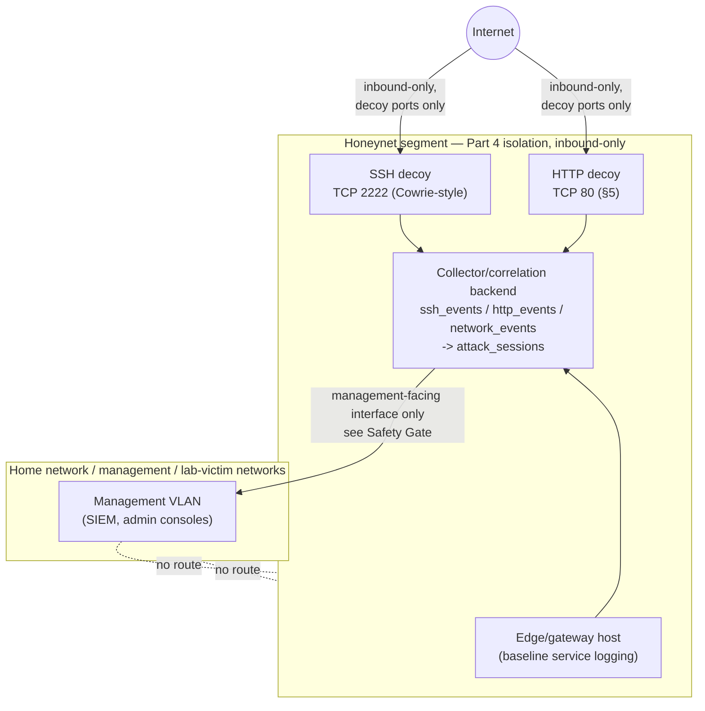

# Part 15 — Honeypots and Honeynet Architecture

## Why this part exists

Every part before this one built something that has to be reached on purpose — a SIEM you query, an endpoint you log into, a sensor you configure. A honeypot is the first thing in this book built to be found by accident, by anyone, and to say nothing when it's touched except "log this." That single design goal — attract unsolicited contact and record it faithfully — is also why this part carries the strictest isolation requirement in the entire book. A decoy service is deliberately unpatched, deliberately exposed, and deliberately left open on specific ports for the whole internet to find. Every other part in this book defends something; this one is the one part that's supposed to lose, on purpose, in a place where losing costs nothing.

This part builds a honeynet: more than one decoy service, plus the plumbing that turns isolated hits on separate decoys into a single correlated attacker session with MITRE ATT&CK tags attached. It cites the author's own running honeynet — three Linux containers, CT103, CT108, and CT113, referenced throughout *The Detection Engineering Handbook V2* — as a REAL LAB EXAMPLE throughout, because this is one of the few parts in this book where the evidence is genuinely a capture from a live system, not a construction. What this part does not do is teach you to interpret what the honeynet catches. Deciding whether a correlated session is a real threat worth escalating, scoring it by risk, or hunting through its history for a missed pattern is Detection Engineering Handbook V2 territory, cited by part number in §12. This part's job stops at "the decoys exist, they're isolated correctly, and the sessions they produce are trustworthy, correlated, and queryable."

> **Safety Gate**
> Everything in this part assumes the honeynet segment built in Part 4 has zero route back to your home network, your management network, or any host holding real credentials, and that its only path to the internet is inbound-only, restricted to the exact ports the decoy services in §4 and §5 listen on — never the real SSH port 22, never a management port of any kind. Before powering on a single decoy, run the Appendix A4 pre-flight checklist in full, and run it again now even if you already ran it while building Part 4's segmentation — a honeypot is built to be attacked, and if isolation fails here the blast radius is whatever the honeynet's VLAN or virtual switch can physically reach, not whatever the firewall rule intended it to reach. Three conditions specific to this part, on top of Appendix A4's general checklist: (1) the honeynet VLAN/vSwitch has no L2 adjacency to the management or lab/victim networks — a shared bridge with a firewall rule stacked on top is not the same thing as a genuinely separate segment, and §3's Build Autopsy below is exactly this mistake, caught in the author's own real lab; (2) the collector/correlation backend covered in §6 is reachable only from the management network, never exposed on the same interface the decoys listen on; and (3) no decoy service's hostname, banner, or credential set uses anything that exists anywhere else in your life — a decoy that leaks a real naming convention has told an attacker more about your real network than a honeypot should ever reveal.

## 1. What a honeypot is for, and what it isn't

**[CONCEPT]** A honeypot is a service with no legitimate users. Anything that talks to it is, by definition, either a misconfigured scanner, an automated bot, or an actual attacker — there's no "normal traffic" baseline to build here because there's no normal use case at all. That single property is what makes honeypot telemetry unusually clean compared to everything else in this book: a Sysmon or auditd event needs a baseline of legitimate activity subtracted out before it's interesting, but every single connection a decoy service receives is worth at least a glance.

Honeypots split into two rough interaction levels, and the split determines what a decoy can teach you:

- **Low/medium-interaction** decoys emulate a service's surface behavior — they'll accept a connection, present a banner, log a credential attempt — without running the real underlying software. Cowrie (SSH/Telnet) is the canonical example: it looks enough like an SSH server to collect banners and credential-stuffing attempts, but there's no real shell behind it for an attacker to actually compromise.
- **High-interaction** decoys run real, deliberately unpatched software — an old phpMyAdmin, an outdated Apache — with a real (if sacrificial) filesystem behind it. These catch more sophisticated interaction, including actual exploit attempts against a real vulnerable code path, at the cost of running genuinely exploitable software that must be treated as fully compromised the moment anything beyond routine probing touches it.

A honeypot does not stop, slow down, or deceive a determined attacker who already knows what they're targeting — it exists to catch *unsolicited* contact from scanners and opportunistic bots that don't know or care what they've found. That's a narrower promise than the word "honeypot" sometimes implies in security marketing, and it's worth stating precisely now, because §11 comes back to exactly this limit once the rest of this part has built something.

## 2. Honeynet architecture: from one decoy to a correlated segment

**[CONCEPT]** A single decoy service tells you that something touched it. A honeynet — several decoys plus the plumbing to correlate what they see — tells you that the *same source* touched several of them, in what order, and whether the pattern looks like reconnaissance, an exploit attempt, or something that kept going afterward. That correlation is what turns raw connection logs into the kind of evidence Detection Engineering Handbook V2 can actually reason about.

The author's own honeynet splits this across three roles, and this part's build follows the same split rather than inventing a different one:

- **Decoy services** — the SSH and HTTP listeners built in §4 and §5, whose only job is accepting connections and logging everything about them.
- **Edge/gateway** — a host sitting at the honeynet segment's boundary, running the segment's own baseline logging (service state, connection attempts against non-decoy ports) independently of the decoys themselves. The author's CT108 ("honeynet-edge") fills this role.
- **Collector/correlation backend** — the component that ingests raw events from every decoy and the edge host, stores them, and runs the correlation logic in §6 that turns isolated hits into attacker sessions. The author's CT103 runs this role, backed by a SQLite database (`honeypot.db`) with `ssh_events`, `http_events`, and `network_events` tables feeding an `attack_sessions` table.





**Figure 15.1 — Honeynet segment architecture: decoys, edge host, and correlation backend.** *CONCEPTUAL.* Illustrates the three-role split this part builds toward — decoy services and an edge/gateway host feeding a collector/correlation backend, which is reachable from the management network but never the reverse — modeled on the role split in the author's own running honeynet (CT103, CT108, CT113). This is an architecture target, not a capture from a running build; Figure 15.5 shows the correlation backend's actual output once built.

The table below compares four realistic honeypot software choices for the decoys themselves, to support choosing what to install in §4 and §5.

**Table 15.1 — Honeypot software options compared.** The table below supports one decision: which decoy software to install in §4/§5, based on how much realism you want against how much exposure you're willing to run.

| Tool | Interaction level | Protocols covered | Resource footprint | Best fit for |
|---|---|---|---|---|
| Cowrie | Low/medium | SSH, Telnet | Light — a single Python process, well under 512MB RAM | Readers wanting credential-stuffing/banner-grab telemetry with no real shell exposure |
| Custom HTTP decoy (nginx/Flask logging every request) | Low | HTTP/HTTPS | Lightest — a web server plus request logging | Readers wanting request-path and user-agent telemetry (recon, exploit-path probing) with no real application behind it |
| Dionaea | Low | SMB, FTP, HTTP, MSSQL, and other malware-targeted protocols | Light to moderate | Readers specifically interested in malware-dropper capture across several legacy protocols at once |
| Deliberately unpatched real service (old phpMyAdmin, old Apache) | High | Whatever the real software speaks | Moderate — it's genuinely running the software | Readers who understand the sacrificial-host commitment in §5's Safety Gate and want real exploit-attempt telemetry, not simulated banners |
| T-Pot (bundled multi-honeypot + Suricata + ELK) | Mixed (bundles several of the above) | Dozens of protocols simultaneously | Heaviest — a multi-container stack, budget against Part 3's higher tiers | Readers who want broad protocol coverage out of one install rather than building each decoy by hand |

This book's worked examples in §4 and §5 build a Cowrie-style SSH decoy and a custom HTTP decoy — the two lightest, most instructive options — and treat the deliberately-unpatched high-interaction pattern (§5's sidebar) as an explicit, higher-risk variant rather than the default.

## 3. Placing the honeynet on the isolated topology

**[SAFETY]** Where the honeynet sits matters more than which software runs on it. It needs its own VLAN or virtual switch, established in Part 4, with three properties that are each individually necessary and none of which is sufficient on its own: an inbound-only path from the internet restricted to the exact decoy ports in §4/§5, zero route to the management or lab/victim networks in either direction, and a collector backend (§6) that pulls or receives events without exposing itself on the decoy-facing interface.

The table below extends Appendix A4's general pre-flight checklist with five checks specific to a honeynet build — run these in addition to, not instead of, the full appendix procedure.

**Table 15.2 — Honeynet-specific pre-flight checklist.** Run every row below before a decoy's first exposure to the internet, and again after adding any new decoy or changing the segment's firewall rules.

| Check | What to verify | Why it matters |
|---|---|---|
| VLAN/vSwitch adjacency | The honeynet's VLAN or vSwitch has no bridged interface, trunk port, or shared vSwitch with the management or lab/victim segments | A firewall rule sitting on top of a shared L2 segment is not isolation — see the Build Autopsy below |
| Inbound port scope | The firewall's inbound-allow rule matches the decoy's listening port exactly (`2222`, `80`), not a range or "any" | An over-broad inbound rule can expose a management port on the same host by accident |
| Collector exposure | The collector/correlation backend (§6) does not listen on the decoy-facing interface at all | A compromised decoy with a route to the collector's listening port could tamper with the evidence it's supposed to produce |
| Naming/credential hygiene | No decoy hostname, domain suffix, or credential matches anything used anywhere else in your life or your real lab segments | A leaked real naming convention tells an attacker more about your actual network than the decoy should ever reveal |
| Scanner/tooling scope exclusion | Any vulnerability scanner or asset-discovery tool elsewhere in the lab has the honeynet's IP range explicitly excluded from its scan targets | Internal scanning traffic reaching the honeynet defeats the "unsolicited contact only" premise this whole part depends on — see the Build Autopsy below |

> **Build Autopsy — the honeynet edge that wasn't as isolated as intended**
>
> **The plan:** The author's own lab runs a vulnerability-scanner platform (CT104, "vulnscan") whose job is to sweep every container on the Proxmox host for real, findable vulnerabilities — SSH configuration weaknesses, outdated services, weak ciphers. Its scan scope was configured broadly, on the theory that excluding any host from vulnerability coverage just creates a blind spot in the scanner's own reporting.
>
> **Why it seemed reasonable:** A vulnerability scanner is supposed to reach everything it's scanning for, and the honeynet's decoy hosts are real Linux containers running real (if sacrificial) services — scanning them for real misconfigurations looked like thoroughness, not a mistake.
>
> **How it failed:** Giving the scanner a route to the honeynet segment means the honeynet segment has a route back — not to the internet, but to another internal lab host outside the isolation boundary this part's Safety Gate requires. CT108's own sshd journal shows exactly this: legacy SSH protocol and cipher-suite negotiation failures from `192.168.1.96` (CT104), which is indistinguishable in the raw log from a real attacker's protocol-fingerprinting scan — identifiable as internal traffic only because the analyst reviewing it already recognizes CT104's IP by heart. That's not the firewall-rule-only mistake Part 4 warns about in the abstract; it's a scanner explicitly configured with the honeynet's address range in scope, deliberately opening the exact path this book's isolation model exists to prevent.
>
> **The fix:** Exclude every honeynet-segment IP range from any vulnerability scanner's target scope, permanently, and treat "the scanner already reaches everything else, so scanning the honeynet too is just thorough" as the specific rationalization to catch yourself making. As of this writing, the author's own lab has not fully implemented this exclusion — the Figure 15.2 excerpt below is included specifically because it documents a live, unresolved instance of this gap, not a fixed one. Build your own honeynet's scanner exclusion rule before this part's decoys go live, rather than discovering the gap the way this lab did: by reading your own edge host's journal months later.

```text
Sep 10 16:21:03 honeynet-edge sshd[539]: Unable to negotiate with 192.168.1.96 port 43036: no matching key exchange method found. Their offer: diffie-hellman-group1-sha1 [preauth]
Sep 10 16:21:03 honeynet-edge sshd[541]: Unable to negotiate with 192.168.1.96 port 43058: no matching host key type found. Their offer: ssh-rsa [preauth]
Sep 10 16:21:03 honeynet-edge sshd[540]: error: Protocol major versions differ: 2 vs. 1
Sep 10 16:21:04 honeynet-edge sshd[550]: Connection closed by 192.168.1.96 port 43082 [preauth]
```

**Figure 15.2 — CT108 `honeynet-edge` sshd journal showing internal scanner traffic from CT104.** *REAL LAB EXAMPLE.* Captured from the author's own running CT108 container (`journalctl -u ssh`) on 2026-09-15; log lines span 2026-09-10. Source IP `192.168.1.96` is CT104's vulnerability-scanner platform, not an external attacker — the evidence backing the Build Autopsy above.

## 4. Building the SSH decoy

> **Resource Reality**
> Cowrie's own documentation lists a single Python process as the entire runtime — 1 vCPU and 256–512MB of RAM is enough to run it comfortably, with disk use dominated by however much JSON event logging you retain, not the software itself. This is one of the lightest components in this book to run; the isolation work in §3 costs more planning effort than this decoy costs hardware.

**[SETUP]** The steps below target Cowrie's official installation method on Debian-family Linux, matching the honeynet segment's isolated container/VM.

1. Create the decoy's VM or container with its only network interface on the honeynet VLAN from §3 — verify this in your hypervisor's network settings before proceeding, exactly as Part 7 warned for the DNS resolver.
2. Install Cowrie's dependencies and clone the official repository per its current install guide.
3. Create and activate Cowrie's Python virtual environment.
4. Configure `cowrie.cfg` to listen on port `2222` for SSH — never port 22, which this book reserves exclusively for real administrative access on the management network, never a decoy.
5. Set a fake hostname and filesystem fingerprint in Cowrie's configuration that matches neither your real lab's naming convention nor any hostname used elsewhere in this book's builds, per the Safety Gate's naming-hygiene condition.
6. Start Cowrie as a service (`bin/cowrie start`) and confirm its JSON event log (`var/log/cowrie/cowrie.json`) begins writing.
7. On the firewall from Part 6, add the inbound-allow rule for TCP `2222` to this decoy's IP only, and confirm the segment's default-deny rule still blocks every other inbound path.

> **Validation Test**
> **Setup:** Cowrie installed and listening on port 2222 per the steps above, on the isolated honeynet VLAN.
> **Action:** From a host outside the honeynet segment but still under your control (never from the open internet during initial testing), run `ssh -p 2222 test@<decoy-ip>` and attempt any password.
> **Expected result:** The connection is accepted, a fake shell prompt or credential rejection appears, and a corresponding JSON entry appears in `cowrie.json` within seconds, recording the source IP, attempted username, and password. If nothing appears in the log, recheck the firewall rule from step 7 before assuming Cowrie itself is broken — a decoy that never receives a test connection can't log one.

```text
id     ts                           src_ip           dst_port  username  password           client_version
-----  ---------------------------  ---------------  --------  --------  -----------------  --------------
10117  2026-09-10T09:08:30.443603Z  107.174.80.154             root      ------fuck------
10104  2026-09-10T09:07:30.815869Z  176.53.159.196             support   support
10092  2026-09-10T07:47:47.021592Z  186.242.162.94             admin     admin
10036  2026-09-10T02:26:30.572762Z  47.93.39.183               root      KgW41vmgMK
```

**Figure 15.3 — Real SSH honeypot credential-attempt excerpt.** *REAL LAB EXAMPLE.* Captured from the author's own CT103 honeynet backend (`ssh_events` table) on 2026-09-15; underlying events span 2026-09-08 through 2026-09-10. Source `176.53.159.196` repeated the `support`/`support` pair across multiple days — a sustained, low-and-slow default-credential sweep against this single decoy. These are attacker-supplied fake credentials, not real secrets belonging to this lab, so nothing here required redaction.

## 5. Building the HTTP decoy

**[SETUP]** A minimal HTTP decoy needs only a web server that logs every request in detail and returns a plausible-looking response — it does not need a real application behind it to be useful, because most of what hits an internet-facing web decoy is recon and exploit-path fingerprinting, not a sophisticated multi-step attack.

1. Create the decoy's VM or container on the honeynet VLAN, same isolation requirement as §4.
2. Install nginx or Apache.
3. Configure it to serve a minimal, generic landing page — nothing that names the real software stack this book's other parts actually run.
4. Enable detailed access logging including the request method, full path, and user-agent string (Apache's default `combined` log format captures all three).
5. Bind the listener to port `80` only.
6. Add the matching inbound-allow rule on the Part 6 firewall, scoped to this decoy's IP.
7. Restart the web service and confirm the access log begins writing on any test request.

> **Safety Gate**
> If you choose the high-interaction variant from Table 15.1 — a real, deliberately unpatched application like an old phpMyAdmin — treat that host as fully compromised the moment it's internet-facing, not as a normal lab endpoint that happens to be old. Never reuse credentials, SSH keys, or TLS certificates from any other host in your lab on this decoy. Patch the underlying OS and any component *other* than the intentionally vulnerable application itself (Part 20 covers this split in full) — patching the deliberately vulnerable component defeats the entire point of building it.

```text
id   ts                                src_ip           method  path                 user_agent
---  --------------------------------  ---------------  ------  -------------------  -------------------------------------------------------------------------------------------------------------------------------------
694  2026-09-09T21:36:41.187764+00:00  223.123.43.135   POST    /GponForm/diag_Form  Hello, World
693  2026-09-09T21:28:40.194169+00:00  89.21.67.141     GET     /sse                 Mozilla/5.0 (compatible; Infrawatch/1.0; +https://infrawat.ch/)
692  2026-09-09T21:28:39.410032+00:00  89.21.67.165     GET     /mcp                 Mozilla/5.0 (compatible; Infrawatch/1.0; +https://infrawat.ch/)
686  2026-09-09T20:40:51.502493+00:00  85.217.149.47    GET     /favicon.ico         Mozilla/5.0 (X11; Linux x86_64) AppleWebKit/537.36 (KHTML, like Gecko) Chrome/140.0.0.0 Safari/537.36 ModatScanner/1.2 (+https://modat.io/)
```

**Figure 15.4 — Real HTTP decoy exploit-probe excerpt.** *REAL LAB EXAMPLE.* Captured from the author's own CT103 honeynet backend (`http_events` table) on 2026-09-15; underlying events span 2026-09-09. Row 694 is a POST to `/GponForm/diag_Form` — the well-known path for the GPON router authentication-bypass RCE (CVE-2018-10561/CVE-2018-10562), still mass-scanned for today, mapping to T1190 (Exploit Public-Facing Application). Rows 692–693 are from an internet-wide scanner ("Infrawatch/1.0") specifically probing for exposed MCP (Model Context Protocol) endpoints — a reminder that decoy telemetry reflects whatever the internet is currently scanning for, not a fixed, predictable set of probes.

## 6. Session correlation: turning raw hits into attacker sessions

**[CONCEPT]** A raw `ssh_events` row and a raw `http_events` row from the same source IP, twelve seconds apart, are two isolated facts until something joins them. The author's own collector backend does this with a `correlation.py` process that reads all three raw tables (`ssh_events`, `http_events`, `network_events`), groups activity by `source_ip` within a session window, and writes the result into an `attack_sessions` table carrying a severity/status pipeline — `recon` → `probe` → `exploit_attempt` → `possible_success` → `confirmed_postexploit` — plus a JSON array of MITRE ATT&CK technique IDs per session.

```text
session_id                        source_ip        status            mitre_techniques_json                 notes
--------------------------------  ---------------  ----------------  ------------------------------------  ------------------------------------
d48b795e47c04c6fbb456b17ddd219b9  16.5.0.236       possible_success  ["T1595", "T1046", "T1083", "T1190"]  exploit attempt, then continued activity from same source
ba0ab1f38e11455f83e48298d7b45c1e  45.156.128.45    exploit_attempt   ["T1595", "T1046", "T1190"]            exploit-shaped web request observed (traversal/CVE-path-like)
be97051a26de4c4a87631942fa7fd5ed  64.62.156.192    possible_success  ["T1595", "T1046", "T1083", "T1190"]  exploit attempt, then continued activity from same source
```

**Figure 15.5 — Honeynet correlated attack session, MITRE-tagged.** *REAL LAB EXAMPLE.* Output of the honeynet platform's own session-correlation logic, captured from the author's running CT103 honeynet backend, showing `possible_success`-status sessions tagged with T1595 (Active Scanning), T1046 (Network Service Discovery), T1083 (File and Directory Discovery), and T1190 (Exploit Public-Facing Application). Captured 2026-09-15; source IPs and internal decoy addresses shown are real but represent no risk to disclose, since the targets are sacrificial decoy hosts by design. A `possible_success` status means the platform observed an exploit-shaped request followed by continued activity from the same source — flagged for manual analyst review, not confirmed compromise.

Building that exact pipeline from scratch is more than this part's scope justifies — §7 below builds a smaller, teaching-scale version of the same pattern instead, so a reader understands the mechanism without needing to reproduce a production-grade correlation engine on day one.

## 7. A hands-on lab: a lightweight correlation script

**[HANDS-ON LAB]** Goal: write a small script that flags any source IP hitting both the SSH decoy and the HTTP decoy within a 15-minute window as a multi-service probe, tags it with two MITRE technique IDs, and appends the result to a plain log file — a scaled-down teaching version of the pattern §6 describes at production scale, not a reproduction of the author's own `correlation.py`.

CONCEPTUAL SAMPLE — illustrative teaching script, reading from two plaintext log files with a fixed column layout rather than the author's own SQLite schema; adapt the parsing logic to whatever log format your §4/§5 decoys actually produce.

```python
import csv
from datetime import datetime, timedelta

WINDOW = timedelta(minutes=15)

def load_events(path, ts_col, ip_col):
    with open(path, newline="") as f:
        for row in csv.DictReader(f):
            yield datetime.fromisoformat(row[ts_col]), row[ip_col]

ssh_hits = list(load_events("ssh_decoy_log.csv", "timestamp", "src_ip"))
http_hits = list(load_events("http_decoy_log.csv", "timestamp", "src_ip"))

flagged = set()
for ssh_ts, ssh_ip in ssh_hits:
    for http_ts, http_ip in http_hits:
        if ssh_ip == http_ip and abs(ssh_ts - http_ts) <= WINDOW:
            flagged.add(ssh_ip)

with open("multi_service_sessions.log", "a") as out:
    for ip in flagged:
        # T1595 Active Scanning, T1046 Network Service Discovery
        out.write(f"{datetime.utcnow().isoformat()} source_ip={ip} "
                  f"mitre=[\"T1595\",\"T1046\"] note=multi-service probe\n")
```

> **Validation Test**
> **Setup:** Two CSV exports (or hand-built sample files) of decoy hits, `ssh_decoy_log.csv` and `http_decoy_log.csv`, each with `timestamp` and `src_ip` columns, containing one shared IP within 15 minutes on both.
> **Action:** Run `python correlate.py` (the script above) against the sample files.
> **Expected result:** `multi_service_sessions.log` gains one new line naming the shared source IP and tagging it `T1595`/`T1046` — confirming the join logic actually matches across both decoys' timestamps and IP fields, not just within one file.

## 8. Forwarding honeynet telemetry into the SIEM

**[SETUP]** This part stops at "correlated sessions exist and are queryable on the collector backend" — building the ingest pipeline that pulls Cowrie's JSON log, the HTTP decoy's access log, and the `attack_sessions` table into Part 8's SIEM is that part's job, not this one's. Two practical notes worth knowing before you get there: Cowrie's JSON log lines are already newline-delimited JSON, which most log shippers (Filebeat, Wazuh's agent) can tail natively; a web server's access log needs the same Apache/nginx parsing treatment any other web log in this book gets. Export the `attack_sessions` table on a schedule (a cron job running a `sqlite3 -json` query) rather than trying to tail a database file directly — SIEM log shippers expect a stream of lines, not a live database connection.

## 9. Troubleshooting common honeynet build failures

**[TROUBLESHOOTING]** Three failure modes account for most of the friction readers hit standing up a first honeynet.

- **No inbound traffic ever arrives.** Most home internet connections sit behind CGNAT (carrier-grade NAT) or a consumer router with no public IP directly reachable — if your ISP doesn't hand you a routable public address, a decoy on your home connection may simply never be reachable from the open internet no matter how the firewall rule is configured. Confirm your WAN IP is actually public (not a `100.64.0.0/10` CGNAT address) before assuming the decoy itself is broken.
- **The port-forward points at the wrong internal IP after a reboot.** If the decoy's VM or container doesn't have a static IP or a DHCP reservation, a reboot can hand it a different address than the one the firewall's port-forward rule targets, silently breaking inbound access with no error anywhere. Fix: reserve a static lease for every decoy host, not just a convenient default.
- **The inbound rule is broader than the decoy's actual port.** A rule written as "allow inbound to this host" instead of "allow inbound to this host, port 2222 only" exposes every other listening service on that decoy — including, potentially, a management or SSH-for-administration port you didn't intend to expose. Re-check the rule's port scope specifically, not just its source/destination.

## 10. Keeping a deliberately vulnerable honeynet safely maintained

**[SAFETY]** A honeynet is the one part of this lab where "patch everything" is the wrong default instruction. The collector backend, the edge host's own OS, and any web server or SSH daemon *hosting* a decoy need normal patching discipline — an unpatched collector is just a second, unintended vulnerable target. The decoy's intentionally vulnerable component itself — Cowrie's simulated banner, or a deliberately old phpMyAdmin version chosen for §5's high-interaction variant — must not be patched, or it stops being the thing this part built it to be. Part 20 covers this exact split (what to patch, what to deliberately leave alone) for the whole lab, not just the honeynet, and is the part to read in full before this segment has been running unattended for more than a few weeks.

> **Lab Note**
> Snapshot every decoy host immediately after its initial build, before its first exposure to the internet — the same discipline Part 5 recommends for every other lab VM. A honeypot that gets genuinely compromised in a way you didn't expect (not just "logged a credential attempt," but an actual foothold on a high-interaction decoy) is exactly the moment you want a clean snapshot to revert to, and exactly the moment you're least likely to have taken one if you didn't do it up front.

## 11. What a honeynet can't teach you

**[CONCEPT]** A honeypot only ever sees traffic addressed to it.

> **Blind Spot**
> An attacker who compromises a real, production-shaped host elsewhere on your lab network and pivots internally without ever touching a decoy IP generates nothing in the honeynet's logs at all. This part's honeynet teaches you to build a magnet for opportunistic internet-wide scanning and credential-stuffing — genuinely useful, real telemetry — but it is not a comprehensive internal intrusion-detection layer, and nothing in this part should be read as substituting for the endpoint and NSM telemetry Parts 9–14 build elsewhere in your lab.

> **What Would Change My Mind**
> §6 and §7 both correlate sessions by `source_ip` alone. That key is stable for a single actor operating from one address for the length of one campaign, but it breaks in two directions: a NAT gateway or shared-hosting IP can put several unrelated scanners behind one address (over-merging them into one false session), and a rotating-infrastructure attacker defeats it entirely by never reusing an address twice (under-merging what should be one tracked campaign into several unrelated ones). If a reader's own honeynet shows either failure mode clearly enough to be a repeatable pattern — not a one-off — that's grounds to widen this part's correlation key (to an ASN or CIDR range, for specific infrastructure known to behave that way) rather than treating exact-IP correlation as sufficient by default. Detection Engineering Handbook V2, Part 30 documents this exact limitation against the author's own honeynet data, and Part 35's HUNT-30-02 is a worked hunt built specifically to test for it.

## 12. Where this telemetry goes next

**[CONCEPT]** This part deliberately stops at "the sessions exist, they're correlated, and they're MITRE-tagged." Three things happen to that output next, each owned by a different volume in this series:

- **Detection Engineering Handbook V2, Part 30 (Correlation Engineering)** covers the entity-resolution problem §11's What Would Change My Mind names directly, using this same honeynet's `attack_sessions` table as its own worked example — read that part's §3.2 for the full treatment of what a `source_ip`-keyed join can and can't be trusted to merge correctly.
- **Detection Engineering Handbook V2, Part 35 (Hunt Types)** builds IOC-based and TTP-based hunts directly against this part's decoy telemetry — a reused default-credential string across the SSH decoy, and scoping the full extent of a `possible_success` session flagged in §6. This part produces the raw sessions; that part teaches you to hunt through them.
- **Detection Engineering Handbook V2, Parts 32–33 (Threat Intelligence, Risk-Based Detection)** are where a correlated session's source IPs get enriched against the threat-intel feeds this book's own Part 16 adds next, and scored by confidence and severity rather than read as a flat status field.
- **SOC Playbook Handbook's Playbook Library** owns the triage procedure for the one scenario this part's isolation is built to prevent from ever mattering for real: if a host on your actual lab/victim network — not a decoy — ever shows the same attack pattern this honeynet is designed to catch safely, that's a real detection to investigate, not a decoy behaving as designed, and the playbook branch for that is entirely different from "log it and move on."
- **SOC Manager's Operating Handbook, Part 8 (assessment design)** can use a correlated honeynet session as a low-cost, already-labeled scenario input for a practice drill — the MITRE tags in Figure 15.5 are exactly the kind of ground truth a Field Test needs to score a trainee's analysis against.

**Cross-references:** Part 3 (hardware tiers, Table 15.1's resource comparisons); Part 4 (network isolation and segmentation architecture, the isolation this part's Safety Gate depends on); Part 6 (perimeter firewall build, the inbound-allow rules in §4/§5); Part 8 (SIEM ingest for the telemetry this part produces, §8); Part 9 (Linux endpoint monitoring, applied to the collector/edge hosts themselves per §10); Part 16 (threat-intelligence feed integration, enriching the source IPs this part's sessions surface); Part 18 (safe attack simulation, contrasted with this part's unsolicited, non-simulated attacker traffic); Part 20 (patching discipline that must not touch a decoy's intentional vulnerability, §10); Appendix A4 (safety and isolation pre-flight checklist, extended by Table 15.2). Detection Engineering Handbook V2 — Part 30 (correlation engineering and entity resolution), Part 35 (hunt types against honeynet telemetry), Parts 32–33 (threat intelligence and risk-based detection). SOC Playbook Handbook — Playbook Library. SOC Manager's Operating Handbook — Part 8 (assessment design).
