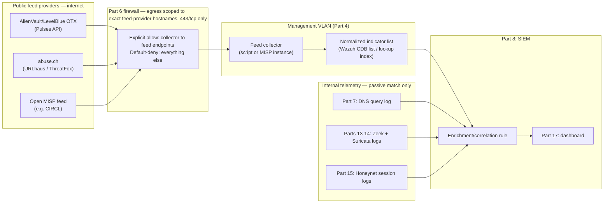

# Part 16 — Threat Intelligence Feed Integration

## Why this part exists

Every telemetry source built so far in this book only knows what happened on your own network. Part 7's DNS log knows a lab host queried a domain. Part 13 and Part 14's sensors know a connection happened and, for Suricata, whether it matched a locally-loaded signature. Part 15's honeynet knows something unsolicited touched a decoy. None of them know whether the domain, IP, or file hash involved has ever been seen anywhere else doing something bad — that context comes from outside the lab, and pulling it in is this part's entire job.

This part builds the plumbing: fetching indicator data from free, open threat-intelligence feeds — AlienVault OTX (now operated under the LevelBlue brand following AT&T's 2024 divestiture of its cybersecurity unit, though the OTX name and API have carried over unchanged), abuse.ch's feeds, and open MISP instances — normalizing what comes back into something a SIEM can match against, and loading it in. It stops there deliberately. Deciding how much weight a matched indicator should carry, scoring it against other signals, and deciding when a match is worth an analyst's time are Detection Engineering Handbook V2, Part 32's job, cited again in §10. This part's finish line looks like Part 8's: the feed data arrives, it's normalized, and it's matched against something real in the SIEM — full stop, no scoring logic attached.

> **Safety Gate**
> Everything in this part assumes the feed collector — whether a small script or a self-hosted MISP instance — runs on the management VLAN from Part 4, behind a Part 6 firewall rule scoped to the exact feed-provider API endpoints in §2, not a blanket "allow HTTPS outbound" rule. Two concrete conditions to verify before pulling a single feed: (1) the firewall's egress rule lists specific destination hostnames or their resolved ranges for OTX, abuse.ch, and any MISP feed source you add, with everything else still denied by default; and (2) no indicator pulled from any feed is ever used as a live target — no lab host resolves, connects to, downloads from, or otherwise visits a domain, IP, or URL taken from a threat-intel feed, for testing or any other reason. Part 7 §8 already drew this line for its own sinkhole teaching setup; this part is the reason that line exists. Re-run the Appendix A4 pre-flight checklist if you haven't since Part 15's honeynet build, since the feed collector sits on the same management segment that talks to both the SIEM and the honeynet's correlation logic.

## 1. What "feed integration" means at this scale

**[CONCEPT]** A threat-intelligence feed, at the scope this part covers, is a stream of indicators — domains, IPs, URLs, file hashes, and occasionally full attack-pattern descriptions — published by someone else who observed them doing something malicious. Integrating one means three things, in order: getting the data (§2–§5), keeping it somewhere a SIEM can query fast (§5, §8), and matching it against telemetry your lab already produces (§7). None of that is the same as deciding whether a match matters. A domain flaged by an eight-month-old OTX Pulse that's since been repurposed as a shared CDN edge is a very different finding than a URL abuse.ch listed an hour ago, and telling those two apart is a scoring judgment — Detection Engineering Handbook V2, Part 32's content, not this part's.

It's also worth separating this part from Part 15's honeynet up front, since both involve "indicators" in some sense. Part 15 *produces* indicators — a decoy service gets probed, and the source IP and behavior of that probe becomes something worth recording. This part *consumes* indicators someone else produced, to enrich telemetry your lab already has. The two meet in §7, where a honeynet capture gets checked against a feed-derived list, but they're opposite ends of the same pipe.

## 2. Choosing feed sources

**[CONCEPT]** Three source types cover nearly every free/open option a home-lab reader will actually reach for. The table below supports one decision: which source (or combination) to wire into §5's worked build, based on how much you're willing to register for and how narrowly scoped you want the resulting indicator volume to be.

| Feed | Auth required | Format | Update cadence | Indicator types | Best fit |
|---|---|---|---|---|---|
| `AlienVault/LevelBlue OTX` | Free account and API key | JSON via REST API (`/api/v1/pulses/subscribed`) | Continuous — community-submitted "Pulses" arrive whenever a contributor publishes one | Domains, IPs, URLs, file hashes; quality varies widely by contributor | Readers who want the broadest indicator variety and are willing to filter noisy community submissions |
| `abuse.ch URLhaus` | Free Auth-Key (abuse.ch began requiring this for programmatic access in 2023, after high-volume unauthenticated scraping degraded the service) | CSV or JSON bulk download, plus a queryable API | Near-real-time; the full dump refreshes every few minutes | Malicious URLs, with associated payload hashes where known | Readers who want a narrowly-scoped, well-curated feed with a low false-positive rate |
| `abuse.ch ThreatFox` | Free Auth-Key | JSON via REST API | Continuous | IOCs tagged with a specific malware family and, where known, a MITRE ATT&CK technique — a T1071 (Application Layer Protocol) tag is typical for C2-traffic indicators | Readers who want indicators that arrive pre-tagged with the malware family and technique context Part 15 and Part 19's purple-team drills can cite directly |
| Open MISP feed (for example, CIRCL's default feed and warninglist bundle) | None for most public feeds; an account only if joining a private sharing community | MISP's own JSON event format, pulled by a MISP instance's built-in feed-sync feature | Varies by publishing community, typically daily | Whatever the publishing community shares — IPs, domains, hashes, and full attack-pattern context | Readers already running a MISP instance (§8) who want a pre-formatted feed with no custom parsing |

Registering for API access on any of these is free, but read the current terms of service before automating anything against them — abuse.ch's terms are written for personal and research use at lab scale, not for redistributing the feed commercially, and OTX's rate limits change without much notice. None of this book's build assumes a paid tier of anything in this table.

> **Lab Note**
> Store every API key from this section in its own file with `chmod 600` permissions, never inline in a script and never in a file that also lives in a public repository. A leaked OTX or abuse.ch key doesn't expose anything about your lab — it just gets revoked once the provider notices misuse from wherever it leaked to — but re-issuing keys and re-auditing every script that referenced the old one is a genuinely annoying afternoon you can skip entirely by keeping keys out of version control from day one.

## 3. Where the feed collector sits on the isolated topology

**[SAFETY]** The collector — the script or MISP instance actually reaching out to §2's sources — has one job that matters for this book's safety story: it needs an outbound path to specific internet endpoints, and nothing else on the lab network should share that path. Place it on the management VLAN from Part 4, alongside the Part 8 SIEM it feeds, never on the endpoint VLAN and never anywhere near the honeynet segment. The honeynet's own decoy hosts have no legitimate reason to reach out to a threat-intel provider, and a decoy that somehow could would be a decoy with an unexplained egress path — precisely the kind of finding Part 4's isolation model exists to prevent, not produce.

The firewall table below adds to Part 6's rule set. Add these as named, specific rules rather than widening an existing "management VLAN outbound" rule — a rule this narrow is what makes it possible to notice, later, if the collector host ever tries to reach somewhere it shouldn't.

| Source | Destination | Port/protocol | Action |
|---|---|---|---|
| Feed collector (management VLAN) | `otx.alienvault.com` | `443/tcp` | Allow |
| Feed collector (management VLAN) | `urlhaus.abuse.ch`, `threatfox.abuse.ch` | `443/tcp` | Allow |
| Feed collector (management VLAN) | Your chosen MISP feed publisher's hostname | `443/tcp` | Allow |
| Feed collector (management VLAN) | Any other destination | any | Deny (default) |
| Any other source | Feed collector host | any | Deny (default) |

Figure 16.1 shows the resulting shape: feed providers reachable only through a scoped egress rule, a collector that never receives inbound connections from anywhere on the lab network, and an enrichment step that happens entirely inside the SIEM, against telemetry the lab already collected.





**Figure 16.1 — Threat-intel feed collector placement and enrichment path.** *CONCEPTUAL.* Illustrates where a feed collector sits on the management VLAN behind a scoped firewall egress rule, and how the resulting indicator list is matched inside the SIEM against internal telemetry from Parts 7, 13, 14, and 15 — never by having a lab host connect to a fetched indicator directly. No REAL LAB EXAMPLE capture of this specific integration exists: the author's real running lab (cited elsewhere in Parts 5, 7, 9, and 15) has not run a live feed-to-SIEM enrichment pipeline end to end, so this figure is an architecture target, not a capture from a build that happened.

## 4. Resource cost: a lightweight script versus a full MISP instance

**[COST/RESOURCE]**

> **Resource Reality**
> A scheduled script that pulls two or three feeds and writes a flat indicator list costs almost nothing — well under 512MB of RAM, running comfortably as a cron job on hardware that's already doing something else, and megabytes of disk for a rolling list. A self-hosted MISP instance is a different order of cost entirely: MISP's own installation documentation lists 4GB of RAM as a floor and 8GB as comfortable once its optional modules (enrichment, correlation, and taxonomy lookups) are enabled, on top of a MySQL/MariaDB database, Redis, and PHP-FPM all running as separate services. These are the vendor's own numbers, not figures this book's author has build-tested — the real lab this book draws REAL LAB EXAMPLE evidence from has never run MISP. Below MISP's floor, expect the same failure shape Part 8's Build Autopsy described for an undersized SIEM node: services that start but silently fall over the first time real event volume hits them, not a gentle slowdown.

| Approach | RAM | Disk | Setup friction | Best fit |
|---|---|---|---|---|
| Lightweight script + flat-file/CDB list | Under 512MB | Megabytes to low tens of megabytes for a rolling list | Low — one scheduled script, one SIEM list reload | Readers on the entry-level hardware tier (Part 3), or anyone who only wants matching, not sharing |
| Self-hosted MISP instance | 4GB minimum, 8GB comfortable with modules enabled (vendor-documented) | Several GB and growing — MISP retains full event/attribute history, not a rolling window | High — PHP, a MySQL/MariaDB database, Redis, and optionally Elasticsearch for the module set | Readers who want to publish or share indicators with other MISP communities, not just consume a feed |

This part's worked build (§5) uses the lightweight script, for the same reason Part 8 picked Wazuh's single installer: it's the lowest-friction path to a working enrichment pipeline for a first build. §8 covers what changes if you'd rather run MISP.

## 5. Building a lightweight feed pipeline

### 5.1 Getting API keys without exposing them

**[SETUP]** Register for a free OTX account at `otx.alienvault.com` and copy the API key from your account profile page. Register for a free abuse.ch Auth-Key at `auth.abuse.ch` — the form asks what you intend to use it for; "personal home-lab telemetry enrichment, non-commercial" is an accurate answer and the kind of use the free tier is meant for. Save both keys as environment variables loaded from a restricted-permission file rather than pasted into any script:

```bash
# /opt/lab-intel/.env — chmod 600, never committed to any repository
export OTX_API_KEY="your-otx-key-here"
export URLHAUS_AUTH_KEY="your-abusech-authkey-here"
```

Source this file (`source /opt/lab-intel/.env`) before running anything in §5.2, and confirm the permissions actually stuck with `ls -l /opt/lab-intel/.env` — it should show `-rw-------`.

### 5.2 Fetching the feeds

**[SETUP]** The commands below target abuse.ch's URLhaus bulk-download endpoint and OTX's Pulses API as of this part's `last_validated` date; both providers have changed endpoint paths before without much notice, so check each provider's current API documentation if a request below returns an authentication error rather than data.

```bash
mkdir -p /opt/lab-intel/raw

# URLhaus recent malicious URLs, CSV, requires the free Auth-Key from §5.1
curl -s -H "Auth-Key: $URLHAUS_AUTH_KEY" \
  https://urlhaus.abuse.ch/downloads/csv_recent/ \
  -o /opt/lab-intel/raw/urlhaus_recent.csv

# OTX Pulses you're subscribed to, JSON
curl -s -H "X-OTX-API-KEY: $OTX_API_KEY" \
  https://otx.alienvault.com/api/v1/pulses/subscribed \
  -o /opt/lab-intel/raw/otx_pulses.json
```

Confirm each request actually returned data rather than an error page before moving on: `wc -l /opt/lab-intel/raw/urlhaus_recent.csv` should report more than the CSV's header line alone, and `python3 -m json.tool /opt/lab-intel/raw/otx_pulses.json > /dev/null` should exit with no error if the OTX response parsed as valid JSON.

### 5.3 Normalizing into one list

**[SETUP]** A SIEM lookup list wants one flat format, not two providers' native schemas. The script below is a teaching-scope normalizer, not a production-hardened parser — it assumes both source files from §5.2 exist and skips malformed lines rather than failing the whole run, which is the right tradeoff for a lab feed but not for anything handling data you'd be paid to get exactly right.

```python
# CONCEPTUAL SAMPLE — teaching-scope normalizer, not hardened for malformed
# upstream data beyond the two skip-on-error cases shown.
import csv
import json

output_rows = []

with open("/opt/lab-intel/raw/urlhaus_recent.csv") as f:
    reader = csv.reader(row for row in f if not row.startswith("#"))
    for row in reader:
        try:
            output_rows.append(("url", row[2], "urlhaus"))
        except IndexError:
            continue

with open("/opt/lab-intel/raw/otx_pulses.json") as f:
    pulses = json.load(f)
    for pulse in pulses.get("results", []):
        for indicator in pulse.get("indicators", []):
            output_rows.append((indicator["type"].lower(), indicator["indicator"], "otx"))

with open("/opt/lab-intel/lab-threat-intel.list", "w") as f:
    for kind, value, source in output_rows:
        f.write(f"{value}:{kind}:{source}\n")
```

Run it with `python3 normalize_feeds.py` and check the result with `wc -l /opt/lab-intel/lab-threat-intel.list` — a healthy first run against a couple of subscribed OTX Pulses and a fresh URLhaus pull typically lands somewhere in the low thousands of lines, not zero and not empty aside from a header.

### 5.4 Loading the list into the SIEM

**[SETUP]** Wazuh's CDB list format takes exactly the `key:value` shape §5.3 already produced, minus the source-attribution column. Split IP-type indicators into their own list, since that's the field Wazuh's built-in `address_match_key` lookup matches against.

```bash
grep ':ip:' /opt/lab-intel/lab-threat-intel.list | cut -d: -f1,2 \
  | awk -F: '{print $1":lab-intel"}' > /var/ossec/etc/lists/lab-threat-intel-ips
systemctl restart wazuh-manager
```

Add a rule referencing that list to `/var/ossec/etc/rules/local_rules.xml`:

```xml
<!-- /var/ossec/etc/rules/local_rules.xml -->
<group name="threat_intel,">
  <rule id="100200" level="10">
    <list field="srcip" lookup="address_match_key">etc/lists/lab-threat-intel-ips</list>
    <description>Source IP matches a lab threat-intel indicator list entry</description>
  </rule>
</group>
```

This rule deliberately carries no `if_sid`/`if_group` parent. Wazuh evaluates a parentless rule against every decoded event, which is what lets one list-lookup rule match a `srcip` field regardless of whether it came from a Zeek `conn.log` entry, a Suricata `eve.json` alert, or a honeynet session log (§7) — gating it behind an unrelated base rule would silently narrow it to only that rule's own log source. Don't borrow a base rule ID from another `local_rules.xml` example you've seen elsewhere without checking what it actually matches first: OSSEC's own rule 530, for instance, fires only on internal `ossec: output:` command-check text and has nothing to do with network telemetry — a threat-intel rule gated behind it would load without error and simply never fire.

Restart the manager (`systemctl restart wazuh-manager`) to pick up both the new list and the rule, then confirm both loaded without error: `grep -i "lab-threat-intel\|100200" /var/ossec/logs/ossec.log` should show the list and rule ID referenced with no parse error nearby.

## 6. Validating the pipeline with a synthetic indicator

**[HANDS-ON LAB]** Goal: prove the list-and-rule pipeline from §5.4 actually fires on a match, without ever pointing a lab host at a real, currently-active malicious indicator to test it — the exact prohibition in this part's Safety Gate.

> **Validation Test**
> **Setup:** The lightweight feed pipeline from §5 loaded into the Part 8 SIEM, Part 7's DNS query log already reachable for a domain-based check as well.
> **Action:** Add the line `example.com:lab-intel` to a second Wazuh list, `etc/lists/lab-threat-intel-domains`, reference it from a second rule in `local_rules.xml` matching a decoded query-domain field (the exact field name depends on how Part 8's ingest pipeline maps DNS log entries — Part 8 stops at "logs arrive and are searchable," and mapping that specific field is Detection Engineering Handbook V2, Parts 5–7's parsing work, so treat the field name below as illustrative). Then, from a lab endpoint, run `nslookup example.com` — a real, harmless domain reserved under RFC 2606 specifically for documentation and testing, and safe to actually query, unlike anything pulled from a live feed.
> **Expected result:** An alert tagged with the `threat_intel` rule group appears in the Wazuh dashboard, matching the queried domain against the `lab-threat-intel-domains` list entry, in the same time window Part 7 §5's own DNS validation test used.

```xml
<!-- CONCEPTUAL SAMPLE — field name illustrative; depends on your DNS log's decoder mapping -->
<group name="threat_intel,">
  <rule id="100201" level="10">
    <list field="query" lookup="match_key">etc/lists/lab-threat-intel-domains</list>
    <description>Queried domain matches a lab threat-intel indicator list entry</description>
  </rule>
</group>
```

If nothing fires, check the list and rule load first (§5.4's `ossec.log` grep), then confirm the DNS log entry for `example.com` actually reached the SIEM at all before assuming the list-matching logic itself is broken — an ingest failure upstream of the rule looks identical to a rule that never matches.

## 7. Matching internal telemetry against the feed, passively

**[CONCEPT]** The word "passively" in this section's title is doing real work. Once §5's list is loaded, matching happens entirely inside the SIEM, against fields already present in telemetry the lab produced on its own: a `srcip` in a Zeek `conn.log` or Suricata `eve.json` alert (Parts 13–14), a queried domain in the DNS log (Part 7), or a source IP that touched a decoy in the honeynet's session log (Part 15). At no point does anything in this pipeline cause a lab host to originate traffic toward an indicator. The SIEM is comparing values it already has against a list it already loaded — the list itself never gets dereferenced as an address to connect to.

This matters most for the honeynet. A source IP that shows up in a `possible_success`-status correlated session in Part 15's honeynet logs and *also* matches a feed-derived indicator is a genuinely useful correlation — it tells you the same host that poked at your decoy has been reported doing something bad somewhere else, too. Building that specific correlation query, and deciding how much confidence to put in a match against a feed known to include noisy community submissions, is where this part's plumbing hands off directly to Detection Engineering Handbook V2, Part 32.

> **Engineering Reality**
> Feed provider documentation tends to describe indicators as "verified" or "curated"; in practice, expect real staleness and real noise regardless of source. OTX Pulses are community-submitted with no consistent review process, so indicator quality inside a single Pulse can range from a genuinely fresh C2 domain to a shared hosting IP that stopped being malicious months before the Pulse was published. abuse.ch's feeds are more narrowly curated and tend to have a lower false-positive rate, but even URLhaus retains delisted entries for a retention window before pruning them, so a match against an hours-old pull can still point at infrastructure that's already been cleaned up. Don't treat a match as confirmation of anything by itself — treat it as a reason to look at the underlying session or connection more closely, which is exactly the judgment call Part 32 formalizes.

> **Blind Spot**
> A feed only ever contains what someone else already observed, reported, and published. A genuinely novel piece of infrastructure — a freshly registered C2 domain nobody has submitted anywhere yet, or a fast-flux setup that rotates IPs faster than any feed refreshes — produces zero matches in this part's pipeline, not because the pipeline is broken, but because there was nothing to match against yet. This part's enrichment step tells you when something you already logged has a known-bad reputation elsewhere; it says nothing about traffic that's simply ahead of every feed it's checked against.

## 8. The MISP alternative

**[SETUP]** If you'd rather run a central indicator-sharing platform than a script — for example, because you want to publish indicators from your own honeynet (Part 15) back out to a MISP community, not just consume one — MISP is the standard open-source option. Installing it is out of this part's worked-example scope given §4's resource cost, but the shape of the decision is straightforward:

1. Provision a VM meeting §4's 4GB-minimum floor, on the management VLAN, behind the same scoped egress rule from §3.
2. Install MISP using the project's own Docker-based or Ansible-based installer (both are documented on MISP's official GitHub project and change often enough that this part doesn't reproduce specific commands here).
3. Add one or more of §2's open feeds under MISP's own "Feeds" configuration page rather than writing a custom fetch script — MISP's feed-sync feature already speaks its native JSON event format.
4. Export MISP's indicator set as a flat list on a schedule and load it into the SIEM the same way §5.4 loads the lightweight script's output — MISP doesn't replace the SIEM-side matching step, it replaces the fetch-and-normalize step.

A MISP instance is worth the resource cost the moment you want to do anything with indicators beyond consuming them for local matching — sharing your own honeynet findings with a community, tracking an indicator's full provenance, or running MISP's built-in correlation across events. For a reader who only wants §7's matching behavior, the lightweight script remains the lower-cost path with no missing capability.

## 9. Troubleshooting common feed-integration failures

**[TROUBLESHOOTING]** Four failure modes account for most of the friction readers hit with this build.

- **API requests suddenly return authentication errors after weeks of working.** Both OTX and abuse.ch rotate or expire keys under some circumstances, and abuse.ch in particular has tightened its Auth-Key requirements before with limited advance notice. Check the provider's current API status page before assuming your script broke — this is a provider-side change often enough that it's worth ruling out first.
- **The normalized list is empty or near-empty after a run that clearly downloaded data.** This is almost always a format-drift problem: a provider adds or reorders a CSV column, or nests JSON one level deeper than the last time the script ran. Check the raw file from §5.2 by hand (`head -5` on the CSV, `python3 -m json.tool | head -40` on the JSON) before assuming the SIEM-side list load is the problem.
- **The SIEM shows zero matches even against a feed with thousands of entries.** Confirm the list file itself actually reloaded — Wazuh caches CDB lists in a compiled form and needs a manager restart (§5.4) to pick up a file that changed on disk, not just a rule reload.
- **A flood of low-value matches appears the first time a large feed loads.** A feed with tens of thousands of IP entries can include ranges that overlap shared infrastructure — CDN edge nodes, cloud provider ranges reused by many tenants — that generate frequent, low-signal matches. This is a scoring problem, not a plumbing problem; note it and move on to Detection Engineering Handbook V2, Part 32 rather than trying to solve it by filtering the feed itself down to nothing.

## 10. Where this enrichment data goes next

**[CONCEPT]** This part deliberately stops at "the indicator list exists, it's loaded, and a match against internal telemetry fires a low-level alert." Three things happen to that alert next, each owned by a different volume in this series:

- **Detection Engineering Handbook V2, Part 32** owns the actual scoring judgment — how much weight a match against a specific feed source carries, how staleness and provider reputation factor in, and how to combine a threat-intel match with other signals (a honeynet correlation, a Suricata alert) into something worth an analyst's attention rather than noise. This part's `threat_intel`-tagged rule from §5.4 is the raw input that judgment operates on.
- **SOC Playbook Handbook's Playbook Library** owns what to actually do the first time a real threat-intel match fires against something that isn't one of this part's own synthetic tests — triaging a match, deciding whether it warrants isolating a lab endpoint, and documenting the finding. This part doesn't teach triage; it makes sure there's a well-formed, well-sourced alert to triage in the first place.
- **SOC Manager's Operating Handbook, Part 8 (assessment design)** can use a deliberately-seeded feed match — a synthetic indicator like §6's, or a real match generated by Part 18's attack-simulation tooling reaching out to a domain a feed happens to also flag — as a repeatable, low-cost input for a practice drill measuring how quickly a trainee correctly triages a threat-intel-sourced alert versus a signature-based one.

Part 17 builds dashboard panels on top of this part's matches alongside everything else Parts 7–16 feed into the SIEM. Part 19 closes the loop fully, pairing a Part 18 simulated action against a specific detection this part's enrichment contributes to and a specific playbook from the SOC Playbook Handbook.

> **Lab Note**
> Don't wire every feed from §2 in on day one. Start with one abuse.ch feed, confirm §6's validation test end to end, and only then add OTX or a MISP feed on top — a pipeline that's already noisy from three sources at once is a much harder thing to debug than one that's quiet and well-understood first.

---

**Cross-references:** Part 4 (network isolation and segmentation architecture); Part 6 (perimeter firewall and segmentation build, extended with §3's egress rules); Part 7 (internal DNS query log, referenced in §6's validation test and §3's telemetry sources); Part 8 (SIEM ingest and CDB list mechanics this part builds on); Parts 13–14 (Zeek and Suricata logs matched in §7); Part 15 (honeynet session correlation matched in §7); Part 17 (dashboards built on this part's matches); Part 18 (attack-simulation tooling referenced in §10); Part 19 (purple-team drills closing the loop); Appendix A4 (safety and isolation pre-flight checklist); Detection Engineering Handbook V2, Part 32 (threat-intel scoring judgment); SOC Playbook Handbook's Playbook Library (alert triage); SOC Manager's Operating Handbook, Part 8 (assessment design).
