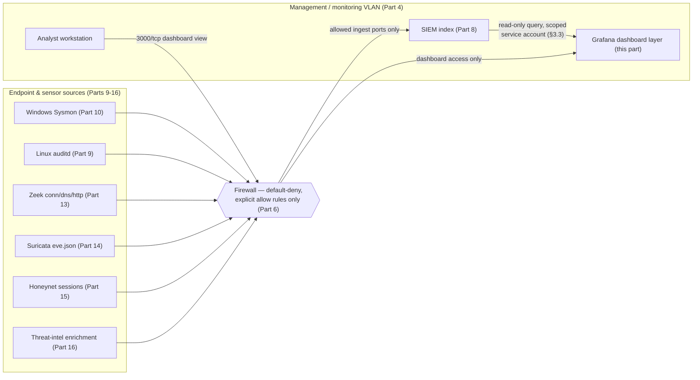

# Part 17 — Dashboards and Visualization Build

## Why this part exists

**[CONCEPT]** Parts 8 through 16 built a working pipeline: a SIEM that can search what arrives (Part 8), Linux and Windows endpoints producing real telemetry (Parts 9–10), Zeek and Suricata watching the wire (Parts 13–14), a honeynet generating unsolicited attacker traffic (Part 15), and a threat-intel enrichment feed (Part 16). Every one of those parts ends the same way — a Validation Test proving one thing arrived and is searchable. None of them answer a much more ordinary question you'll ask yourself constantly once the lab is running: is everything still alive, right now, without typing eight separate queries to check? That's this part's whole job. It builds a small number of dashboard panels that answer "is the pipeline healthy" and "does anything here look unusual" at a glance, on top of the ingest built in every part before it.

This part is not a detection-logic chapter. A panel that plots Suricata alert counts over time tells you alert volume changed; it does not tell you whether that change matters, which alert deserves triage first, or how to tune the rule that's firing too often — that judgment belongs to *Detection Engineering Handbook V2*, cited throughout below. It is also not a NOC-wall chapter. A single-operator home lab produces a few gigabytes of log data a day at most, not the sustained multi-terabyte firehose a real SOC's 55-inch wall display is built to summarize, and a dashboard copied from an enterprise reference architecture will mostly show empty panels and misleading "top 10" lists built for a cardinality your lab will never generate. What follows: choosing where dashboards live, sizing that layer, installing Grafana as a second visualization surface on top of the Part 8 SIEM's own dashboards, and building a specific, small panel set that validates every source built in Parts 8–16 instead of a decorative one.

> **Safety Gate**
> The dashboard layer built in this part is a second read-only window into every source this book has built so far — every endpoint, every honeynet session, every threat-intel match — which makes it a second thing that must stay inside the isolated segment architecture from Part 4, not a "just a viewer, it's fine" exception to it. Two concrete conditions must hold before you install anything below. First, whatever host runs Grafana (or the OpenSearch Dashboards already bundled with the Part 8 Wazuh install) binds its web interface only to an address reachable from the management VLAN, never to an interface with a route to your home network or the open internet. Second, if you ever turn on Grafana's anonymous/public-viewer mode for a "wall display" style screen (§3.3's Build Autopsy covers exactly this temptation), the display device itself must be physically on the isolated lab segment — never bridged onto your home network to make the screen easier to glance at from the living room. Confirm both against the Appendix A4 pre-flight checklist before exposing a dashboard URL to anything, including yourself on a laptop that also has a home Wi-Fi connection active.

## 1. What a home-lab dashboard is actually for

**[CONCEPT]** A real SOC's dashboard wall exists to compress a scale of data no single person could read line by line into a shape a shift of analysts can scan in seconds. Your lab has the opposite problem: with two or three endpoints, one NSM sensor, and a handful of honeynet decoys, the total event volume is small enough to read raw in the SIEM's search bar most days. So the dashboards in this part exist for three narrower, more honest reasons.

First, a fast health check. Instead of running six separate searches every morning to confirm the Linux endpoint's auditd feed, the Windows endpoint's Sysmon feed, Zeek, Suricata, the honeynet, and the threat-intel enrichment job are all still forwarding, one dashboard with six panels answers the same question in the time it takes to load a browser tab.

Second, a shared view during an exercise. Part 19's purple-team drills pair a simulated action with an expected detection; a dashboard panel that visibly moves the moment the simulated action runs is a far better shared reference during a drill than asking everyone involved to run their own query at the right second.

Third, an anomaly trigger, not an anomaly explanation. A panel showing Suricata alert volume triple overnight tells you to go look — it doesn't tell you what to do once you're looking, which is where *Detection Engineering Handbook V2* and the *SOC Playbook Handbook* pick up the thread (§7 below spells out exactly where).

## 2. Choosing a visualization layer

### 2.1 What you already have from Part 8

**[CONCEPT]** If Part 8's SIEM build used Wazuh, you already have a dashboard layer installed and running: OpenSearch Dashboards, bundled directly into the Wazuh install and reachable at the same HTTPS address as the rest of the platform. If you built on the Elastic Stack instead, Kibana is the equivalent bundled layer. Both are capable, full-featured visualization tools in their own right, tied to the same OpenSearch or Elasticsearch cluster the SIEM already writes to — for a reader who wants exactly one dashboard tool and no second install, everything in §4's panel list below can be built directly in whichever of these two you already have running, and you can skip §3 entirely.

### 2.2 Why add Grafana as a second layer

**[CONCEPT]** The reason to install a second tool on top of a perfectly functional bundled one is a single, specific gap: OpenSearch Dashboards and Kibana are both scoped to the one search cluster they ship with. Grafana's actual differentiator for this book isn't prettier panels — it's a single pane that can query more than one backend at once, which matters the moment your lab has more than one place data actually lives (the Part 8 SIEM's index, plus whatever Part 16's threat-intel job or Part 7's Pi-hole query logs store separately, or host-level metrics you might add in a later build). The table below compares the three options directly so you can decide whether that gap is worth a second install for your specific build, rather than defaulting to "more tools is more thorough."

| Property | OpenSearch Dashboards (bundled, Wazuh) | Kibana (bundled, Elastic Stack) | Grafana (standalone, this part) |
|---|---|---|---|
| Extra install required | No — already running from Part 8 | No — already running from Part 8 | Yes — separate package, separate VM or container recommended |
| Query scope | The one OpenSearch cluster it ships with | The one Elasticsearch cluster it ships with | Any configured data source, including more than one at once |
| Resource cost beyond Part 8 | None — shares the SIEM host's existing footprint | None — shares the SIEM host's existing footprint | Small but real — see §2.3 |
| Best fit for this book | Readers who built Wazuh and want zero extra moving parts | Readers who built Elastic and want zero extra moving parts | Readers who want one dashboard pulling from the SIEM and other sources side by side |

If your lab is small and you have no plan to add a second data source, staying on the bundled tool is the right call, not a compromise — the rest of this part still applies to it, since §4's panel list is about what to build, not which tool builds it. §3 walks through Grafana specifically for readers who do want the second layer.

### 2.3 Sizing the dashboard layer

**[COST/RESOURCE]** Grafana itself is a lightweight process compared to anything else in this book — it holds no log data of its own and simply queries whatever backend you point it at, so its own footprint is closer to a small web application than a database.

> **Resource Reality**
> Grafana's own sizing guidance treats roughly 512MB of RAM and a single vCPU as sufficient for a single-user or small-team instance with a modest dashboard count, and that number barely changes as you add panels, since almost all the real work (the actual search) happens on the OpenSearch or Elasticsearch cluster it queries, not on Grafana itself. What Grafana does not fix is an undersized SIEM underneath it: a heavy, wide-date-range panel query sent to an OpenSearch indexer that's already at the floor from Part 8's §2 sizing guidance will time out or visibly slow the whole SIEM, and the failure will look like "Grafana is slow" when the actual bottleneck is the indexer it's querying. Give Grafana its own small VM or a lightweight container rather than squeezing it onto the SIEM host itself — not because it needs the isolation for its own sake, but so a runaway dashboard query doesn't compete for the same CPU the indexer needs to keep ingesting.

The table below maps Part 3's three hardware tiers onto what the dashboard layer can carry without starving anything else already running on that tier.

| Hardware tier (Part 3) | Grafana placement | What it can carry |
|---|---|---|
| Repurposed laptop/mini-PC | Small LXC container or lightweight VM, separate from the SIEM host | A handful of dashboards querying one data source; avoid wide date-range panels (30+ days) on this tier |
| Dedicated home-server box | Dedicated small VM, 1 vCPU / 1GB RAM | The full §4 panel set, querying the SIEM plus one or two additional sources |
| Multi-node cluster | Dedicated VM with headroom to spare | Multiple dashboards, multiple data sources, and a "wall display" viewer profile from §3.3 without resource concerns |

## 3. Installing Grafana and connecting it to your lab's data

### 3.1 Installing the package

**[SETUP]** These commands target Grafana OSS's official APT repository on Ubuntu Server 22.04 LTS, the same distribution used for the Part 8 SIEM host — Grafana's own install docs cover other distributions and container images if your lab standardizes on something else.

```bash
sudo apt-get install -y apt-transport-https software-properties-common wget
sudo mkdir -p /etc/apt/keyrings/
wget -q -O - https://apt.grafana.com/gpg.key | gpg --dearmor | sudo tee /etc/apt/keyrings/grafana.gpg > /dev/null
echo "deb [signed-by=/etc/apt/keyrings/grafana.gpg] https://apt.grafana.com stable main" | sudo tee -a /etc/apt/sources.list.d/grafana.list
sudo apt-get update
sudo apt-get install -y grafana
sudo systemctl enable --now grafana-server
```

The key/repo URLs above still resolve, but Grafana's own current install docs have shifted to a renamed key file (`gpg-full.key` instead of `gpg.key`) stored as `/etc/apt/keyrings/grafana.asc` with an explicit `chmod 644` step, not the `.gpg` filename used above — functionally equivalent, but check the official docs if `apt-get update` starts complaining about the keyring (`OFFICIAL REFERENCE` — see `REFERENCES.md` entry [GRAFANA-INSTALL-DOCS]).

Confirm the install worked before touching configuration by checking that the service is actually up and listening where you expect:

```bash
sudo systemctl status grafana-server
ss -tlnp | grep 3000
```

`systemctl status` should report `active (running)`, and `ss` should show a process bound to `3000/tcp` — Grafana's default port. If nothing is listening, check `journalctl -u grafana-server` for the specific startup error before assuming the network path is the problem.

### 3.2 Locking down the default install before connecting anything

**[SAFETY]** Grafana ships with a default `admin`/`admin` login and forces a password change on the very first web login — do that first login, and change the password, before you attach a single data source. Log in at `http://<grafana-host>:3000` from a management-VLAN workstation only, per this part's Safety Gate; if that address is reachable from anywhere else at this point, stop and revisit Part 4's segmentation and Part 6's firewall rules before continuing, since an unauthenticated-by-default dashboard tool reachable from the wrong segment is exactly the same class of problem Part 8 called out for the SIEM itself.

### 3.3 Adding a read-only data source, not an admin one

**[SETUP]** Grafana needs a plugin to query OpenSearch (the storage layer under Wazuh's indexer) or Elasticsearch directly; install it and restart the service before adding the connection.

```bash
sudo grafana-cli plugins install grafana-opensearch-datasource
sudo systemctl restart grafana-server
```

Confirm the plugin actually registered before wiring up a connection: `grafana-cli plugins ls` should list `grafana-opensearch-datasource`, and "OpenSearch" should now appear as a data source type under Grafana's Connections → Data sources → Add data source screen. If it doesn't appear, the restart didn't pick up the new plugin — re-run it before continuing.

The credential that connection uses matters more than the plugin itself. **[SAFETY]** Do not point Grafana's data source at the same admin account Part 8's SIEM install generated for you — that account can create users, change indices, and delete data, none of which a dashboard viewer needs. Wazuh's own OpenSearch security configuration (documented in its own admin guide, not repeated step by step here since it's a Part 8 SIEM-administration task rather than a dashboard-building one) supports creating a scoped role limited to read-only queries against the alert indices; create that role and a dedicated service account for it before wiring Grafana in.

```yaml
# CONCEPTUAL SAMPLE — invented hostname, index pattern, and credential placeholder;
# substitute your own SIEM host address and the read-only service account you created.
apiVersion: 1
datasources:
  - name: Wazuh OpenSearch (read-only)
    type: grafana-opensearch-datasource
    access: proxy
    url: https://siem.lab.internal:9200
    jsonData:
      database: "wazuh-alerts-*"
      flavor: opensearch
      version: "2.11.0"
      tlsSkipVerify: false
    basicAuth: true
    basicAuthUser: "grafana-viewer"
    secureJsonData:
      basicAuthPassword: "<read-only-service-account-password>"
```

Place a file like the sample above under `/etc/grafana/provisioning/datasources/` and restart `grafana-server`; confirm the connection under Grafana's own Data Sources screen with its built-in "Test" button before building any panel on top of it — a failed test at this stage saves you from debugging an empty panel later and wondering whether the panel query or the connection itself is the problem.

> **Build Autopsy — the anonymous wall dashboard that almost bridged two networks**
>
> **The plan:** Turn on Grafana's anonymous-viewer mode so a spare monitor could display the honeynet session count and Suricata alert volume around the clock without anyone logging in, the way a real SOC's wall display works.
>
> **Why it seemed reasonable:** Anonymous viewing is a documented, one-line Grafana config option, and a screen you never have to log into is genuinely more useful for a glance-on-the-way-past display than one behind a credential prompt.
>
> **How it failed:** The spare monitor's driving mini-PC had no easy way to reach the isolated management VLAN from where it physically sat, and the fastest fix looked like plugging it into the nearest home-network switch port and adding a port-forward or a second NIC bridge so the browser could reach Grafana's address. That "fastest fix" is precisely the failure Part 4 exists to prevent — it would have put a device with a route into the home network directly on the same physical segment the dashboard was displaying honeynet and SIEM data from, defeating the isolation of every other part in this book for the sake of a convenience display.
>
> **The fix:** No bridge was built. The display device was instead moved onto a dedicated switch port already trunked into the lab's isolated VLAN (the same physical wiring pattern Part 4 and Part 6 already establish for every other lab host), and anonymous viewing stayed on — but only for a device that was already inside the isolation boundary, not as a justification for extending the boundary to reach a device that wasn't.

## 4. Designing panels that fit a home lab's actual data volume

### 4.1 The panel checklist

**[CONCEPT]** The table below is the panel set this part actually recommends building first — six panels, each one validating a specific source from Parts 8–16 rather than decorating a dashboard with metrics nobody will check. Build these before adding anything more elaborate; a dashboard with six panels you actually look at beats one with 40 you don't.

| Panel | Data source (Part) | Index/query target | What it validates |
|---|---|---|---|
| Log volume by source, last 24 hours | SIEM (Part 8) | `wazuh-alerts-*` grouped by `agent.name` | Every endpoint and sensor is still forwarding, not just the SIEM itself |
| Endpoint last-seen / heartbeat | Linux & Windows endpoints (Parts 9–10) | Agent check-in timestamp per `agent.id` | An endpoint hasn't silently stopped forwarding without an obvious error |
| Zeek session volume by protocol | Zeek (Part 13) | `conn.log` events grouped by `service` | The NSM sensor's capture interface is still receiving mirrored traffic |
| Suricata alert count by severity | Suricata (Part 14) | `eve.json` events where `event_type` is `alert`, grouped by `alert.severity` | Rule tuning from Part 14 §8 is holding — a sudden spike means something changed, not necessarily something bad |
| Honeynet session count by decoy | Honeynet (Part 15) | Session-correlation output grouped by decoy host | Every deployed decoy is still receiving unsolicited contact, not silently offline |
| Threat-intel indicator match count | Threat-intel enrichment (Part 16) | Enrichment job output where a match occurred | The enrichment pipeline is actually running, not just configured |

### 4.2 Panels that don't work at lab scale

**[CONCEPT]** A pattern copied directly from an enterprise SOC dashboard reference — a "top 10 source IPs" table, a world map heat layer, a rolling 30-day trend line — assumes a cardinality and volume this lab doesn't generate, and building it anyway produces a panel that's technically correct and practically useless.

> **Engineering Reality**
> A "top 10 source IPs" panel documented as a standard SOC dashboard pattern assumes hundreds or thousands of distinct source addresses to rank meaningfully. Point that same panel design at a home lab's honeynet, and on most days you'll see three or four decoy-facing addresses total, sorted in an order that changes every time one of them gets scanned twice instead of once — the panel isn't wrong, it's just answering a question your data is too small to make interesting. Panels that hold up at lab scale are the ones in §4.1's table: counts over time and simple groupings, not rankings that need volume to be meaningful.

## 5. Hands-on lab: building the lab health dashboard

**[HANDS-ON LAB]** Goal: build the first panel from §4.1's table — log volume by source over the last 24 hours — and confirm it actually moves when new data arrives, rather than trusting that a correctly-configured data source automatically means a correctly-configured panel.

The diagram below shows where this panel's query actually travels: from each Part 8–16 source, through the firewall's default-deny rules, into the SIEM's index, and out to Grafana for display — the same VLAN boundary every earlier part in this book has been building toward.





**Figure 17.1 — Dashboard query path across the ingest pipeline built in Parts 8–16.** *CONCEPTUAL.* Illustrates how a single Grafana panel's query travels from the SIEM's index, itself fed by every endpoint and sensor built earlier in the book, back out to an analyst workstation, all without crossing outside the Part 4 VLAN boundary or the Part 6 firewall's explicit allow rules. This is an architecture sketch, not a capture from a running dashboard — no commercial SIEM or standalone Grafana instance is currently running in the author's own real lab, so no REAL LAB EXAMPLE screenshot of this specific panel exists to cite here. Diagram ID `FIG-17-01`.

Steps:

1. In Grafana, create a new dashboard and add a new panel using the read-only data source connected in §3.3.
2. Set the query to count documents in `wazuh-alerts-*` over the last 24 hours, grouped by `agent.name`.
3. Set the visualization type to a time-series or bar chart — either shows the same information clearly at this data volume.
4. Save the dashboard with a name that says what it's for, such as "Lab health — last 24h," not a default "New dashboard" title you'll have five duplicates of within a month.
5. On any lab endpoint, generate one new test event and confirm the panel's count for that endpoint's `agent.name` increases within the SIEM's normal ingest delay.

> **Validation Test**
> **Setup:** Grafana installed and connected per §3, with the §5 panel built against `wazuh-alerts-*` grouped by `agent.name`.
> **Action:** On the Part 8 SIEM host itself, run `logger -t labtest "part17 dashboard check $(date +%s)"` — the same test-event pattern Part 8 §5 used to confirm ingest.
> **Expected result:** The panel's count for that host's `agent.name` increases by one within the SIEM's normal ingest delay, without needing to refresh the browser tab manually if the dashboard's auto-refresh interval is set. If the count doesn't move, the problem is almost always the query's index pattern or time-field mapping, not the underlying data — check §6 before assuming the SIEM itself stopped ingesting.

> **Lab Note**
> Set every panel's time-field mapping explicitly to the field your SIEM actually uses for event time (Wazuh's OpenSearch indices typically use `timestamp`), rather than trusting Grafana's auto-detected default. A dashboard that silently falls back to Grafana's own ingest-time field instead of the event's real timestamp will still render a chart — it just won't be the chart you think it is, and nothing about the panel looks broken to tell you that.

## 6. Troubleshooting dashboards that show nothing, or lie

**[TROUBLESHOOTING]** Three failure modes account for nearly every broken or misleading first dashboard.

**A panel shows "No data" even though the SIEM search bar finds the same events.** This is almost always an index pattern mismatch, not a missing-data problem — Wazuh's indices are date-stamped (`wazuh-alerts-4.x-2026.09.15`, for example), and a data source or panel query pointed at an exact index name instead of a wildcard pattern (`wazuh-alerts-4.x-*`) stops matching the moment the date rolls over. Confirm the data source's configured index pattern actually uses a wildcard before assuming the connection itself is broken.

**A panel's numbers don't match what a direct SIEM search returns for the same time window.** Check the time zone Grafana is applying to the panel against the time zone the SIEM stores timestamps in — a dashboard defaulting to the browser's local time zone while the underlying index stores UTC produces a panel that's silently off by however many hours separate the two, most visibly right around midnight, when events appear to land on the wrong day entirely.

**A "healthy-looking" dashboard with every panel populated stops updating entirely, and nobody notices for days.** A panel with data in it from an hour ago looks identical to a panel with data in it from a week ago at a glance, especially on a bar chart with no visible timestamp axis label. Set every panel's auto-refresh interval explicitly rather than leaving it on a manual-refresh default, and treat a dashboard that hasn't visibly changed across a refresh cycle as a reason to check the underlying pipeline directly, not evidence the lab has simply been quiet.

## 7. Where this part stops, and what to do with the dashboards next

**[CONCEPT]** A dashboard that visibly moves is proof the pipeline built in Parts 8–16 is alive. It is not, by itself, a decision about whether anything it shows is a problem — closing that gap is deliberately split across this library's other three volumes, and each one has a specific, concrete next action once a panel here changes.

- **When a panel's alert-volume count spikes**, open the specific query behind it directly in the SIEM and hand that raw event set to *Detection Engineering Handbook V2*'s correlation and baselining content (its Parts 22–33) — the dashboard's job was to make you look; deciding whether the spike is a tuning problem, a real detection, or expected noise from a Part 18 or Part 19 exercise is that book's job, not a call to make from the panel alone.
- **When a panel shows a fired Suricata or honeynet alert you don't immediately recognize**, pull the matching procedure from the *SOC Playbook Handbook*'s Playbook Library rather than triaging it ad hoc from the dashboard — the panel tells you something happened; the playbook tells you what to check first, what to escalate, and when a test alert should simply be closed as confirmed-benign.
- **When you run a Part 19 purple-team drill**, use the §4.1 panel set — specifically the alert-count and honeynet-session panels — as the shared, timestamped evidence of whether the simulated action produced the expected detection within the expected window. That observation is exactly the graded input the *SOC Manager's Operating Handbook*'s assessment-design content (its Part 8) and onboarding content (its Part 11) are built to structure into a repeatable drill, rather than an informal "did it seem to work."
- **This book's own Part 19** is where the loop closes fully — pairing a specific simulated action with a specific detection this dashboard would show firing, and a specific playbook response to it. **Part 22** carries the same panels forward into the book's closing synthesis of what to actually do with a finished lab.

> **Blind Spot**
> A dashboard panel can only ever show what the SIEM already indexed correctly — it inherits every parsing and normalization gap Part 8 explicitly left to *Detection Engineering Handbook V2*'s Parts 5–7, and it cannot distinguish "nothing happened" from "the pipeline silently stopped." A flat, empty Suricata alert-count panel means either a quiet lab or a broken sensor, and the panel alone cannot tell you which — that's exactly why §4.1's panel set includes a log-volume-by-source and endpoint-heartbeat panel next to the alert panels, so a broken pipeline shows up as a flat health panel even on a day with zero real alerts.

> **What Would Change My Mind**
> This part recommends a deliberately small, six-panel dashboard over a larger enterprise-style layout, on the grounds that a home lab's data volume makes most enterprise panel patterns (rankings, heat maps, wide rolling trends) uninformative at this scale. If a reader's lab grows past a handful of endpoints and sensors into something closer to a small production network — enough distinct hosts and traffic that a "top 10" ranking or a geographic heat map actually varies meaningfully day to day — that specific volume threshold, not the general "keep it small" framing, would be the concrete reason to revisit this recommendation.

---

**Cross-references:** Part 3 (hardware tiers), Part 4 (network isolation this part's Safety Gate depends on), Part 6 (firewall rules gating dashboard access), Part 7 (Pi-hole/DNS query logs as an additional Grafana data source), Part 8 (SIEM platform and its bundled OpenSearch Dashboards/Kibana), Part 9 (Linux endpoints/auditd feeding the endpoint-heartbeat panel), Part 10 (Windows endpoints/Sysmon feeding the same panel), Part 13 (Zeek session-volume panel source), Part 14 (Suricata alert-count panel source), Part 15 (honeynet session-count panel source), Part 16 (threat-intel indicator-match panel source), Part 18 (attack-simulation traffic these panels will visibly react to), Part 19 (purple-team drills using this part's panels as shared evidence), Part 22 (closing synthesis), Appendix A4 (safety and isolation pre-flight checklist); *Detection Engineering Handbook V2* Parts 5–7 (parsing/normalization this part's panels depend on) and Parts 22–33 (correlation/baselining once a panel flags something); *SOC Playbook Handbook*'s Playbook Library (triage procedure once a panel-flagged alert needs action); *SOC Manager's Operating Handbook* Part 8 (assessment design) and Part 11 (onboarding/ramp-up), both consuming this part's dashboards as drill evidence.
