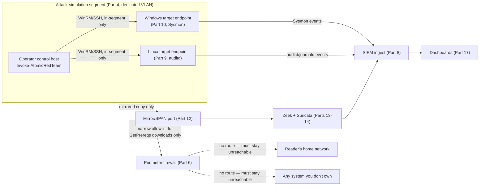

# Part 18 — Safe Attack Simulation with Atomic Red Team–Style Tooling

## Why this part exists

Every earlier build part in this book gets you telemetry the honest way: install a real endpoint, install a real SIEM, wait for real activity to produce real logs. That works, but it's slow, and it never tells you whether a specific detection actually fires for the reason you think it does — you'd have to wait for a real attacker, or lie to yourself about what "normal use" happened to trigger. This part closes that gap. Atomic Red Team, and tools built the same way, give you a library of small, single-technique test cases, each mapped to a specific MITRE ATT&CK ID, each reversible by design. Run one against an endpoint you own, on a segment that can't reach anything else, and you get exactly the telemetry a specific technique should produce, on demand, with a known cause — the single most useful thing a home lab can manufacture for validating the Sysmon and `auditd` work from Parts 9 and 10.

This is also, bluntly, the part of this book most likely to get skimmed out of order. A reader who has already skipped ahead to "the fun part" may not have Part 1's ownership rule or Part 4's isolation model fresh in mind, so this part restates both in full rather than assuming they carried over. If you're reading this part first, or reading it again after a break, read the Safety Gate below before anything else — it is not a formality here.

**[CONCEPT]** What this part does not teach: offensive technique development, exploit writing, EDR/AV evasion, or real-world red-teaming methodology. Atomic Red Team-style tooling runs known, published, single-technique tests against systems you already own — it is a validation tool for defenders, not a red-team curriculum. If you came here looking for how to build a novel attack, this is the wrong book; if you came here looking for how to prove your Sysmon config actually catches something specific, keep reading.

> **Safety Gate — mandatory pre-flight checklist, restated in full for this part**
>
> This is the highest-risk-of-misuse part in the book, so the one rule that governs everything in it gets repeated here rather than assumed read: you attack and defend only systems you own, on a network segment that cannot reach — and cannot be reached by — anything you don't own. Atomic Red Team's own project documentation states its tests are meant to run in a lab environment, not against production or third-party systems; this book holds you to exactly that line, with no exceptions for "it's just a discovery command" or "it's just my own laptop for a second." Before you install anything in §4, and before every single session after that, confirm each item below against the full procedure in Appendix A4 — don't rely on memory of having checked it last time.
>
> 1. **Target endpoints stay on the isolated segment.** The Windows host from Part 10 and/or the Linux host from Part 9 that you're about to run tests against sit on the lab/victim segment built in Part 4, with the same zero-route-to-home guarantee every other part in this book depends on — not bridged, not dual-homed, not reachable from your everyday devices.
> 2. **The operator control host is also confined to that segment.** Whatever machine runs `Invoke-AtomicTest` — a dedicated lab VM, not your daily-driver laptop — reaches the targets only over WinRM or SSH sessions that stay inside the lab segment. Opening a session from a device that's also logged into anything you care about defeats the isolation the moment that device gets compromised back.
> 3. **Egress from the segment is deny-all by default.** The one exception is a narrow, explicit allowlist for the small number of atomics whose prerequisite step downloads a real file from the internet (§5) — and that allowlist gets reviewed before every session, not set once at Part 6 and forgotten about here.
> 4. **Every target has a fresh snapshot taken immediately before the session starts.** Some atomics are destructive by design (§5); a snapshot from minutes ago, not a hope that the test's cleanup command works, is the actual undo button.
> 5. **Nothing here ever points at a hostname, IP, or account you don't personally own and control** — not a coworker's machine, not a cloud tenant that isn't yours, not "just a quick scan" of anything outside the segment above.
>
> If any one of these isn't true right now, stop and fix it before reading further. This is the one callout in this book that never shrinks to a cross-reference.

## 1. What Atomic Red Team actually is

**[CONCEPT]** Atomic Red Team is an open-source project maintained by Red Canary (`redcanaryco/atomic-red-team` on GitHub): a library of small YAML-defined test cases, each called an "atomic," each mapped to one specific MITRE ATT&CK technique or sub-technique ID. A single atomic declares which platforms it supports (`windows`, `linux`, `macos`), an executor (`powershell`, `command_prompt`, `sh`, `bash`, or `manual`), the literal command or commands to run, an optional prerequisite the test needs before it can run (a file, a tool, a registry key), and — this is the part that makes the whole model safe to use in a lab — an optional `cleanup_command` that reverses the test's effect. The companion execution framework, `Invoke-AtomicRedTeam`, wraps that YAML into three verbs a PowerShell console understands: check and install prerequisites, run the test, and clean up afterward.

**[CONCEPT]** "Safe" here means something specific, not a general reassurance. Each atomic is small and single-technique by design — it does one thing mapped to one ATT&CK ID, not a chained multi-stage campaign toward a real objective. Most atomics are reversible, with the reversal command shipped alongside the test itself rather than left for you to figure out. And every atomic is published, reviewed, community-maintained content — you are never writing or discovering a novel exploit to run this content, only executing something already fully documented. That narrow definition of "safe" is also its limit: safety here describes the test's blast radius on a target you own, not a guarantee about what happens if you point any of this at a system you don't own. Nothing changes that second part — see the Safety Gate above.

Table 18.1 lays out the YAML fields worth reading before you run any atomic, since skipping straight to the command line is exactly how a reader misses the one field — `cleanup_command` — that tells you whether the test undoes itself.

**Table 18.1 — Atomic test YAML fields worth reading before you run one.** The table below supports deciding whether a specific atomic is safe to run as-is or needs extra caution before you type the command.

| Field | What it tells you | Why check it first |
|---|---|---|
| `attack_technique` | The MITRE ATT&CK ID this test maps to | Confirms what your detection is actually supposed to catch before you run anything |
| `supported_platforms` | `windows`, `linux`, `macos`, or a subset | Some technique IDs only have a test for one OS — don't assume Windows/Linux parity |
| `executor.name` | `powershell`, `command_prompt`, `sh`, `bash`, or `manual` | `manual` means there's no automated way to run or clean it up — you do both steps by hand |
| `dependencies` / `get_prereq_command` | What the test needs staged before it runs (a file, a tool, a config value) | Some prerequisites download a real file from the internet — this is where egress control (§5) matters |
| `cleanup_command` | The command that reverses the test's effect | Empty or absent means nothing automated undoes this test — snapshot before you run it |

## 2. Evidence and honesty: what's build-tested here and what isn't

**[CONCEPT]** In keeping with this book's own honesty standard (`STYLE-GUIDE.md` §9, and the same discipline Part 11 applies to the Windows domain gap), this part says plainly what it can and can't back with a real capture. The author's actual running lab — the Proxmox host, the honeynet, the monitored Linux containers cited as `REAL LAB EXAMPLE` evidence throughout this book and *Detection Engineering Handbook V2* — does not currently run Atomic Red Team or an equivalent framework. Every command, table, and diagram in this part is either `CONCEPTUAL` (the diagrams, the risk-tier framing) or `OFFICIAL REFERENCE` (Red Canary's own documented install and invocation syntax, reproduced because it's the actual documented interface, not because the author ran it against a lab host and captured the result). Nothing below is labeled `REAL LAB EXAMPLE` or `CONTROLLED LAB EXAMPLE`, and nothing should be — that would be exactly the fabricated-evidence failure mode this book's review checklist is built to catch.

That gap matters less than it might for a Windows/AD domain, because unlike Part 11's abandoned build, nothing here was attempted and stalled — the project this part teaches is a well-documented, widely deployed open-source tool with a stable, publicly verifiable command surface, not a half-finished infrastructure build with unknown failure modes. The honest caveat is narrower and more specific: the *specific interaction* between this book's Sysmon baseline (Part 10), `auditd` rule set (Part 9), and a given atomic's exact telemetry shape has not been personally verified end to end in this lab. Treat every Validation Test in this part as a description of what the tool's documentation and MITRE's own technique write-up say should happen, and confirm it against your own build before trusting it as ground truth.

## 3. Why the isolation model matters here specifically

**[SAFETY]** Every other part in this book isolates a *component* — a SIEM, a honeypot, an endpoint. This part is different: it's the one place in the book where the isolated segment has to contain a tool whose entire purpose is to deliberately trigger the exact behaviors your detections, your NSM sensors, and (if you built Part 15) your honeynet are all watching for, on demand, repeatedly. Figure 18.1 shows where the operator control host and its targets sit relative to everything else this book has built.





**Figure 18.1 — Attack-simulation segment topology and isolation boundary.** *CONCEPTUAL.* Illustrates the intended placement of an operator control host and its target endpoints inside the Part 4 lab segment, the telemetry paths those targets already feed (Sysmon/auditd into the SIEM, mirrored traffic into Zeek/Suricata), and the two things the perimeter firewall from Part 6 must never route to. This is an architecture sketch of the intended build, not a capture from a running deployment — see §2. Diagram ID `FIG-18-01`.

**[SAFETY]** The detail worth pulling out of that diagram explicitly: the operator control host is not exempt from segmentation just because it's "your" tool running "your" commands. It is a machine with credentials that can reach every target endpoint in the segment, which makes it exactly as sensitive as a domain controller or a SIEM manager — if it were ever reachable from outside the segment, compromising it would hand an attacker the same WinRM/SSH access you use for legitimate testing. Confine it the same way Part 4 confines everything else, and never reuse it as a general-purpose lab jump box for unrelated tasks.

## 4. Installing the Atomic Red Team execution framework

**[SETUP]** These steps target the `Invoke-AtomicRedTeam` PowerShell module and PowerShell 7.4.x, following Red Canary's own published installation instructions (`OFFICIAL REFERENCE`). PowerShell 7 (`pwsh`) is cross-platform, which is why the same module and the same commands below work against a Windows target's console, a Linux target's `pwsh` shell, or an operator control host running either OS — you are not maintaining two separate toolchains for two separate platforms.

1. On the operator control host (not a target endpoint), install PowerShell 7. Windows ships only Windows PowerShell 5.1 by default — PowerShell 7 (`pwsh`) needs a separate install even on a current Windows build, via `winget install --id Microsoft.PowerShell --source winget` or the MSI package from the `PowerShell/PowerShell` GitHub releases page. On Debian/Ubuntu, Microsoft's own repository provides a `powershell` package instead.
2. On the Windows target endpoint from Part 10, confirm PowerShell remoting is enabled so the control host can reach it over WinRM — `Enable-PSRemoting -Force`, run once as an administrator; it's off by default on a standalone Windows install.
3. On the Linux target endpoint from Part 9, install PowerShell 7 and register it as an SSH subsystem so the control host can reach it over PowerShell-over-SSH remoting — add a `Subsystem powershell /usr/bin/pwsh -sshs -NoLogo` line to `sshd_config` and restart `sshd`, per Red Canary's own remote-execution documentation.
4. From a `pwsh` session on the operator control host, run the project's install script:

```powershell
IEX (IWR 'https://raw.githubusercontent.com/redcanaryco/invoke-atomicredteam/master/install-atomicredteam.ps1' -UseBasicParsing)
Install-AtomicRedTeam -getAtomics
```

5. Confirm the module loaded and the atomics repository is present:

```powershell
Get-Module -Name invoke-atomicredteam -ListAvailable
Invoke-AtomicTest T1082 -ShowDetailsBrief
```

`Invoke-AtomicTest T1082 -ShowDetailsBrief` should list one or more numbered tests for System Information Discovery without running any of them — this is a read-only listing command, safe to run on the operator control host itself while you're still setting up, before a single test executes against a target.

> **Validation Test**
> **Setup:** `Invoke-AtomicRedTeam` installed per the steps above, on an operator control host inside the Part 4 lab segment (§3).
> **Action:** `Invoke-AtomicTest T1082 -ShowDetailsBrief`
> **Expected result:** A list of one or more numbered atomic tests for T1082 (System Information Discovery), each showing its name, supported platform(s), and executor type — no target endpoint is touched by this command, since `-ShowDetailsBrief` only reads the local atomics repository.

## 5. Choosing which atomics are safe to run first: risk tiers

**[SAFETY]** Not every atomic carries the same weight, and treating them all as interchangeable is the single most common way a reader gets an unpleasant surprise from otherwise well-documented tooling. Table 18.2 sorts the technique library into four risk tiers by what the test actually does to the target, not by how alarming its ATT&CK name sounds.

**Table 18.2 — Atomic test risk tiers to check before you run one blind.** The table below supports deciding what pre-run precaution, if any, a given atomic needs beyond the baseline Safety Gate checklist.

| Risk tier | Example technique | What makes it this tier | Pre-run check |
|---|---|---|---|
| Read-only / discovery | T1082 (System Information Discovery) | Only queries local system state; no persistence artifact, no network egress | None beyond the baseline checklist — safe as a first test |
| Requires cleanup | T1547.001 (Boot or Logon Autostart Execution: Registry Run Keys) | Leaves a persistence artifact on the target until its `cleanup_command` runs | Always run the `-Cleanup` step immediately after the test; verify the artifact is actually gone before moving on |
| Requires network egress | T1105 (Ingress Tool Transfer) | The test's prerequisite step downloads a real file from an external URL to prove file-transfer detection | Confirm the allowlisted egress path from the Safety Gate covers exactly that destination, or stage the file locally and run offline |
| Destructive | T1490 (Inhibit System Recovery) | Deletes shadow copies or backup catalogs on the target — not reversible on that host without a snapshot | Never run without a fresh snapshot taken immediately beforehand; treat the target as fully disposable for this session |

**[TROUBLESHOOTING]** The `cleanup_command` field is not a guarantee, only a documented attempt. Community-reported issues against the `atomic-red-team` repository include atomics whose cleanup step assumes a default file path, a specific registry hive location, or an execution context (elevated versus standard user) that doesn't match every environment — when that assumption doesn't hold, the cleanup command can run without error and still leave the artifact in place. Confirm the artifact is actually gone with your own check (a registry query, a file listing, a service status) rather than trusting a clean exit code from `-Cleanup` alone, especially for anything in the "requires cleanup" or "destructive" tiers above.

## 6. Hands-on lab: running your first atomic test end to end

**[HANDS-ON LAB]** Goal: run the same read-only atomic — T1082 (System Information Discovery) — against both a Windows target (Part 10) and a Linux target (Part 9), and confirm each produces the telemetry the technique should produce in the SIEM you built in Part 8. T1082 sits in TA0007 (Discovery), the ATT&CK tactic covering an adversary's attempts to learn about the system and network they're on — a near-universal early step, and one of the least destructive things to validate first.

1. On the operator control host, open a session to the Windows target endpoint over WinRM: `$winSession = New-PSSession -ComputerName <windows-target> -Credential (Get-Credential)`. Confirm the session opens successfully from strictly inside the lab segment (§3).
2. Open a second session to the Linux target endpoint over PowerShell-over-SSH remoting: `$linuxSession = New-PSSession -HostName <linux-target> -UserName <lab-user>`.
3. Run `Invoke-AtomicTest T1082 -ShowDetailsBrief -Session $winSession` targeting the Windows endpoint. Check that at least one listed test's executor is `command_prompt` or `powershell`.
4. Run the test itself against the Windows target: `Invoke-AtomicTest T1082 -Session $winSession`.
5. Within a minute or two, search the SIEM for a Sysmon Event ID 1 (Process Create) entry on that host, `Image` matching the discovery command the atomic ran (typically `systeminfo.exe` or a PowerShell `Get-ComputerInfo` invocation), with `ParentImage` pointing to the WinRM host process that launched it.
6. Run the platform-appropriate T1082 test against the Linux target: `Invoke-AtomicTest T1082 -Session $linuxSession` (typically a `uname -a` or `/etc/os-release` read via the `sh`/`bash` executor).
7. Check `ausearch -k exec -ts recent` on the Linux target for a `type=EXECVE` record whose argument vector matches the command the atomic ran, tagged with the `exec` key — the same syscall-auditing rule Part 9 built to catch every process launch on that endpoint.
8. Confirm both events also appear in the Part 8 SIEM, not just in the local Sysmon/`auditd` output. If a step 5 or step 7 event exists locally but never reaches the SIEM, the break is in the forwarding path built in Parts 9–10, not in the atomic test itself.

> **Validation Test**
> **Setup:** T1082 confirmed listed via `-ShowDetailsBrief` (§4) against both a Windows target (Sysmon deployed per Part 10) and a Linux target (`auditd`'s `exec` key active per Part 9), both forwarding to the Part 8 SIEM.
> **Action:** `Invoke-AtomicTest T1082 -Session $winSession` and `Invoke-AtomicTest T1082 -Session $linuxSession`.
> **Expected result:** A Sysmon Event ID 1 (Process Create) entry for the Windows target and a `type=EXECVE` record tagged `key="exec"` for the Linux target, both visible in the SIEM within roughly a minute, both with a command line matching exactly what the atomic's YAML says it runs — this is the whole point of the exercise: known cause, known effect, confirmed in your own telemetry rather than assumed from the tool's description.

> **Engineering Reality**
> `Invoke-AtomicTest`'s documentation describes running a test as executing the technique; in practice, the cmdlet considers a test "successful" the moment the command exits without throwing a PowerShell error — it does not independently verify that the technique's intended effect actually happened on the target. A discovery command that runs but returns empty output (a permissions issue, a missing binary, a shell that doesn't support the syntax the atomic assumes) still reports as executed with no red flag anywhere in the invoker's own output. This is exactly why step 5 and step 7 above check the SIEM and `ausearch` output directly instead of trusting the console output that the test "ran" — the atomic framework tells you a command was issued, not that the technique's evidence landed where your detection expects it.

## 7. Mapping atomic runs back to the detections you already built

**[CONCEPT]** Running an atomic and seeing an event in the SIEM is not the same thing as having validated a detection. §6's Sysmon Event ID 1 and `auditd` `exec`-keyed records are raw telemetry — proof the pipeline works, not proof any rule fired on it. Turning that raw telemetry into an actual validated detection is explicitly *Detection Engineering Handbook V2*'s job, and it owns two specific, named pieces of this:

- **Detection Testing** (its Part 37) is where "fires correctly, fires for the right reason, doesn't fire on normal activity" gets defined rigorously — an atomic run is one concrete input to that process, not a substitute for it. Running T1082 once and seeing an event is not the same as confirming a discovery-activity detection rule actually matches that event and doesn't also match every legitimate `systeminfo` call your help-desk scripts make.
- **Detection Coverage** (its Part 41) is the ATT&CK coverage model that explicitly rejects "detection exists on paper" as equivalent to "detection is tested" or "detection was recently validated" — an atomic run against your own lab endpoint is precisely the mechanism that moves a technique from "detection" to "tested" on that coverage model, and re-running the same atomic periodically is what keeps it at "recently validated" instead of quietly drifting back down as your rule set, parser, or SIEM version changes underneath it.

For the telemetry-interpretation layer underneath both of those — what a specific Sysmon field or `auditd` key actually means — *Detection Engineering Handbook V2*'s Sysmon Detection Engineering content (its Part 9) and its Telemetry Engineering I content (its Part 3, which owns `auditd`) are the parts to read next, not this one; this part's job stops at "the known-cause event landed in the SIEM, here's exactly what caused it."

## 8. Sizing the simulation segment

**[COST/RESOURCE]** The operator control host is a new role this book hasn't sized yet — it isn't a target endpoint like Parts 9–10's hosts, and it isn't a service host like Part 7's DNS container. Table 18.3 sizes it alongside the target roles it drives, reusing Parts 9 and 10's own numbers for the targets rather than re-deriving them.

**Table 18.3 — Attack-simulation segment sizing by role.** The table below supports deciding how much additional hardware this part's build adds on top of what Parts 9–10 already committed.

| Role | Platform | Min RAM | Min disk | Notes |
|---|---|---|---|---|
| Operator control host | Windows or Linux VM, PowerShell 7 (`pwsh`) | 2GB | 10GB | Runs `Invoke-AtomicRedTeam`; never reused as a general-purpose lab jump box (§3) |
| Windows target endpoint | Reused from Part 10 | 2–4GB | 40GB+ | Snapshot immediately before every session, not just the first one |
| Linux target endpoint | Reused from Part 9 | 1–2GB | 10GB+ | `auditd`'s `exec` key (Part 9 §5.2) must already be active before §6's lab has anything to check |

> **Resource Reality**
> The operator control host itself is light — 2GB of RAM comfortably runs PowerShell 7 and the atomics repository, since the host does almost no local work beyond issuing remote commands. The real cost this part adds isn't the control host; it's the snapshot storage the Safety Gate's checklist item 4 requires. A fresh snapshot before every session, on every target endpoint, adds up fast if you're running several atomics a week — budget disk headroom for snapshot churn the same way Part 20's maintenance content already tells you to, or the snapshot discipline this part depends on for safety becomes the first thing skipped when disk space gets tight.

## 9. Cleanup discipline and the limits of automation

**[TROUBLESHOOTING]** §5 already named the specific failure mode — a `cleanup_command` that exits cleanly without actually reversing the artifact. The practical habit that catches this: after every atomic in the "requires cleanup" or "destructive" tier, check the artifact directly rather than trusting the invoker's exit status. For a registry-run-key atomic, that means actually querying the key, not just running `-Cleanup` and moving on. For a scheduled-task or cron-based persistence atomic, that means listing scheduled tasks or crontab entries afterward, not assuming the cleanup step's silence means success.

> **Lab Note**
> Snapshot every target immediately before a session, the same discipline Part 9's `auditd` work and Part 20's maintenance content both already teach — and for this part specifically, snapshot *before* the session, not after you've decided a given atomic "looks safe enough to skip it." The atomics in the read-only tier (Table 18.2) are the only ones where skipping the snapshot is even defensible, and even then, a 5-second snapshot is cheap insurance against being wrong about which tier a given test actually belongs to.

**[SAFETY]** If a cleanup step fails and you can't manually reverse the artifact with confidence, the correct move is reverting the target from the pre-session snapshot, not continuing to the next atomic on a target you're no longer sure is in a known state. A lab endpoint with an unverified leftover persistence mechanism from a previous session is exactly the kind of drift that makes a later exercise's results unreliable — you won't know if a detection fired because of the atomic you just ran or a stale artifact from three sessions ago.

## 10. What this tooling doesn't teach you

> **Blind Spot**
> A single atomic validates one technique, in isolation, with no adversary decision-making behind it — it tells you whether your Sysmon config or `auditd` rule set produces the right event when a known command runs, and nothing about how a real intrusion actually unfolds. Real attackers chain techniques toward an objective, adapt when a step fails, and actively try to avoid detection; nothing in this part teaches EDR evasion, obfuscation, or the judgment calls a real adversary makes under uncertainty, and it shouldn't — that's a different skill than the one this book is building, and BOOK-INDEX.md is explicit that this part stops at generating known-cause telemetry, not simulating a real intrusion end to end. Part 19's purple-team drills get closer to that by pairing a sequence of atomics with a specific hunt, but even that stays a scripted, known sequence — treat every green checkmark from this part's exercises as "this one technique in isolation is covered," not "this lab would catch a real attacker."

> **What Would Change My Mind**
> This part recommends the published `atomic-red-team` community library over hand-writing your own test scripts, on the grounds that the community repository is broader, already ATT&CK-mapped, and ships cleanup commands you'd otherwise have to write yourself. If a reader's specific detection depends on a technique variant the published atomics don't cover — a particular LOLBin argument pattern, a specific encoding scheme — that specific gap, not a general "write your own instead," would be the concrete reason to author a custom atomic YAML file rather than defaulting to the library wholesale.

## 11. Where this telemetry goes next

**[CONCEPT]** This part's job ends the moment a known atomic run produces the telemetry it should, forwarded and searchable in the Part 8 SIEM (§6). What a reader does with that telemetry next belongs to the other three NESHBOY volumes, each picking it up at a different point:

- ***Detection Engineering Handbook V2*, Part 37 (Detection Testing)** and **Part 41 (Detection Coverage)** own turning a single atomic run into an actual validated, tracked detection-coverage entry — the distinction §7 already draws between "an event landed in the SIEM" and "a detection was tested and is currently marked recently validated."
- ***Detection Engineering Handbook V2*, Part 9 (Sysmon Detection Engineering)** and **Part 3 (Telemetry Engineering I, which owns `auditd`)** own reading the specific fields this part's exercises produce — what a given Sysmon field or `EXECVE` argument vector actually means beyond "an event fired."
- ***SOC Playbook Handbook*'s Playbook Library** owns what an analyst does when a detection this part helped validate fires for real later — separating a genuine incident from a known validation exercise is a triage skill that library covers, this part doesn't.
- ***SOC Manager's Operating Handbook*, Part 8 (assessment design)** and **Part 11 (onboarding and ramp-up)** are where a bounded, scoped atomic run stops being a solo exercise and becomes a repeatable team drill or a new analyst's supervised first triage of a known-cause alert — this part supplies the safe, reversible action; that book supplies the program structure around running it with other people.

Part 19 (Generating Practice Telemetry and Purple-Team Drills), later in this book, is the direct continuation: it takes this part's single-atomic validation pattern and sequences several atomics into a scenario paired with a specific detection from *Detection Engineering Handbook V2* and a specific playbook from *SOC Playbook Handbook*, closing the loop this part deliberately leaves open.

---

**Cross-references:** Part 1 (the book's ownership/isolation rule, restated in full above rather than assumed read), Part 4 and Appendix A4 (the isolation controls this part's Safety Gate depends on), Part 6 (perimeter firewall enforcing the egress-only allowlist in §3 and §5), Part 8 (SIEM ingest target for both endpoints' telemetry), Part 9 (Linux/`auditd` target endpoint and the `exec` key used in §6), Part 10 (Windows/Sysmon target endpoint used in §6), Part 15 (honeynet decoys — never a valid target for this part's tooling, since they exist to catch inbound traffic, not receive outbound simulation), Part 19 (purple-team drills that sequence this part's single-atomic pattern into a scenario), Part 20 (snapshot discipline this part's Safety Gate and §9 both depend on), Appendix A3 (build checklist/config snippet reference); *Detection Engineering Handbook V2* Part 3 (Telemetry Engineering I — `auditd` field semantics), Part 9 (Sysmon Detection Engineering), Part 37 (Detection Testing), Part 41 (Detection Coverage); *SOC Playbook Handbook* Playbook Library (triage procedure distinguishing a real incident from a known validation event); *SOC Manager's Operating Handbook* Part 8 (assessment design) and Part 11 (onboarding/ramp-up simulation-based training).
