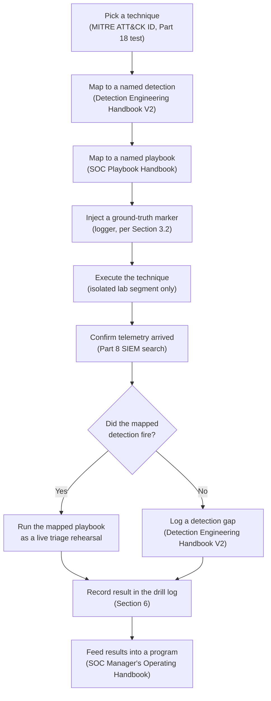

# Part 19 — Generating Practice Telemetry and Purple-Team Drills

## Why this part exists

Part 18 taught you to run one scoped Atomic Red Team technique against a lab endpoint and confirm it left a trace. That's the right first move, but it teaches a narrower skill than the rest of this book is building toward. A real SOC analyst's week doesn't look like one dramatic technique against total silence — it looks like finding a real signal inside a constant low hum of ordinary activity, and then working a chain of related events, not a single isolated action. This part adds three things a one-shot Atomic Red Team run doesn't give you: a background noise generator, so your telemetry has a realistic baseline to stand out against; a scenario-replay approach that chains several techniques into one narrative attack path instead of a single atomic test; and a purple-team drill format that explicitly pairs a simulated action with a named detection from *Detection Engineering Handbook V2* and a named response procedure from *SOC Playbook Handbook*. This is the part where everything built across the first eighteen parts stops being infrastructure and starts being a practice loop you actually run, on a schedule, with a record of what happened.

> **Safety Gate**
> Everything in this part assumes the same isolated lab/victim segment from Part 4 that Part 18's attack-simulation content depends on — nothing here is scoped to run against a system you don't own, and that includes the noise generator in §2. A one-shot Atomic Red Team test is easy to reason about because it runs once, in front of you. A cron-scheduled noise generator or a scenario-replay script runs unattended, repeatedly, whether or not you're watching — which means a stale IP address, a copy-pasted hostname, or a scenario script someone hands you with a real target baked in becomes a standing, scheduled attack tool instead of a one-time mistake. Before you put anything from this part on a cron schedule, confirm every target it touches resolves to a host on the isolated segment built in Part 4 and firewalled in Part 6, run the Appendix A4 pre-flight checklist if it's been more than a few weeks since you last verified isolation on this segment, and never let a noise or scenario script reach outside that segment — not even for something as apparently harmless as a real DNS lookup against the open internet.

## 1. What changes in this part, and what's still out of scope

**[CONCEPT]** Three things distinguish this part from Part 18, and none of them is "a different tool." First, background noise generation runs continuously, at low volume, in the background, rather than as a single deliberate action you watch happen. Second, scenario replay chains multiple techniques — reconnaissance, then execution, then persistence, then discovery — into one narrative attack path, instead of testing one technique in isolation. Third, the purple-team drill format this part builds explicitly names which detection and which playbook a given simulated action is supposed to exercise, before you run it, so the exercise has a pass/fail condition instead of just "something happened, and I looked at the logs afterward."

This part still doesn't teach offensive technique development, real-world red-teaming, or how to write detection logic — those stay exactly where Part 18 and *Detection Engineering Handbook V2* left them. It also doesn't teach staffing a purple-team program; that's the *SOC Manager's Operating Handbook*'s job, cited by part number in §7. What follows assumes you've already completed Part 18's attack-simulation build and have at least one working Atomic Red Team-style tool pointed at a lab endpoint you own.

## 2. Background noise generation

### 2.1 Why realistic baseline noise matters

**[CONCEPT]** A detection that only ever gets tested against a perfectly quiet SIEM index has never actually been tested. Real production telemetry has a constant background rate of `sudo` invocations, DNS lookups that resolve to nothing, SSH logins, and scheduled jobs — and a threshold-based detection (more than a stated number of failed logins in a window, more than a stated NXDOMAIN rate per host) is only as good as its understanding of what "normal" looks like against that background. A lab that goes from silence straight to one dramatic Part 18 technique never forces you to answer the harder question: does this detection also fire on the ordinary noise a real endpoint generates every day, or does it only work because your lab was empty when you tested it? *Detection Engineering Handbook V2*'s baselining content (its Part 31) is written assuming a telemetry stream with some real variance in it — this section is where that variance comes from if your lab doesn't otherwise generate any.

### 2.2 Sizing and scheduling a noise generator

**[SAFETY]** A noise generator earns its name from what it does, not what it's aimed at — every action it takes has to land on a host you own, inside the segment from Part 4. The version built below never leaves that segment: no external DNS lookups, no requests to real internet hosts, nothing that would still function correctly if a stale IP address slipped into the script. It runs entirely against the Part 9/10 endpoints, and optionally the Part 7 internal DNS resolver, that you already control.

**[COST/RESOURCE]** Table 19.1 sizes the noise patterns this section builds against the telemetry they exercise and what part of the book already ingests them — nothing here needs new forwarding configuration, since it all rides pipelines Parts 7, 9, and 13 already built.

**Table 19.1 — Background noise patterns and the telemetry they exercise.** The table below supports deciding which noise patterns are worth scripting for your specific detection-tuning goals, rather than scripting all of them by default.

| Noise pattern | Telemetry produced | Ingested via | Why it matters |
|---|---|---|---|
| `sudo -l` privilege check | `exec`-keyed auditd events (the `sudo` process launch itself — `sudo -l` only reads `/etc/sudoers`, so Part 9's `-p wa` `identity`/`sudoers` watches never fire on it) | Part 9 forwarding pipeline | Baseline for what normal `sudo` activity looks like on this host before a real anomaly-detection rule can flag a deviation |
| Mixed valid/NXDOMAIN DNS queries | `dns.log` query/response pairs, or Pi-hole query log entries | Part 13 Zeek forwarding, or Part 7 Pi-hole | Baseline NXDOMAIN rate — a DNS-tunneling or domain-generation-algorithm detection needs a normal rate to compare against |
| Internal SSH login, disposable account | Auth-success events, `exec`-keyed process launches | Part 9 forwarding pipeline | Baseline authentication volume for a brute-force or impossible-travel detection |
| Internal HTTP GET to a lab-hosted service | `http.log` request records | Part 13 Zeek forwarding | Baseline request rate/URI shape for a web-scanning detection |
| Scheduled task creation and removal | `exec`-keyed process events | Part 9 forwarding pipeline | Baseline scheduled-task activity — the same shape T1053.003 (Scheduled Task/Job: Cron) persistence would leave, covered further in §3 |

> **Resource Reality**
> Even a light noise generator running every few minutes on one endpoint adds up over a month — a handful of auditd `exec` records, a couple of DNS queries, and one SSH session per invocation is a few hundred extra kilobytes of raw log per day, not a meaningful load on its own. The real cost shows up if you script noise generation on every endpoint in the lab simultaneously and never stagger the schedule: a burst of identical cron jobs firing in the same second across five endpoints produces a synchronized spike that itself looks like coordinated activity in a SIEM dashboard. Stagger cron minutes per host, and budget the extra volume against Part 21's retention plan rather than assuming it's negligible just because each individual run is small.

### 2.3 A worked noise-generator script

**[SETUP]** The script below targets a Part 9 Linux endpoint and reuses commands already covered in that part — nothing here requires new software, only a cron entry and a disposable, non-privileged test account. Create `labnoise` the same way Part 9's §8 exercise creates `labtestuser`, authorize an SSH key from `labnoise` to itself on the target endpoint (`BatchMode=yes` fails closed instead of prompting for a password when cron has no terminal to prompt on), then save the script below as `/usr/local/sbin/lab-noise.sh` and mark it executable with `chmod +x`.

```bash
#!/bin/bash
# CONCEPTUAL SAMPLE — illustrative cron-driven noise generator using invented
# lab hostnames and addresses; substitute your own Part 9/10 endpoint names
# and confirm every target below resolves to a host you own on the isolated
# lab segment before scheduling this.
# /usr/local/sbin/lab-noise.sh

# Baseline privilege-use noise (feeds Part 9's exec key — this crontab entry
# already runs as labnoise, and sudo -l only reads /etc/sudoers, so it never
# trips the identity/sudoers watches, which are write-only, -p wa)
sudo -l >/dev/null 2>&1

# Baseline internal DNS noise: one real internal name, one deliberately
# nonexistent name, so the resolver's own logs show a realistic mix.
# 10.10.20.0/24 is the Endpoint VLAN from Part 6's Table 6.3; substitute
# your own resolver and endpoint addresses from that table.
dig +short db01.lab.internal @10.10.20.10 >/dev/null
dig +short "doesnotexist-$RANDOM.lab.internal" @10.10.20.10 >/dev/null

# Baseline internal auth noise: a low-volume SSH login against a second
# owned lab endpoint, using a disposable, non-privileged test account
ssh -o BatchMode=yes -o ConnectTimeout=3 labnoise@10.10.20.101 'whoami' >/dev/null 2>&1

# Baseline internal HTTP noise against an internally hosted lab service
curl -s -o /dev/null http://10.10.20.102/
```

Add it to cron with a staggered minute offset per endpoint, rather than a round number every host would share:

```text
# /etc/cron.d/lab-noise — staggered at :07 past every 15 minutes on this
# specific host; use a different offset on every other endpoint running
# this script, per the Resource Reality note above.
7,22,37,52 * * * * labnoise /usr/local/sbin/lab-noise.sh
```

> **Validation Test**
> **Setup:** The script and cron entry above deployed on a Part 9 endpoint, with the auditd and Zeek forwarding pipelines from Parts 9 and 13 already confirmed working.
> **Action:** Wait for one scheduled run, then search the Part 8 SIEM for events from this host in the few minutes around the scheduled time.
> **Expected result:** A low-volume mix of `exec`-keyed auditd events (the `sudo`, `dig`, `ssh`, and `curl` process launches themselves), one DNS query pair (one resolved, one NXDOMAIN), one SSH auth-success event, and one `http.log` request record — all low-severity, none of it triggering any detection you've built so far. If a detection does fire against this baseline noise, that detection's threshold is tuned too tight for real endpoint behavior, and this is exactly the gap §7 sends back to *Detection Engineering Handbook V2* to fix.

> **Lab Note**
> Keep the noise generator running for at least a full week before you layer a scripted drill on top of it. A detection tuned against zero seconds of baseline noise will look like it's working the first time you test it and then generate false positives the first ordinary Tuesday it runs against real background activity — running the noise generator first is what surfaces that problem before a drill wastes your time chasing it.

## 3. Scenario replay: chaining techniques into an attack path

### 3.1 From atomic tests to a kill-chain-shaped sequence

**[CONCEPT]** A single Atomic Red Team test answers "does my telemetry pipeline capture this one technique." A scenario replay answers a different, harder question: "does my detection stack tell a coherent story across a sequence of related actions, the way a real intrusion actually unfolds." Table 19.2 lays out a worked five-stage scenario built entirely from techniques Part 18 already covers running one at a time — the only thing new here is the sequencing and the delay between stages, which matters because a real attacker doesn't execute five techniques in the same second.

**Table 19.2 — A worked five-stage scenario-replay sequence.** The table below supports planning a scenario that exercises multiple detections in sequence rather than testing techniques one at a time with no narrative connecting them.

| Stage | Tactic | Technique (Part 18 test) | Runs against |
|---|---|---|---|
| 1 | TA0043 (Reconnaissance) | T1595 (Active Scanning) — a scoped port scan against an owned endpoint | Part 9/10 endpoint |
| 2 | TA0001 (Initial Access) | T1190 (Exploit Public-Facing Application) — a scripted exploit attempt against a deliberately vulnerable owned service | Part 9/10 endpoint |
| 3 | TA0002 (Execution) | T1059 (Command and Scripting Interpreter) | Part 9/10 endpoint |
| 4 | TA0003 (Persistence) | T1053.003 (Scheduled Task/Job: Cron) | Part 9 endpoint |
| 5 | TA0007 (Discovery) | T1083 (File and Directory Discovery) | Part 9/10 endpoint |

**[SAFETY]** Every stage above still has to run against a host you own on the isolated Part 4 segment — chaining techniques together doesn't relax the ownership rule, it just means a mistake in one stage's target now propagates into four more stages before you notice it. Check the target host for every stage before the first run, not just the first stage.

### 3.2 Marking ground truth so the SIEM knows what you did, and when

**[SETUP]** A scenario replay is only useful for measuring detection performance if you can prove exactly when each stage ran, independent of whatever the detection stack itself claims to have seen. The simplest way to do that on a Linux endpoint is a `logger` call immediately before and after each stage, riding the same journald/rsyslog forwarding path Part 9 already built — no new configuration is needed, since these lines carry the same tag Part 9's forwarding rules already ship to the SIEM.

```bash
# CONCEPTUAL SAMPLE — ground-truth markers bracketing one scenario stage;
# substitute your own scenario identifier and technique ID per stage.
logger -t purple_drill "scenario=2026-09-15-scenario01 stage=1 technique=T1595 status=start"
# ... the Part 18 Atomic Red Team test for this stage runs here ...
logger -t purple_drill "scenario=2026-09-15-scenario01 stage=1 technique=T1595 status=end"
```

Confirm the markers arrive in the SIEM before running the full five-stage sequence — search for `purple_drill` shortly after running one test marker by hand, and confirm both the `start` and `end` lines appear with a timestamp close to when you ran them. Once that's confirmed, the same pattern brackets every stage in Table 19.2, giving you a searchable, timestamped record of exactly what ran and when, independent of any detection firing or not firing.

> **Engineering Reality**
> It's tempting to skip the marker step and just trust the timestamp on whatever telemetry the technique itself generates — an auditd `exec` record, a Suricata alert. In practice, forwarding delay (a shipper's bulk-send interval, a few seconds of clock skew between the endpoint and the SIEM) means the telemetry's own timestamp and your intended action time can drift by several seconds, which is exactly the margin that matters when you're trying to measure how fast a detection actually fired relative to when the technique ran. The `logger` marker isn't redundant with the technique's own telemetry — it's the independent clock you compare the technique's telemetry against.

## 4. The purple-team drill format

### 4.1 Pairing a simulated action with a named detection and playbook

**[CONCEPT]** A purple-team drill, in this book's sense, is a scenario stage (or a single Part 18 technique) run with three things decided before you press go: which detection is supposed to fire, which playbook an analyst is supposed to follow if it does, and what "the drill passed" actually means. Figure 19.1 lays out that sequence as a repeatable lifecycle — the same eight steps apply whether the drill is one Part 18 technique or a full Table 19.2 scenario.





**Figure 19.1 — Purple-team drill lifecycle.** *CONCEPTUAL.* Illustrates the repeatable sequence this part's drill format follows, from picking a technique through recording a result and feeding it into a program-level assessment cycle. This is a process diagram of the intended workflow, not a capture from a specific tool's own interface — every step maps to a section in this part or a named part in another NESHBOY volume. Diagram ID `FIG-19-01`. Table 19.3 works through three concrete drills that follow this same sequence, spanning a scripted action, a scripted persistence mechanism, and one drill this book doesn't have to script at all.

**Table 19.3 — Three worked purple-team drills, mapped end to end.** The table below supports designing a drill with a stated pass/fail condition, rather than running a technique and deciding afterward whether anything relevant happened.

| Simulated action (MITRE ID) | Telemetry source | *Detection Engineering Handbook V2* reference | *SOC Playbook Handbook* reference |
|---|---|---|---|
| T1110.001 (Password Guessing) — scripted SSH brute force against an owned Part 9 endpoint | Part 9 auditd auth/`exec` telemetry; Part 14 Suricata if a matching signature fires | Correlation/baselining content, Parts 22–33 (authentication-volume correlation) | Playbook Library's credential-access/brute-force triage playbook |
| T1053.003 (Scheduled Task/Job: Cron) — scripted persistence via a cron entry on an owned endpoint | Part 9 auditd `exec` telemetry, plus a file watch on `/etc/cron.d` | Parts 22–33 (persistence-mechanism correlation) | Playbook Library's persistence-mechanism triage playbook |
| T1595/T1046/T1083/T1190 (naturally occurring, unscripted) — real internet scanning against the Part 15 honeynet | Part 15 honeynet session correlation | Parts 34–36 (threat hunting over captured session data) | Playbook Library's reconnaissance/scanning triage playbook |

The third row is worth sitting with, because it's not a drill you script at all.

### 4.2 Real ground truth for free: the honeynet as an unscripted drill

**[CONCEPT]** If Part 15's honeynet is already built and running, it produces something a scripted drill can't: real, unsolicited attacker behavior against a target that exists specifically to attract it, already correlated and MITRE-tagged by the honeynet platform's own logic. You don't have to simulate T1595 (Active Scanning), T1046 (Network Service Discovery), T1083 (File and Directory Discovery), or T1190 (Exploit Public-Facing Application) against a honeynet — internet background scanning does it continuously, for free, and it's real attacker intent rather than a rehearsed script.

```text
session_id                        source_ip        status            mitre_techniques_json
d48b795e47c04c6fbb456b17ddd219b9  16.5.0.236       possible_success  ["T1595", "T1046", "T1083", "T1190"]
5322cb1f62614593a6dc1e239f5209fc  198.235.24.116   possible_success  ["T1595", "T1046", "T1083", "T1190"]
ba0ab1f38e11455f83e48298d7b45c1e  45.156.128.45    exploit_attempt   ["T1595", "T1046", "T1190"]
```

**Figure 19.2 — Real honeynet session correlation, unscripted.** *REAL LAB EXAMPLE.* Excerpted from the author's own running CT103 honeynet correlation database (`attack_sessions` table), captured 2026-09-15. Each row is a real, unsolicited internet session against a sacrificial decoy address (`10.99.99.x`, not shown here — see Part 15 for the full addressing scheme), already tagged with MITRE technique IDs by the platform's own correlation logic and flagged `possible_success` when an exploit-shaped request was followed by continued activity from the same source. Source IPs shown are real external internet hosts; disclosing them carries no meaningful risk since the targets are sacrificial decoys by design.

> **Blind Spot**
> A honeynet's real attacker sessions are genuine ground truth about what happens on the open internet, but they're not a substitute for a scripted drill, because you don't control when they happen or exactly what triggered the platform's `possible_success` judgment. Table 19.3's first two rows give you an exact start time from a `logger` marker and a known technique with no ambiguity about what ran; the honeynet row gives you real adversary behavior with no independent ground-truth timestamp beyond the platform's own `first_seen` value — you're trusting the same system you're trying to validate to also tell you when the test started. Use honeynet captures to hunt against and to validate that your correlation logic makes sensible judgment calls on real data; use scripted drills, not honeynet captures, when the thing you're actually measuring is detection latency.

## 5. Hands-on lab: running one drill end to end

**[HANDS-ON LAB]** Goal: run Table 19.3's first drill — a scripted SSH brute-force attempt against an owned Part 9 endpoint — and record whether the mapped detection fired and whether the mapped playbook's steps matched what you actually needed to do.

1. On the target Part 9 endpoint, confirm a disposable test account exists (reuse `labtestuser` from Part 9's §8 exercise, or create a new one).
2. From a second owned lab endpoint, inject the start marker: `logger -t purple_drill "scenario=2026-09-15-bruteforce stage=1 technique=T1110.001 status=start"`.
3. Run a bounded, scripted set of failed SSH logins against the target — 20 attempts within 60 seconds is enough to exceed most reasonable thresholds without generating an unmanageable log volume.
4. Inject the stop marker with `status=end` in place of `status=start`.
5. Search the Part 8 SIEM for the failed-auth burst on the target endpoint, and confirm its timestamps fall between the two markers.
6. Check whether a correlation rule from *Detection Engineering Handbook V2*'s Parts 22–33 content, if you've built one, fired against this burst.
7. If it fired, open the Playbook Library's credential-access/brute-force triage playbook and walk its steps against this drill as a rehearsal, not just a read-through — note any step that assumed a field or a tool you don't actually have in this lab.
8. If nothing fired, record that as a detection gap rather than treating a quiet drill as a successful one.

> **Validation Test**
> **Setup:** Steps 1–4 above completed, with the Part 9 forwarding pipeline confirmed working.
> **Action:** Search the SIEM for auth-failure events on the target endpoint between the `start` and `end` markers.
> **Expected result:** A visible burst of failed-authentication events clustered inside that window, distinguishable from the low-volume baseline noise §2's generator produces on the same host — if the burst isn't visibly denser than the baseline, the two are indistinguishable to any threshold-based detection and step 6 will fail for a reason that has nothing to do with the detection's logic.

## 6. Recording drill results: the drill log

**[SETUP]** A drill that isn't recorded doesn't compound into anything — the value of running the same three or four drills every few months comes from comparing this run against the last one, not from any single run in isolation. Table 19.4 is a minimal template; keep it as a spreadsheet or a SIEM-indexed record, whichever makes it easier to actually update after a drill instead of intending to and not.

**Table 19.4 — Drill log template.** *(CONCEPTUAL SAMPLE)* The table below supports tracking drill outcomes over time rather than treating each drill as a one-off exercise with no record afterward.

| Date | Scenario ID | MITRE ID(s) | Detection expected | Detection fired? | Time to detect | Playbook followed? | Outcome/notes |
|---|---|---|---|---|---|---|---|
| 2026-09-15 | `2026-09-15-bruteforce` | T1110.001 | Auth-failure correlation rule | Yes | 42s | Yes | Playbook step 3 assumed a field this lab's SIEM doesn't populate — flagged for playbook revision |
| — | — | — | — | — | — | — | — |

> **What Would Change My Mind**
> This part recommends running the noise generator (§2) for at least a full week before layering a scripted drill on top of it, on the grounds that a detection tuned against zero baseline noise will misrepresent its own false-positive rate. If a reader's detection logic is built entirely on absolute thresholds with no baselining component at all — a fixed "more than 10 failed logins in 5 minutes" rule with no comparison to recent history — that specific rule design wouldn't benefit from a noise baseline the way a statistical or adaptive-threshold rule would, and this recommendation would need a caveat for that case rather than a blanket week-long wait before every drill.

## 7. Where this closes the loop

**[CONCEPT]** Everything in this part exists to produce two things: telemetry with a realistic shape, and a record of whether a specific detection and a specific response procedure actually worked against it. Neither of those is useful sitting in this book — each one has a specific next step in a specific other volume.

- **Feed detection gaps back to *Detection Engineering Handbook V2*.** Every row in Table 19.4 where "Detection fired?" is No is a concrete input to that book's correlation and baselining content (its Parts 22–33) — not a vague "improve detections" note, but a specific technique, a specific telemetry source, and a specific timestamp window to build a rule against. Where a drill's target telemetry looks unusual or thin, that book's threat-hunting content (its Parts 34–36) is where you go hunting in it before assuming a rule is the right fix.
- **Rehearse *SOC Playbook Handbook*'s playbooks against real drill conditions, not just read them.** Step 7 of §5's hands-on lab is the point of this cross-reference: a playbook step that assumes a log field, a tool, or a lookup your lab doesn't actually have is a gap in the playbook, not a gap in your lab, and it's far cheaper to find that during a scheduled drill than during a real incident. Record every mismatch in the drill log's outcome/notes column and route it back as a documented playbook revision.
- **Turn a repeatable drill log into a program, per the *SOC Manager's Operating Handbook*.** That book's Part 8 (assessment design) is where a series of Table 19.4 entries becomes a structured, graded exercise instead of an ad hoc one, and its Part 11 (onboarding/ramp-up) is where the exact same drill format becomes a way to bring a new analyst up to speed against a lab environment instead of a live production one. This part builds the drill; that book builds the program the drill lives inside of.
- **Feed dashboards.** Part 17's dashboard content can chart drill outcomes over time (detection-fire rate, time-to-detect trend) alongside the raw telemetry volume Parts 8–16 already produce — a drill log is itself a data source worth visualizing, not just a spreadsheet you check manually.

None of this closes the loop if §2–§6 never actually get run. A noise generator that's built but never scheduled, or a drill format that's designed but never executed against a real technique, leaves this part exactly as theoretical as the detections it was meant to validate.

---

**Cross-references:** Part 4 (network isolation this part's Safety Gate depends on), Part 6 (perimeter firewall enforcing segment boundaries), Part 7 (internal DNS noise target), Part 8 (SIEM ingest and search target throughout), Part 9 (Linux endpoint telemetry and forwarding pipeline this part's noise generator and drill both reuse), Part 10 (Windows endpoint equivalents for scenario stages run there), Part 13 (Zeek `http.log`/`dns.log` telemetry exercised by noise generation), Part 14 (Suricata alerts a scripted drill may trigger), Part 15 (honeynet correlation as unscripted ground truth), Part 17 (dashboards charting drill outcomes), Part 18 (the attack-simulation tooling this part's scenarios and drills are built from), Part 21 (retention planning for noise-generator log volume), Appendix A3 (reusable rule/config baselines this part's telemetry feeds), Appendix A4 (isolation pre-flight checklist referenced in this part's Safety Gate); *Detection Engineering Handbook V2*, Parts 22–33 (correlation/baselining that consumes this part's drill results) and Parts 34–36 (threat hunting over honeynet and drill telemetry); *SOC Playbook Handbook*'s Playbook Library (the triage procedures rehearsed in §5 and §7); *SOC Manager's Operating Handbook*, Part 8 (assessment design) and Part 11 (onboarding/ramp-up) for turning this part's drill format into a repeatable program.
