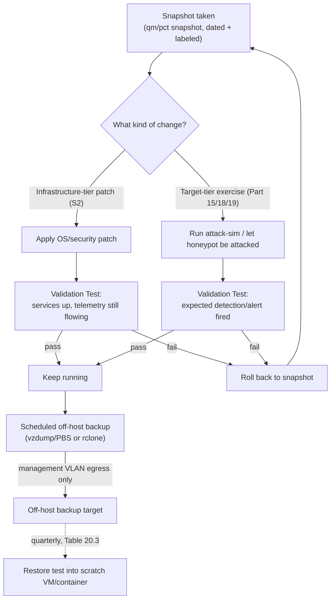

# Part 20 — Lab Maintenance, Patching, and Snapshot/Backup Strategy

## Why this part exists

Every part before this one taught you to build something: a hypervisor, a firewall, a SIEM, endpoints, sensors, honeypots, feeds, dashboards, and attack-simulation tooling. This part is about what happens to all of that six months later, when a security advisory drops for a package half your infrastructure runs, or a config edit you're not sure about is one `systemctl restart` away from finding out the hard way. A home lab that gets built once and never maintained decays in two opposite directions at the same time. The infrastructure you rely on to be trustworthy — the firewall enforcing every Safety Gate in this book, the SIEM holding the evidence you're building a practice habit on — goes stale and quietly picks up real vulnerabilities you never intended. Meanwhile the practice targets you deliberately left vulnerable — a honeypot, a pinned old package staged for an exploit exercise — get patched out from under you by the exact same automated update mechanism that's protecting everything else.

This part is the discipline that keeps both halves of that tension resolved on purpose instead of by accident: a patch policy that treats "infrastructure" and "intentionally vulnerable target" as two different tiers with two different rules, and a snapshot/backup strategy that makes every risky change — a patch, a config edit, an attack-simulation run — reversible in minutes instead of costing you the whole lab. It does not cover storage sizing or retention policy for the data those snapshots and backups themselves consume; that's Part 21's job, cited where it matters below.

> **Safety Gate**
> Two things must hold before you touch anything in this part. First, any automated patching mechanism you enable (`unattended-upgrades`, a config-management run, a scheduled `apt upgrade` cron job) must be scoped to the infrastructure tier only — never let it run unscoped against a honeypot or deliberately vulnerable target host, or you will silently patch away the exact vulnerability that host exists to expose (see the Build Autopsy in §3). Second, any off-host backup destination and any patch-mirror or update source this part has you configure must route through the same perimeter-firewall egress rules Part 4 and Part 6 already built — a backup job or a package-update pull is not an exception to a segment's default-deny egress, and it must never be the reason a honeynet or attack-simulation segment (Parts 15 and 18) picks up a broader route than its own Safety Gate already permits. Before scheduling a single automated patch job or backup cron entry, confirm both against the Appendix A4 pre-flight checklist.

## 1. Two patch regimes, one lab

**[CONCEPT]** Almost everything you've built in this book falls cleanly into one of two tiers, and the two tiers want opposite patch behavior. The **infrastructure tier** — the hypervisor (Part 5), the perimeter firewall (Part 6), internal DNS (Part 7), the SIEM (Part 8), most Linux and Windows lab endpoints (Parts 9 and 10), and the Zeek/Suricata sensor host (Parts 12–14) — should be patched roughly the way you'd patch anything you actually depend on: promptly, on a predictable cadence, because an unpatched piece of infrastructure is just a liability with no offsetting benefit. The **target tier** — honeypots and decoy services (Part 15) and any host deliberately left at a specific vulnerable version for an attack-simulation exercise (Part 18) — is the opposite case: its entire value comes from being a specific, known, often outdated version, and patching it on the same schedule as everything else destroys the thing it was built to be.

The mistake this section exists to head off is treating "patched" as a single global virtue that applies uniformly across a lab. It doesn't. Table 20.1 makes the split concrete, component by component.

The table below supports deciding which patch cadence applies to a given lab component before you enable any automation that touches it.

**Table 20.1 — Lab component patch policy by tier.**

| Component | Tier | Patch cadence | What breaks if you get the tier wrong |
|---|---|---|---|
| Proxmox (or other) hypervisor host | Infrastructure | Monthly minor updates; security advisories promptly | An unpatched hypervisor is a single point of failure underneath every isolated segment above it — a host-level compromise collapses every segmentation boundary this book teaches at once |
| Perimeter firewall (pfSense/OPNsense) | Infrastructure | Within days of a security release | This is the control every Safety Gate box in this book depends on; an unpatched known CVE here is the one failure that defeats every other part's isolation claim simultaneously |
| SIEM platform (Wazuh/Elastic/Graylog) | Infrastructure | Monthly, snapshotted first (§4) | An unpatched ingest pipeline is both an attack surface and an integrity risk for the evidence this whole book teaches you to produce |
| Zeek/Suricata sensor host | Infrastructure | Monthly OS patches; rule/signature updates on their own faster cadence (daily/weekly) | A stale ruleset misses newly published signatures; a stale sensor OS accumulates its own attack surface on a box with a mirrored view of everything |
| Linux/Windows lab endpoints (Parts 9–10) | Infrastructure, unless pinned for a specific exercise | Monthly, or aligned to vendor patch cycles | An endpoint left unpatched "by default" rather than by deliberate pin is attack surface nobody chose, on a segment other parts assume is otherwise sound |
| Honeypot/decoy services (Part 15) | Target — deliberately vulnerable | Pinned; patch only when swapping to a new CVE/exercise | Patch it on the normal cadence and the vulnerability the honeypot exists to expose disappears silently — see §3's Build Autopsy |
| Attack-simulation tooling host (Part 18) | Infrastructure (the tool), pointed at target-tier hosts | Keep the tool itself current | An out-of-date attack-sim framework can fail a technique silently against a current OS build, and a failed test can look exactly like "the defense worked" |
| DNS/Pi-hole (Part 7) | Infrastructure | Monthly | Query-log telemetry (Part 7's own early-win example) depends on the resolver staying up and current, same as any other infrastructure service |

## 2. Patching the infrastructure tier without breaking anything

**[SETUP]** For infrastructure-tier Linux hosts, `unattended-upgrades` gets you automatic security patching without needing to remember to do it. The commands below target Debian 12/Ubuntu 22.04 and 24.04 LTS, the same OS baseline Part 9 used for lab endpoints.

```bash
sudo apt install unattended-upgrades apt-listchanges
sudo dpkg-reconfigure --priority=low unattended-upgrades
```

Restrict it to security-origin updates only, and disable automatic reboots so a kernel update doesn't restart a SIEM VM mid-ingest without you knowing:

```text
# /etc/apt/apt.conf.d/50unattended-upgrades
Unattended-Upgrade::Allowed-Origins {
    "${distro_id}:${distro_codename}-security";
};
Unattended-Upgrade::Remove-Unused-Dependencies "true";
Unattended-Upgrade::Automatic-Reboot "false";
```

Confirm the configuration is valid and see what it would do without actually applying anything:

```bash
sudo unattended-upgrade --dry-run --debug
```

The dry run should list the security-origin packages it would upgrade with no errors about malformed origin strings — that's the check to run once after editing the config, not something you need to repeat every month.

**[COST/RESOURCE]** Your snapshot safety net (§4) stops at the boundary of the hypervisor itself — you can snapshot a VM or container running on Proxmox, but you cannot snapshot Proxmox's own host OS the same way. A bad kernel update to the host is a different risk class than a bad patch inside a guest: there's no five-minute revert. The practical mitigation is to track Proxmox's own point releases rather than the bleeding edge, and to confirm the previous kernel is still selectable from GRUB before rebooting into a new one — `proxmox-boot-tool kernel list` shows what's installed and bootable. Treat a host-level kernel update as the one patch in this whole part where "read the release notes first" is not optional.

For pfSense/OPNsense, the update check lives in the GUI (System → Update on pfSense, System → Firmware on OPNsense); both platforms keep the previous firmware version available as a one-click rollback for a short window after an upgrade, which is the closest thing to a snapshot the firewall itself gets. Take the rollback window seriously — verify the firewall still passes the Part 6 Validation Test (the isolation rules still hold) before that window closes, not after.

> **Validation Test**
> **Setup:** Infrastructure-tier host snapshotted per §4, patch batch applied per the commands above.
> **Action:** Run `systemctl status` (or the equivalent health check) on every service that host runs, and check the Part 8 SIEM for a fresh event from this host within 5 minutes of the patch completing.
> **Expected result:** Every service reports active/running with no restart loop, and at least one new event timestamped after the patch appears in the SIEM search. If either check fails, revert to the pre-patch snapshot from §4 before troubleshooting further — debugging a broken host live is strictly worse than reverting first and investigating the snapshot's before/after state at your own pace.

## 3. Keeping intentionally vulnerable targets vulnerable on purpose

**[CONCEPT]** A honeypot or a deliberately unpatched exercise target only teaches you anything for as long as it stays the specific version it was set up to be. The single most common way that stops being true isn't an attacker — it's your own automation, patching a target-tier host the same way it patches everything else because nobody told it not to.

**[SETUP]** For a package-based target (a decoy SSH or HTTP service on a full Linux VM), the fix is two layers of the same control. First, `apt-mark hold` on the specific package whose version matters:

```bash
sudo apt-mark hold openssh-server
apt-mark showhold
```

Second, and more importantly, disable automated patching on that host entirely rather than trusting a hold to survive every future config-management run:

```bash
sudo systemctl disable --now unattended-upgrades.service
```

For a container-based decoy (a vulnerable web app image pulled from a public registry), the equivalent mistake is pulling by tag rather than digest — a `latest` or even a version tag can silently point at a rebuilt image with the underlying vulnerability patched. Pin by digest instead:

```bash
docker pull vulnerables/web-dvwa@sha256:<digest-you-verified-is-vulnerable>
```

Document the pin. A per-decoy README stating the exact package version or image digest and the CVE or exercise it represents is the difference between "this honeypot is vulnerable to X" as a checkable fact and as a fading assumption nobody re-verifies.

**[SAFETY]** Auditing which CVEs a pinned target-tier host is still exposed to sometimes tempts a reader to run a vulnerability scanner against it from a broader network host, for convenience. Don't. Run the scanner from inside the same isolated segment the honeypot already lives on — the same segment discipline Part 15's Safety Gate requires for everything else touching that host — never from a management host with a wider route. The inventory process itself must never become the thing that gives a decoy an unintended path out of its segment.

> **Build Autopsy — the honeypot that patched itself vulnerability-free**
>
> **The plan:** Reuse the same cloud-init base image and hardening baseline for a new SSH honeypot decoy that infrastructure-tier hosts already used elsewhere in the lab, on the reasoning that a consistent, patched baseline everywhere is strictly good practice.
>
> **Why it seemed reasonable:** The base image's `unattended-upgrades` configuration had already been tuned and tested (per §2) on every other host in the lab with no problems, so reusing it for a new VM felt like reuse, not a new decision that needed separate thought.
>
> **How it failed:** The decoy's entire purpose was an intentionally outdated OpenSSH version, targeted at a specific banner-based Suricata signature. `unattended-upgrades` pulled a routine security-origin OpenSSH point release within its first overnight run, silently closing the exact version gap the honeypot existed to expose. Nothing crashed and nothing alerted — the honeypot kept running, kept looking healthy, and simply stopped being interesting. The Suricata signature that used to fire on the old banner went quiet, and it took several weeks of "why hasn't this caught anything" before anyone checked the actual installed OpenSSH version against the one the exercise assumed.
>
> **The fix:** Target-tier hosts never inherit the infrastructure-tier patch baseline wholesale. Every decoy or pinned exercise target gets `unattended-upgrades` disabled outright and its critical package(s) held explicitly, as its own first-boot step, documented in a per-decoy README — not as an exception someone remembers to apply, but as a default that has to be deliberately opted out of to get infrastructure-tier patching back.

## 4. Snapshot discipline before risky changes

**[CONCEPT]** A hypervisor snapshot is a point-in-time copy of a VM or container's disk state (and, optionally, its RAM state) that you can revert to without reinstalling anything. In this book, a snapshot is the thing that turns "I'm not sure this config edit is safe" from a source of anxiety into a non-event: take the snapshot, make the change, and if it's wrong, you're back to exactly where you started in minutes.

**[SETUP]** The commands below target Proxmox VE 8.x's `qm` (QEMU/KVM VMs) and `pct` (LXC containers) tooling, and VirtualBox 7.x's `VBoxManage`, matching the platforms Part 5 covers. Readers on Hyper-V or ESXi per Part 5's own comparison use that platform's checkpoint/snapshot equivalent — the naming-and-timing discipline below applies regardless of which hypervisor you're actually running.

```bash
# Proxmox VE, QEMU/KVM VM
qm snapshot <vmid> pre-patch-2026-09-15 --description "before monthly infra patch batch"
qm listsnapshot <vmid>
qm rollback <vmid> pre-patch-2026-09-15

# Proxmox VE, LXC container
pct snapshot <ctid> pre-patch-2026-09-15

# VirtualBox
VBoxManage snapshot "<vmname>" take "pre-patch-2026-09-15" --description "before monthly infra patch batch"
```

Confirm the snapshot exists and is restorable before you rely on it — `qm listsnapshot <vmid>` or its VirtualBox equivalent should list the snapshot immediately after creation; if it doesn't appear, don't proceed with the risky change on the assumption it silently worked.

> **Lab Note**
> Name every snapshot with the date and the reason, not just "before update" or `snap3`. Six months into a running lab, a hypervisor with 40 unlabeled snapshots is a worse problem than the one they were supposed to protect against, because you can no longer tell which one is safe to delete without diffing state by hand. `pre-patch-2026-09-15-suricata-etopen-update` costs you 5 extra seconds to type and saves you an afternoon later.

## 5. Snapshot's limits: why you still need an offsite backup

**[CONCEPT]** A snapshot and a backup solve different failure modes, and conflating them is the second most common maintenance mistake in a home lab, right behind the patching-tier confusion in §3. A snapshot lives on the same storage pool as the VM it protects — it's fast to take and fast to revert, but it dies with that storage pool. A backup is a separate copy, ideally on physically different storage, that survives the loss of the host or pool the original lived on. Table 20.2 lays out what each layer actually protects against.

The table below supports deciding whether a given protection layer is sufficient for a specific risk, or whether you need the layer below it too.

**Table 20.2 — Snapshot vs. backup: what each layer recovers from.**

| Protection layer | What it captures | Where it lives | Recovers from | Doesn't recover from |
|---|---|---|---|---|
| Hypervisor snapshot (`qm snapshot`/`pct snapshot`/`VBoxManage snapshot`) | Point-in-time disk state of one VM/container | Same storage pool as the running instance | A bad config edit, a failed patch, a broken rule set — revert in minutes | Storage pool failure, host disk corruption, accidental deletion of the whole instance |
| Off-host backup (`vzdump`/Proxmox Backup Server, or scheduled `rclone`/`rsync` to external storage) | Full VM/container image or file-level archive | A separate physical disk, or a target reachable only from the management VLAN | Host disk failure, accidental instance deletion, a local-storage failure that also destroys any snapshots on it | A config mistake or a logic bug preserved faithfully alongside the good data — a backup keeps whatever state existed at backup time, flaws included |
| Config-as-code source (Appendix A3 baselines, Sysmon/auditd configs, `.rules` files kept in git or a local repo) | The intended configuration itself, independent of any running instance | Wherever you keep source control — even a single local git repo is enough for one operator | Total lab loss — the fastest possible rebuild path, since it's declarative rather than a disk image | Runtime data: logs already ingested, honeypot session history, anything that only exists because a service ran and produced it |

> **Engineering Reality**
> On Proxmox, `qm snapshot` works for QEMU/KVM VMs on nearly any backing storage, but `pct snapshot` for LXC containers needs a storage type that actually supports it — ZFS, LVM-thin, or Btrfs. A container living on plain directory-backed storage returns an error the instant you try to snapshot it, not a slow warning during setup. If any of this book's LXC-based components — the DNS resolver in Part 7, an LXC-based lab endpoint from Part 9 — ended up on directory storage when you provisioned it, you won't discover the gap until the moment you actually need the snapshot, which is exactly the wrong moment to discover it. Run `pvesm status` and confirm the storage backing every container before you rely on §4's commands, not after.

> **Resource Reality**
> A qcow2 or LVM-thin snapshot doesn't cost you the VM's full provisioned disk size — it costs you the delta, every block that changes after the snapshot is taken. On a SIEM VM with active indexing, that delta grows fast: leaving a snapshot in place for a week under normal ingest can consume several GB from index churn alone, with the VM's nominal disk size never changing. Budget headroom for snapshot deltas the same way Part 9 budgeted headroom for `audit.log` growth, and delete a snapshot the moment its Validation Test passes and you're confident in the change. A snapshot isn't free storage sitting idle — it's a loan against your free space, with the delta as accruing interest.

## 6. Building the backup and restore pipeline

**[SETUP]** `vzdump` is Proxmox's built-in backup tool and the simplest starting point for a single-operator lab — it archives a whole VM or container to a target you specify, no separate backup server required.

```bash
vzdump <vmid> --mode snapshot --compress zstd --storage <backup-storage-target>
```

`--mode snapshot` takes the backup from a live snapshot rather than stopping the VM first, which matters for anything you don't want to take an outage window for (the SIEM, most infrastructure-tier hosts). If your lab grows past three or four hosts worth backing up, Proxmox Backup Server adds deduplication and incremental-forever backups on top of `vzdump`'s full-archive model — worth the extra VM at that scale, not worth it below it. For a smaller lab, a scheduled `rclone` or `rsync` job pushing the `vzdump` archive to an external USB disk or a NAS on the management VLAN gets you the same off-host protection with less new infrastructure to maintain.

Figure 20.1 traces the full path a risky change takes through this part's controls, from the snapshot taken before the change through validation, rollback if needed, and the scheduled backup that runs regardless of which path a given change took.





**Figure 20.1 — Patch/exercise validation loop and backup pipeline.** *CONCEPTUAL.* Illustrates how a snapshot taken before any infrastructure-tier patch or target-tier exercise feeds a validation-and-rollback loop, and how a passing change still flows into a scheduled, isolated off-host backup that itself gets a quarterly restore test. This is an architecture sketch of the intended discipline, not a capture from a running deployment.

> **Validation Test**
> **Setup:** At least one completed off-host backup of an infrastructure-tier host (this section), and a scratch VM/container with no production role on the lab network.
> **Action:** Restore the backup into the scratch target, bring it up on an isolated network segment with no route to the live lab, and confirm the service starts.
> **Expected result:** The restored instance boots, the service reports active, and spot-checking one known log entry or config value confirms the backup is a real, usable recovery point rather than a file that merely exists on disk. Run this quarterly per Table 20.3 — a backup nobody has ever restored is a hope, not a plan.

## 7. A maintenance cadence you'll actually keep

**[CONCEPT]** None of the previous six sections matter if the discipline only gets applied once, right after reading this part, and then quietly lapses. Table 20.3 is the cadence this book recommends — short enough per task that skipping it has no good excuse, and frequent enough that a stale pin or a full disk gets caught before it becomes an outage.

The table below supports building a recurring maintenance schedule you can actually sustain as a single operator, rather than a one-time checklist you run once and forget.

**Table 20.3 — Lab maintenance cadence checklist.**

| Cadence | Task | Tier | Why this cadence |
|---|---|---|---|
| Weekly | Check disk headroom on the sensor host, SIEM, and audit-log partitions | Infrastructure | A cheap check that catches Part 9's disk-fill Build Autopsy failure mode before it becomes an outage |
| Weekly | Confirm target-tier version pins haven't drifted (`apt-mark showhold`, a digest diff on pinned container images) | Target | Silent auto-update is the single most common way a honeypot stops being vulnerable — catching it weekly beats catching it never |
| Monthly | Apply OS/security patches to infrastructure-tier hosts, snapshot first | Infrastructure | Balances staying current against re-verifying isolation after every single patch |
| Monthly | Review Suricata/Zeek ruleset and SIEM version currency | Infrastructure | Stale detection content misses newly published signatures the same way a stale OS misses newly published exploits |
| Quarterly | Run a full restore test into a scratch VM/container from the most recent off-host backup | Infrastructure | The only way to know a backup works is to use it before an actual failure forces the question |
| Quarterly | Reconcile the snapshot inventory — delete stale ones, confirm the naming convention is still being followed | All tiers | Snapshot sprawl quietly consumes the disk budget Part 21 covers, without anyone ever deciding it should |
| Per exercise | Snapshot before, and confirm a restore point exists before, any Part 18/19 attack-simulation run | Target | The rollback that turns "the exercise broke something" into an afternoon, not a rebuild |

> **Blind Spot**
> Snapshots and backups protect you against breakage — a bad patch, a fat-fingered config edit, a failed exercise. They do nothing to protect you against a mistake or a compromise that gets faithfully preserved. If a honeypot's session-correlation logic (Part 15) has a bug that's been silently dropping every third session for a month, every backup taken during that month is a confidently preserved copy of bad data, not a safety net. This part's discipline catches breakage; it does not catch correctness, and the two are genuinely different problems that need different checks.

> **What Would Change My Mind**
> This part recommends pinning target-tier packages and images manually (`apt-mark hold`, digest-pinned containers) rather than relying on a patch-management tool to distinguish infrastructure from target hosts automatically. If a patch-management tool built for home-lab scale shipped a genuinely reliable tag-based exclusion feature — patch everything except hosts tagged "target-tier," with no risk of a later config-management run silently overriding that tag — that would be worth adopting over the manual commands in §3. Nothing available did that reliably as of this writing.

## 8. Hands-on lab: patch, break, restore, verify

**[HANDS-ON LAB]** Goal: confirm your own snapshot-and-revert loop actually works end to end on a disposable infrastructure-tier host, before you're relying on it under real pressure from an actual bad patch.

1. Pick a low-stakes infrastructure-tier host — the DNS/Pi-hole container from Part 7 or a spare Linux endpoint from Part 9 both work well.
2. Snapshot it per §4's naming convention: `pre-patch-<date>-hands-on-lab`.
3. Deliberately break something recoverable — truncate `/etc/rsyslog.conf` to zero bytes, or apply a real package upgrade you have reason to think might be disruptive.
4. Confirm the break: the forwarding service fails to restart, or telemetry visibly stops arriving in the Part 8 SIEM.
5. Roll back to the snapshot from step 2.
6. Confirm the service and telemetry are restored, and note how long the whole cycle took from break to confirmed-restored.

Expected result: the full cycle, from confirmed break to confirmed restore, should take single-digit minutes. If it takes longer, or the rollback doesn't fully restore the service, tighten the naming and snapshot-timing discipline in §4 now — this exercise is deliberately low-stakes precisely so the first time you find a gap in your own rollback process isn't during a real bad patch.

## 9. What maintenance discipline means for the other three books

**[CONCEPT]** Patching and maintenance windows aren't just an operational chore confined to this book — they generate their own telemetry, and if the rest of your stack doesn't know a maintenance window is happening, that telemetry becomes noise at best and a mistrained detection at worst.

- **Tell your baselines about the window, don't let them absorb it silently.** Detection Engineering Handbook V2, Part 31 (Baselining) treats maintenance windows explicitly as a standard input a baseline needs to account for — the burst of `exec`-keyed `auditd` events (Part 9) and Sysmon process creations (Part 10) a monthly patch batch generates looks, to an untuned baseline, exactly like a lateral-movement spree. Feed this part's cadence into that baselining logic rather than discovering months later that every patch cycle quietly inflates your false-positive rate.
- **Give alert-triage procedures a real maintenance-window exception, not a silent one.** SOC Playbook Handbook's escalation and alert-triage procedures assume, by default, that an unexpected burst of process-creation or configuration-change events is worth investigating. Cite this part's cadence (Table 20.3) explicitly in whatever suppression or annotation mechanism you build in that book's playbooks, so a planned patch batch doesn't get triaged with the same urgency you'd want applied to an actual, unplanned one — and so it doesn't get suppressed so broadly that a real incident during the same window gets missed.
- **Use a stable, restorable lab as a practice-drill platform, not a moving target.** SOC Manager's Operating Handbook, Part 8 (Interviewing & Technical Assessment Design) and Part 11 (Onboarding & Ramp-Up Programs) both assume you can run the same scenario repeatably against a known-good environment. That's only true if this part's restore strategy genuinely works — which is exactly what §8's hands-on lab and the quarterly restore test in Table 20.3 exist to prove before you rely on either for someone else's assessment or onboarding drill.

---

**Cross-references:** Part 4 (network isolation this part's Safety Gate depends on), Part 5 (hypervisor snapshot/checkpoint mechanics), Part 6 (perimeter firewall egress rules a backup or patch-mirror pull must stay inside), Part 7 through Part 10 (infrastructure-tier hosts this part's patch cadence applies to), Part 9 (the `audit.log` disk-growth precedent this part's Resource Reality reuses), Part 15 and Part 18 (target-tier honeypots and attack-simulation hosts this part's pinning discipline protects), Part 19 (purple-team drills that assume a stable, restorable lab), Part 21 (storage growth and retention that snapshot/backup disk cost feeds into), Appendix A3 (config-as-code baselines as the fastest rebuild path), Appendix A4 (pre-flight isolation checklist); Detection Engineering Handbook V2, Part 31 — Baselining (deh:part31); SOC Playbook Handbook's escalation and alert-triage procedures; SOC Manager's Operating Handbook, Part 8 — Interviewing & Technical Assessment Design and Part 11 — Onboarding & Ramp-Up Programs (manager:part08, manager:part11).
