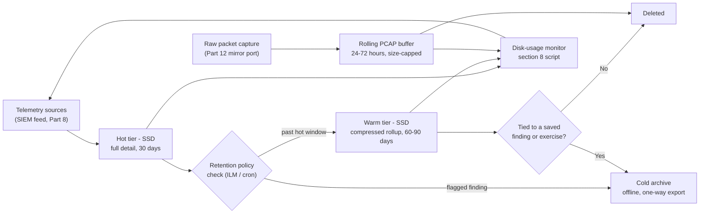

# Part 21 — Storage Growth, Retention, and Long-Term Cost Management

## Why this part exists

Every part in Sections B through F of this book adds something that writes to disk continuously: a SIEM index, a Zeek or Suricata log, a honeynet session record, a Sysmon or auditd event, a pre-change VM snapshot from Part 20. None of them, on its own, looks like a problem on day one. The problem shows up on day 90, when a filesystem that had 40% free space for two months is suddenly at 4% free with no single obvious cause — and the honest, embarrassing truth is that this already happened to the lab this book cites throughout. This part is where you build the habit of doing the arithmetic before the disk does it for you: what actually grows without bound, what's cheap to keep forever, what's expensive to keep for a week, and the specific point where the right answer is deleting data instead of buying another drive.

**[CONCEPT]** This part is deliberately not about backup strategy — Part 20 already covers snapshot discipline and restore paths for when a build breaks. This part is about the separate, slower-moving problem of a lab that works fine but is quietly consuming more disk every day it runs, until it doesn't.

> **Safety Gate**
> Retention and archiving in this part assume you're only ever moving data *out* of the isolated lab segment (Part 4), never opening a new path *into* it. Two conditions must hold before you attach any cold-storage target — a USB drive, a NAS share, a cloud backup bucket — to pull old logs or PCAP off a lab host: first, that target must not be simultaneously reachable from your home network and from inside the lab segment, because a NAS share mounted on both is a bridge, not a backup path, and it defeats every control Part 4 built regardless of how harmless the mount looks; second, archived honeynet captures and PCAP files can contain live exploit payloads, scanner shellcode, or malware samples your own decoys caught (Part 15) — extract and open them only on a host with no route back to anything you use for real work, and never on your everyday laptop out of convenience. Run the Appendix A4 pre-flight checklist against any new archive path before you use it for the first time, not just against the lab segment itself.

## 1. What actually fills a home lab's disk

**[CONCEPT]** Four things eat disk in this book's lab, and they don't grow at the same rate or for the same reason. Confusing them is why "I'll just add more storage" is usually the wrong first response — it treats a policy problem (you never decided how long to keep something) as a capacity problem (you don't have enough room), and buying more room just delays the day you have to make the policy decision anyway.

- **SIEM indices** (Part 8) grow continuously and proportionally to how many endpoints you're forwarding from and how noisy each one is. This is the slowest, steadiest grower, and the one with the most mature tooling for controlling it (§4).
- **Raw packet capture** (Part 12's mirror point, if you're saving full PCAP rather than just Zeek/Suricata's summaries) grows the fastest of anything in this book, because it stores every byte on the wire rather than a structured summary of what happened (§5).
- **Honeynet and endpoint logs** (Parts 9, 10, 15) are the cheapest, most compact category — they're already summaries, not raw captures — and the ones most worth keeping longer, because they're literally the evidence base for the hunting and purple-team content in the other three NESHBOY volumes (§6).
- **VM and container snapshots** (Part 20) don't grow with traffic at all — they grow with how much the live disk changes underneath them, and a snapshot chain nobody remembers to prune is one of the sneakiest full-disk causes in this whole book, because `df -h` on the host doesn't obviously point at "snapshots" the way it points at "the SIEM's data directory" (§7).

## 2. Real lab example: the host that went from 92% full to full

**[CONCEPT]** Part 3 already introduced the host this book partly evidences itself from: an HP EliteDesk 800 G1 desktop running Proxmox, 4 physical cores, 15GiB of RAM, hosting 13 guests. That part's Resource Reality box noted the host's root filesystem was at 92% full at a 2026-09-14 inspection. This part picks that thread up, because what happened next is the whole reason this part exists.

> **Resource Reality**
> By 2026-09-15 — the day this part was drafted — that same root filesystem had gone from 92% full to completely full. No single service crashed outright in an obvious, loud way; instead, the honeynet's correlation backend and the DNS resolver's logging both started failing writes intermittently, in the quiet, easy-to-miss way a full filesystem fails rather than the loud way an OOM-killed process fails. The honest answer to "what exactly filled the last 8%" is that it wasn't instrumented at the time — nobody was running `du -sh` against the guest data directories on a schedule, so there's no clean breakdown of SIEM-equivalent index growth versus log growth versus snapshot sprawl to point to after the fact. That gap is itself the lesson this part is built around: you cannot right-size a retention policy for a filesystem you never metered, and "add more disk" fixes the symptom for exactly as long as it takes the same ungoverned growth to catch back up. Section 8 builds the monitoring this host didn't have.

**[CONCEPT]** Notice what didn't happen here: nobody needed a bigger SIEM index or a wider honeynet to hit this wall. A 4-core desktop with 15GiB of RAM and a modest guest count filled its own root filesystem within roughly a day of crossing 92%, on ordinary background growth from services that were already running, not from a burst of new load. That's the actual shape of the problem this part solves — not "will my lab eventually need more storage" (yes, eventually, everything does) but "will an unmonitored, unpoliced lab surprise you with a hard stop weeks before you expected one" (also yes, and it already has, on the lab this book is drawn from).

> **Build Autopsy — "the disk that kept needing one more terabyte"**
>
> **The plan:** Respond to "the SIEM VM is running low on disk" by attaching a bigger virtual disk to it every time the warning appeared, on the theory that storage is cheap and the alternative — figuring out a retention policy — is more work than it's worth for a single-operator lab.
>
> **Why it seemed reasonable:** A 500GB SSD is genuinely inexpensive, the attach-and-extend-filesystem procedure takes ten minutes, and each individual expansion did solve the immediate problem. Nothing about any single instance of this looked like a mistake.
>
> **How it failed:** Every expansion bought time proportional to the current growth rate, but the growth rate itself never changed, because nothing was ever deleted, rolled up, or archived — nothing enforced a ceiling. Each expansion also had to be manually repeated, on a schedule that kept getting shorter as more endpoints and a wider honeynet got added on top of the same unmanaged index. The underlying failure is that "buy more disk" treats an unbounded-growth problem as a one-time capacity problem, when it's actually a recurring policy problem that resurfaces on a shortening interval.
>
> **The fix:** A retention policy (§3–4) that puts an actual ceiling on hot-tier growth, so a disk-size decision is made once per tier instead of being re-litigated every few weeks as an emergency.

## 3. Retention math: doing the arithmetic before your disk does it for you

**[COST/RESOURCE]** The table below is illustrative, not a measurement from a specific running lab — treat the ranges as a starting point for your own `du -sh` numbers once §8's monitoring is in place, not as a guarantee for your exact hardware and traffic mix.

**Table 21.1 — Typical daily disk growth by lab component (CONCEPTUAL SAMPLE).** Supports deciding which retention lever in §4–7 to pull first, by showing which components grow fastest relative to how compact their data actually is.

| Component | Typical daily growth | Grows without bound? | Primary lever | Notes |
|---|---|---|---|---|
| SIEM event index (Sysmon + auditd + Zeek + Suricata combined feed) | 50MB–500MB, scales with endpoint count | Yes, until policy caps it | ILM/index rollover (§4) | A default one-replica index roughly doubles this on disk — see §4's Engineering Reality |
| Raw PCAP (full packet capture, not just NSM summaries) | 500MB–5GB+ | Yes, fastest grower in the book | Ring-buffer rotation (§5) | Even a quiet lab segment generates this; an internet-facing honeynet decoy generates far more from background scanning alone |
| Honeynet session/probe logs (Part 15) | 5MB–50MB | Yes, but slowly, and it's already compact | Long retention is usually affordable (§6) | Grows with how much scanning traffic your decoys attract, not with how much you did |
| Endpoint auditd/journald and Sysmon logs (Parts 9–10) | 1MB–10MB per endpoint | Yes, slowly | Long retention is usually affordable (§6) | Cheapest category per byte of investigative value in this book |
| VM/container snapshots (Part 20) | 0 at creation, then variable | Yes, tied to live-disk change rate, not time | Manual pruning (§7) | The only category that doesn't show up as "logs growing" in any dashboard |

**[COST/RESOURCE]** The arithmetic that matters is simple: days until full = free space ÷ daily growth rate, summed across every row above that you're actually running. A lab with 200GB free and a combined growth rate of 6GB a day (a plausible total once PCAP retention and an active honeynet are both in the mix) has roughly 33 days before it hits zero — not months, and not a number most readers would guess without doing the division. Run this calculation for your own lab before reading further, using either Table 21.1's ranges or, better, your own §8 measurements.

> **What Would Change My Mind**
> This part's working assumption, carried into §4's specific numbers, is that a single-operator lab following this book's scope (Sections B–F, no persistent Windows domain) rarely needs more than 30 days of hot-tier SIEM retention and a 72-hour rolling PCAP buffer to support the hunting and purple-team exercises Detection Engineering Handbook V2 and Part 19 of this book describe. If a reader reports a specific exercise from either source that genuinely required reaching back further than 30 days of hot data to reproduce or investigate — not "more retention would have been nice" but "the exercise's own instructions assume history this policy doesn't keep" — that specific number needs revision here, not just a footnote caveat.

## 4. SIEM index lifecycle: hot storage, rollover, and deletion

**[CONCEPT]** Part 8 left three SIEM choices on the table — Wazuh, the Elastic stack, or Graylog — and this part doesn't relitigate that choice. What it adds is the retention mechanism each one gives you, because "logs arrive and are searchable" (Part 8's stopping point) says nothing about how long they stay searchable before someone — you — has to decide.

**[CONCEPT]** The author's own running lab doesn't operate any of these SIEM platforms — it's the Linux-only honeynet and monitoring setup Part 9 and Part 15 draw real evidence from, with no Wazuh, Elastic, or Graylog instance behind it. Everything in this section is grounded in each platform's own published behavior, not a build the author has run end-to-end on this book's own hardware — treat the exact API syntax below as a documented starting point to verify against whatever version you actually installed in Part 8, not as a build-tested figure.

### 4.1 Elasticsearch/OpenSearch-family ILM (Wazuh's bundled indexer, or a standalone Elastic stack)

**[SETUP]** The commands below target the Index Lifecycle Management (ILM) API as documented for the Elasticsearch/OpenSearch 7.x–8.x lineage Wazuh's bundled indexer and a standalone Elastic stack both build on, per Part 8. Define a policy that keeps an index in a fast "hot" phase for 7 days, rolls it into a "warm" phase (still searchable, no longer accepting new writes) for another 23 days, then deletes it at 30 days total:

```bash
curl -X PUT "https://localhost:9200/_ilm/policy/lab-telemetry-policy" \
  -H "Content-Type: application/json" \
  -u "admin:<your-indexer-password>" \
  -d '{
    "policy": {
      "phases": {
        "hot":    { "actions": { "rollover": { "max_size": "20gb", "max_age": "7d" } } },
        "warm":   { "min_age": "7d",  "actions": { "shrink": { "number_of_shards": 1 } } },
        "delete": { "min_age": "30d", "actions": { "delete": {} } }
      }
    }
  }'
```

Defining the policy alone doesn't attach it to anything: the `rollover` action operates on a write alias, not a fixed index name, so it only takes effect once an index template sets `index.lifecycle.name` to `lab-telemetry-policy` and `index.lifecycle.rollover_alias` to the alias your SIEM's data stream actually writes through — Part 8's install docs for whichever platform you chose cover that template step. Confirm the policy is attached and progressing with `GET _ilm/policy/lab-telemetry-policy` and, on an index using it, `GET <index-name>/_ilm/explain` — the explain output should show a `phase` field advancing from `hot` toward `delete` as the index ages, not stuck on `hot` indefinitely.

> **Engineering Reality**
> ILM's `rollover` action only fires when an index crosses its configured `max_size` or `max_age` threshold — and in a home lab with modest ingest volume, an index can sit well under `max_size` for weeks. If your lab generates less than 20GB of events in 7 days (likely, per Table 21.1), the `max_age` trigger is what actually rolls it over, not the size trigger; if you set only a size threshold and skip `max_age`, a quiet lab's index may never roll over at all, and the delete phase that depends on it never fires either. Always pair a size threshold with an age threshold for a home-lab-scale policy, or the newest, most active index just keeps growing forever while you believe a retention policy is running.

### 4.2 Graylog's index set rotation and retention

**[SETUP]** Graylog exposes the same idea through its web UI rather than a REST policy document: under **System → Indices**, an index set's **Rotation strategy** (typically "Index Size" or "Index Time," matching Table 21.2's tiers) and **Retention strategy** ("Delete Index" or "Close Index," where closed indices stop accepting queries but stay on disk until manually reopened or deleted) together do what §4.1's ILM policy does for Elasticsearch. Set rotation to a 7-day time window and retention to delete after 4 rotated indices to land on the same 30-day-total policy as the ILM example above.

> **Validation Test**
> **Setup:** either §4.1's ILM policy attached to a live index, or §4.2's Graylog rotation/retention strategy configured on an index set.
> **Action:** force a rollover early for testing — `POST <write-alias-name>/_rollover` (the alias, not the concrete backing index) for Elasticsearch/OpenSearch, or the **Rotate active write index now** button in Graylog's index set page.
> **Expected result:** a new index appears as the active write target, and the previous index shows the `warm` phase (ILM) or a "closed for writing" state (Graylog) rather than continuing to accept new events — confirming the policy actually executes before you wait 7 real days to find out it doesn't.

## 5. PCAP retention: the fastest way to fill a disk, and why you probably don't need much of it

**[CONCEPT]** Zeek and Suricata (Parts 13–14) already give you structured summaries of every connection and every rule match. Raw PCAP is different in kind, not just in size — it's every byte that crossed the wire, which is exactly why it's Table 21.1's fastest grower and exactly why most of this book's exercises don't actually need it kept for long. The honest case for raw PCAP in a home lab is narrow: reconstructing the literal payload of a specific session (extracting a file transferred in the clear, replaying an exact exploit byte sequence) after Zeek or Suricata already told you something worth looking closer at. That's a look-back-a-few-days use case, not a look-back-a-few-months one.

**[SETUP]** The commands below target `tcpdump` 4.9.x as shipped on Debian 12/Ubuntu 22.04, run on the NSM sensor VM from Part 12 against the same mirrored capture interface Zeek and Suricata already read. `-G` and `-W` together do not, on their own, build a self-sustaining ring buffer — without `-C`, tcpdump exits once it has written the 24th file instead of wrapping around and overwriting the oldest one, so a capture left running this way silently stops recording after 24 hours with no error anywhere:

```bash
sudo tcpdump -i eth1 -w /pcap/rolling/capture_%Y%m%d_%H%M%S.pcap -G 3600 -W 24
```

`-G 3600` rotates to a new file every 3600 seconds (one hour); `-W 24` stops tcpdump after the 24th file rather than deleting anything. Run it under a systemd unit with `Restart=always` so it relaunches the instant it exits at file 24, and add a separate cron job to actually enforce the 24-hour ceiling tcpdump itself doesn't:

```ini
# /etc/systemd/system/pcap-ring.service
[Unit]
Description=Rolling PCAP capture on the Part 12 mirror interface

[Service]
ExecStart=/usr/bin/tcpdump -i eth1 -w /pcap/rolling/capture_%%Y%%m%%d_%%H%%M%%S.pcap -G 3600 -W 24
Restart=always
RestartSec=5

[Install]
WantedBy=multi-user.target
```

```bash
# crontab -e — deletes anything older than 24 hours; tcpdump's own -G/-W never does this
0 * * * * find /pcap/rolling -name 'capture_*.pcap' -mmin +1440 -delete
```

Confirm the loop is actually closed, not just running once and stopping, with `systemctl status pcap-ring` (expect `active (running)`, not `inactive (dead)` sitting at file 24) and `ls -la /pcap/rolling/ | wc -l` a few hours in — the count should stabilize at 24, not climb past it or freeze short of it.

> **Blind Spot**
> A 24-hour PCAP ring buffer has an obvious, specific cost: if a purple-team drill (Part 19) or a honeynet capture (Part 15) turns out to be worth deeper packet-level analysis and you don't notice until the second day after it happened, the raw bytes are already gone — overwritten by the ring, not archived anywhere. Zeek's and Suricata's logs survive past that window and tell you the session happened, but neither one preserves the literal payload the way raw PCAP does. This ring buffer trades exactly that capability for disk space; it doesn't eliminate the need for payload-level analysis, it just narrows the window in which it's possible.

> **Lab Note**
> If a specific session is worth keeping past the ring buffer's window — you just ran a Part 18 attack simulation and want the exact PCAP for later review — copy that one file (or use `tcpdump`'s BPF filter to extract just that session from the current ring file) to the archive tier from §6 within the same day, before the ring buffer overwrites it. This is a five-minute `cp` command done at the right moment instead of a capability you can never get back once the file's gone.

## 6. What's actually worth keeping long-term: honeynet and endpoint logs

**[CONCEPT]** Table 21.1's cheapest rows — honeynet session/probe logs and endpoint auditd/Sysmon/journald output — are also the ones with the best ratio of investigative value to disk cost in this entire book, because they're already the summarized, structured record of what happened rather than the raw bytes underneath it. A honeynet's correlated attack-session log (Part 15) at, say, 30MB a month costs you almost nothing to keep for a year; the same can't be said for a year of raw PCAP from the same segment.

**[COST/RESOURCE]** This is the retention tier where "keep it longer than you think you need to" is actually the right default, not a hoarding instinct to resist — the entire premise of Detection Engineering Handbook V2's threat-hunting content (its Parts 34–36) is having enough history to hunt across, and this book's Part 3 already flagged that a Tier-1 hardware budget forces short retention windows specifically here. If your hardware tier allows it, extend hot-or-warm retention for honeynet and endpoint logs well past the 30-day SIEM-index default in §4 — 90 days or more, if disk allows — before extending PCAP retention at all.

**Table 21.2 — Recommended retention windows by data class.** Supports deciding what changes between §4's SIEM-index default and a longer or shorter window for a specific data class, before you touch any single component's config.

| Data class | Recommended hot/warm window | Cold-archive it? | Why |
|---|---|---|---|
| SIEM event index (mixed feed) | 30 days | Selectively, only around a flagged finding | Bulk retention here is dominated by Windows/Sysmon volume, which is the least compact category |
| Raw PCAP | 24–72 hours (rolling) | Only the specific session you flagged, same day | Fastest grower, lowest value once Zeek/Suricata have already summarized it |
| Honeynet session/probe logs | 90+ days | Yes, indefinitely if disk allows | Cheap, compact, and the direct evidence base for hunting and correlation content elsewhere in the series |
| Endpoint auditd/journald/Sysmon logs | 60–90 days | Yes, for anything tied to a documented exercise | Cheapest per-byte investigative value in the book |
| VM/container snapshots | Days, not weeks | No — snapshots aren't an archive format | See §7; a snapshot is a rollback point, not a retention record |

## 7. Snapshot sprawl: Part 20's quiet disk-eater

**[TROUBLESHOOTING]** Part 20 tells you to snapshot before every risky change. It does not tell you, and this part will, that a snapshot nobody deletes keeps consuming more disk the longer it lives — not because the snapshot itself grows, but because a copy-on-write snapshot pins every block the live disk changes after it was taken, and a lab endpoint that's actively being used for exercises changes a lot of blocks over a few weeks. A snapshot taken before a config change three months ago, still sitting there because nobody remembered to remove it after confirming the change worked, can be pinning gigabytes of now-irrelevant delta data on a host where nobody's looking for it.

**[SETUP]** On a Proxmox VE 8.x/9.x host (Part 5), list what's actually pinned per guest and check the underlying storage's real usage against what the guest configs claim:

```bash
qm listsnapshot <vmid>
pvesm status
zfs list -t snapshot 2>/dev/null || lvs -a
```

`qm listsnapshot` shows every named snapshot for a given VM and how long ago it was taken; `pvesm status` shows real consumption per storage pool, which is the number that actually matters; the `zfs`/`lvs` fallback pair shows the storage-backend-level view depending on whether the pool is ZFS or LVM-thin, since a snapshot's real disk cost lives at that layer, not in the VM config.

**[TROUBLESHOOTING]** The fix is a habit, not a tool: delete a snapshot the moment you've confirmed the change it protected against actually worked, the same way you'd delete a backup you've confirmed you don't need — not "eventually," and not "when I notice the disk is full," because by the time `df -h` shows the problem, you're already in the situation Part 21's whole premise warns about.

## 8. Building a disk-growth monitoring loop

**[SETUP]** The gap that let §2's host go from 92% to full without warning is a missing feedback loop — nothing was watching, so nothing could alert. The script below (targeting any Debian/Ubuntu host from Parts 5–14) checks root filesystem usage and writes a structured line to syslog, cheap enough to run via cron every 15 minutes:

```bash
#!/bin/bash
# /usr/local/bin/disk-growth-check.sh
THRESHOLD=85
USAGE=$(df --output=pcent / | tail -1 | tr -dc '0-9')
if [ "$USAGE" -ge "$THRESHOLD" ]; then
  logger -t disk-growth-check "WARNING: root filesystem at ${USAGE}% — threshold ${THRESHOLD}%"
fi
```

```bash
# crontab -e, on the host being monitored
*/15 * * * * /usr/local/bin/disk-growth-check.sh
```

Because the warning goes through `logger`, it lands in `journald`/syslog exactly like the baseline telemetry Part 9 already teaches you to forward — point the Part 8 SIEM at this host's syslog the same way, and disk usage becomes a searchable, alertable field alongside every other event source in the lab, instead of a number you only check when something already feels wrong.

> **Validation Test**
> **Setup:** the script and cron entry above, installed on a lab host already forwarding syslog to the Part 8 SIEM.
> **Action:** temporarily lower `THRESHOLD` to a value below the host's current usage (for example, `THRESHOLD=1`), then wait for the next cron run or execute the script manually.
> **Expected result:** a `disk-growth-check` tagged warning entry appears in local syslog within seconds, and the same entry is searchable in the SIEM within the normal forwarding delay — confirming the loop actually closes end to end before you rely on it at a real threshold.





**Figure 21.1 — Retention and disk-growth monitoring lifecycle.** *CONCEPTUAL.* Illustrates how the retention levers built in §4–7 connect to the monitoring loop built in §8 — hot-tier telemetry and PCAP each move toward either a cold archive or deletion based on policy, while a disk-usage monitor feeds its own findings back into the SIEM as ordinary telemetry. This is an architecture sketch for the policy this part recommends, not a capture from a specific running build.

## 9. Buy more disk, or prune? A decision table

**[COST/RESOURCE]** Every symptom in the table below has one right first response and one tempting wrong one — the wrong one is almost always "add capacity" when the real problem is "nothing has a ceiling."

**Table 21.3 — Disk-growth symptom to response.** Supports picking the right fix quickly instead of defaulting to "buy a bigger drive," which the Build Autopsy in §2 shows only delays the same problem.

| Symptom | Likely cause | Right response | Wrong response |
|---|---|---|---|
| One VM's disk fills every few weeks, same VM each time | No retention policy on that VM's data (SIEM index or PCAP) | Apply §4 or §5's retention mechanism to that specific component | Extending that VM's virtual disk again |
| Host-level `pvesm status` usage climbs steadily with no new VMs added | Snapshot sprawl (§7) | Audit and prune snapshots older than their confirmed-working window | Adding a second storage pool |
| SIEM dashboards feel slow, disk usage looks fine | Disk I/O, not capacity — likely spinning disk under indexing load (Part 3, §5) | Move the active index to SSD; keep only cold archive on spinning disk | Buying more RAM |
| A specific honeynet decoy's log volume spiked overnight | Real scanning activity, not a misconfiguration | Confirm via the correlation logic in Part 15, then decide if it's worth extending that decoy's retention | Assuming it's a bug and restarting the service |
| Root filesystem crosses 85% with months of runway left at current growth | Normal, expected growth against a fixed disk | Nothing urgent — confirm §8's monitor is watching it and plan the next tier upgrade on your own schedule | Panicking and deleting data you haven't reviewed |

**[COST/RESOURCE]** When a genuine capacity upgrade is the right call — a Tier-2 box (Part 3) whose SSD is simply full of retained data you've decided is worth keeping, not ungoverned growth — the incremental cost is modest at home-lab scale: a used 1TB SATA SSD for anything actively indexing runs roughly $40–60, and a 2–4TB spinning HDD suitable for the cold-archive tier in Table 21.2 runs roughly $20–30 per terabyte used. Buying that disk after a retention policy is in place buys you real, bounded headroom. Buying it before one is in place buys you the same conversation again in a few weeks, per §2's Build Autopsy.

## 10. What this retention policy feeds downstream

**[CONCEPT]** A retention policy isn't just a disk-management chore — it's a decision about how far back the rest of the NESHBOY series can reach into what your lab produced, so it's worth naming the handoff explicitly.

Detection Engineering Handbook V2's threat-hunting content (its Parts 34–36) assumes you have enough retained history to hunt across; §6's recommendation to extend honeynet and endpoint log retention well past the SIEM-index default exists specifically so a hunting exercise from that book isn't blocked by a policy this book set too conservatively. If a hunt asks you to look back 60 days and your policy only kept 30, the fix is this part, not that one.

SOC Playbook Handbook's playbooks assume the evidence an incident produced is still available when you work through it — a playbook that asks you to pull the original PCAP for a session your honeynet flagged three days ago fails, not because the playbook is wrong, but because §5's default 72-hour ring buffer already overwrote it. Decide your PCAP retention window with a specific playbook-practice cadence in mind, not just a disk-space instinct, if you plan to run Part 19's purple-team drills against Playbook Handbook procedures on a delay longer than a few days.

SOC Manager's Operating Handbook's budget-justification framing (its Part 20) is a near-exact mirror of the arithmetic in §3 and §9 here, just at a different scale: "we need X gigabytes a month to retain Y days of history for hunting and drills, costing $Z, and here's what breaks below that" is the same sentence structure that book teaches for justifying a real SOC's storage line item to a real budget owner. The retention math you did in this part for your own lab is a small, low-stakes rehearsal of that exact argument — keep your numbers from §3 and §9 the same way Part 3 suggested keeping your hardware-tier numbers, because the next time you need to make this case for real, you'll already have run it once.

---

**Cross-references:** Part 3 (Hardware and Resource Budgeting) for the hardware tiers and the host this part's real-lab example continues from; Part 4 (Network Isolation and Segmentation Architecture) and Appendix A4 (The Safety & Isolation Pre-Flight Checklist) for the isolation controls this part's Safety Gate depends on when attaching any archive target; Part 5 (Choosing and Installing a Hypervisor) for the Proxmox commands in §7; Part 8 (Building the SIEM Platform) for the SIEM platform choice §4's retention mechanisms attach to; Part 9 (Linux Endpoints and auditd Deployment) and Part 10 (Windows Endpoints and Sysmon Deployment) for the endpoint telemetry sized in §3 and §6; Part 12 (Packet Capture and Traffic Visibility Fundamentals), Part 13 (Deploying Zeek), and Part 14 (Deploying Suricata) for the capture point §5's PCAP rotation reuses; Part 15 (Honeypots and Honeynet Architecture) for the honeynet logs recommended for extended retention in §6; Part 18 (Safe Attack Simulation) and Part 19 (Generating Practice Telemetry and Purple-Team Drills) for the exercises §5's Lab Note and §10 assume you'll want to reach back for; Part 20 (Lab Maintenance, Patching, and Snapshot/Backup Strategy) for the snapshot discipline whose disk cost §7 covers; Detection Engineering Handbook V2, Parts 34–36 for the hunting depth §6 and §10 size retention against; SOC Playbook Handbook's Playbook Library for the evidence-availability assumption §10 flags; SOC Manager's Operating Handbook, Part 20 for the budget-justification argument this part's arithmetic rehearses.
