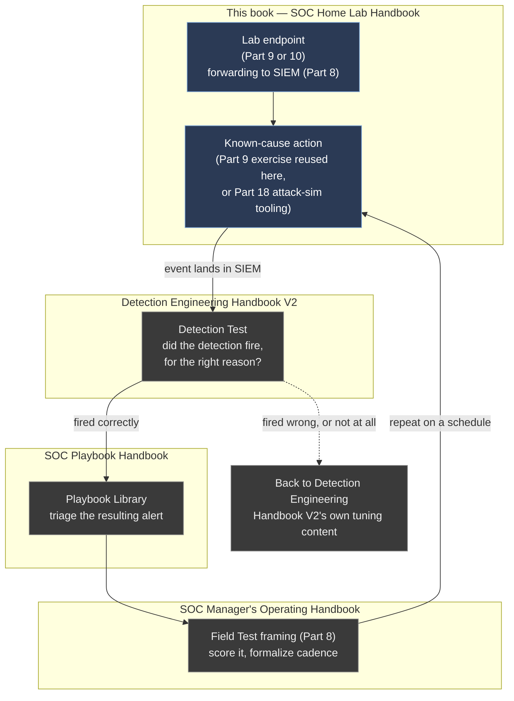

# Part 22 — From Lab to Practice: Closing Synthesis and the Series Map

## Why this part exists

If you've built even half of what Parts 1 through 21 describe, you have something most security books never get you to: a running environment that produces real telemetry from real, if small, misbehavior — a Linux endpoint tagging `identity`-keyed file writes, a Windows host logging process creation, Zeek and Suricata watching a mirrored port, maybe a honeynet quietly logging unsolicited probes from the open internet. That's the entire promise this book made in Part 1, and by this point it's either kept or it isn't.

What this part does not do is teach you anything new to install. It closes the loop this book has been pointing at since Part 1's own closing section: telemetry sitting in a SIEM that nobody ever runs a Detection Test against, triages through a playbook, or turns into a repeatable drill is a lab that's built but not used — and "built but not used" is a worse outcome than never building it, because it costs you disk, power, and patching effort (Part 20) for nothing back. This chapter walks one complete path, start to finish, from a specific piece of telemetry this book's earlier parts can produce, through a Detection Test in *The Detection Engineering Handbook V2*, through a playbook in *SIGNAL TO ACTION: The Complete SOC Playbook Handbook*, to a repeatable Field Test drill structured per *The SOC Manager's Operating Handbook*. It then hands you the full cross-series lookup table this book has been building toward one hand-off at a time, part by part, so you have one place to find where any specific build output goes next.

Say plainly what this walkthrough is and isn't: it's a worked, illustrative path through the four volumes, built on the real `identity`-key exercise Part 9 already validated on the author's own lab-endpoint pattern — it is not a claim that the author ran an Atomic Red Team technique, wrote a formal Detection Test, worked a playbook, and scored a Field Test drill against this specific book's own environment end to end. Parts 15, 18, and 19 aren't written yet as this chapter goes to draft, and this closing synthesis doesn't get to borrow evidence from parts that don't exist. Where the walkthrough below touches something the author's real lab has actually produced — the honeynet's MITRE-tagged correlated sessions, cited from `BOOK-INDEX.md`'s own Part 15 evidence description — it says so and stays inside what's actually documented there.

> **Safety Gate**
> Nothing in this closing chapter loosens any isolation control built earlier in this book. The worked walkthrough in §3–§4 below reuses Part 9's disposable-account exercise, which must run only on a lab endpoint inside the isolated segment from Part 4, firewalled per Part 6, with the Appendix A4 pre-flight checklist already run — never on a host holding a real credential you use elsewhere. If your version of this walkthrough instead uses Part 18's attack-simulation tooling or touches Part 15's honeynet segment, that part's own (expanded) Safety Gate governs and this section doesn't substitute for it. Before you run anything below against your own lab, confirm the specific endpoint you're targeting is one you built for exactly this purpose and that its only network path is the one Part 4 and Part 6 designed — a closing chapter is not the place to get casual about a rule this book has stated as non-negotiable since Part 1.

## 1. What "the lab is built" actually means at this point

**[CONCEPT]** "Built" doesn't mean every part in this book — it means enough of the pipeline exists end to end that a piece of telemetry can travel from an endpoint to a SIEM to a decision. At a minimum, that's a hypervisor (Part 5), a segmented network with a working firewall (Parts 4 and 6), a SIEM that can ingest and search (Part 8), and at least one endpoint producing telemetry into it (Part 9 or Part 10). Everything past that — Zeek and Suricata (Parts 13–14), threat-intel enrichment (Part 16), a honeynet (Part 15), dashboards (Part 17), attack-simulation tooling (Part 18) — adds more telemetry sources and more realism, but the loop this chapter closes works the same way with one endpoint as it does with fifteen.

That matters because a reader partway through this book, or a reader who retrofitted one component onto an existing setup per Part 1's second reading path, doesn't need to wait for Part 21's storage-retention content to be relevant before running this chapter's walkthrough once. The loop below is deliberately sized to the smallest lab this book can produce, not the largest.

**[CONCEPT]** It's also worth being honest about what "built" doesn't mean: it doesn't mean patched, monitored for its own health, or resourced for anything beyond light, human-driven use. Part 20's maintenance discipline and Part 21's retention policy are what keep a built lab usable six months from now instead of degrading quietly — this chapter assumes those are in place or on your list, not finished forever.

## 2. The closing loop, in one diagram

**[CONCEPT]** Before walking each step in prose, it's worth seeing the whole loop at once — one action generating telemetry in this book, three separate hand-offs to the other three NESHBOY volumes, and one feedback edge back into this book's own maintenance and expansion work.





**Figure 22.1 — The closing loop across all four NESHBOY volumes.** *CONCEPTUAL.* Illustrates the hand-off sequence this chapter walks in prose: a lab endpoint built in this book produces telemetry from a known-cause action, a Detection Test in *The Detection Engineering Handbook V2* confirms whether a detection fired for the right reason, a fired alert gets worked through *SOC Playbook Handbook*'s Playbook Library, and *The SOC Manager's Operating Handbook*'s Field Test framing turns the whole run into a scored, repeatable drill that eventually schedules another pass through the same loop. This is a process diagram, not a capture of a specific run — no claim is made that this exact sequence has been executed end to end against this book's own lab as of this writing.

The loop's honest failure path matters as much as its success path: if the Detection Test in §5 shows the detection didn't fire, or fired for the wrong reason, the loop doesn't continue to the playbook step — it goes back into Detection Engineering Handbook V2's own tuning content first. Working a playbook against an alert that never should have fired teaches you nothing about triage; it teaches you to distrust an alert that was simply built wrong.

## 3. Step one — pick a telemetry source and confirm it's still alive

**[HANDS-ON LAB]** Goal: before generating anything new, confirm the pipeline you're about to exercise is actually intact, since a stale or drifted lab is the single most common reason this chapter's walkthrough produces nothing.

1. Pick one endpoint you already built — Part 9's Linux endpoint is the easiest starting point if you have it, because its `identity` key (introduced in Part 9, tagging writes to `/etc/passwd`, `/etc/shadow`, and `/etc/group`) is already wired end to end from a real `useradd`/`userdel` exercise.
2. Confirm the endpoint is powered on and still forwarding: run `sudo systemctl status auditd rsyslog` on the endpoint itself.
3. Confirm the SIEM is still receiving from it — search for any event from that host in roughly the last 24 hours.

If step 3 comes back empty, stop here and fix the forwarding path (Part 9, §6) before doing anything below — generating a known-cause event against a pipeline that's already broken just gives you a second thing to debug at once.

> **Lab Note**
> This is the one exercise in this book worth running on a calendar, not just once. A lab left alone for a few weeks drifts — a certificate expires, a forwarder silently stops, a disk fills per Part 21's own warning — and the fastest way to catch that isn't watching dashboards passively, it's running this three-step check before every drill. Five minutes here saves you from discovering the break in the middle of §4, when it looks like the detection failed instead of the plumbing.

## 4. Step two — generate known-cause telemetry

**[HANDS-ON LAB]** With the pipeline confirmed alive, generate one specific, known-cause event and note exactly what you did and when, so the Detection Test in §5 has a ground truth to check against. The commands below are the same disposable-account action Part 9's own Validation Test used — reused here for a different purpose: not confirming the audit pipeline works, but generating a real trigger to run a detection against.

This reuses Part 9's own disposable-account sequence verbatim, targeting the same Debian/Ubuntu `auditd` baseline Part 9 built — it is a real, run-it-as-shown command sequence standing in for a Part 18 attack-simulation technique, not an illustrative/invented sample.

```bash
# stand-in for a Part 18 attack-simulation technique; run only on the disposable
# lab endpoint from Part 9, per this chapter's Safety Gate.
sudo useradd -m closingdrill
sudo ausearch -k identity -ts recent
sudo userdel -r closingdrill
```

If you've built Part 18's attack-simulation tooling instead, run a scoped technique from it against the same endpoint rather than the account-creation stand-in above — MITRE ATT&CK's T1136.001 (Create Account: Local Account) is the technique this stand-in actually maps to, and Part 18's tooling likely has a named, reversible test for exactly that technique. Either way, the discipline is the same: one action, one timestamp, one expected event shape, so the next step has something concrete to confirm against.

**[SAFETY]** Whichever action you pick, it must be reversible and confined to the disposable lab endpoint — this chapter's Safety Gate restates that explicitly because a closing chapter is exactly the point in a book where a reader relaxes and runs "just one more thing" against whatever's closest to hand, which is precisely how isolation gets skipped in practice rather than in theory.

A Windows-endpoint reader running the equivalent exercise against Part 10's build would generate Event ID 4720 (A user account was created) instead of an `identity`-keyed auditd record — the loop below works identically either way; only the specific event shape changes.

## 5. Step three — run a Detection Test in Detection Engineering Handbook V2

**[CONCEPT]** This is the point where this book's job formally ends for this specific event, and *The Detection Engineering Handbook V2* picks up. That book's own Detection Test callout — the pattern this book's Validation Test callout is directly adapted from, per `BOOK-INDEX.md`'s provenance notes — asks one question with a checkable answer: given the event you just generated, does a detection rule fire, and does it fire for the reason you think it does?

Concretely, that means taking the `identity`-keyed event from §4 into whatever correlation or rule logic Detection Engineering Handbook V2's Parts 22–33 teach you to build on top of Part 9's raw telemetry, and checking three things: did an alert fire at all, did it fire within a reasonable window of the actual action, and does the alert's own fields (the account name, the host, the timestamp) match what you actually did rather than some other coincidental activity on the same host. A detection that fires on the right host at the wrong time, or the right time on the wrong host, has failed this test just as much as one that never fires — "it triggered" isn't the same claim as "it triggered for the right reason."

> **Validation Test**
> **Setup:** The §4 action already run and confirmed present via `ausearch -k identity` (or the equivalent Event ID 4720 search), and a detection rule built per Detection Engineering Handbook V2's baselining/correlation content pointed at the same SIEM index.
> **Action:** Search the SIEM for both the raw `identity`-keyed event and any alert your detection logic generated in the same window.
> **Expected result:** One alert, timestamped within roughly a minute of the raw event, carrying the same hostname and account name as the action in §4. Zero alerts, or an alert with mismatched fields, means the detection — not this chapter's walkthrough — needs the tuning content the other book owns; don't proceed to §6 with a detection you haven't confirmed is actually correct.

**[CONCEPT]** If your lab doesn't yet have a detection rule built against this specific telemetry, that's a legitimate stopping point for this pass of the loop, not a failure — Detection Engineering Handbook V2's Parts 22–33 are where you'd build one, and this chapter's job was only ever to hand you a confirmed, known-cause event to build and test that rule against.

## 6. Step four — work the alert through a SOC Playbook Handbook playbook

**[CONCEPT]** Once §5 confirms a real, correctly-fired alert, the next hand-off is to *SIGNAL TO ACTION: The Complete SOC Playbook Handbook*'s Playbook Library — the volume that owns what an analyst actually does once an alert like this lands in a queue. This book stops at "the alert fired correctly"; it has no content on scoping, containment, or escalation decisions, and it shouldn't grow any, because that's a different, much deeper discipline with its own volume already covering it.

Concretely, the playbook exercise looks like this: treat the alert from §5 as if it landed in a real queue with no other context, and work it the way the relevant SOC Playbook Handbook playbook instructs — pull the account-creation event's surrounding context (what else happened on that host in the preceding few minutes), determine whether the account persisted or was cleaned up, and decide whether the activity, taken at face value with no foreknowledge that you caused it, would warrant escalation. This is also the point where a home-lab drill most resembles real analyst work, because the triage judgment itself doesn't care whether the underlying event was real or simulated — only the ground truth you're checking your judgment against does.

**[TROUBLESHOOTING]** A specific trap worth naming: because you know you caused the alert, it's tempting to skip straight to "yes, that's expected, close it" without actually working the playbook's steps. Resist that — the entire value of running a known-cause drill is practicing the triage motion under conditions where you can grade yourself against ground truth, and skipping the motion because you already know the answer defeats the exercise as thoroughly as skipping the isolation checklist defeats a honeypot.

## 7. Step five — formalize the loop as a repeatable Field Test drill

**[CONCEPT]** A single pass through §3–§6 is a useful exercise once. Repeating it on a schedule, with a way to compare this month's run against last month's, is what turns a home lab from "a thing I built" into "a thing that keeps me sharp" — and that formalization is *The SOC Manager's Operating Handbook*'s job, specifically its Part 8 Field Test framing, cited throughout this book's earlier parts as the destination for exactly this kind of drill.

Field Test framing (per `manager:part08`) asks you to fix, in advance, what a "pass" looks like — a maximum time from alert to triage decision, a specific set of context fields you're expected to pull, a defined escalation threshold — so that a repeated drill produces a comparable score instead of a vague sense of "that went fine." Table 22.2 below adapts that framing down to a single-operator scale, since the Manager's Handbook's own version assumes a team running the drill against each other, not one person running it against themselves.

**Table 22.2 — Adapting Field Test framing to a solo-operator drill.** The table below supports deciding what to keep, simplify, or drop from a team-scale Field Test when only one person is running it.

| Drill element | Team-scale Field Test (Manager's Handbook) | Solo-operator adaptation (this book) |
|---|---|---|
| Scope/technique | Assigned per analyst, often blind | Self-selected from Table 22.1's telemetry sources, logged before running |
| Success criteria | Fixed rubric scored by a second reviewer | Fixed checklist (§5's Validation Test + §6's playbook steps), self-scored against a written answer key made before the run |
| Timing | Time-to-triage tracked per analyst, compared across the team | Time-to-triage tracked per run, compared against your own prior runs |
| Reporting | Rolled up to a manager for team-capability tracking | A dated log entry — technique run, detection fired (yes/no), triage time, one line on what you'd change |
| Cadence | Scheduled by the manager, often quarterly | Monthly is realistic for a hobbyist lab; tie it to Part 20's own patch-cadence reminder so both happen in the same sitting |
| Blind vs. known scope | Usually blind, to test real detection capability | Known on purpose here — the goal is confirming the pipeline and practicing triage motion, not testing whether you can surprise yourself |

**[CONCEPT]** The last row is worth dwelling on. A team-scale Field Test often works best blind, because the point is testing whether an analyst who didn't design the detection can still work it correctly. A solo drill against your own lab can't be meaningfully blind — you already know what you did in §4 — so the adaptation's honest goal is narrower: confirm the pipeline stays alive over time (§3), and keep the triage motion itself from atrophying (§6), not simulate the experience of a real unknown alert. If you want that experience specifically, Part 15's honeynet is the better source, since its alerts are genuinely unsolicited and you don't know in advance what's going to show up in them.

> **Lab Note**
> Keep the answer-key log from Table 22.2's reporting row in something durable — a plain text file next to your Part 20 maintenance log is fine. Six months of "technique, detection fired, triage time" entries is the only real evidence you have that the lab is doing its job, and it's a more useful thing to point to in an interview or a portfolio than a screenshot of a dashboard with no history behind it.

## 8. The full cross-series quick-reference table

**[CONCEPT]** Every part in this book has named its specific hand-off to one of the other three volumes at the point it applied. Table 22.1 collects those hand-offs into one lookup, organized by what this book's part actually produces — use it as the fast path when you've built something and want to know immediately where to take its output, and use Appendix A5 when the question is broader than "what does this specific part's telemetry feed into."

**Table 22.1 — Cross-series quick reference: what to do with each part's output.** The table below supports deciding which NESHBOY volume and part to open next once a given piece of this book's build is producing telemetry.

| This book's part | What it produces | Detection Engineering Handbook V2 | SOC Playbook Handbook | SOC Manager's Operating Handbook |
|---|---|---|---|---|
| Part 7 (Internal DNS) | DNS query/sinkhole logs | `deh:part15` (DNS-based detection content) | Playbook Library — suspicious-domain triage | — |
| Part 9 (Linux/auditd) | `identity`, `sudoers`, `sshd_config`, `exec`-keyed events | `deh:part03`, `deh:part31` (telemetry schema, baselining) | Linux logging technical-reference chapters | `manager:part08` (drill design, this part) |
| Part 10 (Windows/Sysmon) | Sysmon Event ID 1 (Process Create) and related process/network telemetry | `deh:part08`, `deh:part09` (Sysmon detection engineering) | Windows logging technical-reference chapters | `manager:part08` |
| Part 11 (domain lab problem) | Kerberos/AD-auth telemetry, if the Option B exercise is run | `deh:part13` (Kerberos/AD detection logic) | Playbook Library — domain-authentication alert triage | `manager:part20` (budget framing for AD-lab maintenance cost) |
| Part 13 (Zeek) | `conn`, `dns`, `http`, `ssl`, `notice` logs | `deh:part14`, `deh:part15` (NSM detection content) | Playbook Library — network-anomaly triage | — |
| Part 14 (Suricata) | Rule-fired alerts | `deh:part14`, `deh:part15` | Playbook Library — signature-alert triage | — |
| Part 15 (honeynet) | Correlated, MITRE-tagged unsolicited attack sessions | Detection/hunt content on real attacker behavior, not simulated | Playbook Library — full incident triage as if the target were real | `manager:part08` (blind, unscoped drill source) |
| Part 16 (threat intel) | Enriched/reputation-scored events | `deh:part32` (threat-intel scoring judgment calls) | Playbook Library — enrichment-informed triage | — |
| Part 18 (attack simulation) | Known-cause technique execution, MITRE-tagged | This chapter's Detection Test pattern (§5) | This chapter's playbook pattern (§6) | `manager:part08` (Field Test framing, this chapter's §7) |
| Part 19 (purple-team drills) | Paired action-plus-detection-plus-playbook runs | Direct input to the Detection Test loop | Direct input to the triage loop | Direct input to Field Test scoring |

**[CONCEPT]** Two rows have an em dash in the SOC Manager's Operating Handbook column, and that's deliberate, not an omission — not every telemetry source in this book has a natural team-process hand-off. DNS query logs and NSM alerts are inputs to detections and triage; they don't, on their own, generate a distinct staffing or drill-design conversation the way a honeypot session or an attack-simulation run does. A blank cell in this table would look like an oversight; the dash says the gap was checked and is real.

## 9. What a solo home lab still can't teach you

**[CONCEPT]** This closing chapter's whole argument is that a well-built home lab can carry you meaningfully far into real SOC skill practice. It's worth being equally direct about where that argument stops, because overselling a hobbyist lab's realism is its own kind of dishonesty — the same discipline Part 11 applied to the Windows domain problem applies here to the whole book's closing claim.

> **Blind Spot**
> A solo home lab, however completely built, cannot teach you what it feels like to triage a real alert inside a queue of forty other alerts of unknown severity, half of them false positives, while a second analyst is also working the same incident and a manager is asking for a status update. Every drill in this chapter is run with full ground truth and no competing demands on your attention — that's what makes it useful for practicing a specific motion cleanly, and it's exactly what makes it a poor simulation of real SOC pressure, alert volume, or team coordination. *The SOC Manager's Operating Handbook*'s own content on staffing and shift design exists because that pressure is a real, distinct problem this book's lab was never built to reproduce.

**[CONCEPT]** A second, narrower gap: Part 15's honeynet is the one part of this book that generates genuinely unscoped, unsolicited attacker behavior, and even that has a ceiling — real opportunistic scanning traffic, not a targeted campaign against you specifically, and nothing resembling the scale or sophistication of what a real, staffed SOC's perimeter sees in a day. If your goal after this book is "practice against realistic adversary behavior at realistic volume," this lab gets you the mechanics and the triage motion; it doesn't get you the volume, and no single-operator hardware budget from Part 3 ever will.

## 10. Keeping the loop running

**[CONCEPT]** The loop in Figure 22.1 isn't a one-time closing exercise — it's the thing this whole book was built to make possible repeatedly, cheaply, on your own schedule. Three practical habits keep it running instead of becoming a thing you did once for this chapter and never again:

- Run the §3 pipeline check before every drill, not just the first one — it's five minutes, and it's the difference between debugging a real gap and debugging a stale lab.
- Log every drill per Table 22.2's reporting row, even the ones where nothing interesting happened — a string of "ran clean" entries is itself useful evidence that the pipeline has stayed healthy across Part 20's patching cycles.
- Expand the loop's inputs as you build more of this book, not just its outputs — a lab with only Part 9's Linux endpoint gets one drill variant; a lab with Part 15's honeynet and Part 18's attack-simulation tooling added gets a genuinely different, more valuable drill without any change to the loop itself in Figure 22.1.

> **What Would Change My Mind**
> This chapter's central claim is that a single-operator home lab, run through the §3–§7 loop on a monthly cadence, meaningfully builds and maintains real SOC-relevant skill without needing a team, a budget, or a real employer's environment. If a reader ran this loop faithfully for six months and reported no measurable improvement in triage speed or detection-tuning judgment against their own Table 22.2 log — not against someone else's opinion of "meaningfully," against their own recorded numbers — that would be a direct, specific challenge to this chapter's argument, and it would need a documented revision here, not a quiet shrug that home labs are "just for fun."

## 11. Closing: the series map, one more time

**[CONCEPT]** This book opened, in Part 1, with a promise: it builds the environment; the other three volumes teach you what to do with what it produces. Twenty-two parts later, that promise is what this chapter has walked once, concretely, rather than just restated. The table in §8 above is this book's own version of the lookup Part 1 previewed and Appendix A5 expands exhaustively — treat Appendix A5 as the reference you return to as your lab grows past what §8's ten rows cover, and treat §8 as the fast path for the common case.

If you're finishing this book having built only a fraction of it — a SIEM and one Linux endpoint, say — that's still enough to run the loop in this chapter today. The rest of this book, and the three volumes it hands off to, are there for when one endpoint's worth of telemetry stops being enough to keep the loop interesting. Building the lab was never the point; running the loop in Figure 22.1 against it, repeatedly, is.

---

**Cross-references:** Part 1 (the series map and hand-off list this chapter closes out), Part 4 and Part 6 (isolation and firewall controls this chapter's Safety Gate depends on), Appendix A4 (pre-flight checklist referenced by this chapter's Safety Gate), Part 9 (the disposable-account exercise reused as this chapter's worked example), Part 10 (Windows-endpoint equivalent of the same exercise), Part 11 (the honesty standard this chapter's §9 applies to its own closing claim), Part 15, Part 18, and Part 19 (unscoped honeynet signal, attack-simulation tooling, and purple-team drill content this chapter's loop assumes exists once built), Part 20 (maintenance cadence this chapter ties its drill schedule to), Part 21 (retention policy assumed healthy for the pipeline check in §3), Appendix A5 (the exhaustive version of this chapter's §8 table); `deh:part03`, `deh:part08`, `deh:part09`, `deh:part13`, `deh:part14`, `deh:part15`, `deh:part31`, `deh:part32`, `deh:part33` (Detection Test and detection-logic content this chapter hands off to); SOC Playbook Handbook's Playbook Library and Linux/Windows logging technical-reference chapters (triage procedures this chapter hands off to); `manager:part08` (Field Test framing this chapter adapts in §7), `manager:part20` (budget framing referenced via Part 11).
